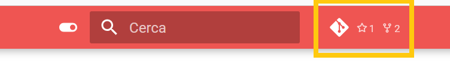
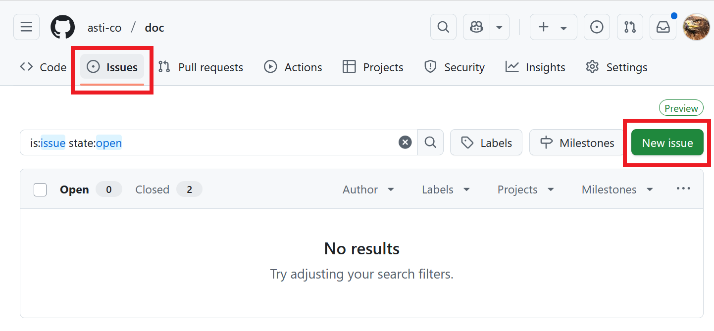
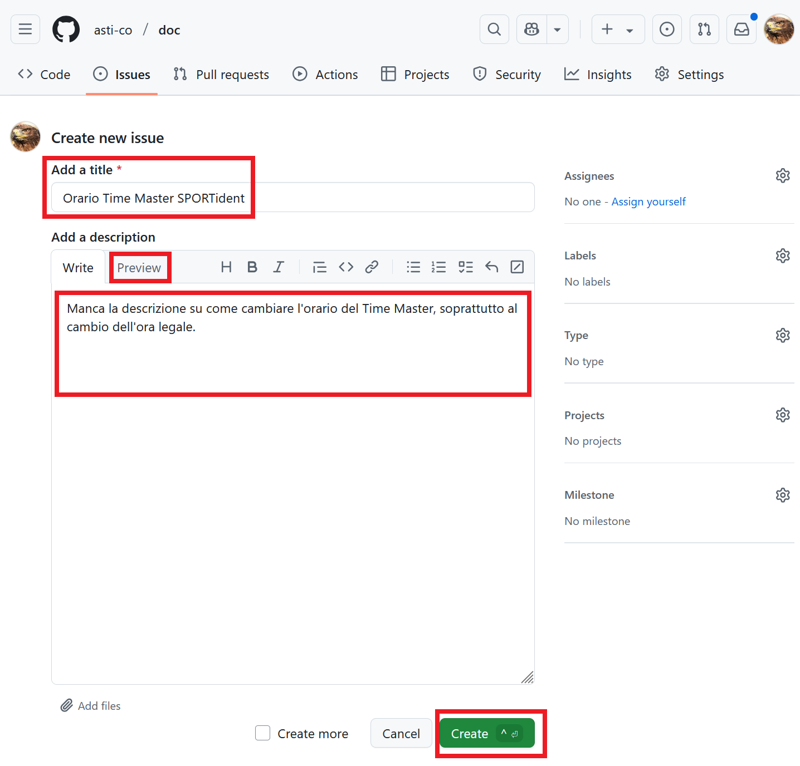

# Dare Feedback
Hai trovato degli errori?  
O una parte poco chiara?  
O non hai trovato del tutto quello che cercavi?  
Oppure vuoi semplicemente condividere un commento o un tuo pensiero con il team che gestisce le pagine?
   
Qualsiasi tipo sia il tuo feedback, crea un `issue` in `github` seguendo le istruzione qui sotto.

1. Accedi a `github` premendo sull'icona nella barra in alto alla pagina.  

1. Accedi con le tue credenziali di `github`.  
Se non hai un account, ne puoi creare uno gratuitamente.
1. Accedi alla sezione `Issues` e premi su `New issue`.  

1. Crea l'`Issue`.

    1. Assegna un titolo al tuo problema (il problema `in poche parole`).  
    **Nota**: crea un `Issue` per ogni problema riscontrato. Evita di elencare una serie di errori diversi in un unico formulario, in quanto risulterà più difficile gestire le correzioni.
    1. Descrivi nel dettaglio cosa hai riscontrato, su quale pagina, e cosa ti saresti aspettato di trovare.  
    **Nota**: puoi usare i "soliti" comandi nella barra sopra l'area di testo per formattare il tuo commento. Usa l'opzione `Preview` per vedere un'anteprima del testo formattato.
    1. Al termine, salva il tutto premendo su `Create`.
  
Grazie per il tuo feedback. Ogni commento è molto apprezzato e ci permette di migliorare questa documentazione!