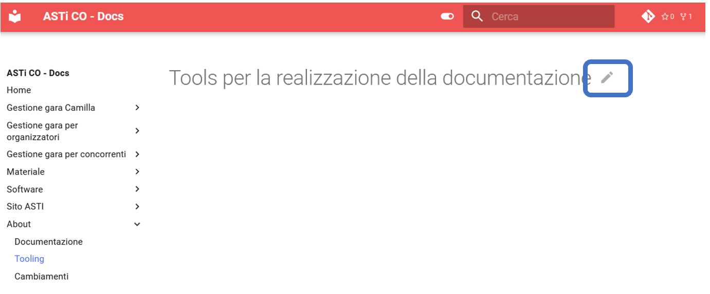
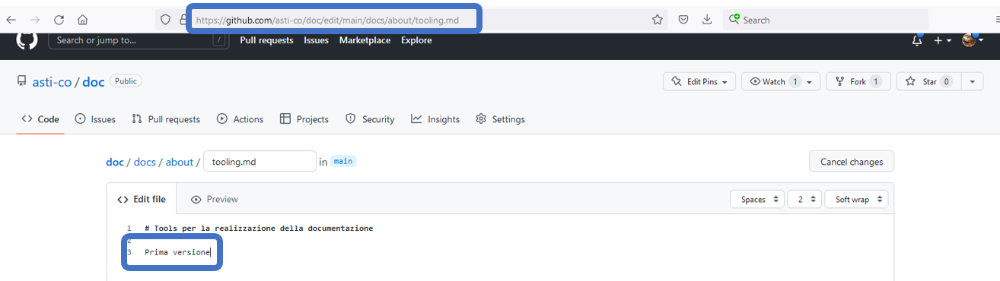
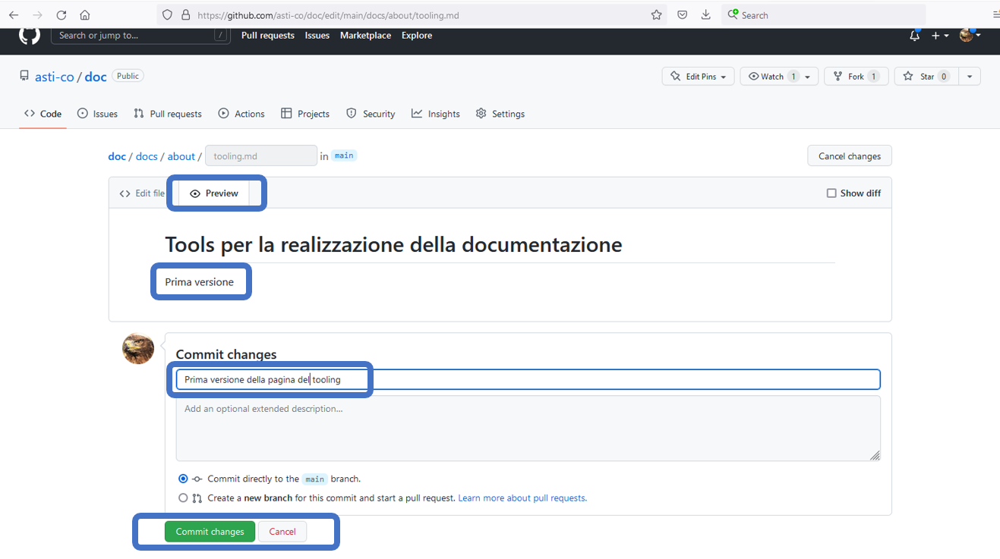
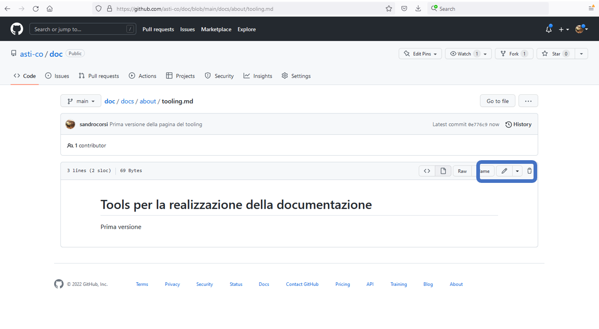
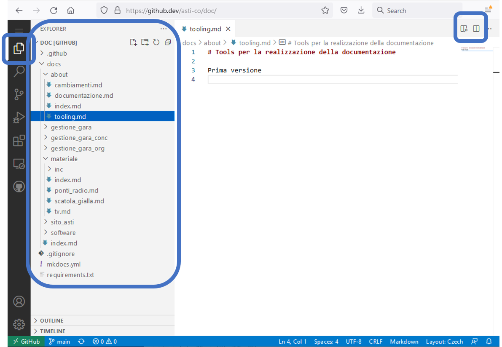
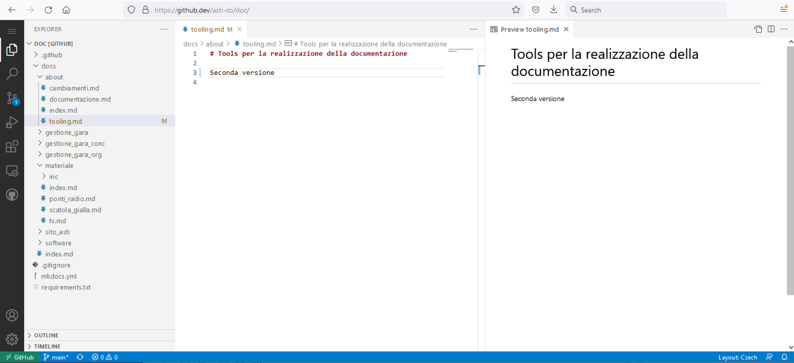
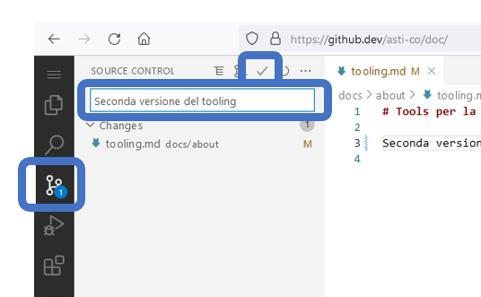
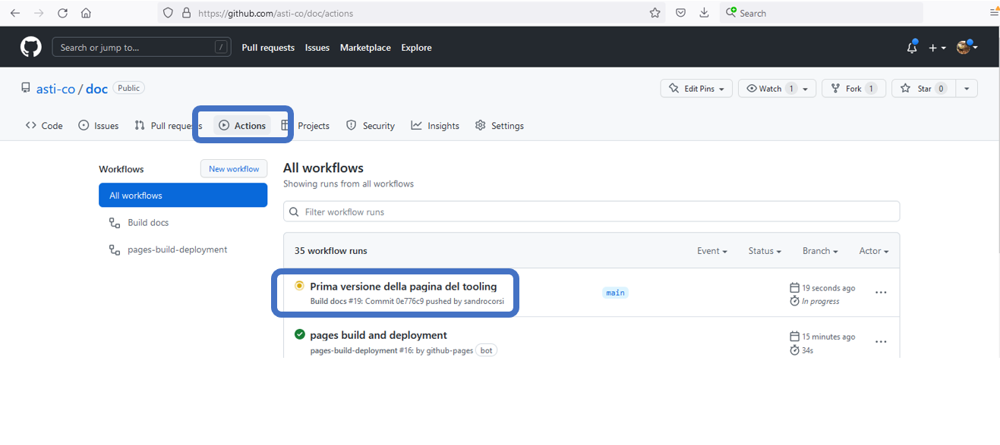
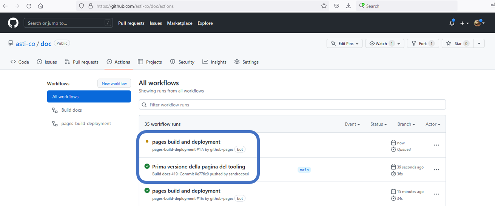

# Tools per la realizzazione della documentazione

## Editor di github
L'impostazione predefinita di github mostra l'icona della penna in ogni pagina, per aprire in maniera facile l'editor online.




L'URL per editare la pagina ***tooling*** nella sezione ***about*** è [https://github.com/asti-co/doc/edit/main/about/tooling.md](https://github.com/asti-co/doc/edit/main/about/tooling.md). Notare che l'URL è ***.com***.

La pagina permette di modificare il contenuto inserendo codice markdown.



Selezionando il tab ***Preview*** è possibile vedere la pagina con il contenuto trasformato nel formato finale, come sarà poi visibile agli utenti.  
Su questa pagina è possibile indicare un commento che descrive le modifiche fatte e pubblicare la pagina cliccando sul tasto ***Commit changes***



Una volta pubblicata, la pagina viene mostrata in formato read-only di github, con l'icona della matita per riaprire l'editor.



Le pagine modificate non saranno immediatamente visibili in quanto vanno dapprima trasformate. Vedi la sezione in basso per [controllare il processo di pubblicazione](#controllo-del-processo-di-pubblicazione).  

## Editor Visual Studio Code {#vscodeOnline}
Cambiando l'URL di github da ***.com*** a ***.dev*** abilita l'utilizzo online dell'editor MicroSoft Visual Studio Code ([https://github.dev/asti-co/doc/](https://github.dev/asti-co/doc/)). 

Non tutte le opzioni nella colonna di sinistra sono attivi nella versione online, ma quelle utili lo sono!  

La prima in alto mostra la lista delle cartelle e dei file, permettendo la navigazione tra le pagine e l'apertura di uno a più file in editor in tab separati. 

Le due icone in alto a destra permettono  di visualizzare l'anteprima della pagina, rispettivamente aprire una seconda finestra di editing.



L'editor mostra il codice markdown, con le parole chiave, titoli, link, ecc. rappresentati in colori e font diversi.



La terza opzione nella colonna di sinistra permette la pubblicazione del codice. L'icona mostra il numero di file modificati, mentre la seconda colonna mostra i file modificati.  
Sopra la lista di file modificati è possibile indicare un commento che descrive le modifiche fatte e pubblicare la pagina cliccando sull'icona del ***visto*** in alto.



Le pagine modificate non saranno immediatamente visibili in quanto vanno dapprima trasformate. Vedi la sezione in basso per [controllare il processo di pubblicazione](#controllo-del-processo-di-pubblicazione).


## Controllo del processo di pubblicazione
Selezionando la scheda ***Actions*** permette di controllare i processi di compilazione delle pagine.



Il processo è completamente automatico ed è suddiviso in due fasi.



Le nuove pagine saranno pronte e visibili a tutti quando entrambe le fasi mostreranno lo stato *completato*, simboleggiato da un visto verde.  
In caso di errori, l'icone diventa un punto rosso. Cliccando sull'azione relativa permette di accedere ai log e ai messaggi di errore, utili per capirne la causa.


## Sviluppo in locale

Creare la documentazione localmente sul proprio PC permette modifiche più ampie con un controllo preciso del risultato finale prima della sua pubblicazione.  
I tool richiesti sono:

- `git` per la gestione delle versioni dei file
- `vscode` o altro editor di testo
- `python` per la trasformazione dei file
  
### git

1. Installa `git`
1. Configura `git`  
    1. Apri il file `.gitconfig` nella cartella utente con un editor di testo.  
    **Nota:** il file è nascosto, per cui abilita la visione dei file nascosti.
    1. Imposta il nome e indirizzo email  
    *Contenuto file*
        ```
        [user]
	        name = Sandro Corsi
	        email = sandro.corsi@bluewin.ch
        ```

    1. Verifica che la configurazione sia corretta  
    *Comando*
        ```
        git config --global -l
        ```
    *Output*
        ```
        user.name=Sandro Corsi
        user.email=sandro.corsi@bluewin.ch
        ```
      
1. Crea una cartella per la documentazione ASTI
1. Copia tutta la documentazione in locale.  
Nella cartella appena creata  
    *Comando*  
    ```
    https://github.com/asti-co/doc.git
    ```    
  
1. Usa i seguenti comandi per gestire i file da command line  
    1. Aggiorna i file locali (prendi l'ultima versione disponibile sul server)  
    *Comando*  
    ```
    git pull
    ```
      
    1. Dopo aver modificato dei file, pubblicali sul server  
        1. Identifica tutti i file modificati  
        *Comando*  
        ```
        git add .
        ```
          
        1. Aggiungi un commento che descrive le modifiche fatte (corto, max 50 caratteri)  
        *Comando*  
        ```
        git commit -m "la descrizione di quel che hai fatto"
        ```
          
        1. Manda le modifiche al server  
        *Comando*  
        ```
        git push
        ```
          
### VSCode

Puoi usare qualsiasi editor di testo.  
L'editor `VSCode` è disponibile gratuitamente su windows, Linux e MacOS ed ha tanti plugin a disposizione, tra cui anche quelli per la gestione integrata di `git` e delle pagine `markdown`.

1. Scarica [VSCode](https://code.visualstudio.com/)
1. Di regola è consigliato lanciare VSCode con `code .`, configurazione di default su Windows e Linux.  
Per MacOS, seguire queste [istruzioni](https://code.visualstudio.com/docs/setup/mac#_launching-from-the-command-line)
1. In VSCode apri la cartella della documentazione ASTI (in `File > Open Folder...`)  
**Nota:** se è attivo il plugin di git sarà possibile eseguire i comandi descritti sopra direttamente dal tool.
1. Utilizza `VSCode` in locale come quello online (vedi la [descrizione sopra](#vscodeOnline))

### Crea localmente

??? Example "Per la generazione delle pagine su Linux/MaxOS"
    
    1. In un terminale, vai nella cartella della documentazione ASTI
    1. Inizialmente (solo una volta) inizializza il sistema  
    ```
    make venv serve
    ```
    1. In seguito, usa unicamente questo comando
    ```
    make serve
    ```
      
        1. Controlla l'output per vedere se ci sono errori.  
        Ad esempio, il tool mostra i link a pagine non esistenti.
        1. Finiti i controlli viene mostrato il messaggio seguente  
        ```
        Serving on http://127.0.0.1:8000/
        ```
    1. Apri l'indirizzo indicato `http://127.0.0.1:8000/` in un browser internet (Firefox, Chrome, ecc.)  
    **Nota:** il sistema si accorge autonomamente del cambiamento del contenuto delle pagine e ogni volta che salvi un file questo viene compilato e la pagina è aggiornata nel browser.

??? Example "Per la generazione delle pagine in Windows"
    Se hai coraggio, prova questa procedura ma senza garanzia...  
    Per andare sul sicuro è consigliabile usare il subsystem Linux su Windows.  
      
    1. Installa Python3 da [https://www.python.org/downloads/](https://www.python.org/downloads/)  
    1. In un terminale, vai nella cartella della documentazione ASTI
    1. Inizialmente (solo una volta) inizializza il sistema  
        1. Crea l'ambiente
        ```
        python -m venv env
        ```
        1. Inizializza il sistema  
        ```
        env\Scripts\activate.bat
        ```
        1. Installa le librerie  
        ```
        python -m pip install --upgrade pip setuptools wheel
        ```
        1. Installa/aggiorna altri requisiti
        ```
        python -m pip install --upgrade -r requirements.txt
        ```
          
    1. In seguito, usa unicamente questi comandi
        1. Inizializza il sistema  
        ```
        env\Scripts\activate.bat
        ```
        1. Lancia il server  
        ```
        mkdocs serve --livereload -a 127.0.0.1:8000
        ```  
        1. Controlla l'output per vedere se ci sono errori.  
        Ad esempio, il tool mostra i link a pagine non esistenti.  
           
            **Nota:** Se questo comando lancia delle eccezioni (lunghi messaggi d'errore) devi utilizzare la procedure con il Windows Subsystem for Linux.
          
        1. Finiti i controlli viene mostrato il messaggio seguente  
        ```
        Serving on http://127.0.0.1:8000/
        ```
    1. Apri l'indirizzo indicato `http://127.0.0.1:8000/` in un browser internet (Firefox, Chrome, ecc.)  
    **Nota:** il sistema si accorge autonomamente del cambiamento del contenuto delle pagine e ogni volta che salvi un file questo viene compilato e la pagina è aggiornata nel browser.


??? Example "Per la generazione delle pagine in Windows col Subsystem for Linux"
    Questa soluzione utilizza il Windows Subsystem for Linux per eseguire alcuni comandi in Windows ed alcuni in Linux.  
      
    1. In un terminale installa il Windows Subsystem for Linux (WSL) con Ubuntu (vedi la [documentazione Microsoft](https://docs.microsoft.com/en-us/windows/wsl/install))
    ```
    wsl --install
    ```
      
    1. Configura WSL (solo una volta)
        1. Apri il terminale di WSL
        1. Inizializza il sistema
        ```
        # assicurati che il sistema sia aggiornato
        sudo apt-get update
        sudo apt-get ugrade
          
        # assicurati che pyhton, pip e venv siano installati
        sudo apt install python3
        sudo apt install python3-pip
        sudo apt install python3.8-venv
        ```
          
        1. Vai nella cartella della documentazione ASTI  
        **Nota:** il disco `C:` è accessibile in WSL come cartella `/mnt/c`
        ```
        cd /mnt/c/path/alla/catella/ASTI
        ```
          
        1. Crea l'ambiente e lancia il server
        ```
        make venv serve
        ```
          
    1. In seguito, usa unicamente questi comandi
        1. Apri il terminale di WSL
        1. Vai nella cartella della documentazione ASTI  
        **Nota:** il disco `C:` è accessibile in WSL come cartella `/mnt/c`
        ```
        cd /mnt/c/path/alla/catella/ASTI
        ```
          
        1. Lancia il server  
        ```
        make serve
        ```  
            1. Controlla l'output per vedere se ci sono errori.  
            Ad esempio, il tool mostra i link a pagine non esistenti.  
             
            1. Finiti i controlli viene mostrato il messaggio seguente  
            ```
            Serving on http://127.0.0.1:8000/
            ```
    1. Apri l'indirizzo indicato `http://127.0.0.1:8000/` in un browser internet (Firefox, Chrome, ecc.)  
    **Nota:** il sistema si accorge autonomamente del cambiamento del contenuto delle pagine e ogni volta che salvi un file questo viene compilato e la pagina è aggiornata nel browser.

    


