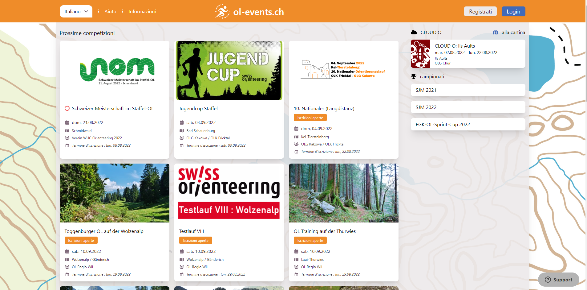
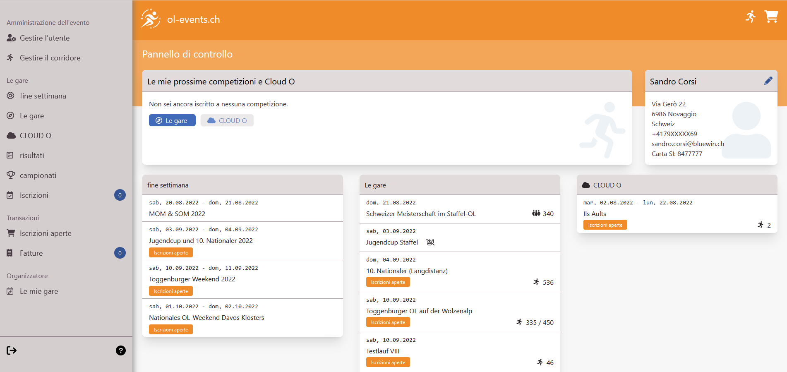

# Iscrizioni

Le iscrizioni alle gare sono gestite in maniera diversa dalle varie società: alcune richiedono che ogni membro si iscriva autonomamente alle gare, altre hanno un sistema interno di iscrizione, e le iscrizioni effettive vengono fatte in blocco da un socio responsabile.  
Inoltre, esistono vari portali per le iscrizioni, e per alcune gare (ad esempio le SprintCup) non è possibile iscriversi online, ma unicamente via email o sul posto. I dettagli sulla procedura d'iscrizione e sull'eventuale portale sono specificati nell'annuncio gara.  
  
Questa pagina descrive la procedura d'iscrizione per alcuni portali.

## OL-Events

Portale svizzero: [ol-events.ch](https://portal.ol-events.ch/it).

**Nota**: l'O-92 ha creato una breve guida sull'utilizzo di OL-Events, complementare a questa pagina: [documento PDF O-92](inc/tutorial ol-events O-92.pdf)

Sulla pagina iniziale il portale elenca le prossime gare, mostrando una scheda riassuntiva per ogni gara. Cliccando su una gara si ottengono informazioni più dettagliate e la possibilità di iscriversi.

Utenti già annunciati vedono come pagina principale il pannello di controllo con una lista delle prossime gare alle quali si sono iscritti, e le prossime gare mostrate in una lista (con meno dettagli). Selezionare `Le gare` nel menu a sinistra per vedere la pagina con le schede più estese di ogni gara.

### Registrazione iniziale

Per iscriversi alle gare bisogna registrarsi (gratuitamente) come utente, rispettivamente annuciarsi come utente (Login) se si è già registrati.

Per registrarsi

- Cliccare su `Registrati` in alto a destra
- Riempire tutti i campi del formulario  
  Tutti questi dati potranno essere modificati in seguito, a parte l'indirizzo email.
- Confermare l'indirizzo email  
  Controllare le email e cliccare sul link di verifica nell'email ricevuto da OL-Events.

Annunciarsi (login) con il proprio utente e completare i dati.

- Cliccare su `Gestire l'utente`  
  Qui si possono modificare i dati inseriti nel formulario di registrazione.
- Cliccare su `Gestire il corridore`  

    - **Corridori registrati nella banca dati SOLV**  
    Utenti già registrati nella banca dati dei concorrenti SOLV possono usare l'opzione `Ricerca` per importare i propri dati, cercando per numero SOLV o per nome e cognome.  
  
    - **Corridori non registrati nella banca dati SOLV**  
    Per utenti svizzeri che hanno intenzione di iniziare a fare CO è consigliato iscriversi prima nella banca dati concorrenti SOLV e importare poi i propri dati in OL-Events. Riempire il formulario [sul sito solv](https://www.o-l.ch/cgi-bin/solvdb&competitor=newform) (solo in tedesco...).  
    
    - **Corridori stranieri o occasionali**  
    Per utenti stranieri o occasionali, creare un proprio profilo concorrente su OL-Events utilizzando l'opzione `Creare`.

- Eventualmente, estendere le possibili categorie  
  Durante il processo di iscrizione alle gare, OL-Events propone una lista ridotta di categorie tra cui scegliere, togliendo le categorie vietate o poco probabili. Ad esempio, ad un concorrente di 52 anni mostra la categoria H50 (categoria più probabile), le categorie possibili H40, HAL, HAM, HAK, HB e OK, ma non mostra le categorie H60 o H18 (vietate). Allo stesso modo, alle donne non vengono mostrate le categorie maschili.
  Selezionando l'opzione `Estendere la selezione delle categorie` è possibile disabilitare questa logica, ottenendo tutte le categorie possibili (quelle vietate non vengono comunque mostrate).

- Aggiungere altri concorrenti al proprio profilo.  
  Per poter iscrivere altri corridori (famigliari, compagni di società, amici, ecc.) connetterli al proprio profilo.
    - Cliccare su `Gestire il corridore`
    - Ricercare il/i corridore/i nella banca dati dei concorrenti SOLV cliccando su `Ricerca`
    - Cercare via numero SOLV o via nome e cognome.  
      Nota: cercando per numero SOLV, il collegamento è automaticamente attivato nel proprio profilo. Il concorrente aggiunto al profilo riceve un email di informazione, con indicazioni su come contattare il portale per far rimuovere il collegamento.  
      Cercando per nome o cognome, invece, il collegamento è subito visibile nel profilo, ma diventa attivo solo dopo l'esplicita approvazione del concorrente aggiunto al profilo, che riceve un email di informazione con un apposito link.

### Iscrizione

Per iscriversi alle gare

- Cliccare su `Le gare` nel menu a sinistra per mostrare la lista delle prossime gare
- Cliccare sulla scheda della gara alla quale ci si vuole iscrivere
- Cliccare sul bottone blu `Login`
- Nella lista con tutti i concorrenti aggiunti al proprio profilo, selezionare la categoria per ogni concorrente da iscrivere.  
  I concorrenti vengono automaticamenti aggiunti al carrello della spesa
- Cliccare sull'icona del carrello della spesa in alto a destra
- Nella scheda di ogni concorrente iscritto, verificare e eventualmente correggere il numero del chip.  
  A dipendenza della gara, inserire le possibili informazioni supplementari (ad esempio desideri di partenza, utilizzo di mezzi di trasporto pubblici, ecc.).  
  Ogni scheda mostra un'icona `cestino` con la quale cancellare l'iscrizione del relativo concorrente.
- Accettare i termini e le condizioni legali e cliccare sul bottone blu `comprare`.  
  Nota: questo conferma l'iscrizione di tutti i concorrenti nel carrello della spesa.

- Fatturazione
!!! Info ":asti-tmo: TMO"
    Per le gare valide per il TMO il portale non offre la possibilità di pagamento in quanto le iscrizioni vengono pagate in blocco dalle varie società ticinesi.  
    I concorrenti di altre società dovranno pagare la tassa d'iscrizione secondo le modalità specificate nell'annuncio gara.

!!! Info ":asti-naz: Nazionali"
    Per le gare nazionali, il portale mostra una fattura per ogni acquisto (ogni volta che si preme il bottone `comprare` nel carrello della spesa viene emessa una nuova fattura).  
    Selezionare una fattura e procedere al suo pagamento.

A questo punto non è più possibile cancellare l'iscrizione tramite il portale, ma unicamente via comunicazione diretta con i gestori del portale: [info@supsign.ch](mailto:info@supsign.ch)

Non è necessario completare il processo in un unico passaggio. Nel menu a sinistra selezionare:

- **Iscrizioni**  
  Mostra tutte le iscrizioni a gare future di tutti i concorrentti associati al proprio profilo.  
  Ogni scheda ha un'icona `matita` che permette di modificare alcuni valori (categoria, numero chip, desideri di partenza, ecc.).  
  L'icona `aggiorna` permette di rileggere i dati del concorrente dalla banca dati dei concorrenti SOLV, per aggiornare ad esempio il numero chip.
- **Iscrizioni aperte**
  Mostra il carrello della spesa con tutte le iscrizioni pendenti, con la 'solita' opzione per accettare le condizioni legali e `comprare` per confermare tutte le iscrizioni.  
  Se il carrello è vuoto, mostra le schede delle gare alle quali ci si è iscritti (o si ha iscritto uno dei concorrenti associati al proprio profilo)
- **Fatture**
  Mostra le fatture relative alle proprie iscrizioni. Per i TMO, l'importo è sempre `CHF 0.00`.

## GO2OL

Portale svizzero: [go2ol.ch/](https://go2ol.ch/).

**QUESTA SEZIONE È ANCORA DA FARE**  
{width=100px}

## PICO EVENTS

Portale svizzero: [entry.picoevents.ch/](https://entry.picoevents.ch/index_it.php).

**QUESTA SEZIONE È ANCORA DA FARE**  
{width=100px}

## EVENTOR

Portale dell'IOF, la federazione internazionale di orientamento, per le categorie elite (anche juniores). Solo per gare WRE (world ranking events), coppa del mondo, campionati del mondo, ecc.: [iof eventor/](https://eventor.orienteering.org/Events).  

