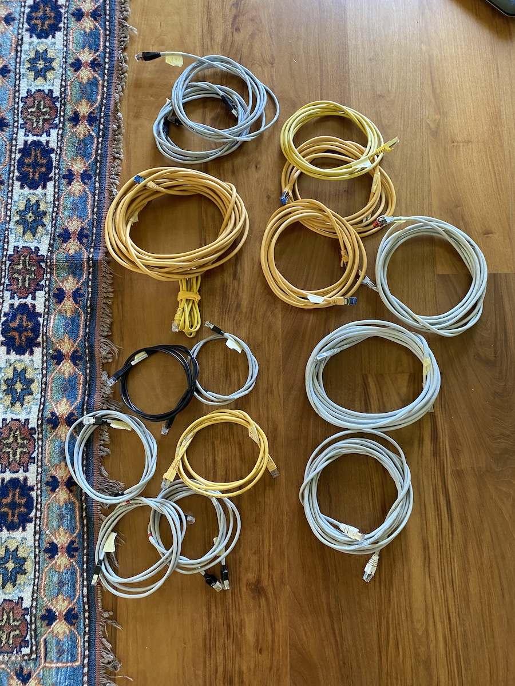

# Materiale informatico

- [Computer](#computer)
- [Materiale di rete](#materiale-di-rete)
- [Stampanti](#stampanti)
- [Materiale elettrico](#materiale-elettrico)

### Computer

| Nome      | Descrizione                                                                                       |
|-----------|---------------------------------------------------------------------------------------------------|
| asti-pc-1 | HP. Windows 7. Acquisto 20XX                                                                      |
| asti-pc-2 | HP. Windows 7. Acquisto 20XX                                                                      |
| asti-pc-3 | HP. Windows 7. Acquisto 20XX                                                                      |
| asti-pc-4 | Lenovo ThinkPad L560. Intel Core i5-6200U 2.3GHz, RAM 8GB, disco 256GB. Windows 10. Acquisto 201X |
| asti-pc-5 | Acer Aspire A515-56. Intel Core i7-1156G7 2.8GHz, RAM 16GB, disco 1TB. Windows 10. Acquisto 2022  |

### Materiale di rete

#### Modem

| Quantità | Materiale                |
|----------|--------------------------|
| 1x       | Router Huawei CPE B593   |

#### Switch

| Quantità | Materiale                |
|----------|--------------------------|
| 2x       | Switch 5 porte           |
| 1x       | Switch 8 porte           |
| 1x       | Switch grande, +16 porte |

#### Cavi di rete

| Quantità | Lunghezza [m] | Colore | Protezione pinza |
|----------|---------------|--------|------------------|
| 1        | 1             | Grigio | No               |
| 1        | 1.5           | Nero   | No               |
| 1        | 1.5           | Giallo | No               |
| 3        | 2             | Grigio | No               |
| 1        | 2             | Giallo | Sì               |
| 3        | 3             | Grigio | Sì               |
| 2        | 3             | Grigio | Sì               |
| 2        | 5             | Grigio | No               |
| 1        | 5             | Grigio | Sì               |
| 1        | 10            | Giallo | Sì               |
| 2        | ROTTO         | Giallo | Sì               |

### Stampanti

| Nome               | Descrizione                      |
|--------------------|----------------------------------|
| asti-stampantina-1 | EPSON TM-88V. USB                |
| asti-stampantina-2 | EPSON TM-88V. RETE+USB           |
| asti-stampantina-3 | [ROTTA] EPSON TM-88V. USB        |
| asti-stampantina-4 | EPSON TM-88VI. RETE+USB          |
| asti-stampantina-5 | EPSON TM-88VI. RETE+USB          |
| asti-stampantina-6 | EPSON TM-88VI. RETE+USB          |
| asti-print-bw-1    | HP LaserJet 400 M401. Formato A4 |

### Materiale elettrico

| Quantità | Materiale                           |
|----------|-------------------------------------|
| 1x       | Ciabatta rossa 5 prese (TBA, check) |
| 1x       | Ciabatta rossa 8 prese (TBA, check) |
| 3x       | Prese italiane                      |
