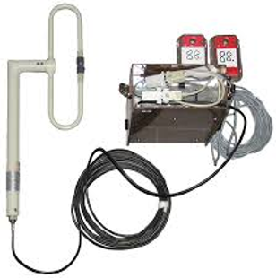

I punti radio sono dispositivi che trasmettono in tempo reale (o quasi) i dati relativi al passaggio del concorrente ad un punto.  

Esistono vari tipi di punti radio, con caratteristiche diverse a dipendenza delle esigenze, e possono richiedere la pianificazione di molti mesi, anche oltre un anno.  
  
**Nota**: l'ASTi non dispone di punti radio propri.

## Punti radio VELPOZ

Velpoz ([www.velpoz.ch](http://www.velpoz.ch)) è un gruppo svizzero focalizzato sull'utilizzo dei punti elettronici nella CO.  
Sono gli unici in Svizzera ad avere i punti radio basati sulle frequenze radioamatori.

Caratteristiche:

- Trasmissione dati molto veloce 
- Unica tipologia di punti radio utilizzabile per punti con copertura televisa in diretta (con tempo che si "ferma" al passaggio del concorrente)
- Tecnologia affidabile (di regola trasmette i tempi di tutti i concorrenti)
- Necessita un __permesso dall'ufficio federale delle telecomunicazioni__.
- Il SOLV inoltra a fine marzo la richiesta per il permesso per tutte le gare dell'anno _annunciate al SOLV come "gare con punti radio"_. 

    - Le società organizzatrici devono quindi contattare il SOLV per tempo.  
    - Altrimenti è possibile inoltrare la richiesta direttamente all'ufficio federale [BAKOM/UFCOM](https://www.bakom.admin.ch/bakom/it/home.html) (con costi finanziari e amministrativi maggiori).

- La posa richiede personale specializzato e autorizzato di VELPOZ. Richiedere la disponibilità con largo anticipo.
- I punti radio sono pesanti e necessitano pertanto se possibile di un accesso carrozzabile fino in zona punto.
- Di regola i responsabili VELPOZ effettuano prove di trasmissione dai punti già un anno prima della gara, per avere condizioni di vegetazione simili al giorno di gara. 

{width=100px}

## Punti radio SportIdent

SPORTIdent ([sportident.com](https://www.sportident.com/products.html#stations)) ha sviluppato punti radio delle dimensioni delle normali scatolette "vecchie" (quelle più grandi).

Caratteristiche:

- Comunicazione basata su telefonia mobile

    - Controllare la copertura in zona punto, anche a livello di terreno.
    - Controllare la copertura delle reti 2G (vecchie) e 4G

- Posa semplice e veloce  
{width=100px}  
  
- Non necessita di alcuna autorizzazione
- Tempi di trasmissione di diversi secondi
- Affidabilità relativa (1-2% di concorrenti non trasmessi)
- Ideale per 
    - classifiche online a punti intermedi
    - per classifiche online con tempo finale se l'arrivo è lontano dalla lettura chip.
    - per punti di preavviso per speaker
    - per punti di preavviso prima dei punti televisivi (per cameraman e regia)

- Richiede un account sul sito SPORTident e i modem registrati sul proprio account. 

    - **Richiedere per tempo a SPORTident l'assegnazione dei modem all'account**  

Dettagli sui punti radio SPORTident in [materiale > sportident > punti radio](sportident/punti_radio.md) e sul loro utilizzo con OL-Einzel in [software > oe12 > punti radio SPORTident](../software/oe12/punti_radio.md).

## Punti radio Simon

I punti radio di Simon Harston, utilizzati alle nazionali 2015 al San Bernardino e alla 5 giorni EGK 2018 (gara di contorno degli EOC), non sono più disponibili.  