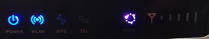

# Router

- Modello: Router Huawei CPE B593
- Numero SIM: 079 284 55 31
- Abbonamento: Swisscom Prepaid, CHF 2.-/giorno. Utilizzo massimo 10GB/mese, poi la velocità viene limitata.

## Allacciamento del router alla rete

1. Collegare i cavi come nella figura. Il cavo giallo va nello switch ethernet

    

2. Accendere il Router con il pulsante sul fianco

    

3. Attendere l’allacciamento alla rete (richiede alcuni minuti)

    |<!-- --> |<!-- --> |
    |-|-|
    | | In accensione |
    | | WiFi abilitato |
    | | Viola fisso = SIM non riconosciuta (attendere) |
    | | Rosso fisso = non connesso alla rete (attendere) |
    | | Segnale a livelli + Blu->LTE, Verde->UMTS, Giallo -> GSM = Collegamento OK|

4. Se non dovessero esserci porte ethernet (cavo giallo) disponibili

    |<!-- --> |<!-- --> |
    |-|-|
    | Wi-Fi | `asti-ticino` |
    | Password | *vedi scatola gialla* |

!!! danger ""

    UTILIZZARE LA CONNESSIONE UNICAMENTE PER GLI SCOPI DI INVIO DATI DI CLASSIFICHE, NON PER USO DI SVAGO.

## Ricarica del credito

[https://cockpit.swisscom.ch/](https://cockpit.swisscom.ch/)

Se non si accede tramite router il sistema chiede il numero di cell.
(079 284 55 31) e manda una password alla SIM per poter procedere. 
Se ci si collega attraverso il router, si arriva direttamente alla pagina autenticata

### Costi
Il traffico dati costa fino a massimo CHF 2.-/giorno e si ha a disposizione 10GB/mese alla velocità di 1Mb/0.5Mb. 

Pacchetti aggiuntivi
- 100MB al costo di CHF 9.-
- 400MB al costo di CHF 19.-
- 1GB al costo di CHF 35.-
- 24h Speed al costo di CHF 5.-

!!! danger ""

    NON LASCIARE SCADERE IL CREDITO A CHF 0.- !!!

## Controllo messaggi

1. Effettuare il login sul router all’indirizzo (solo se allacciato alla rete ethernet – NO WiFi)

    [http://192.168.1.1](http://192.168.1.1)

2. Autenticazione

    |<!-- --> |<!-- --> |
    |-|-|
    | Username | `admin` |
    | Password | *vedi scatola gialla* |

3. L’icona in alto a destra mostra la presenza di un messaggio nuovo non letto

    

4. Menu principale SMS

    

5. Visionare i messaggi

    

!!! warning "Attenzione"

    La carta SIM del router può contenere solo 50 messaggi.
    Quanto il limite è raggiunto, le notifiche successive non vengono ricevute.
    **È importante eliminare regolarmente i vecchi messaggi**

## Configurazione router

