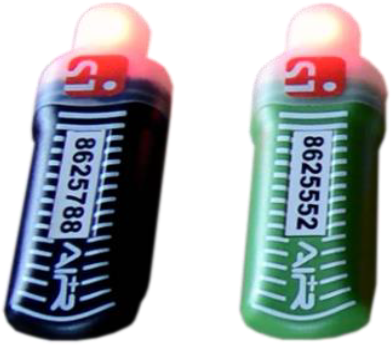
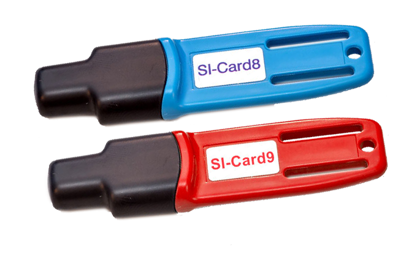

# Chip SPORTident

Esistono diversi tipi di chip SPORTident che si differenziano per velocità, memoria e il supporto per la modalità `a distanza`.  
  
- SIAC (SportIDENT active card)  
{width=20%}    
    - Chip `veloce`
    - Timbratura sia `a contatto` che `a distanza`
        - Accensione modalità `air - a distanza`: `check`, `siac on`, `siac test`
        - Spegnimento modalità `air - a distanza`: `finish`, `siac off`
    - Numeri 8'000'000 - 8'999'999
    - Velocità di timbratura: 50 ms `a distanza`, 60 ms `a contatto`
    - Velocità di cancellazione: < 0.5s
    - Memoria per 128 tempi intermedi + `clear`, `check`, `start` e `finish`.
    - Formato tempo 24h + giorno
    - Batteria usata solo per modalità `a distanza`. 
    **Nota**: il chip funziona in modalità `a contatto` anche con la batteria scarica.
    - Feedback di timbratura: flash ottico e segnale acustico sul chip
- SI-Card 9  
{width=20%}  
    - Chip `veloce`
    - Timbratura solo `a contatto`
    - Numeri 1'000'000 - 1'999'999
    - Velocità di timbratura: 115 ms
    - Velocità di cancellazione: < 2s
    - Memoria per 50 tempi intermedi + `clear/check`, `start` e `finish`.
    - Formato tempo 24h + giorno (4 settimane)
    - Feedback di timbratura: flash ottico e segnale acustico sulla scatoletta
- SI-Card 8
    - Chip `veloce`
    - Timbratura solo `a contatto`
    - Numeri 2'000'000 - 2'999'999 (ma non 2003... usati nel 2003 per i mondiali in CH)
    - Velocità di timbratura: 115 ms
    - Velocità di cancellazione: < 2s
    - Memoria per 30 tempi intermedi + `clear/check`, `start` e `finish`.
    - Formato tempo 24h + giorno (4 settimane)
    - Feedback di timbratura: flash ottico e segnale acustico sulla scatoletta
- SI-Card 5-6-7  
Chip più datati usati ancora come chip di allenamento o da noleggio.
    - Chip `lenti`
    - Timbratura solo `a contatto`
    - Numeri bassi
    - Velocità di timbratura: 360 ms
    - Memoria per 30 tempi intermedi + 6 solo numero del punto senza tempo + `clear/check`, `start` e `finish`.
    - Formato tempo 12h
    - Feedback di timbratura: flash ottico e segnale acustico sulla scatoletta

Esiste anche un ulteriore chip di servizio, non utilizzabile per le gare.  

- Chip viola
    - Scritta sul chip: `SERVICE OFF`
    - Modalità solo `a contatto`
    - Timbrando una scatoletta spenta, il chip viola la accende `per 2 minuti` (modalità di servizio).  
    Un chip normale accende un punto per ore, a dipendenza dell'impostazione della scatoletta.
    - Timbrando una scatoletta accesa, il chip viola la spegne.

Vedi la [pagina ufficiale del produttore](https://www.sportident.com/products#category=card).