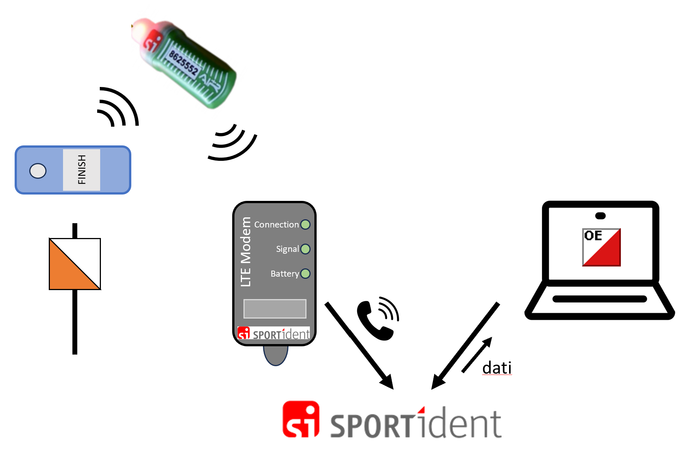
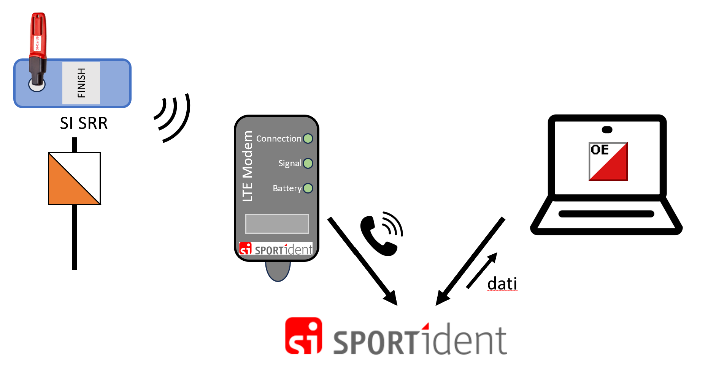
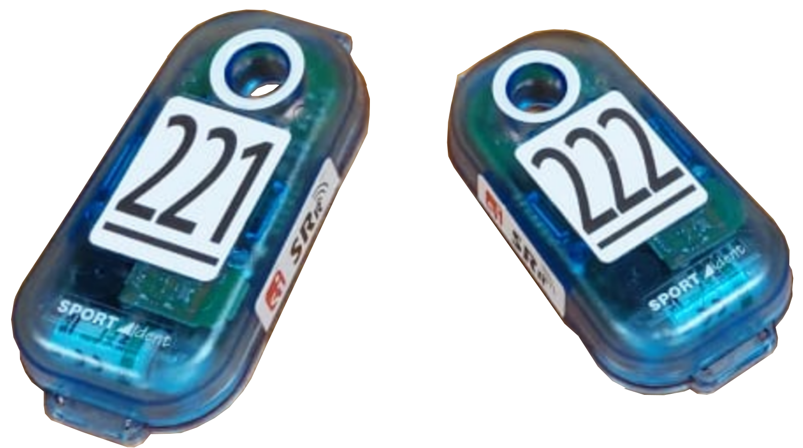
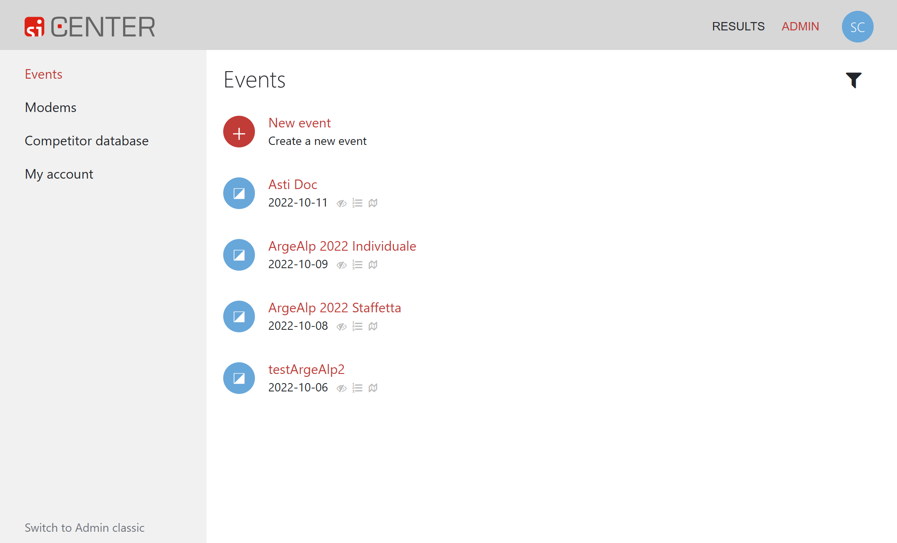

# Punti radio SPORTident

## Panoramica

I punti radio SPORTident trasmettono il passaggio dei concorrenti (numero chip, numero del punto e tempo) nel momento in cui il concorrente timbra il punto.   

Utilizzando punti radio al posto dei classici finish è possibile pubblicare classifiche online col tempo finale di gara molto prima della lettura del chip. Questo può tornare molto utile in caso di arrivo distante dalla lettura chip non solo per la velocità di pubblicazione della classifica stessa, ma anche per il controllo dei concorrenti mancanti, facilitando la pianificazione al rifornimento e permettendo di anticipare il ritiro punti.

Questi punti radio permettono l'allestimento di classifiche online anche a punti intermedi, nel bosco, aumentando l'interesse a seguire l'andamento della gara per chi segue la competizione online.  
Se posati in maniera appropriata, i punti radio possono anche essere utilizzati per verificare che tutti i concorrenti siano usciti da una certa zona di gara, permettendo così di anticipare il ritiro punti di aree più discoste.

La posa e gestione dei punti radio, descritte in questa pagina, come pure l'integrazione con il software di gestione gare OL-Einzel (descritta nella sezione [software](../../software/oe12/punti_radio.md)) è molto semplice e non richiede permessi o capacità speciali. In particolare non è richiesta una licenza di radioamatore o un permesso da parte dell'ufficio federale di telecomunicazioni.  

La tecnologia di comunicazione è basata sulla telefonia mobile, per cui è importante controllare la copertura nei luoghi in cui si intende posare un punto radio.
  
!!! Warning "Affidabilità"
    Attenzione: non fidarti ciecamente dei dati forniti dai punti radio. Secondo statistiche non ufficiali, l'affidabilità non è totale e alcuni concorrenti (1-2%) potrebbero timbrare il punto ma non risultare nei dati spediti al server.  
    I motivi sono vari e dipendeno da diversi fattori tra cui la qualità della copertura della rete mobile, lo stato delle batterie dei punti, dei modem e anche delle SIAC, della posizione dei punti rispetto ai modem, ecc. 

!!! Failure "Tempistica"
    Se non utilizzi unicamente i punti radio ASTI ma anche ulteriori punti radio a noleggio, richiedi per tempo l'assegnazione dei nuovi modem al profilo ASTI sul sito SI-Center di [SPORTident](https://www.sportident.com) come descritto nella sezione [in basso](#si-center).
  
## Punti SRR e Modem

### Concetto
Ai punti viene posato un modem che intercetta le punzonature e le spedisce a SPORTident via telefonia mobile, utilizzando la tecnologia LTE (4G).  
**Nota**: i modem con le due antennine utilizzano la tecnologia 2G che non è più ufficialmente supportata e di fatto non dovrebbe più essere utilizzata in Svizzera.  
{width=50%}  
  
Le punzonature vengono trasmesse al modem in due modalità differenti, a dipendenza del tipo di chip usato:  
  
- **SIAC "air"**: la scatoletta del punto emette un segnale che la SIAC riceve e riconosce come punzonatura. A differenza dei punti normali, il segnale emesso dalla scatoletta richiede alla SIAC di spedire via radio l'ultima registrazione (quindi la timbratura del punto). Il segnale emesso dal chip SIAC viene intercettato dal modem che lo inoltra al server di SPORTident via "telefono".  
{width=70%}  

- **SI-Card "a contatto"**: la scatoletta del tipo SRR (short-range radio, radio a breve raggio), oltre a gestire la timbratura del chip inserito nel buco, spedisce i dati via radio (numero chip, numero punto e orario) al modem che li inoltra al server di SPORTident via "telefono". 
{width=70%}

Le scatolette in dotazione all'ASTI supportano solo le SIAC, per cui per coprire anche le timbrature a contatto (anche di SIAC scariche) bisogna utilizzare scatolette speciali del tipo SRR (delle stesse dimensioni delle scatolette piccole).  
{width=30%}  
  
Il software di elaborazione della gara, ad esempio OL-Einzel, si connette al server [SI-Center](#si-center) di SPORTident e scarica i dati a intervalli regolari (anche più volte al minuto, a dipendenza dei bisogni).  
Il software può poi utilizzare i dati in vari modi:  

- Mostrare nella lista dei concorrenti mancanti quali hanno già timbrato il `finish` ma non ancora scaricato il chip.
- Fornire allo speaker i tempi intermedi e il tempo di gara dei concorrenti prima che questi scarichino il chip.
- Inoltrare i dati a un sito di classifiche online per mostrare i tempi intermedi e finali prima della lettura chip.

Per l'utilizzo dei punti radio con OL-Einzel, vedi la pagina [software > OE 12 > Punti radio SPORTident](../../software/oe12/punti_radio.md).

### Caricamento batteria modem

Per caricare la batteria del modem, svita il tappo e collega il modem con un cavo mini-USB. La luce `Battery` si accende di rosso se la batteria è in carica, e diventa verde quando la batteria è completamente carica.  
{width=30%}

### Accensione/spegnimento

Per accendere e spegnere il modem, avvicina il chip di servizio dei punti radio (o un magnete) sul lato delle lucine in zona dell'icona `((0/1))`.  
L'attivazione di solito non è problematica e si manifesta con l'accensione delle luci. La frequenza di accensione si stabilizza intorno ai 10 secondi. Se lampeggiano intorno ai 2-3 secondi significa che la connessione alla rete mobile non ha funzionato e la luce `Connection` è rossa.  
Lo spegnimento può essere più complicato. Durante lo spegnimento, prova a tenere il chip (o il magnete) fermo, oppure muovilo lungo il lato, e allontanalo non appena si spengono le lucine (per non riaccendere subito il modem).  
**Nota**: lo spegnimento può essere frustrante...  
**Nota**: il chip di servizio è in dotazione nella scatola dei punti radio, mentre il magnete si trova in quella di alluminio delle scatolette di lettura, all'interno di un barattolo di plastica dei vecchi rullini delle foto. Come alternativa, usa un magnete potente tipo quello dei geomag.  
{width=30%}

### Posa

Verifica che ci sia copertura di rete 4G dove vuoi posizionare un punto radio.  
Posa i punti radio come punti normali, sostituendo la scatoletta con una SRR. Posiziona il modem ai piedi sotto il punto, controllando che abbia ricezione di rete.  
Se prevedi che i concorrenti passano ad alta velocità dal punto, ad esempio allo sprint finale all'arrivo, tieni conto che il chip SIAC del concorrente potrebbe già essersi allontanato tanto dal modem e non essere più in zona di ricezione. In questi casi, sposta il modem in direzione della corsa, tenendo però conto di mantenere il modem nel raggio d'azione della scatoletta SRR (un paio di metri dovrebbero bastare).  
Vale la pena testare ogni scatoletta sia con un chip a contatto che con una SIAC, simulando in questo caso la punzonatura di un atleta in corsa.  
**Nota**: verifica il funzionamento dei punti radio direttamente con gli operatori al PC, stando in contatto telefonico e confermando così immediatamente la ricezione di ogni singolo timbro. 

### Numero punto

Le due scatolette punto SRR in dotazione all'ASTI sono numerati `221` e `222`. Tienine conto nei percorsi, in quanto non è possibile utilizzare la sostituzione punto, posando ad esempio un punto radio `221` al posto di un punto `31`. `OL-Einzel` lo supporta, ma non le classifiche online `LiveResults` di `PicoTiming`.  
Alternativamente, riprogramma le scatolette SRR dei punti radio con il numero del punto del percorso.  

## Sito SPORTIdent Center {#si-center}

Le timbrature spedite al server di SPORTident vanno assegnate ad una gara nel profilo ASTI. SPORTident fattura il servizio in base al numero di timbrature inoltrate.  
  
!!! Warning "Profilo ASTI"
    Attenzione: tutte le gare dell'ASTI usano lo stesso profilo ASTI e una unica gara per anno.  
    Quindi per l'uso dei punti radio ASTI non è necessario creare né un profilo né una gara e nemmeno assegnare modem alle gare.  
    I dati necessari (API KEY e ID GARA) sono attaccati all'interno del coperchio della scatola dei punti radio. 

??? Info "Passi per la creazione di un profilo SPORTident Center"  

    - Connettiti al sito di SPORTident [www.sportident.com](https://www.sportident.com/).
    - Seleziona `CENTER` nel menu in alto a destra.
    - Seleziona `ADMIN` in alto a destra.
    - Se non hai un profilo puoi crearne uno cliccando su `Sign up` in basso, altrimenti entra con le tue credenziali.
    - Nel menu a sinistra completa i dati nella varie pagine sotto `My Account`.  
    **Nota**: non serve né una `subscription` (non copre i punti radio) né un `token` (viene usato l'`API key`). 
    - Verifica in `Modems` nel menu a sinistra che i modem in dotazione siano assegnati al tuo profilo. Altrimenti scrivi una mail a [support@sportident.com](mailto:support@sportident.com).
    - In `Events` crea un evento per la tua gara (seleziona `New event`).  
    **Nota**: seleziona il tipo `Other` e non `Orienteering` per restare compatibile con `PicoTiming`.
    - Inserisci tutti i dati e premi il bottone `Create`.
    - Seleziona la gara appena creata. Nella pagina `Settings` trovi l`ID` assegnata alla gara che serve nel programma di elaborazione dati (ad esempio `OL-Einzel`) per recuperare i dati.
    - Sotto `Modems` assegna i modem alla gara (puoi selezionare solo quelli connessi al tuo profilo).
    - Non specificare nulla sotto le altre voci in quanto non servono per l'uso dei punti radio.
  

