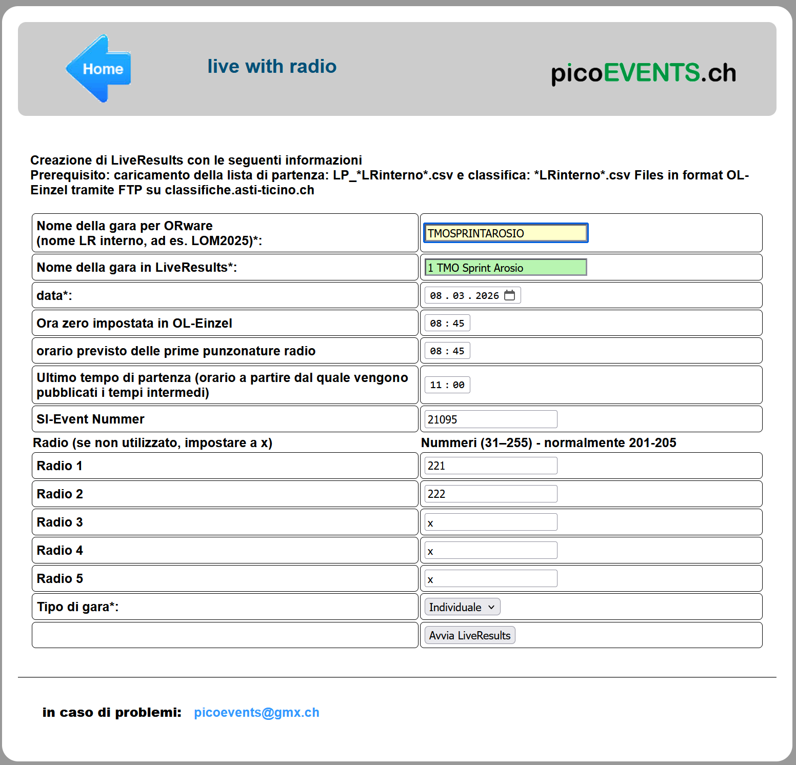
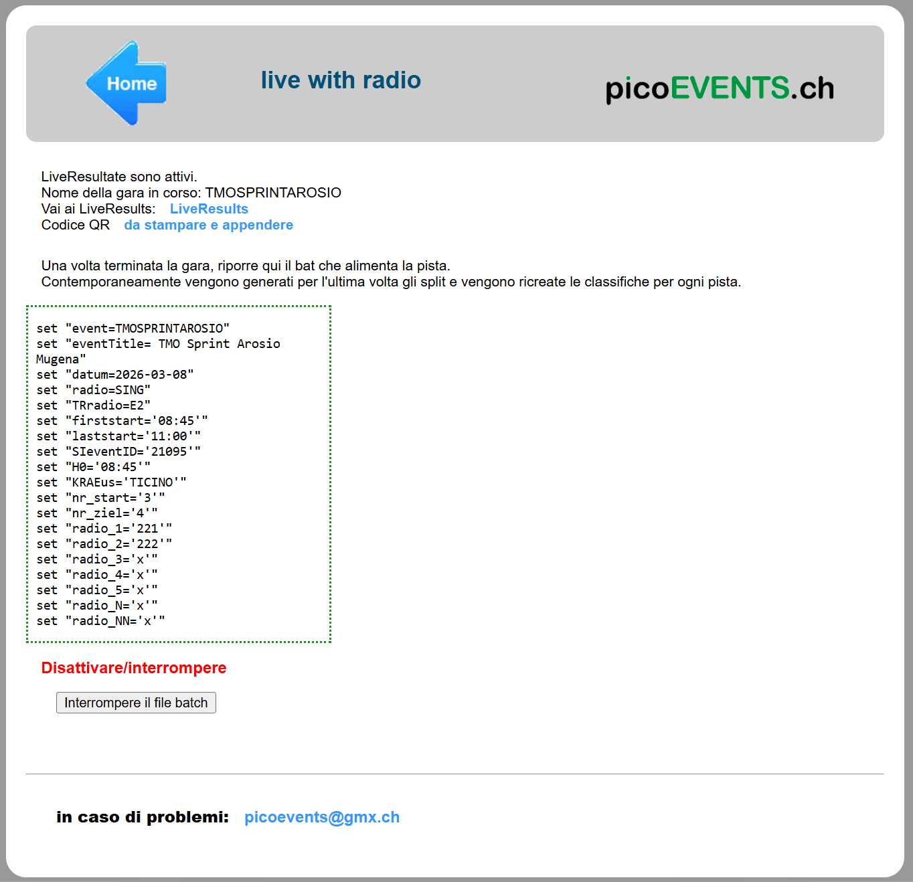

# Portale PicoEvents - Per gli organizzatori

Creare la gara su [PicoEvents](https://results.picoevents.ch/tic) per le liste di partenza e le classifiche online, come pure per le classifiche sulle TV al centro gara.

## Creazione gara
Come operazione preparatoria prima della gara, crea un evento sul sito PicoEvents.

1. Accedi al sito [https://results.picoevents.ch/tic](https://results.picoevents.ch/tic).  
1. Fai login con `public` e parola chiave `TI_22`.  
{width=80%}
1. Compila il formulario:  
**Nota**: hai 30 minuti a disposizione tra il login e l'avvio di `LiveResults`. 
{width=80%}  
    1. `Nome della gara per ORWare`: questo nome è univoco per la gara e viene usato anche come base per il nome del file esportato da `OL-Einzel`.  
    Usiamo come convenzione il nome `TIPO_GARA ANNO NR_GARA`.  
    Es. `TMO202601` o `NAZ202605`  
        - `TIPO_GARA`: `TMO`, `NAZ`, `SCOOL`, `SELE`
        - `ANNO`: a 4 cifre
        - `NR_GARA`: numero della gara a 2 cifre (es. 1. TMO `01`, 5. Nazionale `05`)  
    **Nota**: per ragioni tecniche deve essere corto.  
    **Nota**: questo campo accetta solo lettere maiuscole e cifre ma nessun carattere speciale (spazio, trattini, ecc.).  
    **Nota**: PicoEvents si aspetta questo nome come nome dei file con classifiche e liste di partenza:  
    Es. per il 1. TMO del 2026
        - `TMO202601.csv` per le classifiche
        - `LP_TMO202601.csv` per le liste di partenza
    1. `Nome della gara in LiveResults`: Nome dell’evento come visualizzato nell'elenco delle gare.  
    Usiamo come convenzione il nome `TIPO_GARA FORMULA_GARA LUOGO`.  
    Es. `TMO Sprint Arosio` o `Nazionale Arcegno`  
        - `TIPO_GARA`: `TMO` o `Nazionale`
        - `FORMULA_GARA`: `Long`, `Middle`, `Sprint`, `Staffetta`
        - `LUOGO`: centro gara o cartina.  
    **Nota**: la lista serve praticamente solo il giorno della gara.  
    **Nota**: per ragioni tecniche va tenuto breve.  
    **Nota**: questo campo accetta solo lettere (maiuscole e minuscole), cifre, spazio e caratteri accentati, ma non altri caratteri speciali (punto, virgola, trattini, ecc.).  
    1. `Data`: la data della gara.
    1. `Ora zero come impostata in OL-Einzel`: è importante non impostare l'ora zero pubblicata nelle info gara, ma quella impostata nel software OL-Einzel.
    1. `Orario previsto delle prime punzonature radio`: impostando questo valore si evita che il programma continui a cercare punzonature radio molto prima del passaggio del primo concorrente.  
    **Nota**: al limite impostare lo stesso valore dell'ora zero della gara.
    1. `Ultimo tempo di partenza (orario a partire dal quale vengono pubblicati i tempi intermedi)`: per regolamento, concorrenti non ancora partiti non possono vedere i tempi intermedi di tratta.  
    **Nota**: PicoEvents non utilizza a questo scopo gli orari di partenza esportati da OL-Einzel, per cui questo orario va impostato a mano.  
    1. `Numero evento SI`: questo valore cambia ogni anno. Per il 2026 utilizzare `21095`.
    1. `Radio`: impostare i numeri dei punti radio.  
    **Nota**: PicoEvents non supporta la sostituzione di scatolette come in OL-Events. I numeri indicati devono quindi corrispondere ai numeri effettivi della scatoletta.
        1. `Radio 1`: di regola `221`.  
        1. `Radio 2`: di regola `222`.   
        **Nota**: lasciare impostati a `x` i punti non utilizzati.  
        **Nota**: i `Finish` non vengono indicati.
    1. `Tipo di gara`:  seleziona il tipo di gara tra  
        - `Individuale` (normali TMO)
        - `Staffetta` (sia TMO che Sele)
        - `Squadre` (sCoolCup).
1. Quando il formulario è completo, premi sul bottone `Avvia LiveResults`.  
**Nota**: Se è passato troppo tempo tra il login e l'avvio di LiveResults, verrà visualizzata una pagina d'errore e bisogna ricominciare da capo.   
  
  
1. Le classifiche si attivano e viene mostrata una schermata con:
    - Link alla classifica online
    - Link a un codice QR da stampare che porta direttamente alla classifica online
    - Informazioni sulla configurazione
    - Un bottone per interrompere la generazione delle classifiche

1. Seleziona il link al codice QR, stampalo e appendilo al centro gara.  
Questo codice porta direttamente alle classifiche della tua gara.

1. Interrompendo il file batch si interrompe il processo di importazione dei dati.  
**Nota**: la gara con tutti i suoi dati resta visible agli utenti.

<!--
1. Le TV sono gia preimpostate per la gara TMO.  
  

    - Le colonne sono predefinite (5) mentre le categoria si possono spostare, aggiungere o rimuovere secondo le necessità ed il numero di concorrenti.
    - `Add TV` aggiunge una TV supplementare.
    - `Delete` cancella la TV con tutte le sue categorie.
    - `Clear TV` svuota la TV di tutte le categorie ma mantiene la TV.
    - `Fill TV` mette tutte le categorie sulla TV. È poi più facile rimuovere le categoria che non servono e ricombinare quelle rimanenti.
    - `Submit settings` salva le modifiche.
-->

## Pubblicazione liste di partenza
Per pubblicare le liste di partenza con OL-Einzel, vedi i dettagli in [software > OE12 > Liste di partenza > Pubblicazione](../../oe12/liste_partenza.md#pubblicazione).  

!!! Warning "Usa il nome ORWare della tua gara"
    Nel nome del file delle liste di partenza `LP_<NOME_ORWARE>.csv` assicurati di usare il `nome ORWare` della tua gara e non quello già impostato in OL-Einzel, che probabilmente è il nome della gara precedente.  
    **Nota**: secondo l'immagine precedente, il nome del file *per questa gara* sarebbe `LP_TMO202601.csv`.  
    Ricordati di `NON` impostare il `Nome file univoco`.

## Pubblicazione classifiche
Per pubblicare le classifiche con OL-Einzel, vedi i dettagli in [software > OE12 > Classifiche > Classifiche TV / Online](../../oe12/classifiche.md#classifiche-tv-online).  

!!! Warning "Usa il nome ORWare della tua gara"
    Nel nome del file delle classifiche `<NOME_ORWARE>.csv` assicurati di usare il `nome ORWare` della tua gara e non quello già impostato in OL-Einzel, che probabilmente è il token della gara precedente.  
    **Nota**: secondo l'immagine precedente, il nome del file *per questa gara* sarebbe `TMO202601.csv`.  
    Ricordati di `NON` impostare il `Nome file univoco`.

## Verifica classifiche online
Verifica le liste di partenza e le classifiche accedendo al sito online come utente anonimo, come descritto nella pagina per i [concorrenti](visualizzazione.md).  

<!--
Verifica pure le classifiche come vengono mostrate sulle TV.  

1. Accedi al sito [o2rank](http://classifiche.asti-ticino.ch/o2rank).
1. Fai login con l'utente `co@asti-ticino.ch` e la parola chiave `class1f1che`.
1. Seleziona il bottone `edit` della tua gara.
1. Copia il `Ftp Token` della tua gara.
1. Seleziona `TV` in alto a destra.
1. Incolla il tuo `Ftp Token`.
1. Seleziona la `TV` che vuoi vedere.
1. Verifica i dati visualizzati.
--> 

!!! Warning "Controlla anche le TV"
    Controlla le liste di partenza e le classifiche sulle TV al centro gara.  
    **Nota**: Con LiveResults di PicoEvents non è più possibile controllare le classifiche delle TV sul browser del PC.    

    
