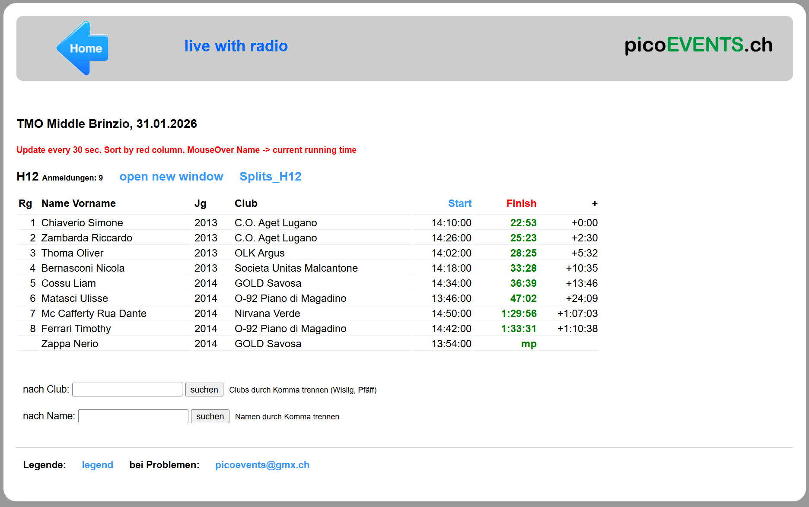
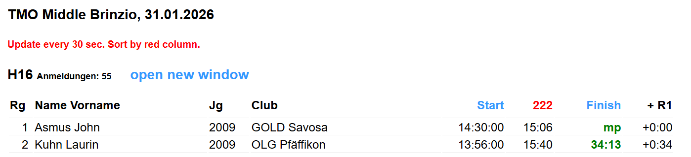
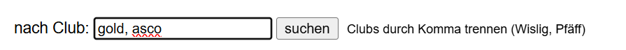
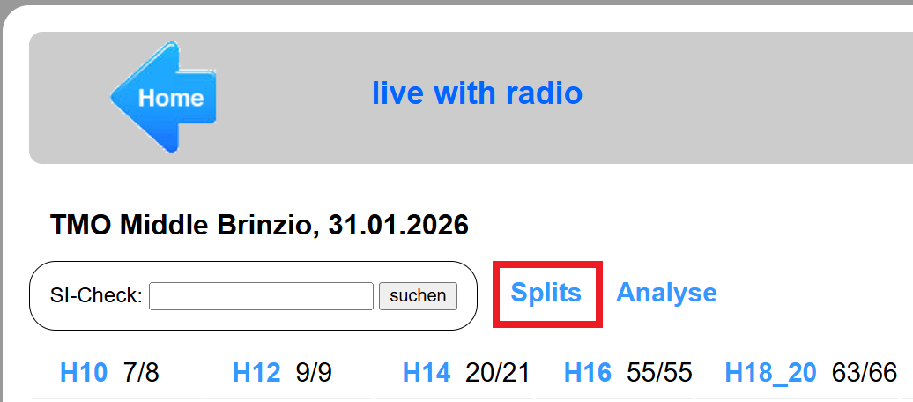
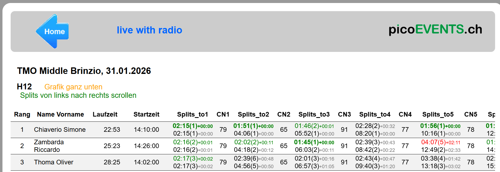
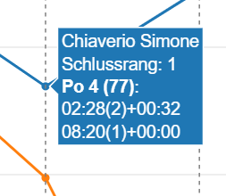

# Portale PicoEvents - Per i concorrenti

La pagina di visualizzazione delle classifiche contiene dati interessanti soprattutto per i concorrenti, ma anche gli organizzatori possono trovare pagine molto utili (es. `m` e `mO`).  

## Visualizzazione classifiche

1. Accedere al portale di PicoEvents via il QR Code affisso al centro gara o via [results.picoevents.ch](http://results.picoevents.ch). Di regola si accede direttamente alla pagina della gara, altrimenti viene mostrata una lista di gare dalla quale scegliere.  

1. Selezionare la propria categoria per vedere la classifica attuale.  
  
    1. Ordinare i concorrenti per orario di partenza, tempo di gara, ecc. selezionando l'intestazione della colonna (`Start`, `Finish`).  
    I dati sono ordinati secondo la colonna in rosso.  
    1. Categorie con punti radio hanno colonne aggiuntive con i tempi relativi al punto radio.  
    In questo esempio, il punto `222`.  
    
    1. Tempi di gara:
        - in nero: sono i tempi registrati all'arrivo con i punti radio, prima dello scarico chip e del controllo della sequenza dei punti.
        - in verde e grassetto: tempi confermati dopo la lettura chip, per concorrenti classificati (tutti i punti corretti).
    1. Stato di classifica:
        - `mp`: manca punto
        - `resgd`: ritirato 
        - `ncl.`: non classificato
        - `overT`: fuori tempo massimo
        - `disq`: squalificato
        - `horc`: fuori gara
        - `dns`: non partito
    1. La classifica viene aggiornata automaticamente ogni 30 secondi.
    1. Usa `open new window` per aprire la classifica in una pagina separata se vuoi visualizzarne diverse contemporaneamente.

1. Filtra i risultati per mostrare solo i concorrenti di una o più società (separate da virgola).  

1. Filtra i risultati per mostrare solo i concorrenti di una o più famiglie (separate da virgola).   

1. Seleziona liste speciali.  

    1. `ALL`: mostra tutte le categorie in una sola lista.  
    **Nota**: i numeri accanto a ALL indicano i concorrenti arrivati rispetto a quelli iscritti.
    1. `StZ`: mostra la griglia di partenza, cioè tutti i concorrenti in ordine di partenza.
    1. `ZielZ`: mostra tutti i concorrenti nell'ordine di arrivo
    1.  `Speaker`: da scoprire...
    1. `m`: elenca i concorrenti ancora nel bosco.  
    **Nota**: questa lista è utile soprattutto per i collaboratori all'arrivo o al rifornimento.
    1. `l`: chip noleggiati
    1. `mO`: elenco di concorrenti che hanno terminato la gara (hanno timbrato il `Finish` radio) ma non hanno ancora scaricato il chip.  
    **Nota**: lista utile ai collaboratori IT per sapere chi ha dimenticato di scaricare e poterlo quindi cercare al centro gara.
    1. `Scroll`: permette di scegliere una categoria e vederela scrollare automaticamente.

## Analisi gara con PicoEvents

Il portale PicoEvents mostra inizialmente solo i tempi di partenza, di gara e eventualmente i tempi di passaggio ai punti radio.  
Dopo la partenza dell'ultimo concorrente, il portale mostra anche i tempi intermedi con relativi grafici, permettendo l'analisi di gara già prima che sia effettivamente terminata.

1. Nella visualizzazione della liste di categorie, premi su `Splits` poi seleziona la categoria.  
  
In alternativa, nella visualizzazione della classifica di una categoria, seleziona il relativo tasto Splits, ad es. `Splits_H12`.
1. Scrolla la lista verso destra per vedere tutti i tempi intermedi.  
  
    - I migliori tempi di tratta sono mostrati in verde e grassetto.
    - Buoni tempi sono mostrati in verde
    - Tempi particolarmente lenti sono marcati in rosso.
1. Nella parte bassa della pagina, seleziona i concorrenti per vederne il grafico.  

    - La riga orizzontale corrisponde al tempo medio dei migliori 5 di tratta. Quelli più veloci sono sopra la riga, quelli più lenti sotto.
    - Usa l'îcona della macchina fotografica nell'angolo in alto a destra per salvare il grafico.
    - Posiziona il mouse sul grafico a un punto per vedere il distacco di tratta e il rango relativo a quel punto.  
    Esempio:  
      
        - Simone ha vinto la gara(`Schlussrang: 1` = `rango finale: 1`).  
        - `Po 4 (77)`: Punto 4, numero 77
        - `02:28(2)+00:32`: tempo di tratta del Simone (02:28), secondo rango di tratta, 32 secondi di distacco dal migliore.
        - `08:20(1)+00:00`: tempo di gara del Simone al 4. punto (08:20), rango a quel punto (primo), distacco dal primo (0:00).

## Analisi gara con OL-Zimaa
Dopo la partenza dell'ultimo concorrente, il portale PicoEvents attiva anche l'analisi dei dati via un portale esterno.

1. Nella pagina principale della gara, seleziona `Analyse` per accedere al sito esterno `Olana - Orienteering Results Analysis` su [ol.zimaa.ch](https://ol.zimaa.ch)

1. Questo sito permette varie analisi, ad esempio analisi di tratta da punto A a punto B indipendentemente dalla categoria.  

    - Cambia la lingua nell'angolo in alto a destra.
    - Seleziona l'anno per accedere a tutte le gare passate, anche non gestite da PicoEvents.

