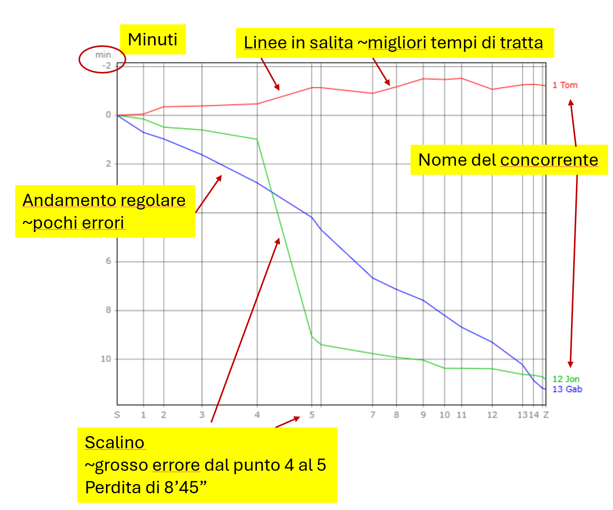

# Classifiche Swiss Orienteering

Le classifiche di tutte le gare valide per il TMO come pure di tutte le gare nazionali e campionati svizzeri sono visibili sul sito della federazione svizzera [Swiss Orienteering](https://www.swiss-orienteering.ch/it).

1. Seleziona [Gare > Classifiche](https://www.o-l.ch/cgi-bin/results).  
1. Seleziona la gara nel campo `Anlass` e clicca su `Rangliste`.
**Nota**: sul sito sono memorizzate le classifiche di tutte le gare dal 1997. Seleziona l'anno in alto per vedere eventi del passato.
1. Seleziona la categoria.
**Nota**: selezionando `alle` si vedono tutte le categorie su un'unica pagina, con l'indicazione del numero totale di partecipanti ma mancherà la possibilità di vedere i grafici.
1. Seleziona l'opzione `Zwischenzeiten` in fondo alla classifica per vedere i tempi intermedi.  
Per ogni punto, vengono indicati (su tre righe).  
    - il numero progressivo del punto, il tempo totale di gara fino a quel punto e il rango totale a quel punto  
    - il numero del punto, il tempo di tratta dal punto precedente, il rango di tratta
    - il distacco dal tempo migliore di tratta
1. Seleziona l'opzione `Grafik` in fondo alla classifica per visualizzare un grafico dell'andamento della gara.  
**Nota** è possibile indicare la dimensione del grafico specificando la larghezza rispettivamente l'altezza in pixel.
    1. Inizialmente viene mostrato il grafico del vincitore.
    1. Seleziona l'opzione davanti ad ogni concorrente che vuoi vedere.
    1. La linea nel grafico sarà orizontale per il tempo intermedio di tratta (da punto a punto) corrispondente alla media dei migliori 3 risultati (o forse 5...).
        - Linee ascendenti indicano tempi di tratta ottimi, quelli discendenti una perdita di tempo rispetto ai migliori.
        - La pendenza della linea varia a dipendenza del distacco dal tempo medio dei migliori.  
        - La colonna a sinistra mostra il distacco in secondi o minuti (a dipendenza dell'indicazione in cima alla colonna).
        - Una pendenza discendente regolare tipo "retta" significa di regola una perdita costante di tempo a livello di corsa senza errori di orientamento. 
        - Scalini nella linea mostrano gli errori e il relativo tempo perso.  
        

