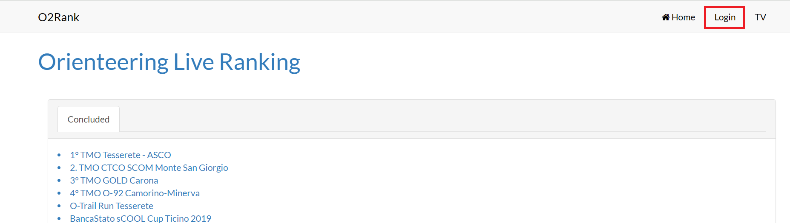
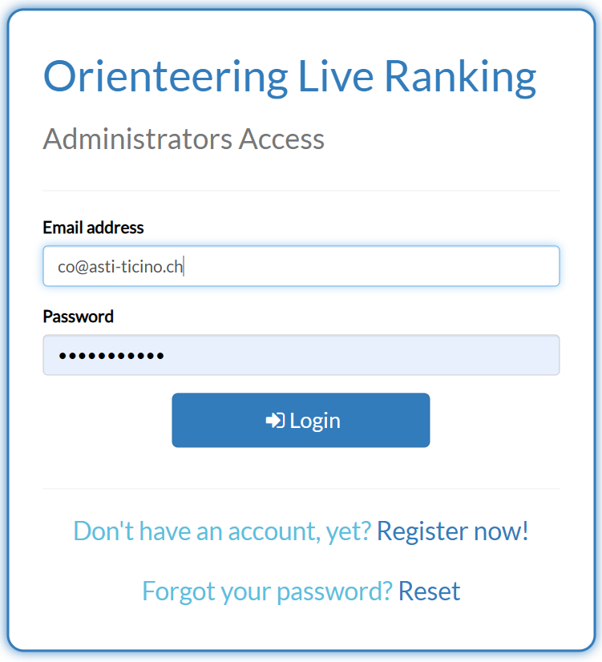
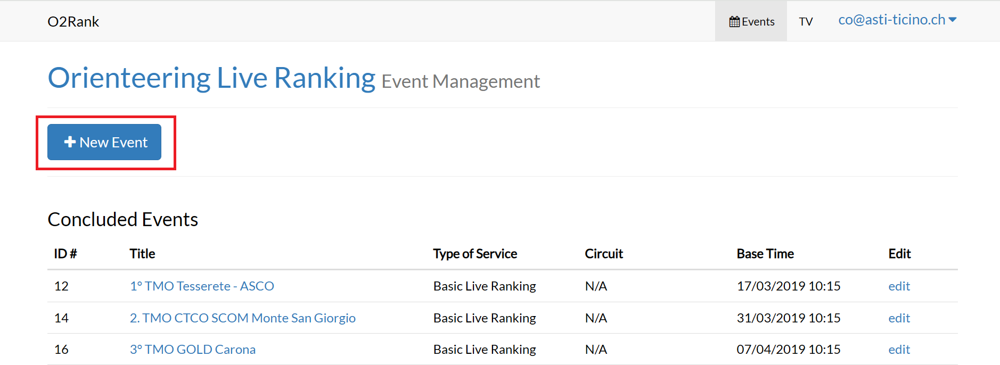
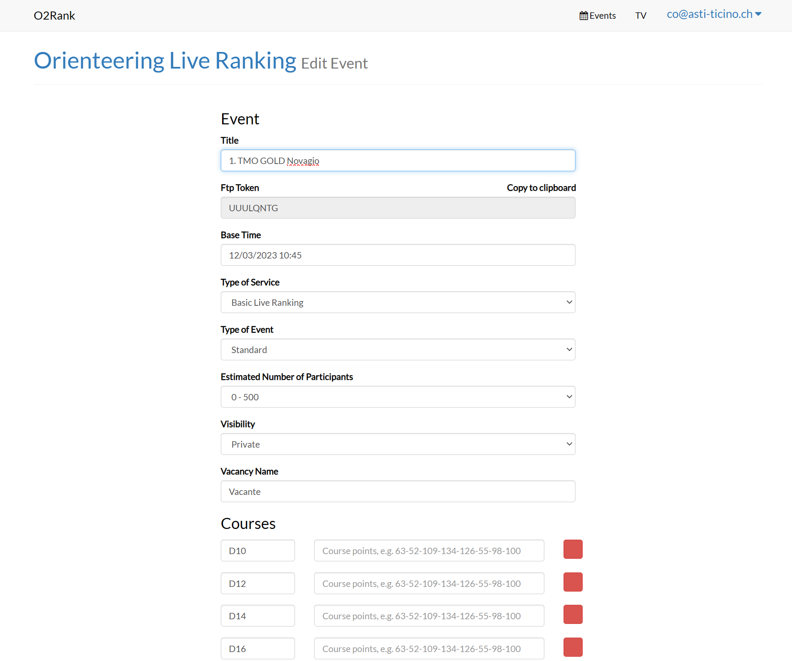
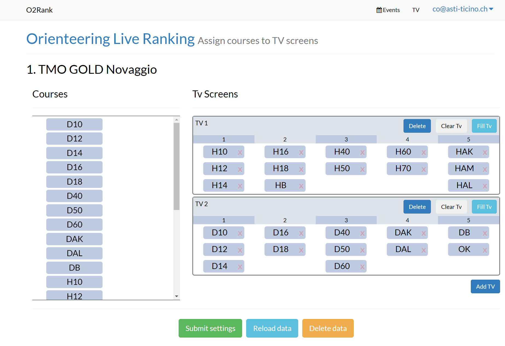

# Portale O2Rank - Per gli organizzatori

Creare la gara su [o2rank](http://classifiche.asti-ticino.ch/o2rank/) per le liste di partenza e le classifiche online, come pure per le classifiche sulle TV al centro gara.

## Creazione gara
Come operazione preparatoria prima della gara, crea un evento sul sito O2Rank.

1. Accedi al sito [http://classifiche.asti-ticino.ch/o2rank/](http://classifiche.asti-ticino.ch/o2rank/).  

1. Fai login con `co@asti-ticino.ch` e parola chiave `class1f1che`.  
{width=50%}
1. Clicca su `+ New Event` per creare una nuova gara.  

1. Compila il formulario:
    1. `Private Event`: attiva il flag se non vuoi che l’evento sia pubblico e cioè che non sia visibile nella lista degli eventi.   
    I dati saranno accessibili tramite il token (vedi in seguito).  
    **Nota**: la modalità privata è comoda durante la creazione e i test preliminari, per assicurarsi che tutto funzioni prima della pubblicazione.
    1. `Title`: Nome dell’evento (es. `1. TMO GOLD Novaggio 2023`).
    1. `Base Time`: Ora zero secondo OL-Einzel.
    1. `Type of service`: i possibili valori sono:
        - `Basic Live Ranking`: valore da usare per gare TMO.
        - `Radio Live Ranking`: per gare con punti radio. 
        **Nota**: o2rank supportava i punti radio di Simon, non più disponibili, per cui non usare questa opzione fino al prossimo aggiornamento.
        - `ScoolCup Live Ranking`: per la gara sCoolCup.
    1. `Type of Event`: i possibili valori sono
        - `Standard`: per tutte le gare
        - `Relay`: per le staffette. 
        **Nota**: questa funzionalità non è attualmente implementata.
    1. `Estimated number of Participants`: Non utilizzato
    1. `Select an event template`:i possibili valori sono
         - `TMO`: imposta le categorie tipiche del TMO.
         - `NAZ`: imposta le categorie di una nazionale
    1. Se non selezioni un template:
        1. `Category`: Crea un elemento per ogni categoria (`OK`, `H10`, `H12`,….).  
        Non è necessario inserire la sequenza delle scatolette, serve per gli eventi con punti radio.
        1. `Vacancy Name`: inserisci come sono identificati i vacanti.   
        **Nota**: Se usi OL-Einzel imposta `Vacante`.
1. Controlla i valori e premi su `Create Event`.
1. Il sito crea la gara e mostra la pagina per le mutazioni.  
**Nota**: nota il campo `Ftp Token`: il token identifica in maniera univoca la tua gara. Va usato nel software OL-Einzel nel nome dei file CSV di classifiche e liste di partenza. Il bottone `Copy to clipboard` copia il token, rendendolo pronto per essere incollato in OL-Einzel. 
  

  
  
1. In fondo alla pagina, entra nella configurazione TV (bottone `TV Setup`).
1. Le TV sono gia preimpostate per la gara TMO.  
  

    - Le colonne sono predefinite (5) mentre le categoria si possono spostare, aggiungere o rimuovere secondo le necessità ed il numero di concorrenti.
    - `Add TV` aggiunge una TV supplementare.
    - `Delete` cancella la TV con tutte le sue categorie.
    - `Clear TV` svuota la TV di tutte le categorie ma mantiene la TV.
    - `Fill TV` mette tutte le categorie sulla TV. È poi più facile rimuovere le categoria che non servono e ricombinare quelle rimanenti.
    - `Submit settings` salva le modifiche.

## Pubblicazione liste di partenza
Per pubblicare le liste di partenza con OL-Einzel, vedi i dettagli in [software > OE12 > Liste di partenza > Pubblicazione](../oe12/liste_partenza.md#pubblicazione).  

!!! Warning "Usa il token della tua gara"
    Nel nome del file `LP_<FTP-TOKEN>.csv` assicurati di usare il `Ftp Token` della tua gara e non quello già impostato in OL-Einzel, che probabilmente è il token della gara precedente.  
    **Nota**: secondo l'immagine precedente, il nome del file *per questa gara* sarebbe `LP_UUULQNTG.csv`.  
    Ricordati di impostare anche `Nome file univoco`.

Se l’evento è futuro, presente o passato (se meno di 5 giorni), nel giro di qualche minuto i dati vengono importati (al file caricato viene messo un OK_ nel nome del file sul server FTP).

!!! Info "Reset dei dati"
    Caricando una nuova lista di partenza durante la gara, il server effettua automaticamente un reset dei dati caricati.  
    Le persone nelle liste di partenza e nelle classifiche spariscono per un minuto, bisognerà attendere il prossimo import delle classifiche per vedere di nuovo i dati aggiornati.

## Pubblicazione classifiche
Per pubblicare le classifiche con OL-Einzel, vedi i dettagli in [software > OE12 > Classifiche > Classifiche TV / Online](../oe12/classifiche.md#classifiche-tv--online).  

!!! Warning "Usa il token della tua gara"
    Nel nome del file `<FTP-TOKEN>.csv` assicurati di usare il `Ftp Token` della tua gara e non quello già impostato in OL-Einzel, che probabilmente è il token della gara precedente.  
    **Nota**: secondo l'immagine precedente, il nome del file *per questa gara* sarebbe `UUULQNTG.csv`.  
    Ricordati di impostare anche `Nome file univoco`.

Se l’evento è futuro, presente o passato (se meno di 5 giorni), nel giro di qualche minuto i dati vengono importati (al file caricato viene messo un OK_ nel nome del file sul server FTP).

## Verifica classifiche online
Verifica le liste di partenza e le classifiche accedendo al sito online come utente anonimo, come descritto nella pagina per i [concorrenti](visualizzazione.md).  

Verifica pure le classifiche come vengono mostrate sulle TV.  

1. Accedi al sito [o2rank](http://classifiche.asti-ticino.ch/o2rank).
1. Fai login con l'utente `co@asti-ticino.ch` e la parola chiave `class1f1che`.
1. Seleziona il bottone `edit` della tua gara.
1. Copia il `Ftp Token` della tua gara.
1. Seleziona `TV` in alto a destra.
1. Incolla il tuo `Ftp Token`.
1. Seleziona la `TV` che vuoi vedere.
1. Verifica i dati visualizzati.

!!! Warning "Controlla anche le TV vere"
    La possibilità di controllare il display sulle TV è molto comodo, in quanto permette una verifica senza bisogno di spostarsi a vedere le TV vere, non sempre posizionate in prossimità del team IT. È anche possibile verificare la corretta configurazione della gara prima del montaggio effettivo delle TV.  
    Se i dati non vengono mostrati sul browser non lo saranno nemmeno sulle TV vere.  
    **Nota**: può tuttavia succedere il contrario, cioè sul browser è tutto corretto ma le TV vere non funzionano. Questo potrebbe essere legato a problemi di connettività di rete.  
    **Nota**: il browser sul PC e quello sulle TV potrebbero formattare i dati un po' diversamente (ad esempio i nomi delle società su più righe). Non è possibile intervenire in questo senso.

## Impostazioni sulle TV

**QUESTA SEZIONE È ANCORA DA FARE**  
{width=30px}

Vedi la [versione PDF](inc/Classifiche%20Online-Televisioni%20_%20impostazioniV2023.4.pdf)

    
