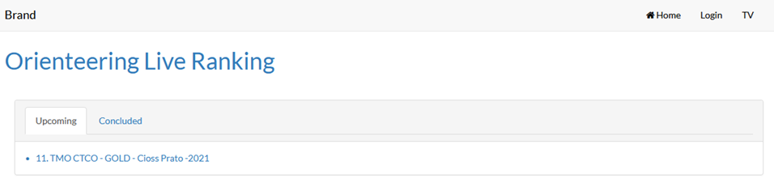
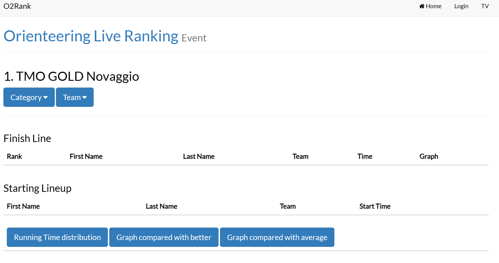
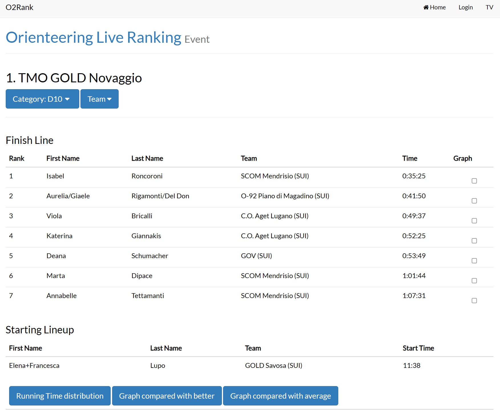
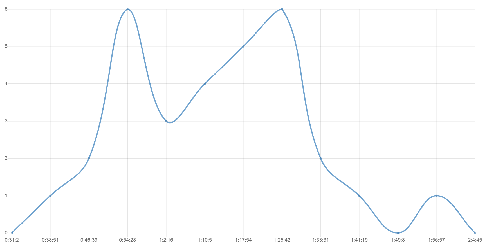

# Portale O2Rank - Per i Concorrenti

Le classifiche del sito O2Rank vengono aggiornate durante la gara, in tempo reale.  
  
Non è quindi necessario attendere il termine della gara per vedere le classifiche parziali, ma è possibile per chiunque, concorrenti o fan, in loco o da casa, di seguire le gesta dei propri eroi.  
  
1. In un browser, accedi al sito [o2rank](http://classifiche.asti-ticino.ch/o2rank).  
**Nota**: il sito mostra due liste: `Upcoming` sono le prossime gare, `Concluded` quelle già concluse.

1. Seleziona la gara che ti interessa.  

1. Seleziona una categoria per vedere la classifica (`Finish Line`) e, nella parte bassa, la lista di partenza (`Starting Lineup`).  
**Nota**: seleziona una società in `Team` per vedere solo i membri di una società nella categoria selezionata.

1. Sotto la classifica trovi tre bottoni:
    1. `Running time distribution`: mostra un grafico con la distribuzione dei tempi di gara di tutti i concorrenti della categoria.
    
    1. `Graph compared with better`: mostra un grafico dei tempi intermedi di tutti i concorrenti selezionati tramite la checkbox `Graph` sulla destra, confrontati con il tempo del vincitore (riga orizontale).  
    **Nota**: il grafico resta vuoto se la gara non contiene i tempi intermedi.
    1. `Graph compared with average`: mostra un grafico dei tempi intermedi di tutti i concorrenti selezionati tramite la checkbox `Graph` sulla destra, confrontati con il tempo medio dei concorrenti selezionati (riga orizontale).
1. Nella classifica, premi sul nome di un concorrente per vedere tutte le gare a cui ha partecipato e i risultati ottenuti.
1. Nella classificha, premi sul nome della società per vedere un sommario di quanti membri hanno partecipato alle varie gare. 