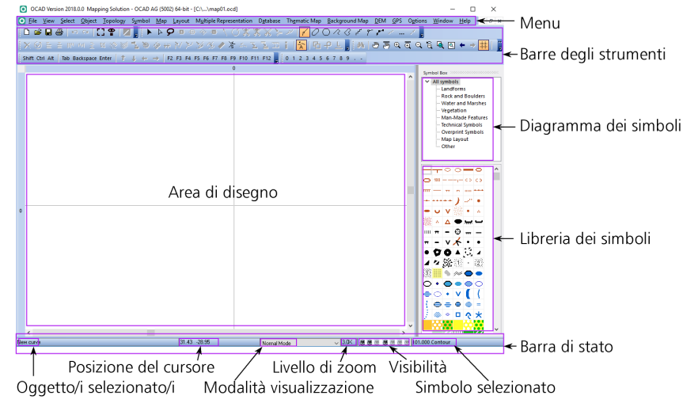

# OCAD 

**QUESTA PAGINA È ANCORA IN ELABORAZIONE**  
{width=100px}

!!! Info "Pagine su OCAD"
    Le pagine seguenti NON costituiscono una guida ufficiale né esaustiva per l’utilizzo di OCAD. Per consultare la guida completa e ufficiale, visitate il sito [OCAD Wiki](https://www.ocad.com/wiki/ocad/), dove troverete anche una [Guida introduttiva ad OCAD (PDF)](https://www.ocad.com/downloads/gs/Getting%20Started_OCAD_Italian.pdf) in italiano.

[OCAD](https://ocad.com) è il software più diffuso in Ticino e in Svizzera per la creazione di tracciati di percorsi e la realizzazione di carte per la corsa d'orientamento.
Queste pagine forniscono indicazioni per creare e stampare percorsi, con l’obiettivo di supportare i tracciatori delle gare ASTi valide per TMO/TMS. Se doveste riscontrare errori, vi preghiamo di segnalarli.

Questa sezione si suddivide in tre parti:  

- [**Panoramica**](#ocad_panoramica): descrive le varie edizioni di OCAD, i tipi di licenza e l'utilizzo di OCAD come applicazione cloud e l'interfaccia grafica.
- [**OCAD per tracciatore**](ocad_tracciatore.md): descrive le principali funzionalità di OCAD per tracciatore e stampare dei tracciati per delle gare ASTi.
- **OCAD per cartografo**: (prossimamente) descrive alcune funzionalità di OCAD per eseguire degli aggiornamenti puntuali di cartine.  

##  Panoramica di OCAD 
## Edizioni
OCAD è disponibile in diverse edizioni, ciascuna con funzionalità specifiche pensate per esigenze differenti. Ecco un riepilogo.  

- **OCAD Course Setting**: specifico per preparare i tracciati su cartine da CO esistenti.
- **OCAD Viewer**: consente di visualizzare e stampare dei files OCAD ma non modificarli. È gratuito.   
- **OCAD Starter**: pensato per creare mappe semplici (ad esempio cartine scolastiche) ed elaborare dei traccitai. 
- **OCAD Orienteering**: permette sia di disegnare le cartine e preparare dei tracciati.   
- **OCAD Mapping Solution**: versione professionale, adatta alla realizzazione di mappe complesse (non solo per la CO) e all'elaborazione dei tracciati.
- **OCAD Trial**:  versione demo completa di OCAD valida 14 giorni.

Esiste anche un'app OCAD:  

- **OCAD Sketch App**: pensata per rilevare le cartine. Funziona su Androidi o iOS. È gratuita.

## Licenze Single User o for Teams
Per OCAD *Course Setting*, *OCAD Starter*, *OCAD Orienteering* e *OCAD Mapping Solution* esistono due tipi di licenze:  

- **OCAD for Single User**: licenza singola fissa utilizzabile solo su un PC.
- **OCAD for Teams**: licenza/e "floating". Attivabile solo su un PC alla volta ma trasferibile facilmente ad un altra persona / PC.

## OCAD come applicazione cloud: 
È possibile installare OCAD su un cloud come Dropbox o OneDrive e utilizzarlo direttamente da lì, senza doverlo installare localmente sul proprio PC.

Molte società ticinesi utilizzano licenze OCAD for Teams, che sono installate su Dropbox e condivise con i soci autorizzati. Per maggiori dettagli, contattate la vostra società. 

## Interfaccia grafica  
A seconda della modalità di utilizzo di OCAD, l'interfaccia potrebbe variare leggermente:

- **Interfaccia tracciamento**: quando si apre un file OCAD contenente percorsi per il tracciamento.  
       
  {width=500px}  

- **Interfaccia cartina**: quando si apre un file OCAD di una cartina per modificarla. Questa modalità non è disponibile in OCAD Course Setting.   
    
  
 
  Le due interfacce sono costuite da:  
   
  - una barra dei menu
  - una barra degli strumenti
  - una barra di stato
  - un'area di disegno
  - per l'interfaccia cartina: la libreria dei simboli (diagramma dei simboli + simboli)
  - per l'interfaccia tracciamento: il riquadro dei simboli (symbol box), il riquadro dei simboli dei tracciati (course objects box) e la lista degli oggetti dei tracciati (course objects list)