# < name="top"></a>OCAD per il tracciatore

**QUESTA PAGINA È IN FASE DI ELABORAZIONE  
ALCUNE INFORMAZIONI DEVONO ANCORA ESSERE VALIDATE**  
{width=100px}

In queste pagine sono descritte le procedure per preparare i percorsi di una gara utilizzando OCAD, dalla creazione del file iniziale alla stampa delle mappe. Viene presentato il metodo consigliato per le gare di CO ASTi (TMO, TMS, ecc.), con alcune varianti per utenti più esperti. Le istruzioni sono in continuo aggiornamento, quindi potrebbero subire modifiche nel tempo. Se trovate eventuali errori vi invitiamo a segnalarli.

- [ [&#9655;] Informazioni preliminari per il tracciamento di una gara ASTi](#cs_info_preliminari_tracciamento)
- [ [ 0 ] Interfaccia grafica OCAD Tracciamento percorsi](#cs_interfaccia_grafica)
- [ [ 1 ] Creazione del file OCAD dei tracciati](#cs_creazione_file_tracciati)
- [ [ 2 ] Impostazione progetto OCAD dei tracciati](#cs_impostazione_progetto_tracciati)
- [ [ 3 ] Creazione/composizione dei tracciati](#cs_creazione_composizione_tracciati)
- [ [ 4 ] Descrizione punti](#cs_descrizione_punti)
- [ [ 5 ] Controllo dei tracciati](#cs_controllo_tracciati)
- [ [ 6 ] Grafica dei tracciati ed elementi dei tracciati](#cs_grafica_ed_elementi_tracciati)
- [ [ 7 ] Impaginazione per la stampa (cartina e percorsi)](#cs_impaginazione_stampa)
- [ [ 8 ] Esportazione PDF descrizione punti](#cs_esportazione_descrizione_punti_pdf)
- [ [ 9 ] Esportazione tracciati per OL-Einzel](#cs_esportazione_oe)
- [ [ 10 ] Stampa delle cartine di gara](#st_stampa_cartine_gara)  
- [ [ 11 ] Verifica cartine stampate](#st_verifica_cartine_stampate)
- [ [ 12 ] Esportazione cartine e percorsi per Livelox](#cs_esportazione_livelox)

- [ Altre informazioni supplementari](#ocad_altro)

---
## [&#9655;] Informazioni preliminari per il tracciamento di una gara ASTi

- [x] **Richiedete l’ultima versione del file della cartina** da utilizzare per la gara al/alla responsabile cartine ASTi.
- [x] **Se, in qualità di organizzatori, effettuate aggiornamenti puntuali alla cartina**, eseguiteli direttamente sul file completo della carta. Al termine della gara, inviate nuovamente il file aggiornato (comprensivo di tutti gli elementi di layout) al/alla responsabile cartine ASTi.  
      Gli eventuali aggiornamenti puntuali, soprattutto nel caso di cartine nuove, dovrebbero essere effettuati dal cartografo che ha realizzato la cartina oppure, quantomeno, con il suo consenso. Per cartine meno recenti, possono essere eseguiti con il supporto di un cartografo della vostra società o da “orientisti esperti”. È fondamentale evitare modifiche rilevanti alla cartina; qualora queste siano necessarie, devono essere pianificate per tempo ed eseguite nell'ambito di un progetto di aggiornamento cartina.
- [x] **Verificate che state utilizzando l’ultima versione del software OCAD**. Tra una versione e l’altra, oltre a nuove funzionalità, possono esserci modifiche al modello dei simboli di tracciato.
      Se usate una licenza team su cloud, chiedete al responsabile della vostra società di aggiornare OCAD, se necessario.  
      > [Come verificare che versione del software OCAD sto usando](#ocad_check_version)
- [x] **Durante il tracciamento dei percorsi**, considerate fin da subito il formato della cartina che verrà stampata, in modo da evitare problemi in seguito o inutili cambi/giro della cartina.
- [x] **Denominazione delle categorie/tracciati**: per le gare ASTi, utilizzare le denominazioni ufficiali previste. Riferimento: <a href="https://www.asti-ticino.ch/co/index.php?folder=ctco&main=reco" target=_new><ins>RECO</ins></a>.

> [ Ritorna sopra ](#top)
---
##  [ 0 ] Interfaccia grafica OCAD Tracciamento percorsi

{width=500px}

-  barra dei menu
-  barra degli strumenti
-  barra di stato
-  area di disegno
-  riquadro dei simboli (symbol box):
-  il riquadro dei simboli dei tracciati (course objects box)
-  lista degli oggetti dei tracciati (course objects list)

> [ Ritorna sopra ](#top)
---
## [ 1 ] Creazione del file OCAD dei tracciati
???+ Info "File necessari per il tracciamento"
    Per preparare i tracciati di gara sono necessari due file OCAD:

      - *File dei tracciati*: è il file OCAD in cui si gestiscono gli elementi dei tracciati (partenze/punti/passaggio obbligati, ecc.), si creano i tracciati e le categorie, e si carica la cartina come sfondo. Questo file deve essere creato da voi.
      - *File della cartina*: è il file OCAD della cartina, che verrà utilizzato come sfondo nel file dei tracciati. Questo file vi viene fornito.  
    
    :bulb: Si consiglia di salvare entrambi i file — tracciati e cartina — all’interno della stessa cartella, assegnando loro nomi chiari e, se necessario, includendo la data della versione (es. *percorsiSanGiorgio_250602.ocd* e *mapSanGiorgio_250101.ocd*)

???+ Info "Simbologia e scala del file dei tracciati"
    I *simboli* utilizzati nel file dei tracciati devono rispettare le specifiche del tipo di cartina impiegata (ad esempio: ISOM, ISSprOM, ecc.). Inoltre, la *scala* del file dei tracciati deve corrispondere esattamente a quella del file della cartina.    
    :pushpin: Prima di creare il file dei tracciati, è quindi fondamentale conoscere:

      - la *simbologia* adottata nella cartina (di regola per le gare middle e long nel bosco usiamo cartine ISOM e per le gare sprint cartine ISSprOM)
      - la *scala* del file della cartina

??? Note "Annota simbologia e scala del file della cartina"
      Prima di iniziare a tracciare, annota la simbologia e la scala della cartina per lavorare nel modo giusto.

       - Simbologia cartina:
      - [ ] ISOM 
      - [ ] ISSprOM
    - Scala del file della cartina:
      - [ ] 1:10'000
      - [ ] 1:4'000  
      altre scale (casi particolari):
      - [ ] 1:7'500
      - [ ] 1:5'000
      - [ ] ____

- [x] Crea il file dei tracciati: esistono due modi per farlo, si consiglia il primo.
    1. **Creazione guidata file tracciati di gara** :thumbsup:   
    `> File > Creazione Guidata Tracciati di Gara`  
    Maggiori info > [Creazione guidata file tracciati di gara](#cs_creazione_guidata_file_tracciati) 
    1.  **Creazione manuale file tracciati di gara**:  
    `> File > Nuovo`  
    Maggiori info > [Creazione manuale file tracciati di gara](#cs_creazione_manuale_file_tracciati)  

???+ Failure "Errore scala sfondo"
    Se quando aprite il file della cartina appare il seguente messaaggio d'errore *Lo sfondo è georiferito in scala ..... ma i percorsi sono in scala ....* significa che il vostro file dei percorsi non ha la medesima scala del file della cartina.  
    Ricreate un nuovo file dei percorsi con la scala e simbologia corretta   
    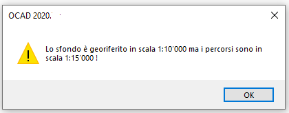{width=300px}

???+ Warning "Impostazioni: bordino bianco - linee di connessione"
      - Bordino bianco:
          - Per gare bosco (ISOM): **non è permesso** - non attivate l'opzione.
          - Per cartine sprint (ISSprOM): è permesso per TMO/TMS - potete attivare l'opzione. Per gare nazionali da discutere con TD.    
      - Lineee di connessione: distanza tra il cerchio e la linea di collegamento consigliato {==0.00 mm==}
- Una volta creato il file dei tracciati con la cartina come sfondo, se la cartina è georeferenziata, anche i tracciati saranno automaticamente in coordinate.

???+ Info "Dati georeferenziati e precisione cartine"
    Si consiglia di lavorare con dati georeferenziati, poiché alcune funzionalità di OCAD (ad esempio il caricamento su Livelox) lo richiedono.  
    In Svizzera si utilizza il sistema di coordinate Swiss Grid CH1903+ / LV95 (coordinate nell’ordine di 2 milioni / 1 milione).  
    Tra le cartine ASTi, esistono ancora alcune vecchie cartine non georeferenziate. Inoltre, alcune cartine, pur georeferenziate, sono state create con basi altimetriche e planimetriche vecchie (piani corografici), meno precise rispetto a quelle attuali, basate su dati lidar e misurazione ufficiale. Per questo motivo sovrapponendo una traccia GPS ci potrebbero essere delle discrepanze.
    Con il rifacimento delle cartine utilizzando tecniche aggiornate, in futuro non ci saranno più questi problemi.

> [ Ritorna sopra ](#top)
---
## [ 2 ] Impostazione progetto OCAD dei tracciati

- [x] Verificate le impostazioni del progetto OCAD 
      - Menu `> Tracciamento percorsi > Impostazioni`
      - Appare la finestra **Opzioni generali tracciati** dove è possibile configurare alcuni parametri
  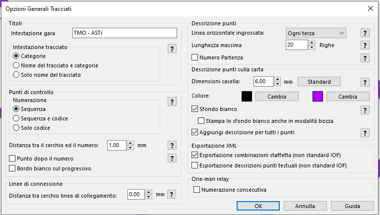  
        -   *Intestazione gara*: scritta che apparirà nella descrizione punti
        -   *Intestazione tracciato*: selezionate *Categoria* per far apparire solo il nome della categoria nella descrizione punti
        -  *Punti di controllo - Numerazione*: selezionate *Sequenza* per far apparire i numeri prograssivi
        -  *Distanza tra il cerchio ed il numero*: distanza fra il cerchio e il numero progressivo che verrà posizionato automaticamente
        -  *Punto dopo il numero*: se attivato vi apparità un punto dopo il numero (es. 2.). *NON attivatelo*
        -  *Bordo bianco sul progressivo*: vedi capitolo precedente
        -  *Distanza tra cerchio linea di collegamento*: vedi capitolo precedente
        -  Descrizione punti:
            - *Linea orizzontale ingrossata*: impostate *Ogni terza* per far apparire una linea più spessa ogni 3 righe nella descrizione punti
            - *Lunghezza massima*: potete definire il numero massime di righe per la descrizione punti oltre al quale vera creata una seconda colonna, ...
        -  *Dimensioni caselle*: dimensioni caselle della descrizione punti lasciate dimensione standard ==6mm== (per le categorie seniores anche ==7mm==)
        -  *Colore*: della descrizione punti (nero o magenta)
        -  *Sfondo bianco*: *attivatelo* per avere uno sfondo bianco sotto la descrizione punti
        -  *Stampa lo sfondo bianche anche in modalità bozza*:  per stampare lo sfondo bianco della descrizione anche in modalità bozza
        -  *Aggiungi descrizione punti per tutti i punti*: *attivatelo*
        -  Esportazione XML
            - *Esportazione combinazioni staffetta (non standard IOF)*
            - *Esportazione descrizione punti testuali (non standard IOF)*: per esportare le descrizioni punti in formato testuale. *NON attivatelo*
        -  *One-man relay - Numerazione consecutiva*

Maggiori informazioni vedi > <a href="https://www.ocad.com/wiki/ocad/en/index.php?title=Course_Setting_Options" target=_ocad><ins>OCAD Wiki - Course Setting Options</ins></a>

---
## [ 3 ] Creazione/composizione dei tracciati  
- [ ] (opzionale) Attivate *Descrizione automatica dei punti di controllo* per ottenere automaticamente la decrizione del punto quando inserite un elemento del tracciato (partenza o punto di controllo).
  Questa opzione deve essere attivata prima di inserire i punti e inoltre dovete tenere presente che se spostate il punto la descrizione punti non viene aggiornata. In qualsiasi caso alla fine controllate sempre comunque i simboli e completate le colonne C, E, F, G e H della descrizione punti.
    -  Menu `> Tracciamento percorsi > Descrizione automatica dei punti di controllo...`  
    -  Appare la finestra **Descrizione punti automatica**
      
      - Attivate l'opzione *Utilizza la descrizione automatica dei punti di controllo*  
      - Selezionate lo sfondo con la cartina
      - Selezionate le specifiche cartografiche: di regola per nuove cartine *ISOM2017/ISSprOM2019* (o configurate manualmente *Corrispondenza simboli*)
- [x] (se non prevedete abbinamenti di percorsi) Create l'elenco dei tracciati/categorie importando l'elenco dei tracciati/categorie 
    - Scarica il file con <a href="https://www.asti-ticino.ch/co/doc/elenco_tracciati_categorie_tmo_251201.txt" target=_dwd>elenco dei tracciati/categorie per TMO</a>
    - Menu `> Tracciamento percorsi > Categorie`
       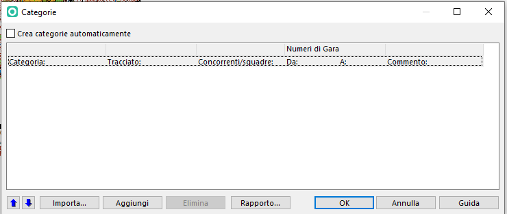
    - Cliccate sul pulsante *importa*
    - Selezionate il file *elenco_tracciati_categorie_#* che avete appena scaricato. Automaticamente vengono create le categorie e i relativi tracciati (vuoti) e abbinati per nome.  
    - Se nome tracciati=nome categorie potete attivare l'opzione *Crea categorie automaticamente*
          
- [ ] (se prevedete di fare abbianamenti di percorsi): 
    - Aprite la finestra *tracciati* `> Tracciamento percorsi > Tracciati`
    - Inserite i nomi dei tracciati previsti
    - Andate nella alla finestra *categoria*  `> Tracciamento percorsi > Categorie` 
    - Aggiungete l'elenco delle categorie (vedi <a href="https://www.asti-ticino.ch/co/doc/elenco_tracciati_categorie_tmo_251201.txt" target=_dwd>elenco dei tracciati/categorie per TMO</a>)
    - Associate ad ogni categoria il tracciato previsto 
- [ ] (ozionale) Nella colonna *concorrenti/squadre* della finestra **Categoria** inserite una stima dei concorrenti di ogni categoria, è molto utile per vedere la frequenza ai punti
- [x] Ora potete iniziare a tracciare (comporre i tracciati).  
      Esistono diversi modi per farlo: 
      1.  Inserendo prima i vari punti e poi componendo i tracciati (= associare i vari punti ad un tracciato)
      1.  Utilizzando la funzionalità *componi tracciato* inserendo ma mano i vari punti ed oggetti del tracciato. 
          In questo caso attenzione a non disegnare due volte i medesimi oggetti del tracciato (punti, partenza, arrivo, ecc.)
      1.  Oppure combinando le due varianti  

      Maggiori informazioni su come comporre/modificare dei tracciati:

      -  Vedi > <a href="https://www.ocad.com/docs/Getting_Started_with_Course_Setting_in_OCAD.pdf" target="_new"><ins>Getting Started with Course Setting in OCADs</ins></a> (capitolo 5 - pagina 13  della Guida OCAD Tracciamento percorsi)
      -  Vedi > Componi tracciato / Elementi tracciato

???+ Info "Lunghezza/dislivello tracciati"  
     - Per gare middle e long (ISOM): 
        - Lunghezza: distanza in linea d’aria. Aggiungere lunghezze extra solo in casi particolari (es. attraversamento obbligatorio molto lungo, vedi indicazioni corso tracciatori).
        - Dislivello: calcolato sul percorso ideale effettivo.
     - Per gare sprint (ISSprOM):    
        - Lunghezza: distanza effettiva del percorso ideale. 
        - Dislivello: calcolato sul percorso ideale effettivo.

- [x] Calcolate e inserite la lunghezza e il dislivello di ogni tracciato
    - Aprite la finestra **Tracciati** menu `> Tracciamento percorsi > Tracciati`
        
        - *Lunghezza [km]* è la lunghezza in calcolata in linea d'aria e viene calcolata automaticamente da OCAD.
        - *Lunghezza extra* è l'eventuale lunghezza extra che dovete aggiungere.   
           Obbligatorio per le gare sprint   
           lunghezza_extra = lunghezza_effettiva_calcolata - lunghezza_in_linea_aria_ocad  
           Per inserirla cliccate nella cella e inserite il valore
        - La lunghezza corretta e mostrata nei percorsi e nella descrizione punti sarà quindi *lunghezza* + *lunghezza extra*  
          
        - *Dislivello salita calcolato [m]* se avete come sfondo un modello numerico del terreno è il dislivello calcolato da OCAD (dislivello calcolato NON su percorso ideale ma dalla differenza delle quote dei punti)
        - *Dislivello salita utilizzato [m]* dove dovete inserire il dislivello che avete calcolato e sarà quello mostrato nei percorsi
           Per inserirlo cliccate nella cella e inserite il valore

##  [ 4 ] Descrizione punti
-  Nella sezione *Oggetto* del riquadro del Course objects box è possibile inserire la descrizione del punto/oggetto selezionato in formato testuale o simboli.  
   
- Ultimo punto-arrivo: se il percorso è segnalato ricordatevi di inserirlo e se *segnalato ad imbuto* di attivare l'opzione *segnalato ad imbuto*  
     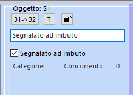  
   Vedi > [[ 102 ] Ultimo punto arrivo](#cs_ultimo_punto_arrivo)
  

???+ Info "Descrizione punti"  
    Maggiori informazioni su come deve essere preparata la descrizione punti vedi guida <a href="https://www.swiss-orienteering.ch/files/kommission_ausbildung/ausbildungsmaterial/iof-postenbeschreibungen/iof_descrizioni_punti_ital.pdf" target=_new><ins>Descrizione dei punti IOF</ins></a> pubblicata da swiss-orienteering.

> [ Ritorna sopra ](#top)
---
##  [ 5 ] Controllo dei tracciati
- [x] Dopo che avete composto tutti i tracciati effettuate il controllo dei tracciati  
      menu `> Tracciamento percorsi > Statistiche sui controlli e sulla gara...` 
      
      appare la finestra **Statistiche sui controlli e sulla gara...** dove  
      -  *Statistiche*: per ogni punto di controllo avete il numero di tracciati e concorrenti che lo hanno.  
          *Tracciati* / *Categorie*: trovate l'elenco dei  tracciati / categorie che hanno il punto selezionato.  
          In arancio appaioni i punti dove non passa nessun tracciato.
      - *Statistiche sulle frazioni*: avete il numero di tracciati che hanno la frazione indicata (da punto a punto) e il numero di concorrenti totale che hanno quella frazione.   
         Attivando *Nascondi tratte usate da un solo percorso* le frazioni con un solo tracciato non verranno mostrate.  
         *Tracciati* e *Categorie*: trovate l'elenco dei tracciati / categorie che hanno la frazione selezionata.  
      - *Diagramma Punto/Tracciato*:
      - *Statistiche gara*: trovate il *numero di punti*, il *numero di tracciati* e il *numero di categorie*
      - *Distanza minima tra punti di controllo*: trovate i punti di controllo che si trovano a una distanza inferiore di quella minima
      - *Tratte tra due punti in direzioni opposte*: trovate le tratte che verranno effettuate in direzione opposte sui tracciati indicati
      - *Tracciati indentici*: trovate l'elenco di eventuali tracciati identici
      - *Tracciati privi di partenza o arrivo*: trovate i tracciati dove manca la partenza o l'arrivo

    ???+ Warning "Distanze minime tra due punti"
        - per le gare sprint (cartine in scala 1:4'000 o 1:3'000) la distanza minima tra due punti di controllo posati sul terreno è di ==25m== (distanza effettiva) e di ==15m== in linea d'aria
        - per gare con cartine in scala 1:15'000, 1:10'000 o 1:7'500 la distanza minima tra due punti posati è ==30m==. Se però la descrizione punti è simile (esempio due punti a dei sassi) la distanza minima è di ==60m==.
        
- [x] Quando i tracciati sono definitivi un ulteriore controllo è dato dalla generazione del *Report di coerenza dei tracciati* dove trovate il report di eventuali errori/problemi sui vostri tracciati
      menu `> Tracciamento percorsi > Report di coerenza dei tracciati...`

- [x] Se prevedete una "partenza svedese" verificate di aver inserito il punto di consegna della cartine e il percorso obbligatorio  
      Vedi > <a href="#cs_partenza_svedese">[ 101 ] Partenza svedese: percorso segnalato dal punto di consegna della cartina</a>
- [x] Se prevedete un ultimo punto-arrivo segnalato verificate di aver inserito il percorso obbligatorio tra l'ultimo punto e l'arrivo
      Potete verificarlo guardando l'anteprima della descrizione punti.

- [x] Verificate che la descrizione punti di tutti i punti e della/e partenze siano corrette

    ???+ Warning "Controlli dei percorsi - Vedi corso tracciatori"
         - Frequenze ai punti
         - Tracciati identici
         - Punti vicini
         - Tratte nelle direzioni opposte
         - Arrivo
         - Partenza svedese
         - Ultimo punto arrivo
         - Descrizione punti

> [ Ritorna sopra ](#top)
---
##  [ 6 ] Grafica ed elementi dei tracciati
???+ Warning "Raccomandazioni"
    Una volta definitivi i tracciati, verificate e ottimizzate la loro grafica affinché ogni percorso, insieme alla cartina, risulti leggibile e comprensibile. In particolare, assicuratevi che:  

    - i numeri dei punti siano posizionati in modo chiaro e non ambiguo;
    - le linee di collegamento siano facilmente interpretabili;
    - nessun elemento importante della cartina venga coperto dai simboli del tracciato (linee, cerchiolini o numero del punto).

    *I simboli del tracciato sono sovrapposti alla cartina, ma non devono mai mascherare i dettagli fondamentali, in particolare quelli stampati con i colori nero, marrone e blu al 100%* (vedi Direttive ISOM2017-2 e ISSprOM2019-2).

    Per le gare ASTi, salvo diversa indicazione (vedi capitoli successivi), i percorsi saranno stampati da PDF con l'effetto di trasparenza sul colore magenta.
    È comunque raccomandato tagliare i cerchi dei punti e le linee di collegamento quando coprono oggetti rilevanti della cartografia.

- [x] Verificate e nel caso riposizionate i numeri dei punti.  
      Per le gare sprint (se viene utilizzato il numero con il bordino biano) verificate che non copra passaggi o scelte per il concorrente.  
       - Visualizzate in modalità anteprima il tracciato 
       - Selezionate il numero progressivo del punto e spostatelo
- [x] Se i cerchi dei punti coprono oggetti/passaggi importanti, tagliateli, senza però esagerare.  
        vedi > [[ 104 ] Tagliare i cerchi dei punti](#cs_taglia_cerchiolini)
- [x] Se le linee di collegamento tra i punti coprono oggetti importanti, tagliatele, senza però esagerare.  
        vedi > [[ 105 ] Tagliare le linee di connessione](#cs_taglia_linee)
- [x] Se avete utilizzato Route Analyser verificate che non ci siano scelte di percorsi visibili (meglio eliminarle)
- [x] Se avete collegato un modello del terreno (per Route Analyer o altro) scollegatelo
- [x] Nome categoria: dovrebbe essere posizionato al bordo della cartina (ideale in basso/alto a destra o sinistra) in modo che alla partenza il concorrente possa vederlo senza vedere la cartina con il percorso (che sarà coperto con un foglio).
- [x] Inserite anche gli altri elementi di layout dei tracciati (scritte in magenta: nome gara, organizzatori, ecc.)   
      Vedi > <a href="#cs_layout_checklist" target=_checklist><ins> [100] Checklist elementi di layout</ins></a>
- [x] Descrizione punti: se ci sta sulla cartina inseritela in formato (simboli) (non rimpicciolitela ! le caselle dimensione min ==6mm==)
  

    ???+ Warning "I testi devono essere orientati a nord"
        Tutti i testi e loghi stampati sulla cartina devono essere orientati a nord.

> [ Ritorna sopra ](#top)
---
##  [ 7 ] Impaginazione per la stampa (cartina e percorsi)

Ci sono diversi modi per creare un layout di una cartina in OCAD. Creare un layout cartografico accattivante può diventare rapidamente una sfida e richiede una buona padronanza di OCAD. In questo capitolo verranno mostrati due modi per farlo.

???+ Info "Punti da considerare prima di impaginare"
     Prima di iniziare ad impaginare ci sono alcuni punti da considerare:  

       -  dove creare il layout?
          - direttamente nel file della cartina: più facile per condividere con altri la cartina impaginata.
          - layout in un file OCAD separato: comodo per riutilizzare il layout su altre cartine.
       - come verrà stampata la cartina ?  
         - quale formato di carta: A4 o A3 
         - quale orientamento: verticale o orizzontale 
         - margini di stampa: verifica se la stampante stampa fino ai bordi o lascia un margine (es. la stampante ASTi ha margini)
       - quale parte della cartina stampare ?  => definire l'area utile per la gara
       - in quale scala stampare le cartine ? A seconda della categoria potrebbe essere necessario stampare le cartine in scale diverse
       - come stampare ? stampare dai PDF o direttamente da OCAD?  
        :bulb: in generale e in particolare per le gare, è **raccomandato** (**obbligatorio**) stampare sempre dai PDF esportati da OCAD e NON stampare direttamente da OCAD. 
      
???+ Warning "RECO: Scala cartine stampate"
     Per le gare valide per il TMO/TMS il [RECO art.58a](https://www.asti-ticino.ch/co/index.php?folder=ctco&main=reco) indica le scale delle cartine autorizzate per le singole categorie.  
     Per le gare nazionali fa stato invece il WO.  
    
     Attenzione: per le cartine ASTi la stampa in scala 1:15'000 può avvenire solo se la cartine è stata rilevata in scala 1:15'000 (per maggiori informazioni chiedere al/alla responsabile cartine o al consulente cartina KK indicato sulla cartina) 

     Per le gare ASTi (TMO/TMS) si dovranno quindi di regola stampare alcune categorie

    - in scala "standard" (1:10'000 / 1:4'000) 
    - in scala "ingrandita" (1:7'500 / 1:3'000)

:pushpin: **Importante:** il file della cartina e il file dei percorsi rimangono sempre nella scala originale del file della cartina è la scala di stampa che cambia !

di conseguenza si dovranno avere anche due layout

   - layout scala standard
   - layout scala ingrandita

Come indicato esistono diversi modi per impaginare ed esportare i PDF delle cartine per una gara; qui ne vengono spiegati due "consigliati" (in futuro potremmo adattarli):

- ***A) Metodo "vecchio-tradizionale"***: consiste di avere un'unica impaginazione del file della cartine + percorsi.  
    -  per le categorie in scala "standard" si esporterà i PDF e si stamperà su formato A4 mentre 
    -  per le categorie in scala "ingrandita" si esporterà i PDF e si stamperanno in formato A3 (rincondansi prima di esportare i pdf di cambiare il testo della scala indicato nell'impaginazione del file della cartina es. Scala: 1:10'000 -> 1:7'500)
- ***B) Metodo canovacci (Canvas)***: si preparano due layout uno per la stampa in scala "standard" e uno per la scala "ingrandita" e si utilizzerà lo strumento Canovacci per generare i PDF.

###  A) Metodo "vecchio-tradizionale" {==DA RIVEDERE==} 
**Preparate il file della cartina**

- [x] Impaginate il file OCAD della cartina: per far ciò occorre utilizzare OCAD Orienteering o OCAD Mapping Solution. Se non siete esperti chiedete aiuto a qualcuno della vostra società.  
      - Avviate OCAD Orienteering o OCAD Mapping Solution
      - Aprite il file OCAD della cartina (es. *mapSanGiorgio_250601.ocd*)   
       menu `File > Apri` 
      - Se necessario ritagliate la cartina   
        Vedi > [[ 112 ] Come ritagliare una cartina](#ocad_ritagliare_cartina)
        
      - Definite l'area di stampa
       **Definizione dell'area di stampa**
       - Selezionate il menu `Layout > Definizione area di stampa...`
       - Appare la seguente finestra
         
        - *Frontside*: per impostare l'area di stampa per pagina fronte. *Backside* per impostare l'area di stampa del foglio verso in caso di stampa su due lati del foglio
        - *Scala*: seleziona la scala di stampa
        - *Imposta da formato foglio*: seleziona il formato del foglio e l'orientamento
        - *Margine*: per la stampante ASTi imposta {==5 mm==}
        ???+ Info "Margine"
            Le stampanti laser hanno un margine di ca 5 millimetri che non è stampabile, e molto spesso capita che chi prepara il layout di stampa non lo considera e piazza scritte e loghi oltre questo margine, trovandosi sorpreso e costretto a modificare in tutta fretta il layout al momento della stampa (rischiando anche di commettere errori).
        - Spostate il riquadro chiaro che appare nella cartina nella posizione corretta 
        - Date un nome a questa estensione (es. *AreaStampa_10000_A4_fronte* )  
      - Spostate le scritte e i loghi già presenti
      - Inserite i loghi mancanti, loghi disponibili come simboli OCAD (esempio logo della società, logo BdS, logo ASTi, ecc.) (vedi CD ASTi). 
      - Ev. Create un nuovo simbolo OCAD da un logo vettoriale (es. sponsor)
      - Inserite altri loghi disponibili in formato immagine (es. sponsor) con lo strumento Layout (menu `> Layout > Gestione oggetti di layout ...`)
    ???+ Warning "Non inserire loghi immagini come sfondi"
         Non inserite mai immagini (come loghi di sponsor) utilizzando lo strumento Sfondi > Gestione, poiché questo trasforma la cartina e i percorsi in un formato raster, compromettendo la qualità della stampa.
         Come indicato per inserire delle immagini utilizzate lo strumento Layout!  

- [x] Verificate che tutti gli elementi di layout siano presenti  
      Vedi > [[100] Checklist elementi di layout](#cs_layout_checklist)
   
- [x] Verificate i colori della cartina per la stampante ASTi  
      Vedi > [[ 106] Come verificare/modificare i colori di un file OCAD](#ocad_colori_impostazione)
- [x] Verificate che la cartina non abbia degli sfondi
        - Menu `> Sfondi > Gestione`
        - Se sono presenti dei collegamenti a degli sfondi clicca sul pulsante `Elimina tutti`
- [x] Verificate che la cartina sia in modalità vista normale
- [x] Salvate il file della cartina

**Preparate il file dei percorsi**

- [x] Impaginate il file OCAD dei percorsi con OCAD Course Setting
     - Aprite il file OCAD dei percorsi
     - Verificate che come sfondo avete solo il file della cartina che avete sistemato al punto precedente
     - Verificate che tutti gli elementi del layout siano presenti e posizionateli in modo adeguato
- [x] Verificate i colori "magenta" dei tracciati  
      Vedi > [[ 106] Come verificare/modificare i colori di un file OCAD](#ocad_colori_impostazione)
- [x] Impostate l'area di stampa

**Esportate i PDF dei tracciati/categorie**

- [x] Aprite il file dei percorsi ed esportate i PDF dei tracciati/categorie con scala standard
      -  Menu `>File > Esporta`
      - Nella finestra **Esporta** che appare a destra 
        - selezionate PDF
        - scala di stampa

      - Cliccate sul pulsante esporta
      - Nella finestra **Seleziona tracciati/categorie** selezionate i tracciati o le categorie che desiderate stampare in scala "standard"
        (di default appaiono i tracciati per le categorie attivate l'opzione categorie)
        <Tutti punti> è la rete dei punti
      - Cliccate su OK, selezionate la cartella dove salvare i pdf di default i nomi defi file sono *nomeFilepercorsi_#nome_categoria_o_tracciato#.pdf*
      
      - Prima di ripetere le operazioni per le categorie con la scala "ingrandita" dovete correggere l'indicazione testuale della scala nel file della cartina
        - Aprite il file della cartina
        - Correggete il testo sulla cartina che indica la scala con la scala "ingrandita" (scala: 1:7'500 o 1:3'000)
        - Salvate il file
        - Verificate che nello sfondo appaia il testo corretto

      - Ripetete tutte le operazioni da menu `>File > Esporta` impostando come scala la scala "ingrandita" e selezionando le categorie che hanno una scala "ingrandita". 

- [x] Verificate tutti i PDF che avete generato:
      - qualità: che la cartina sia in formato vettoriale, zoomando nel pdf su un dettaglio della cartina dovreste vederla vettoriale e non dei quadratini  (pixel)
      - contenuto: che i PDF sono stati generati correttamente

???+ Warning "Esportazione PDF non utilizzare altri metodi"
     Esportate i PDF come indicato!   
     Non utilizzare > Stampa > PDF, Microsoft Print to PDF o altri strumenti per la scrittura di PDF, poiché convertono i dati in immagini raster, riducendo la qualità di stampa (pixelata). 
     Invece, esportate un PDF come idnicato e stampatelo utilizzando Adobe Reader. I file PDF così creati contengono dati vettoriali, che garantiscono una qualità di stampa superiore.

> [ Ritorna sopra ](#top)
###  B) Metodo "canovacci" (Canvas)  {==DA RIVEDERE==} 
Con l’introduzione della stampa delle cartine ingrandite alcune categorie spesso c’è la necessità di avere due o più impaginazioni (layout) della cartina. 
Qui viene spiegato un modo con lo strumento Canovacci su come fare per gestire più impaginazioni (layout) utilizzando un unico file con la cartina. Questo per evitare di stampare versioni diverse della cartina in base al layout.  

- [x] Prepara il file OCAD della cartina senza elementi di layout (richiede OCAD Orienteering o OCAD Mapping Solution)
     - Apri con OCAD Orienteering il file della cartina
     - ==DA VALUTARE SE LASCIARE O MENO== 
       Se necessario ritaglia la cartina  
       Vedi > [[ 112 ] Come ritagliare una cartina](#ocad_ritagliare_cartina)
     - Oppure Nascondete (o cancellate) gli oggetti del layout (es testi, loghi, ecc.) lasciando solo la cartina. Gli elementi del layout (nome cartina, loghi, ecc.) saranno inseriti nel file di layout.
     Attenzione: se nascondete dei simboli verificate che il simbolo non sia usato per degli oggetti della cartina. Esempio frecce nord spesso utilizzano colore blu dei fiumi o laghi.
     Dopo la gara se avete fatto aggiornamenti della cartina siete pregati di rionsegnare il file della cartina intero con anche gli elementi del layout (nome cartina, ecc.) che erano presenti nel file iniziale quindi prima di cancellare fate una copia.
     - Verifica che la cartina sia in modalità *vista normale*
        Menu `> Vista > Vista normale`
     - Verificate che non ci siano sfondi nel file della cartina, nel caso eliminali
        - Menu `> Sfondi > Gestione`
        - Se sono presenti dei collegamenti a degli sfondi clicca sul pulsante `Elimina tutti`
     - Verificate che i colori siano impostati correttamente per la stampante ASTi  
        Vedi > [[ 106] Come verificare/modificare i colori di un file OCAD](#ocad_colori_impostazione)

- [x] Prepara il file layout per stampa in scala "standard (richiede OCAD Orienteering o OCAD Mapping Solution)  
      Vedi > [[ 108 ] Come preparare un file di layout](#ocad_impostazione_layout_file)

- [x] Prepara il file layout per stampa in scala "ingrandita" (richiede OCAD Orienteering o OCAD Mapping Solution)  
      Vedi > [[ 108 ] Come preparare un file di layout](#ocad_impostazione_layout_file)

- [x] Prepara il file dei percorsi
     - Apri il file dei percorsi 
     - Come sfondi menu `> Sfondi > Gestione...` devi avere
       - File layout standard
       - File layout ingrandito
       - File cartina 

- [x] Imposta lo strumento "canovacci": creiamo i 'canovacci' o inquadrature, ne definiamo le loro estensioni e assegniamo quali percorsi devono essere stampati secondo quale inquadratura. Un'inquadratura ('canovaccio') avrà una denominazione, una scala di stampa, un'area di stampa (definita precedentemente), sarà utilizzata per delle categorie/percorsi e avrà degli sfondi (cartina e layout) e potrà visualizzare dei simboli o meno.    
      - menu `> Tracciamento percorsi > Canovacci` e appare la finestra **Canovacci**
      - **Impostazioni**: prima di iniziare clicca su *Impostazioni* per impostare se desideri esportare i percorsi o le categorie. 
          Attenzione: Devi farlo all'inizio poiché gli input andranno persi se si cambia in seguito.
          - Seleziona percorsi o categorie
          - Attiva 'opzione *Attiva le canvas nell'anteprima del percorso  ed esporta* in questo modo l'anteprima dei tuoi percorsi caricherà il canvas corrispondente.
      - **Canovacci**: creiamo e impostiamo i vari *Canovacci* per la stampa. Per far ciò clicca su *Canovacci*
          - Clicca sul pulsante *Nuovo* per aggiungere un nuovo canovaccio
          - Imposta per canovaccio selezionato la *scala di esportazione* (scala di stampa) 
          - Seleziona l'area di stampa (tra le aree di stampe che hai creato precedentemente o se non ancora definite clicca sul pulsante *Definisci*  vedi > [[ 118 ] Canovacci Definisci area di stampa](#ocad_canovacci_definisci_area_stampa) 
          - se descrizione punti stampata sulla cartina: imposta le dimensioni e il numero di righe massime per la descrizione punti per il canovacci che stai impostando 
        - seleziona le categorie/percorsi che avranno questo canovaccio
      - **Utilizzo**: clicca su *Utilizzo* per preselezionare i simboli e gli sfondi (cartina e layout) che verranno utilizzati in seguito nella sezione *Visibilità*
          - *Carte di sfondo*: trascina le carte di sfondo che vuoi utilizzare nei canovacci (normalmente tutte)
          - *Simboli* tracina i simboli e liascia i simboli che vuoi poter personalizzare in seguito nella sezione *Visibilità* (p.es. il simbolo 709.003 area vietata con perimetro continuo vuoi mostrarlo solo sulle cartine di alcune categorie/percorsi).
          Se tutte le categorie/percorsi visualizzano tutti i simboli allora non trascinare nessun simbolo
      -**Visibilità**: clicca su *Visibilità* per deinite quali simboli e sfondi saranno visibili per quale canovaccio (area di disegno).
          - seleziona il canovaccio (p.es. 10000)
          - Simboli: Fai doppio clic su un simbolo per renderlo visibile o meno. 
          - Sfondi: Fai doppio clic su un simbolo per renderlo visibile o meno.
          - ripeti l'operazione per utti i canovacci
- [x] Esporta i PDF delle cartine di gara con strumento canovacci       
     **Esportazione PDF**: clicca su *Esportazione* per esportare i PDF
       - *Esporta percorso* seleziona la cartella dove desideri salvare i PDF
       - Clicca su *Esporta* per esportare i pdf
       - Clicca su *Apri la cartella di esportazione* per aprire la cartella dove sono stati generati i PDF
       - Se la mappa contiene oggetti di layout raster, OCAD prende la risoluzione dpi dalle impostazioni di esportazione.
        Non ci devono però essere sfondi raster !!!
- [x] Verificate tutti i PDF che avete generato:
      - qualità: che la cartina sia in formato vettoriale, zoomando nel pdf su un dettaglio della cartina dovreste vederla vettoriale e non dei quadratini  (pixel)
      - contenuto: che i PDF sono stati generati correttamente     

> [ Ritorna sopra ](#top)
---
##  [ 8 ] Esportazione PDF descrizione punti

 -  menu `> Tracciamento percorsi... > Stampa > Descrizione punti`
 -  appare la finestra **Descrizione punti**
 -  seleziona la *Stampante*: nel nostro caso "Microsoft Print to PDF" per generare i pdf
 - *Stampa* seleziona *Descrizione punti in simboli*
 - *Dimensioni casella* lascia valori Standard {==6.00 mm==} o per le categorie seniores imposta {==7.00 mm==}
 - *Copie* numero di descrizioni punti generate
 - *Selezione Tracciati/Categorie* seleziona la categoria o il tracciato per cui desideri generare i pdf
 - clicca su OK per generare i pdf  
 (consiglio) Consiglio per una gara generare 1 pdf per categoria con il numero di descrizioni punti che si desidera stampare per quella categoria oppure il numero massimo di descrizioni punti che ci stanno sul foglio per la categoria e poi si fanno le fotocopie  
:warning: ricordati di generare anche il pdf della descrizione punti della rete punti *Tutti i punti*

> [ Ritorna sopra ](#top)
---
##  [ 9 ] Esportazione tracciati per OL-Einzel

Quando hai l'ultima versione definitiva dei tracciati:

- menu `> Tracciati percorsi > Esporta > Tracciati (XML, IOF Versione 3.0)`
- dai un nome al file esempio percorsiTMO_250910.xml 
- invia il file al responsabile elaborazione dati della tua società prima dell'elaborazione delle griglie di partenza
  Serve per l'[importazione dei percorsi in OEinzel](../../oe12/creazione_gara/#import_percorsi)

Il file contiene la sequenza dei punti di controllo per il controllo sigle.  
Se eccezionalmente dopo l'elaborazione delle griglie di partenza ma prima dell'esportazione dei PDF/stampa delle cartine vengono effettuati dei cambiamenti sui tracciati occorre riesportare il fiel per l'elaborazione dati, così come naturalmente dei PDF dei percorsi e delle descrizione punti.

> [ Ritorna sopra ](#top)
---
##  [ 10 ] Stampa delle cartine di gara

???+ Warning "Stampa cartine per gare ASTi (TMO/TMS/...)"
    - Stampare dai PDF generati come indicato nei capitoli precedenti. NON stampare direttamente da OCAD!
    - Stampare sulla carta "speciale" (Antius) che viene rivenduta dal responsabile stampa alle varie società (verificate per tempo che la vostra società ha i fogli sufficienti per la gara, in caso contrario contattare il responsabile stampante)
    - Per le gare ASTi (TMO/TMS) stampare con la stampante ASTi. La stampante ASTi si trova nel magazzino ASTi. Con anticipo (vedi RECO) verificare con il responsabile stampante la disponbilità del magazzino ASTi.

- Se stampate con la stampante ASTi le impostazioni della stampante e di Adobe Acrobat: dovrebbe essere già impostata correttamente come indicato sotto!  
    NON cambiate le impostazioni !  

???+ Info "Impostazioni stampante e Adobe Acrobat"
    Le impostzioni della stampante e di Adobe Acrobat dovrebbero essere le seguenti (==COMPLETARE RESP.STAMPANTE==)  
      
      
      

- Prepara i fogli: "smazzare" i fogli "speciali" (Antius) (a volte se appiccicano molto, conviene separarli uno per uno, soprattutto per i fogli grandi A3 è caldamente raccomandato) e inseriscili nel {==??? vassoio ==}  
- Premesso che i PDF siano stati esportati correttamente (con carta parziale, poi scelta A4/A3 orizzontale/verticale). 
- Apri con il file PDF con Adobe Acrobate
- Menu `> Stampa`
- Nella finestra **Stampa** che appare:
  
  (==COMPLETARE RESP.STAMPANTE==)
    - *Stampante*: {==??? XEROX... ==} nome della stampante di stampante ASTi
    - clicca sul pulsante *Proprietà stampante*
        -  se stampate su fogli A3: impostare *A3 carta lucida pesante* (la seconda opzione)
        -  se stampate su fogli A4: impostare *A4 carta lucida pesante* (la prima opzione) oppure semplicemente "vassoio 1" (che è già comunque impostato su A4 carta lucida pesante...)  
        {==??? aggiungere printscreen ==}
    - *Copie*: numero di copie che si vogliono stampare
    - *Pagine da stampare*: tutte
    - *Gestione e dimensioni pagina*: seleziona {==*scala personalizzata: 100%*==} o ??? {==*Dimensioni effettive*==} 
    - Attiva l'opzine *Scegli alimentazione secondo dimensioni PDF* (necessario se si stampa su A3)
    - *Orientamento*: seleziona *automatico*   
    - quindi cliccare su *Stampa* per avviare la stampa...

  È possibile che di tanto in tanto escano due fogli assieme, dove il secondo è bianco e si può riutilizzare. Da notare che il conteggio delle copie risulta corretto (viene contata una sola copia anche se sono usciti due fogli). In quel caso verificare la qualità del “foglio doppio” uscito (di regola è normale…).  

  **Stampa recto-verso:**  
  (==SISTEMARE==)
  Per la stampa retro, la stampante stampa sulla parte superiore del foglio, quindi mettere i fogli con la prima pagina già stampata sotto...

https://www.swiss-orienteering.ch/files/03-KK-Tagung_2024_Kartendruck.pdf

> [ Ritorna sopra ](#top)
---
##  [ 11 ] Verifica delle cartine stampate

Verifica delle cartine stampate

 - [x] Elementi di layout: vedi <a href="" target=#cs_layout_checklist><ins> > Checklist elementi di layout</ins></a> 
 - [x] Risoluzione (qualità della stampa): il KartenSignet se stampato nelle dimensioni corrette (dimensioni quadratini 6mm x 6mm) è un indicatore della risoluzione della stampa. I cerchi devono essere distinti.  
  {width=400px}
 - [x] Colori: confrontare con la striscia di riferimento dei colori vedi foglio "Farbreferenz di swiss-orienteering" che trovate in magazzino ASTi vicino alla stampante.  
   {width=200px}
   
 - [x] Aderenza del colore alla carta (nessuna abrasione)
 - [x] Scala cartina stampata: se al punto precedente non avete fatto attenzione potrebbe capitare di stampare non 100%  
     semplice controllo "due linee del nord di regola (se cartina ok) dovrebbero essere distanti 3 cm"
 - [x] Percorsi + cartina: verificate che stampa sia ok

> [ Ritorna sopra ](#top)
---
##  [ 12 ] Esportazione cartina e tracciati per Livelox

Si rimanda a > [Livelox per organizzatori](../../analisi/livelox/organizzatori/#impostazioni)

> [ Ritorna sopra ](#top)
---
##  Altre informazioni supplementari
---
##  [ 100 ] Checklist degli elementi da stampare sulle cartine
Vedi "Checklist degli elementi da stampare sulle cartine" di swiss-orienteering  
{==AGGIUNGERE LINK A PDF QUANDO PUBBLICATO==}  
Per gare ASTi (TMO, TMS e promozionali)  

 - [x] **Nome** cartina
 - [x] **Scala**: se la mappa viene ingrandita, la scala deve essere addattata di conseguenza
 - [x] **Equidistanza**
 - [x] **Anno rilievo (ultimo aggiornamento)**
 - [x] **Nome dei cartografi**
 - [x] **Linee del nord** 
    - ISOM: 
      - 20 mm 1:15'000
      - 30 mm 1:10'000
      - 40 mm 1:7'500
    - ISSprOM:
      - 30 mm 1:4'000
      - 40 mm 1:3'000
 - [x] **Freccia del nord**
 - [x] **Logo Swiss Orienteering Kartensignet**: I quadrati colorati sul carta stampata hanno una dimensione di
6 mm x 6 mm. Se la scala di stampa è ingrandita, il logo può essere ingrandito di conseguenza o lasciato delle stesse dimensioni.
 - [x] Editore: **Logo ASTi** (verificate che sia l'ultima versione ASTi Ticino e Moesa)  
 - [x] Altri loghi
    - [ ] per le cartine dove è presente anche il logo dell'Ufficio dello Sport (solo alcune cartine di paese). In alcune cartine ancora indicato il logo G+S, sostituitelo con il logo dell'Ufficio dello Sport.  
    - [x] Eventuale altro loghi presenti (SOW)
    - [ ] Logo della società organizzatrice
    - [x] logo Banca dello Stato  
 - [x] **Copyright**: frase se presente sulla cartina
 - [x] **Restrizioni d'uso**: eventuale frase se presente sulla cartina
 - [x] Nome della **categoria**
 - [x] Nome e cognome del **tracciatore/controllore e capogara**
 - [x] **Numero di telefono in caso di emergenza**
 - [ ] **Descrizione punti**

 Per inserire dei loghi OCAD   
 Vedi > [[ 109 ] Come inserire un logo (simbolo OCAD) in un file ocd esistente ](#ocad_importazione_simbolo)       

> [ Ritorna sopra ](#cs_grafica_ed_elementi_tracciati)

---
## [ 101 ] Come inserire una partenza svedese (percorso segnalato dal punto di consegna della cartina)
(Tratto da <a href="https://ocad.com/blog/2022/05/map-issue-point-correct-placement/" target=_new><ins>OCAD blog</a></ins>)  
Il punto di consegna della cartina viene spesso utilizzato in modo errato, ecco quindi una guida su come utilizzarlo correttamente:

 - In primo luogo, tracciate un percorso segnalato fino al punto di partenza. Il percorso segnalato deve terminare al punto di partenza e non iniziare da lì.  
 - Seleziona il percorso segnalato e inserite un vertice d'angolo (quadrato rosso sotto) per contrassegnare la posizione del punto di consegna della cartina.  

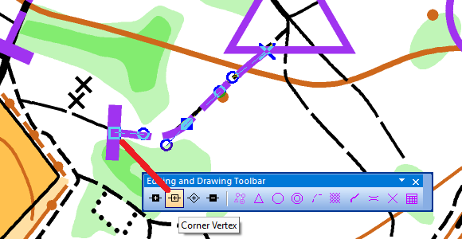{width=400}

> [ Ritorna sopra ](#cs_controllo_tracciati) 

---
## [ 102 ] Come inserire ultimo punto-arrivo segnalato
Se il percorso dall'ultimo punto all'arrivo viene segnalato con bandierine o nastri occorre inserirlo nel seguente modo. 

 - Selezionate il simbolo *Percorso segnalato* nella casella dei simboli.  
 - Selezionate uno strumento di disegno (ad esempio lo strumento linea).  
 - Disegnate il percorso segnalato nella direzione in cui lo percorrono i concorrenti (dall'ultimo punto all'arrivo).  
 - Vi apparirà la finestra *Course Object*. Questa vi propone un codice, cliccate su `OK`.  
 - L'oggetto percorso segnalato viene visualizzato sulla mappa.  
 - Ora potete aggiungere l'oggetto "Percorso segnalato" ai diverisi percorsi.  
 - Se il percorso è segnalato ad imbuto attivare l'opzione *Segnalato ad imbuto*.  
        
      

> [ Ritorna sopra ](#cs_descrizione_punti)

---
##  [ 103 ] Come inserire un cambio cartina virtuale (map flip) (voltare la cartina)
- Nel percorso desiderato inserire l'oggetto del tracciato *Rotazione della carta (voltare il foglio)* dopo il punto in cui bisogna girare il foglio ma prima del seguente punto
    - Nella sezione Tracciato/Categoria  (*Course Object Box*) selezionate il tracciato/categoria dove volete inserire il "cambio cartina virtuale*
    - Premete sul pulsante `Inserisci`
    - Selezionate *Rotazione della carta (voltare il foglio)* e cliccate sul pulsante `OK` 
     
- Inserire il punto di ripartenza del percorso      
    -  Inserite nella mappa l'oggetto *Punto di continuazione dopo cambio carta* (punto di ripartenza del percorso) sovrapposto esattamente il punto di controllo dove avviene il cambio e con la medesima descrizione punti  
        
    - Inserite questo oggetto nel tracciato/categoria prima del prossimo punto    
        
      Ecco come apparirà un percorso corretto con "map flip"  
      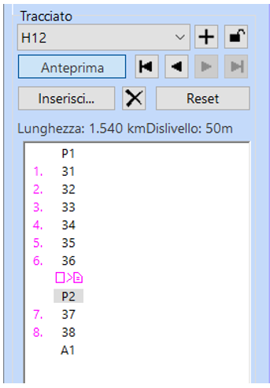
      E come apparirà nella stampa  
      {width=50%}

> [ Ritorna sopra ](#top)

---
## [ 104 ] Come tagliare i cerchiolini dei punti
 - Seleziona l'icona *Seleziona e modifica oggetto(i)* nella barra degli strumenti  
   
 - Clicca sul punto nella cartina
 - Seleziona l'icona *Taglia* nella barra degli strumenti  
   
 - Clicca sul cerchio di controllo per inserire un'interruzione.  
   Per chiudere un cerchio del punto controllo già tagliato, scegli di nuovo lo strumento *Taglia* e clicca una volta sull'interruzione.

> [ Ritorna sopra ](#cs_grafica_ed_elementi_tracciati)

---
## [ 105 ] Come tagliare le linee di connessione dei percorsi
 - Seleziona l’icona Seleziona oggetto/i e modifica vertici nella barra degli strumenti.  
   
 - Fai clic su una linea di collegamento.
 - Seleziona l’icona *Taglia* nella barra degli strumenti.  
   
 - Fai clic nel punto in cui deve iniziare l’interruzione sulla linea di collegamento e, tenendo premuto il tasto sinistro del mouse, trascina il cursore fino al punto finale dell’interruzione.  
   Seleziona nuovamente la linea di collegamento e fai clic con il tasto destro del mouse per reimpostare la linea di collegamento.  
   L’interruzione si applica solo al percorso selezionato. Usa la funzione *Modifica linea di collegamento per tutti i percorsi* per applicare il taglio a tutti i percorsi.
 - Le linee di collegamento possono anche essere modificate inserendo dei vertici e spostandoli, oppure spostando il punto iniziale o finale della linea di collegamento.

> [ Ritorna sopra ](#cs_grafica_ed_elementi_tracciati)

---
##  [ 106 ] Come verificare/modificare i colori di un file OCAD
I colori risultanti da una stampa variano in funzione di diversi fattori  
Qui trovate le tonalità dei colori per delle stampe da PDF con la stampante ASTi  

 - Colori per cartine sprint    
    {width=400}  
 - Colori per cartine bosco ISOM  
    {width=400}  

***Attenzione***: i numeri e le denominazioni dei colori potrebbero variare a dipendenza della cartina.

{==COMPLETARE CON NUOVA OPZIONE COLORI BASE==}

> [ Ritorna sopra ](#top)

---
##  [ 107 ] Come definire un'area di stampa
???+ Info "Estensione dell'esportazione"
     Definire le “estensioni di esportazione” significa scegliere l’area della carta che vuoi esportare (salvare come file o stampare). Per esempio: vuoi esportare una pagina A4 verticale con un margine di 5 mm, oppure una pagina A3 orizzontale senza margini.  
     Per farlo, in OCAD c’è una funzione chiamata *Definisci area di stampa*: 
     Questa funzione ti permette di scegliere la dimensione e l’orientamento del foglio su cui vuoi lavorare (ad esempio A4 o A3, verticale o orizzontale).  
     Una volta scelto, sullo schermo vedrai l’area utile (dove puoi mettere la mappa) evidenziata, mentre il resto sarà grigio (fuori dall’area stampabile).  
     Questo ti aiuta a capire dove posizionare gli elementi del tuo layout, così non metti niente fuori dai bordi stampabili.  
     Quando salvi questa impostazione, potrai usarla sia per esportare il file (ad esempio in PDF), sia per stampare.
     - *Margini*: è importante definire un margine, perché le stampanti non possono stampare fino al bordo del foglio.  
       La dimensione del margine dipende dalla stampante, per la stampante ASTi è di {==5mm==}
     Con l'introduzione della stampa recto/verso è possibile definire due aree di stampa anche diverse (area di stampa recto e area di stampa verso) 

 - Menu `> Layout > Definizione area di stampa`
 - Selezionate *Frontsize* per impostare l'area di stampa fronte
 - Attivate *Mostra dimensioni foglio nell’area di disegno*
 - Impostate la *scala* di stampa
 - Impostate il *formato del foglio* (p.es. A4) e l’*orientamento* verticale/orizzontale
 - *Margine* impostare {==5 millimetri==} (per Stampante ASTi)
 - Spostate il riquadro chiaro che appare nella cartina nella posizione corretta
 - Verificate che ci stanno tutte le scritte, loghi, ecc…
 - Date un nome a questa *estensione di stampa* e cliccate sul pulsante `Salva`
 
 - La sezione *Backsize* serve per definire l'estensione di stampa del retro, nel caso si utilizzi la modalità di stampa fronte/retro (vedi > [Come impostare una stampa fronte/retro)](#cs_stampa_fronte_retro)

> [ Ritorna sopra ](#top)

---
##  [ 108 ] Come preparare un file di layout

Esistono diverse modalità:  

  - A) Impostare il file di layout utilizzando i simboli OCAD: ossia inserire il nome della cartina, scala, loghi, ecc utilizzando solamente i simboli OCAD  
  - B) Impostare il file di layout utilizzando lo strumento "Layout" per inserire il nome della cartina, loghi raster, ecc.  
  - C) Impostare il file di layout utilizzando sia simboli OCAD che strumenti di "Layout" (esempio se avete loghi raster)

Vedi [Create a Layout](https://www.ocad.com/wiki/ocad/en/index.php?title=Create_a_Layout) (da OCAD wiki)  
Vedi [Strumento di Layout con OCAD](https://www.ocad.com/wiki/ocad/en/index.php?title=Layout)  

> [ Ritorna sopra ](#top)

---
## [ 109 ] Come inserire un logo (simbolo OCAD) in un file ocd esistente  
{==DA COMPLETARE==}  

> [ Ritorna sopra ](#top)

---

## [ 110 ] Come inserire un logo immagine
{==DA COMPLETARE==}
Vedi [OCAD Blog](https://ocad.com/blog/2022/11/how-to-add-logos-in-ocad/)

Talvolta c’è la necessità di inserire dei loghi di sponsor o altro sulla cartina di gara.  
È possibile inserire i loghi in formato immagine (utilizzando lo strumento Layout e NON come sfondo) ma se sono presenti diversi loghi immagine la stampa potrebbe risultare lenta. 
Se disponete il logo in formato vettoriale potete trasformarlo/crearlo come simbolo OCAD  
Vedi > [Come creare un simbolo OCAD da un logo vettoriale](#ocad_creazione_simbolo_ocad) 

---
## [ 111 ] Come creare un simbolo OCAD da un logo vettoriale 
{==DA COMPLETARE==}
Talvolta c’è la necessità di inserire dei loghi di sponsor o altro sulla cartina di gara. Come indicato precedentemente è possibile inserire i loghi in formato immagine (utilizzando lo strumento Layout e NON come sfondo) ma se sono presenti diversi loghi immagine la stampa potrebbe risultare lenta. 
Se disponete il logo in formato vettoriale potete trasformarlo/crearlo come simbolo OCAD.

 - Chiedere il logo in formato vettoriale (svg o pdf vettoriale)
 - ...
 {==COMPLETARE==}

> [ Ritorna sopra ](#cs_impaginazione_stampa)

---
##  [ 112 ] Come ritagliare una cartina con OCAD
{==DA COMPLETARE==}

> [ Ritorna sopra ](#cs_impaginazione_stampa)

---
##  [ 113 ] Come impostare una stampa fronte/retro
???+ Info "OCAD Stampa fronte/retro"
      A partire dall’aggiornamento di maggio 2025, OCAD supporta la gestione della stampa fronte/retro su stampanti compatibili con questa funzione.
      Questa novità consente di evitare il reinserimento manuale delle cartine, riducendo il rischio di errori o problemi durante la stampa.

      Quando si esporta un percorso in formato PDF, OCAD genera automaticamente un file di due pagine. Per ottenere la stampa corretta, è sufficiente inviare questo file alla stampante impostando l’opzione *stampa fronte/retro*.

      La principale applicazione di questa funzione riguarda i casi in cui il tracciatore, per esigenze tecniche (ad esempio incroci sul tracciato), richieda un *cambio cartina virtuale*: il percorso viene suddiviso in due parti da stampare sullo stesso foglio, con la prima parte sul fronte e la continuazione sul retro.
      Un'ulteriore applicazione utile della stampa fronte/retro è la possibilità di stampare sul retro della cartina il numero di gara e la tratta nelle gare a staffetta.
      
      ::warning:: ATTENZIONE: Per configurare correttamente i percorsi in caso di “map flip” (cioè il voltare la cartina per continuare il percorso sul retro), è fondamentale seguire le istruzioni dedicate.
      Per stampare fronte/retro bisogna prima definire l’area di stampa per il davanti e per il dietro della cartina.  

- Definite l'area di stampa *Frontside*  
  vedi > [[ 107 ] Come definire un'area di stampa](#ocad_impostazione_area_stampa)
- Definite l'area di stampa *Backside*  
    -  Selezionate la sezione *Backside*
    -  Attivate l'opzione *use back side for PDF export*
    -  Se l’estensione dell’area di stampa è la stessa per davanti e dietro continuare, altrimenti posizionare l’area di stampa desiderata.
    -  Premete sul pulsante `Chiudi` e su richiesta del programma, salvate il tutto.  
       
    - Per maggiori informazioni sulla *stampa del retro col numero* per le gare a staffetta e l'uso del pulsante *import colors and symbols for back side* vedasi OCAD wiki
- Esportate il percorso PDF come segue (metodo tradizionele):
    - Menu `> File > Esporta`
    - Verificate che il formato sia impostato a PDF.
    - Selezionare “carta parziale”
    - Nel campo “load expert” selezionare il formato stampa appena definito (che dovrebbe portare l’indicazione *double sided*.
    - Verificate la scala di esportazione (dovrebbe essere impostata automaticamente dal formato stampa scelto).
    - Premete sul pulsante `Esporta`  
     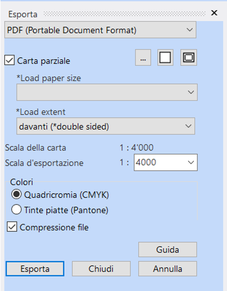
    - Selezionate il percorso desiderato
    - Impostate la directory dove si vuole salvare il file
    - Il PDF generato è composto da due pagine.
      
- Stampate il PDF 
    - Per stamparlo impostate “fronte/retro” sulla stampante    
      {==Screenshot della stampante ASTI del driver di stampa==}

> [ Ritorna sopra ](#top)

---
---
##  [ 114 ] Come verificare che versione del software OCAD sto usando  
 - Andate nel menu `> Guida > Informazioni su OCAD`  
   Vi apparirà il numero della versione  
   **Note di rilascio e aggiornamenti:**
      - Elenco aggiornamenti OCAD: vedi <a href="https://ocad.com/OCAD2018/OCAD_2018_Update.txt" target=_new><ins>Release Notes</ins></a>
      - Novità OCAD vedi <a href="https://www.ocad.com/wiki/ocad/en/index.php?title=What_is_New" target=_new><ins>OCAD What is new</ins></a>

> [ Ritorna sopra ](#cs_info_preliminari_tracciamento)  
       
---
###  [ 115 ] A. Creazione guidata tracciati di gara  

- Seleziona il menu `File > Creazione Guidata Tracciati di Gara`
- Appare la seguente finestra  
{width=500px}   
  **1.Nome della gara**  
    - *Intestazione gara:* inserisci il nome della gara es. *1. TMO - ASTi*  
    - *Disciplina:* seleziona *C-O*
- Clicca sul pulsante `Avanti`  
- Appare la seguente finestra  
{width=500px}   
  **2.File carta di sfondo, set di simbologia e lingua**  
    - *File carta:* clicca su sfoglia e seleziona il file della cartina (es. *mapSanGiorgio_250601.ocd*)
    - *File di simbologia:* seleziona la libreria dei simboli corretta  
        - Per cartine classiche 10'000 (ISOM):  
        *Course Setting 10 000 ISCD 2024 - ISOM 2017.ocd*
        - Per cartine sprint (ISSprOM):  
        *Course Setting 4 000 ISCD 2024 - ISSprOM 2019.ocd*  
    - *Nome del nuovo file tracciati:* indica il nome che vuoi assegnare al file dei tracciati e dove salvarlo sul tuo PC (es.*percorsiSanGiorgio_250615.ocd* )
- Clicca sul pulsante `Avanti`  
- Appare la seguente schermata  
{width=500px}  
    **3.Opzioni**  
    - Attivando *Carica tracciati e categorie da un altro file tracciati* è possibile importare il nome dei tracciati e categorie da un altro file di percorsi (opzionale - non fatelo importeremo i tracciati/categorie in altro modo)
    - *Lineee di connessione:* distanza tra il cerchio e la linea di collegamento imposta  {==0.00 mm==}
    - *Bordo bianco sul progressivo*: se l'attivate viene creato un bordo bianco sul numero progressivo del punto   
    ???+ Warning "Impostazioni: bordino bianco - linee di connessione"
          - Bordino bianco:
              - Per gare bosco (ISOM): **non è permesso** - non attivate l'opzione.
              - Per cartine sprint (ISSprOM): è permesso per TMO/TMS - potete attivare l'opzione. Per gare nazionali da discutere con TD.    
          - Lineee di connessione: distanza tra il cerchio e la linea di collegamento consigliato {==0.00 mm==}
- Clicca sul pulsante `Crea`  
- Il file dei percorsi viene creato e appare la seguente finestra con la cartina come sfondo    
{width=500px}  

> [ Ritorna sopra ](#cs_creazione_file_tracciati)  

---
###  [ 116 ] B. Creazione manuale tracciati di gara  
Per una creazione "manuale" del file dei tracciati  

- Seleziona il menu  `> File > Nuovo`
- Appare la seguente finestra  
  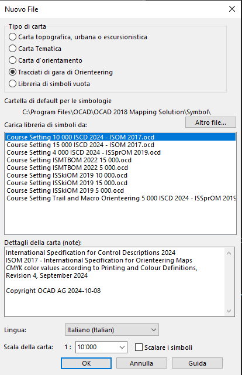{width=300px}    
  **Nuovo file**  
    - *Tipo di carta:* seleziona *Tracciati di gara di Orienteering* (a dipendenza dell'edizione di OCAD che state usando più opzioni sono attive)
    - *Cartella di default per le simbologie*: lascia quella impostata di default che punta sulla cartella dove sono salvati i *modelli delle simbologie*  
    - *Carica libreria di simboli da:* seleziona la simbologia corretta in base al vostro tipo di cartina. Di regola.  
         - Per cartine classiche 10'000 (ISOM): *Course Setting 10 000 ISCD 2024 - ISOM 2017.ocd*
         - Per cartine sprint (ISSprOM): *Course Setting 4 000 ISCD 2024 - ISSprOM 2019.ocd*
    - *Dettagli della carta (note)*: indica la versione della simbologia che avete selezionato (verificate che sia quella corretta e che [sia la più recente](https://www.ocad.com/wiki/ocad/en/index.php?title=Symbol_Set_Overview#Course_Setting_Symbol_Sets))
    - *Lingua*: impostate *italiano*
    - *Scala della carta*: è la ***scala del file*** della cartina di regola per le cartine sprint 1:4'000 per le cartine classiche 1:10'000. Se avete selezionato la *libreria di simboli* corretta al punto precedente avrete la scala già corretta.
- Cliccate sul pulsante `OK`
- Il file dei percorsi viene creato e appare la seguente finestra
{width=500px}  
- Per aggiungere la cartina come sfondo vai nel menu `> Sfondo > Gestione`  
- Appare la seguente finestra    
  {width=400px}  
  **Gestione carte di sfondo**
    - Cliccate sul pulsante *Apri* e seleziona il file ocad della tua cartina (p.es.*mapSanGiorgio_250601.ocd*)
    - Nella finestra vedrete aggiungersi una riga con il collegamento alla mappa e nella finestra principale vi apparirà la cartina
    - Cliccate sul pulsante *Chiudi*
- Salvate il progetto  menu `> File > Salva` e denominalo ad es. *percorsiSanGiorgio_250615.ocd*

???+ Failure "Errore scala sfondo"
    Se quando aprite il file della cartina appare il seguente messaaggio d'errore *Lo sfondo è georiferito in scala ..... ma i percorsi sono in scala ....* significa che il vostro file dei percorsi non ha la medesima scala del file della cartina.  
    Ricreate un nuovo file dei percorsi con la scala e simbologia corretta   
    {width=300px}

> [ Ritorna sopra ](#cs_creazione_file_tracciati)  
---
##  [ 117 ] Canovacci Definisci area di stampa
{==COMPLETARE==}

> [ Ritorna sopra ](#top)

---
##  [ 118 ] Utilizzo colori base
{==SISTEMARE==}  

Nel 2025 è stata introdotta in OCAD questa utile funzione.   
Ora per ogni specifica stampante si può creare un file (xml) con i colori di base tarato sugli standard richiesti dalla IOF.
Per la stampante ASTI è stato creato il file “ASTI Colors 2026”.   

- Se usate licenze Cloud: 
    - scaricate il file da {==LINK==} (nome_file_AAAAMMGG.xml) 
    - andate nella cartella cloud e verificate che ci sia la medesima versione  
    - se non fosse il caso chiedete al responsabile della vostra società di salvarlo sul cloud nella corretta directory
- Se avete OCAD installato sul vostro PC:
    - scaricate il file da {==LINK==} (nome_file_AAAAMMGG.xml)
    - copiate il file nella cartella 
      C:\ProgramData\OCAD\OCAD 2018\Base Colors  

### <name=""></a>Colori base - Caso 1: Nuovo file 
Quando si apre un nuovo progetto (di cartina o percorsi), OCAD automaticamente crea la paletta di colori corretta, assegnando ogni colore a uno dei colori base provenienti dal file di default della IOF. Conviene subito sistemare i giusti colori, caricando il file con i colori di base per la stampante ASTI.  

- Sistemare i colori base:   
    - Aprire il menu “carta” e poi “colori”, e poi cliccare in basso a sinistra su “colori base”.  
    - Si apre una nuova finestra, in cui nel campo “load from” va inserito il file “ASTI Colors 2026”. 
      Se il file è stato messo nella directory giusta di OCAD lo potete scegliere dalla lista a tendina, 
      altrimenti cliccando sul pulsante coi tre puntini potete scegliere la directory dove avete il file (p.es. chiavetta USB).  
    - Alla fine compare questa maschera:  
      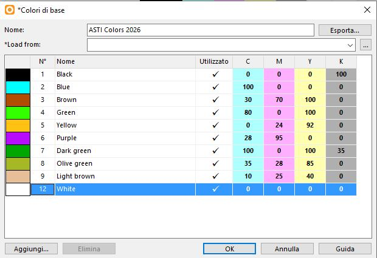{width=300px}  
    - Chiuderla cliccando su OK.  
    - Automaticamente OCAD adatta i colori alla paletta dei colori base caricati.  
    - Verificare che tutti i colori (salvo bianco e nero…) siano assegnati ai colori base (se ne manca qualcuno, assegnarlo).

- Ora bisogna modificare la sfumatura di alcuni colori, specificando la percentuale nell’intensità.
    - Modificare i grigi (da 20 a 27%, da 35 a 45%, da 50 a 60%, vedi foto sotto).  
    - Modificare i gialli (da 75 a 83%, da 50 a 67%, vedi foto sotto). 
    - Modificare i blu (da 70 a 80%, da 50 a 60%, da 30 a 40%, vedi foto sotto).
    - Modificare i verdi (da 60 a 65%, da 30 a 35%, vedi foto sotto).  
      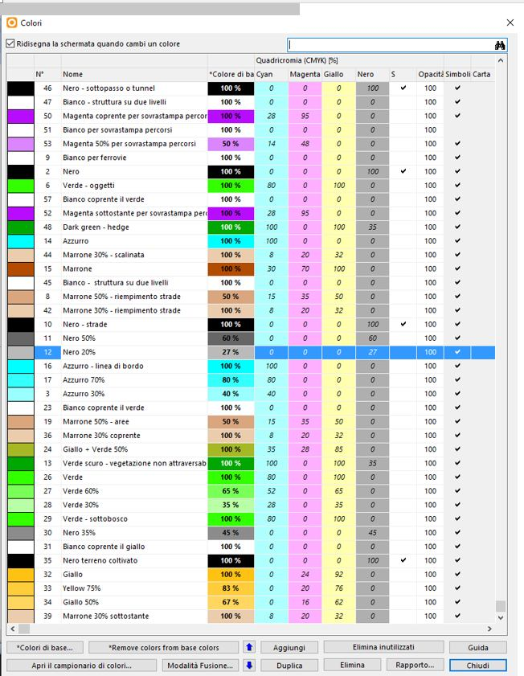{width=300px}   
    - Chiudere la finestra.

- Ora i colori della cartina base sono impostati. Fate un'ottimizzazione/riparazione della cartina per comprimere il file.
  > [ [ 119 ] Come ottimizzare/riparare un file ocad](#ocad_ottimizzare_file_ocad)

- I colori devono essere verificati/impostati sia per la cartina che per i percorsi.  
  Si può passare ora al file dei percorsi e fare la stessa cosa.  
  Alla fine dell’operazione, si può esportare il PDF e stampare la cartina con i colori giusti e certificati.  

### <name=""></a>Colori base - Caso 2: Verifica colori file esistente

- Come prima cosa verificare se ci sono già dei colori base assegnati.
  Procedere come segue.
  - Aprire il menu “carta” e poi “colori”. Appare una nuova finestra.
    {width=300px}  
  - Se la colonna “colori di base” è vuota significa che non sono ancora stati assegnati > Assegnare i colori base
  - Se la colonna “colori di base” è riempita significa che sono già stati assegnati > Verificare i colori base

- Assegnare i colori base (se non ci sono colori base assegnati)
  - Cliccare allore sul bottone in basso a sinistra su “colori base”.  
  - Si apre una nuova finestra, in cui nel campo “load from” va inserito il file “ASTI Colors 2026”. 
    Se il file è stato messo nella directory giusta di OCAD lo potete scegliere dalla lista a tendina, altrimenti cliccando sul pulsante coi tre puntini potete scegliere la directory dove avete il file (p.es. chiavetta USB).
  - Una volta caricato il file, compaiono i colori base ASTI corretti.  
  - Chiudere la finestra cliccando su OK, poi subito dopo cliccare sul bottone “assegna colori ai colori base”  
    {width=300px} 
  - OCAD cerca di assegnare in automatico i colori, verificare che tutti i colori (salvo bianco e nero…) siano assegnati ai colori base.  
  Attenzione: È possibile che con vecchie cartine l’assegnazione avvenga solo parziale, quindi se dovesse mancare qualche colore va assegnato a mano, cliccando nella colonna “colori base” corrispondente e scegliendo il colore dall’elenco.  
  - Ora bisogna modificare la sfumatura di alcuni colori, specificando la percentuale nell’intensità (vedi capitolo precedente).

- Verificare i colori base
  Nel caso invece all’apertura del menu colori di una cartina esistente comparisse questa finestra:
  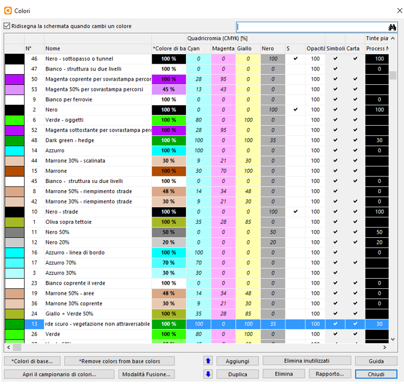{width=300px} 
  Significa che i colori sono già assegnati a dei colori base.
  - Cliccando sul pulsante “colori base” si può vedere se è già caricato il profilo dei colori per la stampante ASTI (ASTI Colors 2026), nel qual caso è tutto OK e basta controllare le sfumature dei colori specificando la percentuale nell’intensità (vedi capitolo precedente).
  - Altrimenti se è caricato un profilo sbagliato (p.es. quello di default della IOF) si consiglia di scegliere in basso sulla sinistra “remove colors from base colors”, poi scegliere “colori di base” per assegnare la paletta di colori ASTI giusta, ed infine premere sul bottone “assegna colori ai colori base”. 
  - A questo punto verificare che tutti i colori (salvo bianco e nero…) siano assegnati ai colori base. 
  - È possibile che con vecchie cartine l’assegnazione avvenga solo parziale, quindi se dovesse mancare qualche colore va assegnato a mano, cliccando nella colonna “colori base” corrispondente e scegliendo il colore dall’elenco.
  - Ora bisogna modificare la sfumatura di alcuni colori, specificando la percentuale nell’intensità (vedi capitolo precedente).

> [ Ritorna sopra ](#top)

---
##  [ 119 ]  Come ottimizzare/riparare un file ocad
{==COMPLETARE==}
- Menu `> Carta > Ottimizzazione/Riparazione`

> [ Ritorna sopra ](#top)

---
##  [ 120 ] 
{==COMPLETARE==}

> [ Ritorna sopra ](#top)

---
##  [ 121 ] 
{==COMPLETARE==}

> [ Ritorna sopra ](#top)

---
##  [ 122 ] 
{==COMPLETARE==}

> [ Ritorna sopra ](#top)

---
---
##  [ 123 ] 
{==COMPLETARE==}

> [ Ritorna sopra ](#top)

---
##  [ 124 ] 
{==COMPLETARE==}

> [ Ritorna sopra ](#top)

---

##  [ 125 ] Importazione della cartina nel file dei percorsi (solo esperti OCAD)
{==Sistemare==}
Un'altra tecnica di stampa, che dà ottimi risultati, consiste nell’importare la cartina nel file dei percorsi.  
La cartina va tolta dagli sfondi, ed è integrata coi percorsi.    
Questo significa che tutti i colori sono nello stesso file, e si possono pilotare le trasparenze come si vuole, semplicemente posizionando i colori critici nella sequenza desiderata (così che “coprano” quelli sotto di loro e non quelli sopra di loro...).    
Questa tecnica permette di stampare direttamente da OCAD ottenendo la trasparenza necessaria.  
Un vantaggio di questa stampa diretta da OCAD è che il color viola è “regolare”, ossia tutto con la stessa tonalità, e non dipende dal colore che c’è sullo sfondo (come con il darkening da PDF).  
Uno svantaggio sono le vecchie cartine, magari non georeferenziate, o con tavolozze di colori alla vecchia maniera, che rendono questa tecnica molto difficilmente applicabile...  
Ecco come procedere.  

 - Aprire il file percorsi.
 - Scegliere dal Menu Carta “colori”.
 - Per semplificare le cose si consiglia di  premere sul bottone “elimina inutilizzati” e di confermare,
 - Così facendo dovrebbero restare solo alcuni viola, un nero ed un bianco, tutti colori utilizzati nei percorsi, mentre gli altri colori aggiunti per default da OCAD vengono eliminati, semplificando il quadro generale.
  
 - Come prossimo passo andare nel Menu Sfondi, “gestione” e premere su “elimina tutti”, confermando.
 - Scompare la cartina dallo sfondo e resta solo il percorso selezionato.
 - Andare sul Menu File, scegliere “importa” e selezionare la cartina che prima era come sfondo.
 - Impostare i seguenti parametri:
   - usa le coordinate reali (se la cartina è georeferenziata)
   - importa simboli e colori
   - Importa colori in fondo alla tavolozza
   - cambia stato del simbolo da modificabile a protetto
 - E poi confermare con OK.  
   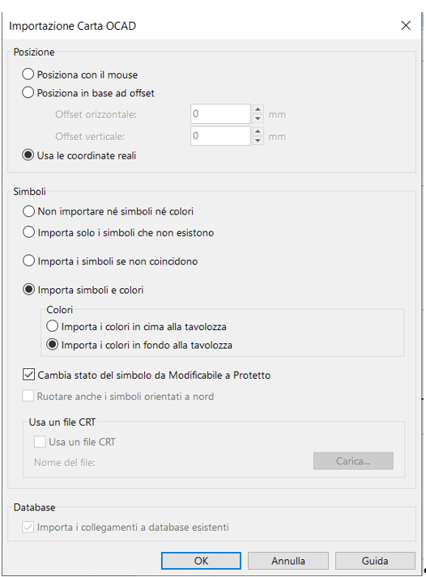
 - Ricompare la cartina come era prima (ma ora è tutto nello stesso file…)!
 - Ora bisogna concentrarsi di nuovo sui colori (Menu Carta, “colori”).
 - In particolare sul color viola sottostante (di solito è il colore 52).
 - Esso va posizionato più in basso, sotto i seguenti colori della cartina:
   - oggetti verdi
   - linee blu (es. fiumi)
 - marrone linee (curve di livello)
 - Ecco un esempio di posizionamento (che può variare, a seconda dei colori presenti nella cartina):
  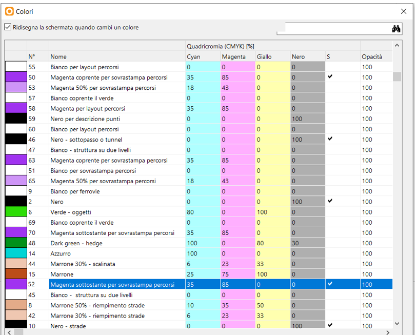  
 - Attivando il bottone “anteprima” si può vedere l’effetto.
 - Verificare se le righe dei percorsi o dei punti sovrastano o meno quale altro colore della cartina.
 - Modificare il posizionamento finché si ottiene l’effetto desiderato.
 - Si può poi spostare l’attenzione sui numeri dei punti, che di solito usano il colore numero 50, che dovrebbe essere posizionato in alto, in modo da coprire tutti i colori sottostanti, e risultare così ben visibile.
 - Quando si è soddisfatti, dopo aver impostato i colori giusti per la stampante usata, si può procedere alla stampa, che può essere diretta da OCAD oppure esportando i PDF (che generano poi l’effetto darkening).

> [ Ritorna sopra ](#top)

---
##  [ 126 ] Darkening
{==Sistemare==}
Il “darkening” è una funzione che rende il viola dei percorsi trasparente quando si esportano i PDF da OCAD per la stampa dei percorsi.   
Quando si crea un file di percorsi (e solo su un file di percorsi e non su una cartina!), OCAD automaticamente imposta l’effetto “darkening” per il viola di percorsi e numeri (non per il viola di layout). Quindi esportando i percorsi in PDF, si ottiene automaticamente la trasparenza desiderata.  
Questo si può verificare come segue:  

 - Visualizzare i colori (Menu Carta, Colori), premere sul pulsante “fusione”.
 - Appare la maschera seguente, in cui si vede che i colori 50 e 52 vengono “trasformati” e resi “non coprenti”.
  
  
> [ Ritorna sopra ](#top)

---

