# Gestione Archivio

Le iscrizioni effettuate tramite i portali d'iscrizione usano i dati della banca dati SOLV. Importare la banca dati come archivio in OL-Einzel permette di avere dati completi per le mutazioni e iscrizioni sul posto.  
  
!!! Info
    Le azioni presentate in questa pagina vengono di regola effettuati sui PC ASTi dai responsabili del materiale.  
    Possono tuttavia essere comode per chi vuole caricare la banca dati sul proprio PC in fase di preparazione della gara.

!!! Warning "Protezione dei dati"
    I contenuti dell'archivio sono dati personali sensibili, per cui non ne è permesso alcun uso al di fuori dello stretto necessario per l'organizzazione della gara.

## Scaricamento Banca Dati SOLV

Per scaricare la banca dati occorrono delle credenziali con i relativi diritti.

1. Dal sito di [Swiss Orienteering](https://www.swiss-orienteering.ch), seleziona `Gare > Banca dati concorrenti`.
1. Si apre la pagina principale della [SOLV-DB](https://www.o-l.ch/cgi-bin/solvdb).
1. Se non hai le credenziali ma credi di averne diritto, scrivi un email a oltech (vedi l'indirizzo in fondo alla pagina).  
    Altrimenti vai alla pagina di login.  
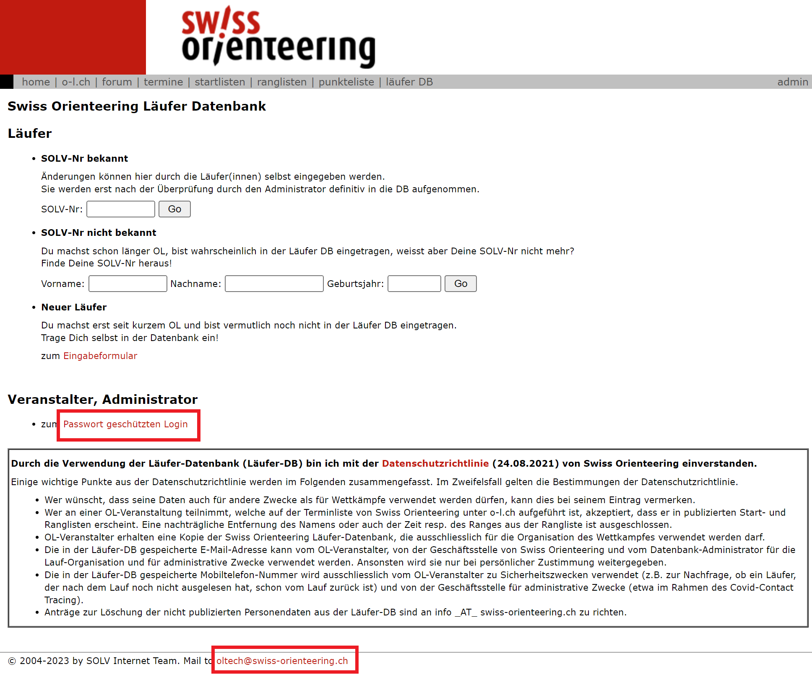
1. Inserisci il nome utente e la password.  
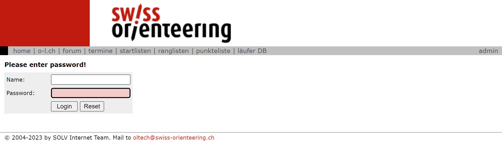
1. Seleziona l'azione `Download`.  
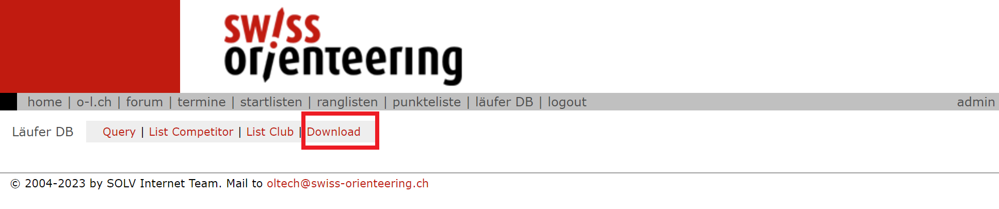
1. Seleziona `CSV für SportSoftware OE12 V.12` e scegli `Personen` e `Mit Kategorie`.  
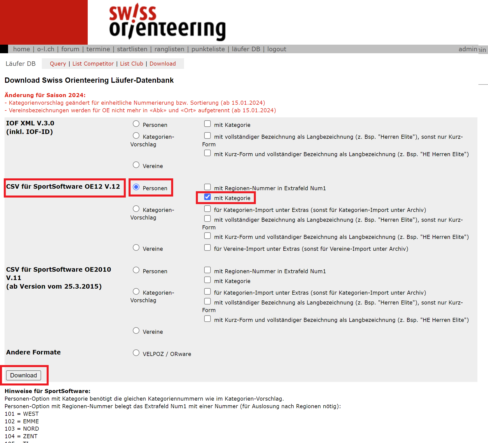
1. Premi `Download` per scaricare il file nella cartella di default dei download del browser.

## Importazione in OL-Einzel

Importa l'archivio in OL-Einzel.  
**Nota**: tutti i PC ASTi hanno un archivio locale, ma il PC 4 (server) ha sempre la versione più recente.

1. Seleziona `Archivio > Archivio > Seleziona`.  
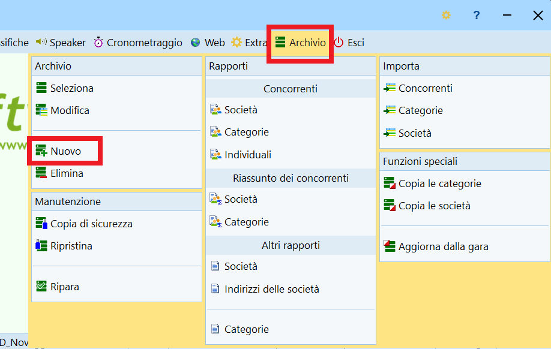
1. Verifica che sia in modalità `Locale`, altrimenti premi sui tre puntini `...` a fianco della scritta `Rete`.
1. Seleziona `Archivio SOLV` se ce l'hai.  
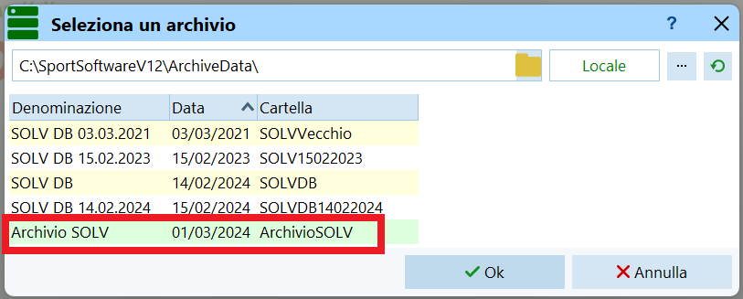
    1. Seleziona `Archivio > Archivio > Modifica`.  
    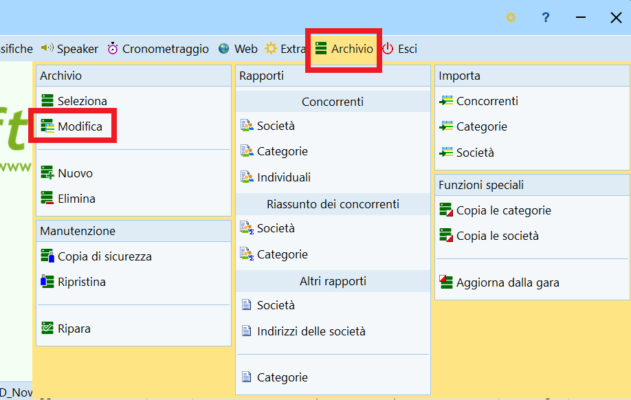
    1. Imposta la data a quando hai scaricato il file dell'archivio.  
    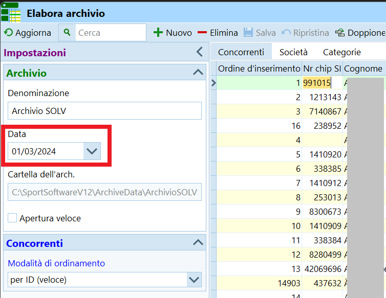
1. Crea l'`Archivio SOLV` se non ce l'hai.
    1. Seleziona `Archivio > Archivio > Nuovo`.  
    
    1. Inserisci `Archivio SOLV` come denominazione, e la data quando è stato scaricato l'archivio.  
    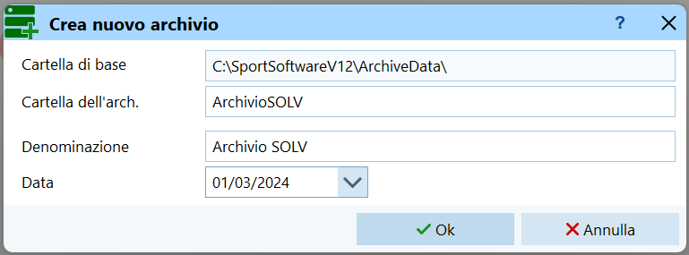
1. Seleziona `Archivio > Importa > Concorrenti`.  
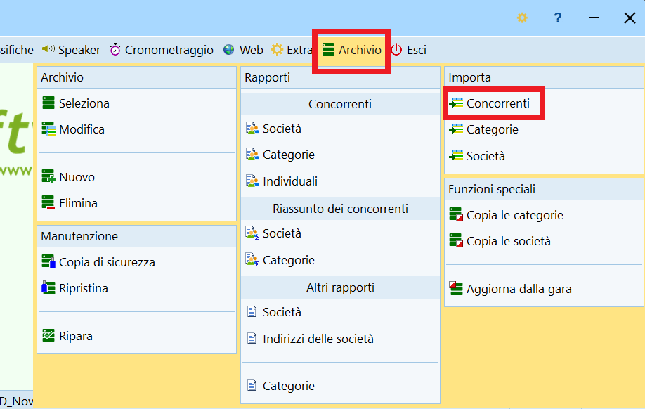
1. Nel dialogo:
    1. Controlla che l'archivio sia `Archivio SOLV`.
    1. `Cancella e ricrea` i concorrenti.
    1. Identifica i concorrenti dall'`ID banca dati`.
    1. `Cancella e ricrea` le società.
    1. `Cancella e ricrea` le categorie.
    1. Imposta `Colonne con separatori (CSV)` come formato.
    1. Imposta `Punto e virgola` come separatore.
    1. Imposta `Nessuno` come delimitatore di testo.
    1. Seleziona il file scaricato.  
    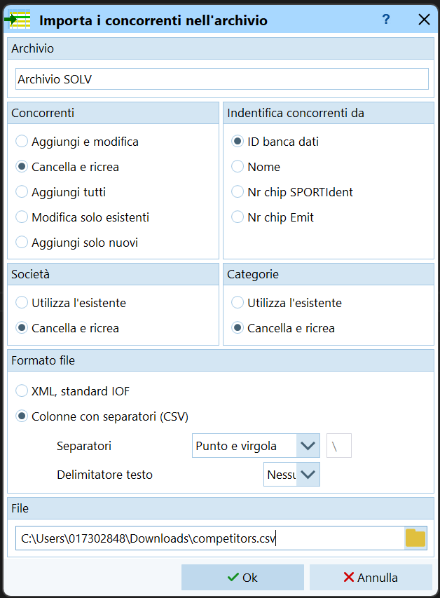
1. Conferma di sapere quello che fai.  
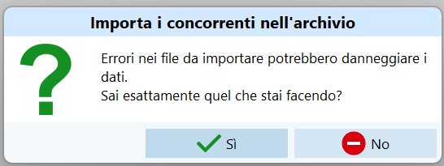
1. Attendi che vengano importati tutti i dati.  
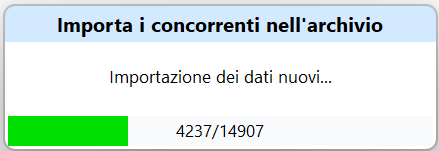
1. Verifica il rapporto.  
**Nota**: devono esserci tanti concorrenti ma nessun errore.  
**Nota**: nella banca dati sono presenti tanti concorrenti con lo stesso nome.  
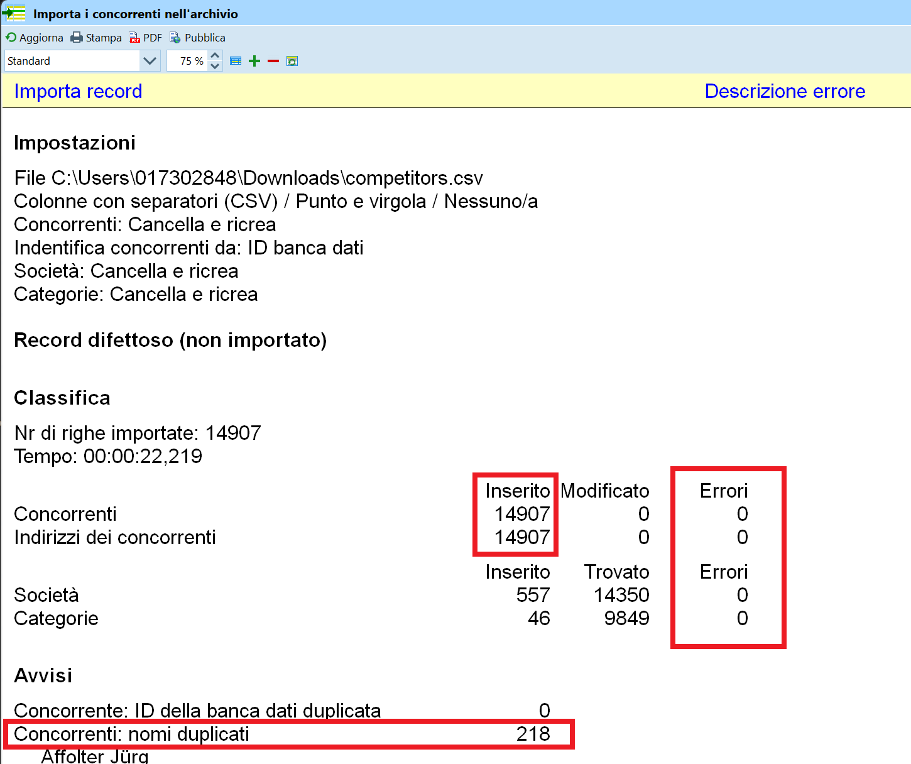

## Impostazione Uso Archivio

Viene sempre usato l'archivio selezionato in `Archivio > Archivio > Seleziona`.  
Sui PC ASTi, il PC4 usa l'archivio locale, tutti gli altri PC usano l'archivio `Archivio SOLV` sul PC 4 (server), quindi in modalità `Rete`.  
In questo modo, basta aggiornare il server e tutte le stazioni di lavoro hanno la versione aggiornata dell'archivio.  
L'archivio locale sulle varie macchine serve nel caso un PC (ad esempio il PC 5) venga portato a casa per la preparazione della gara.  
  
È possibile verificare l'archivio usato in `Iscrizioni > Modifica > Iscrizioni`, verificando il nome dell'archivio, la data e l'ubicazione (locale o remota).  
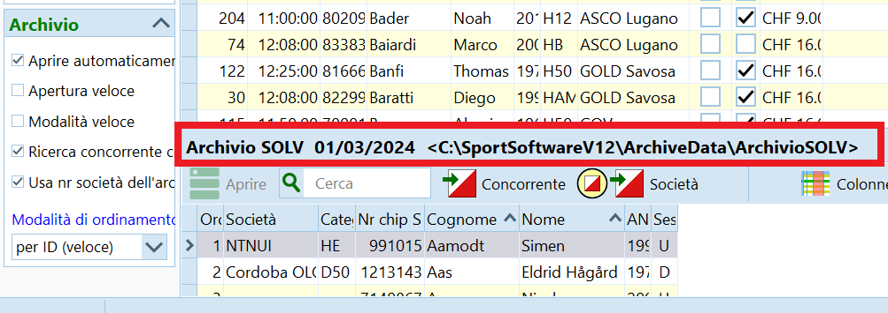 