# Gestione di varie casistiche normali

{width=100px}  
Vedi [PDF della vecchia versione, capitolo 5.3, 5.7, 5.8](../../gestione_gara_org/inc/Istruzioni_OL_einzel_per_TMO_v2_4.pdf) per i capitoli riguardanti
  
- Sostituzione punti.   
**In OE12 la funzione è nel menu `Percorsi` sotto `Modifica > Sostituzione punti`**
- Chip noleggiati (5.3)
- Correzione motivo di non classifica (5.7)
- Controllo orari di partenza (5.8)

## Non partiti

Puoi inserire i non partiti manualmente o tramite la lettura della scatoletta check della
partenza.  

### Procedura manuale

Inserisci i non partiti in base al rapporto della partenza  
  
1. Nel menu `Cronometraggio` seleziona `Manualmente > Immissione manuale`  
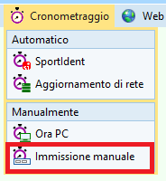  
  
1. Annulla la finestra di stampa
1. Imposta nel pannello a sinistra `Valutazione rapida` a `Nessuno`
1. Imposta lo stato di classifica in basso a destra a `N.Part.`
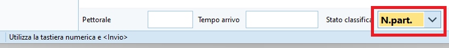  
  
1. Per ogni concorrente non partito  
    
    1. Inserisci il numero di pettorale e premi `Enter`.  
    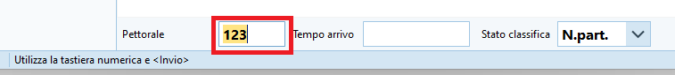  
      
    1. Verifica sempre che il nome che appare nella lista corrisponda a quello del concorrente non partito

### Procedura tramite lettura check

Inserisci i non partiti leggendo i timbri dalla scatoletta Check della partenza (possibilmente
quella utilizzata per il controllo delle partenze al minuto -1).  
  
**Nota**: le schermate seguenti sono fatte con una gara con soli tre iscritti con nomi eloquenti...
  
| Cognome | Nome        |
| ------- | ----------- |
| Test1   | Arrivato    |
| Test2   | In giro     |
| Test3   | Non partito |

1. Chiudi tutte le finestre connesse alla scatoletta di lettura, per esempio `Leggi Chip`
1. Nel menu `Giorno di gara` seleziona `Chip > Elabora stazione SI`  
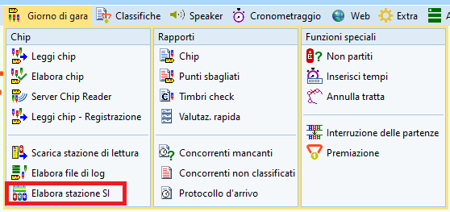  
  
1. Seleziona `Leggi`  
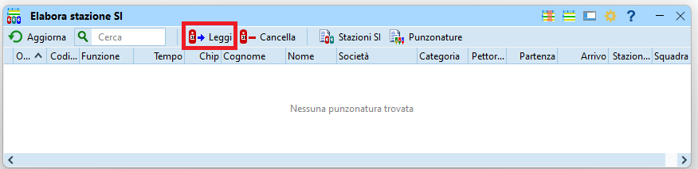  
  
1. Verifica la connessione alla scatoletta di lettura (pallino verde in basso a destra).  
       
    ???+ Bug "ATTENZIONE A NON ELIMINARE TUTTE LE PUNZONATURE"  
        La finestra che appare ha almeno tre problemi:  
          
        1. Non è possibile chiudere la finestra.  
        La `crocetta` in alto a destra per chiudere la finestra `NON` funziona se prima non viene eseguita un'azione.  
        Per chiudere la finestra, premere su `Verifica ora`, eventualmente accettare il messaggio di errore e poi chiudere la finestra normalmente.  
          
        1. Il bottone `Cancella` non chiude la finestra, quindi non si comporta come un bottone `Cancel`/`Annulla`, ma `CANCELLA TUTTE LE PUNZONATURE` sulla scatoletta.  
        Questo bottone va rinominato `Elimina` per non fare confusione. 
          
        1. Il bottone `Cancella` `NON` chiede la conferma da parte dell'utente, ma cancella tutto immediatamente, senza una verifica e senza possibilità di ripensamento.  
      
  
    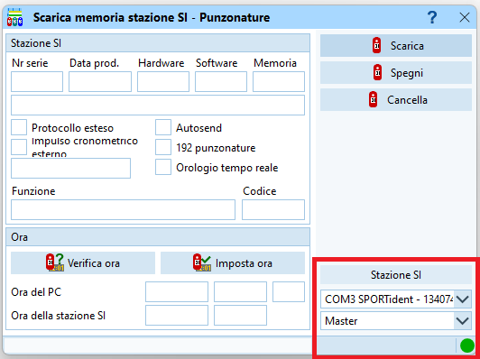  
  
    - Imposta la modalità `Master`
    - Seleziona la porta `COM... SPORTident...`
  
1. Posiziona la scatoletta dello start check sulla scatoletta di lettura usando il magnete.
1. Seleziona `Scarica`  
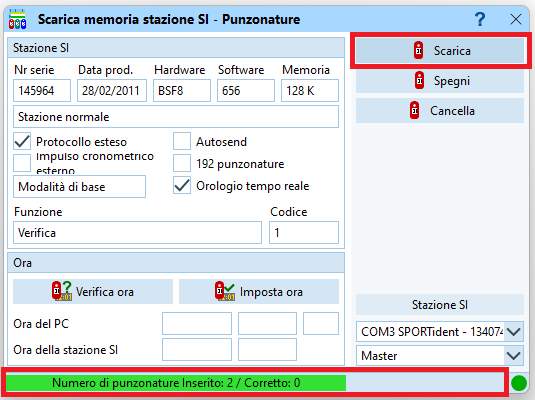  
  
    - Verifica nella barra in basso che il numero di punzonature scaricate corrisponda circa al numero di iscritti
      
1. Verifica che vi siano tanti concorrenti nella schermata di elaborazione SI e che i tempi siano nell'intervallo previsto  
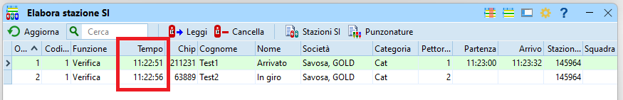  
  
    - Evita di usare questa procedura se vi sono tempi sballati. La scatoletta Start Check potrebbe contenere dati di una gara precedente (se non è stata fatta la sincronizzazione con la stazione SI-Master in modalità estesa) 
  
1. Chiudi la finestra di `Elabora Stazioni SI`  
  
1. Nel menu `Giorno di gara` seleziona `Funzioni speciali > Non partiti`  
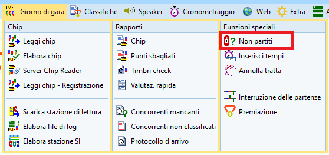  
  
1. Nelle opzioni a sinistra, assicurati che sia seleziona `Timbri check` e premi `Avvia`  
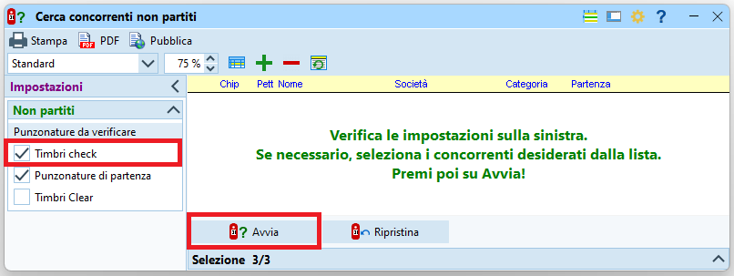  
  
1. Conferma anche se non vedi ancora chi sono i concorrenti marcati non partiti  
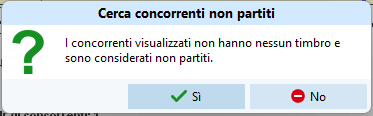  
  
1. Verifica la lista sia attendibile  
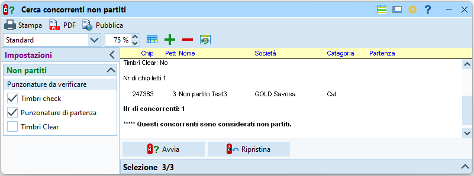  
  
    - In caso contrario usa la funzione `Ripristina` per annullare la modifica dello stato di gara dei concorrenti non partiti.

## Concorrenti mancanti

Per sapere quanti (e quali) concorrenti mancano all'arrivo  

1. Nel menu `Giorno di gara` seleziona `Rapporti > Concorrenti mancanti`  
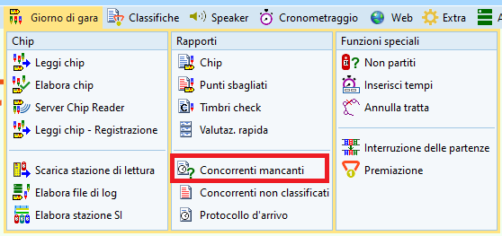  
  
1. Per evitare confusione, nascondi la sezione con tutti i concorrenti (in basso a sinistra).  
Verifica il sommario per categoria e la lista dei nomi.  
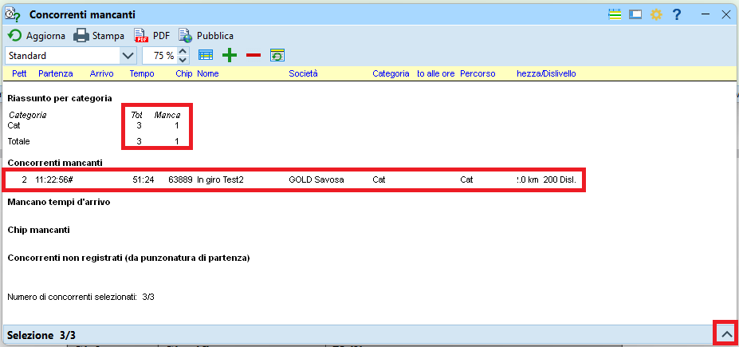  
  
    - **Nota**: se mantieni la finestra aperta, premi il bottone `Aggiorna` in alto a sinistra