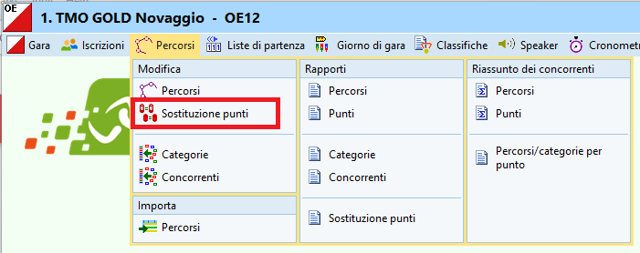
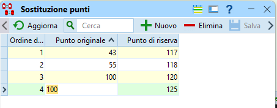
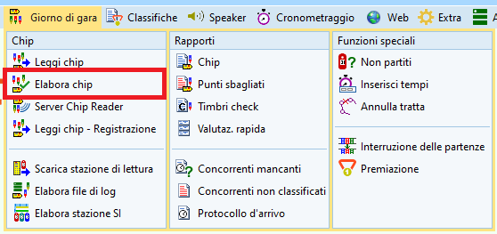
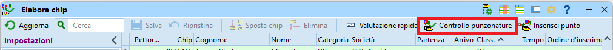
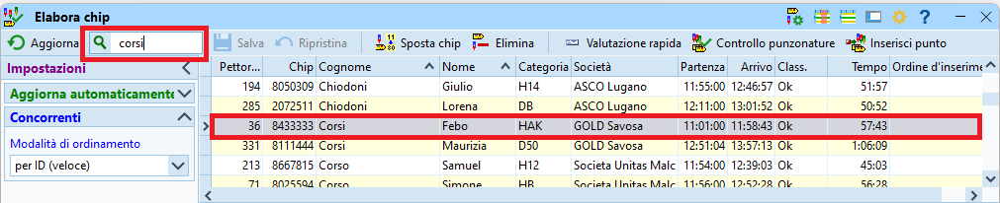
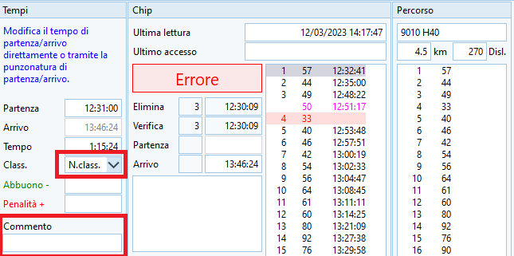
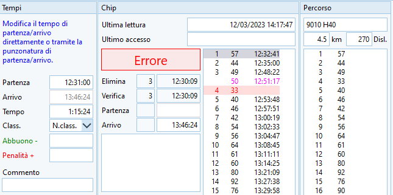
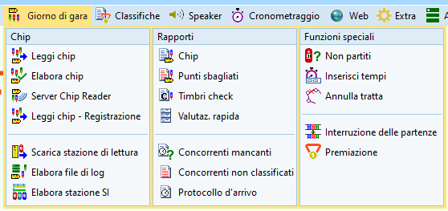
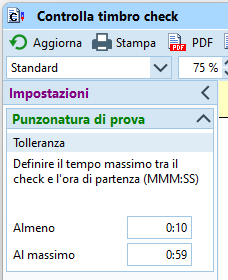
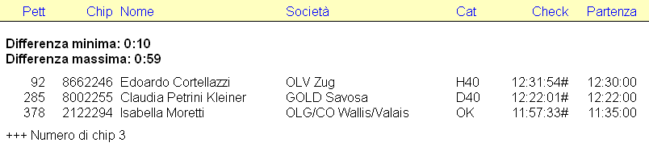

# Gestione di varie casistiche normali

## Sostituzione punti
OL-Einzel permette la sostituzione di un punto, cioè la posa di una scatoletta diversa da quella prevista dal percorso. Questo è utile soprattutto nel caso di scatolette che non funzionano al momento della programmazione o, peggio ancora, durante la posa. In questi casi, sostituisci il punto difettoso con uno funzionante, applicando del nastro autocollante per coprire il numero "vero" del punto e scrivi ben leggibile il numero del punto "originale", cioè il numero che i concorrenti si aspettano di trovare.

1. Nel menu `Percorsi` seleziona `Modifica > Sostituzione punti`.  

1. Nella maschera che appare premi `+ Nuovo` e inserisci i numeri dei punti e salva (premendo `Enter`).  

**Note**:  
    - il numero `Punto originale` (a sinistra) è quello che i concorrenti si aspettano di trovare, mentre il `Punto di riserva` è la scatoletta che effettivamente è posata e viene timbrata.  
    - da questo momento in avanti vengono accettate entrambe le timbrature sia del punto originale che di quello di riserva (nell’esempio, un timbro “117” viene interpretato come un “43”).  
    - nell’esempio, all’ultimo punto mettiamo tre scatolette, supponendo che la scatoletta col numero `giusto`(punto 100) funzioni, una seconda scatoletta (120) e una terza (125). Tutte e tre verranno interpretate come se fossero una scatoletta numero 100.  

Qualora fossero già state lette le SI-Card di diversi concorrenti, che sono stati evidentemente messi in stato `Non classificato`, è possibile rifare l’analisi delle punzonature alla luce dei dati modificati.

1. Nel menu `Giorno di gara`, seleziona `Chip > Elabora chip`.  

1. Seleziona `Controllo punzonature`.
  
**Nota**: Appare un rapporto con i concorrenti modificati.

## Correzione stato classifica
È possibile cambiare lo stato di classifica dei concorrenti a uno dei seguenti valori.  

- **Ok** - `Classificato`  
Usato sia per concorrenti che hanno letto il chip ed hanno tutti i punti corretti, sia per concorrenti ancora in gara.
- **N.Part.** - `Non partito`  
- **Rit** - `Ritirato`  
Nel caso un concorrente lasci via più punti apposta, oppure se giunge alla lettura senza chip (di solito perso nel bosco), o anche se un concorrente ferito non giunge al centro gara.
- **N.Class.** - `Non classificato`  
Nel caso di errori come punti mancanti o sbagliati ma senza volontarietà.
- **Squal** - `Squalificato`  
Decisione della giuria, normalmente per comportamento antisportivo.
- **FTMax** - `Fuori tempo massimo`  
Chiaro, poco usato.
- **Ben fatto** - `Classificato`  
Usato per categorie senza rango.

Procedura per lo modifica: 

1. Nel menu `Giorno di gara` seleziona `Chip > Elabora chip`.  

1. Ordina i concorrenti per pettorale, per nome, ecc.
1. Seleziona il concorrente da modificare.

1. Cambia lo stato di classifica.

1. Eventualmente, aggiungi un commento se il cambio di stato non è evidente dalla sequenza dei punti.
1. Premi `Enter` per confermare o `Esc` per annullare la modifica.

## Punti timbrati
Il `Elabora chip` si possono vedere tutti i dati memorizzati sul chip di gara dei concorrenti.

Per una gara "tipica", con partenza data dalla lista di partenza (e non dalla scatoletta start) e l'arrivo dato dal timbro del finish:
  

- Sezione `Tempi` a sinistra  
    - `Partenza` è l'orario di partenza della lista di partenza. È un campo modificabile, ad esempio per aiutanti della partenza che sono partiti dopo l'ultimo concorrente e non rispetto al loro tempo di partenza ufficiale.
    - `Arrivo` è l'orario letto dal chip e quindi **non** modificabile.
    - `Tempo` di gara, viene ricalcolato in caso di modifica dell'ora di partenza solo quando viene salvato (premuto `Enter`).
    - `Class.` è lo stato di classifica.
    - `Abbuono -` e `Penalità +` non sono usati per i TMO.
    - `Commento` può essere usato per il motivo della modifica dello stato e tempo di partenza.
- Sezione `Chip` centrale
    - `Ultima lettura` mostra quando è stato letto il chip.
    - `OK` o `Errore` stato del controllo dei punti, indipendente quindi dallo stato di classifica.
    - `Elimina` dovrebbe essere l'ora del clear (ma sembra sempre quello del check).
    - `Verifica` è l'ora del check (dovrebbe essere quello dello start-check nel minuto prima dell'orario di partenza).
    - `Partenza` l'ora della scatoletta start, se usata
    - `Arrivo` l'ora della scatoletta finish.
    - Lista dei punti
        - In nero i punti fatti correttamente.
        - In rosso i punti mancanti.
        - In viola i punti timbrati ma non richiesti dal percorso.
- Sezione `Percorso` a destra
    - Nome del percorso
    - Lunghezza e dislivello
    - Punti richiesti

## Verifica orari partenze
Controlla se qualche concorrente è partito prima del suo tempo di partenza.  
Questo controllo si basa sull'orario in cui si effettua il Check del chip. Per minimizzare l'effetto di concorrenti che si presentano in ritardo alla prepartenza, il chip viene ricontrollato (tramite la scatoletta `start-check`, che è una normale scatoletta `check`) durante il minuto di partenza. Al passaggio dalla zona del minuto -1 alla zona di partenza, ma dopo la partenza dei concorrenti precedenti, ogni partecipante deve rifare il `check`.  
  
Il programma si basa su questo tempo, memorizzato sul chip stesso, per determinare chi è partito ad un orario non corretto, quindi in anticipo o in ritardo.

1. Nel menu `Giorno di gara`, seleziona `Rapporti > Timbri check`.  

1. Nelle impostazioni a sinistra, controlla il tempo minimo e massimo tra il timbro della scatoletta Check e la partenza.  
**Nota**: seguendo il processo descritto sopra, il check viene fatto tra meno di un minuto prima della propria partenza fino a pochi secondi dalla partenza.  

1 Premi il bottone `Aggiorna` in alto a sinistra.
1. Controlla la lista.  

**Note**.  
    - Se ci sono concorrenti partiti in anticipo, chiarisci il motivo con i funzionari della partenza.  
    Di regola, partenze in anticipo non sono ammesse. Informa la giuria: su loro decisione devi eventualmente correggere l'orario di partenza o impostare lo stato del concorrente a `Squalificato`. 
    - Normalmente, la maggior parte dei concorrenti che appaiono in questa lista sono partiti in ritardo. 
        - Se la colpa è del concorrente, non viene modificato il tempo di partenza. 
        - Se la responsabilità è dell'organizzatore, l'orario di partenza va modificato, ma sempre su decisione della giuria.
        - Ogni tanto singoli concorrenti partono senza aver timbrato lo start-check e quindi appaiono come partiti alcuni minuti troppo presto. Di solito, i funzionari alla partenza si ricordano di questi casi, perché sono "casinisti" che si fanno notare...
    - Nell'esempio sopra
        - Il primo concorrente è partito 2 minuti in ritardo
        - La seconda un secondo
        - La terza ben 22':33" troppo tardi.

## Non partiti

Puoi inserire i non partiti manualmente o tramite la lettura della scatoletta check della
partenza.  

### Procedura manuale

Inserisci i non partiti in base al rapporto della partenza  
  
1. Nel menu `Cronometraggio` seleziona `Manualmente > Immissione manuale`  
  
  
1. Annulla la finestra di stampa
1. Imposta nel pannello a sinistra `Valutazione rapida` a `Nessuno`
1. Imposta lo stato di classifica in basso a destra a `N.Part.`
  
  
1. Per ogni concorrente non partito  
    
    1. Inserisci il numero di pettorale e premi `Enter`.  
      
      
    1. Verifica sempre che il nome che appare nella lista corrisponda a quello del concorrente non partito

### Procedura tramite lettura check

Inserisci i non partiti leggendo i timbri dalla scatoletta Check della partenza (possibilmente
quella utilizzata per il controllo delle partenze al minuto -1).  
  
**Nota**: le schermate seguenti sono fatte con una gara con soli tre iscritti con nomi eloquenti...
  
| Cognome | Nome        |
| ------- | ----------- |
| Test1   | Arrivato    |
| Test2   | In giro     |
| Test3   | Non partito |

1. Chiudi tutte le finestre connesse alla scatoletta di lettura, per esempio `Leggi Chip`
1. Nel menu `Giorno di gara` seleziona `Chip > Elabora stazione SI`  
  
  
1. Seleziona `Leggi`  
  
  
1. Verifica la connessione alla scatoletta di lettura (pallino verde in basso a destra).  
       
    ???+ Bug "ATTENZIONE A NON ELIMINARE TUTTE LE PUNZONATURE"  
        La finestra che appare ha almeno tre problemi:  
          
        1. Non è possibile chiudere la finestra.  
        La `crocetta` in alto a destra per chiudere la finestra `NON` funziona se prima non viene eseguita un'azione.  
        Per chiudere la finestra, premere su `Verifica ora`, eventualmente accettare il messaggio di errore e poi chiudere la finestra normalmente.  
          
        1. Il bottone `Cancella` non chiude la finestra, quindi non si comporta come un bottone `Cancel`/`Annulla`, ma `CANCELLA TUTTE LE PUNZONATURE` sulla scatoletta.  
        Questo bottone va rinominato `Elimina` per non fare confusione. 
          
        1. Il bottone `Cancella` `NON` chiede la conferma da parte dell'utente, ma cancella tutto immediatamente, senza una verifica e senza possibilità di ripensamento.  
      
  
      
  
    - Imposta la modalità `Master`
    - Seleziona la porta `COM... SPORTident...`
  
1. Posiziona la scatoletta dello start check sulla scatoletta di lettura usando il magnete.
1. Seleziona `Scarica`  
  
  
    - Verifica nella barra in basso che il numero di punzonature scaricate corrisponda circa al numero di iscritti
      
1. Verifica che vi siano tanti concorrenti nella schermata di elaborazione SI e che i tempi siano nell'intervallo previsto  
  
  
    - Evita di usare questa procedura se vi sono tempi sballati. La scatoletta Start Check potrebbe contenere dati di una gara precedente (se non è stata fatta la sincronizzazione con la stazione SI-Master in modalità estesa) 
  
1. Chiudi la finestra di `Elabora Stazioni SI`  
  
1. Nel menu `Giorno di gara` seleziona `Funzioni speciali > Non partiti`  
  
  
1. Nelle opzioni a sinistra, assicurati che sia seleziona `Timbri check` e premi `Avvia`  
  
  
1. Conferma anche se non vedi ancora chi sono i concorrenti marcati non partiti  
  
  
1. Verifica la lista sia attendibile  
  
  
    - In caso contrario usa la funzione `Ripristina` per annullare la modifica dello stato di gara dei concorrenti non partiti.

## Concorrenti mancanti

Per sapere quanti (e quali) concorrenti mancano all'arrivo  

1. Nel menu `Giorno di gara` seleziona `Rapporti > Concorrenti mancanti`  
  
  
1. Per evitare confusione, nascondi la sezione con tutti i concorrenti (in basso a sinistra).  
Verifica il sommario per categoria e la lista dei nomi.  
  
  
    - **Nota**: se mantieni la finestra aperta, premi il bottone `Aggiorna` in alto a sinistra