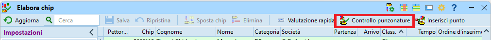
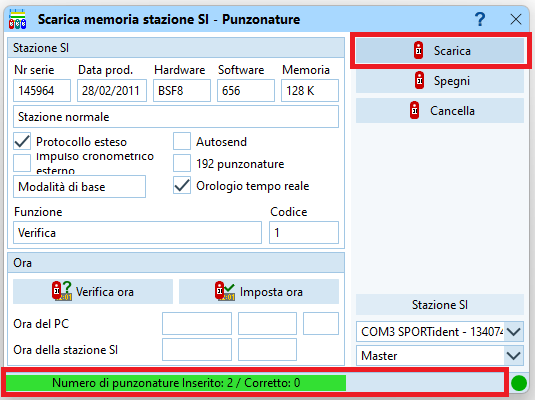

# Gestione di varie casistiche speciali

Questa sezione copre casi speciali che si spera non dover mai utilizzare.  

## Fuori tempo massimo
Se per la gara è stato definito un tempo massimo, controlla il tempo di gara di tutti i concorrenti e cambia lo stato di classifica a `FTMax.` per coloro che hanno impiegato più del tempo limite.

1. Nel menu `Giorno di gara` selezione `Funzioni speciali > Tempo massimo`.  

1. Inserisci il tempo massimo nel campo in basso e premi `Avvia`.  

1. Se ci sono concorrenti fuori tempo massimo, il programma richiede la conferma per non classificarli.  
**Nota**: il messaggio parla di `squalificare` i concorrenti, ma effettivamente il loro stato di classifica viene impostato a `FTMax` e non a `Squal`.  

**Nota**: non esiste una procedura automatizzata per annullare questa azione. Per cambiare lo stato dei concorrenti fuori tempo massimo, modificare i dati in `Giorno di gara > Elabora chip`. Vale la pena ordinare per `Class.` e cercare `FTMax`. 

## Annullamento tratta
L'annullamento di una tratta serve specialmente nelle seguenti situazioni:  

- Per neutralizzare la gara ad esempio durante uno spostamento, come l'attraversamento di una strada/ferrovia, dove non è garantita una parità di trattamento per tutti i concorrenti. In questo caso, posizionare un punto su entrambi i lati della strada/ferrovia e annullare la tratta tra questi due punti.
- Per organizzare gare formate da varie tappe corte (tipo sprint). In questo caso, utilizzare punti normali (non `FINISH` o `START`) come arrivo della prima tappa e come partenza della seconda tappa. Utilizza la scatoletta `FINISH` solo alla fine dell'ultima tappa. Neutralizza il tempo tra la fine di una tappa e la partenza della prossima utilizzando annulla tratta.
**Nota**: tieni conto del numero massimo di timbri (30) su certi chip, compresi quelli utilizzati per simulare il finish e lo start "intermedi".
- Per ignorare le tratte per e da un punto posato male.  
**Nota**: questo utilizzo non è al momento contemplato/ammesso dai regolamenti.  
**Nota**: se il punto da ignorare è il primo o l’ultimo, inserisci 998 per indicare la partenza rispettivamente 999 per indicare l’arrivo.
 

Per definire le tratte da annullare:  

1. Nel menu `Giorno di gara` seleziona `Funzioni speciali > Annulla tratta`.  

1. Aggiungi una tratta premendo sul tasto `+ Nuovo` nel menu in alto.  
**Nota**: se il bottone non è attivo, inserisci il numero di uno dei punti nel campo d'immissione e premi sul bottone `+` alla sua destra. Questo genera la lista di tutte le tratte da e per quel punto. Seleziona le tratte non da annullare e premi sul tasto `- Elimina` in alto.  

1. Inserisci il numero del punto di partenza e d'arrivo della tratta.  
**Nota**: puoi anche annullare la tratta solo per singole categorie. Se la tratta va annullata per più di 5 categorie, crea una seconda riga con la stessa tratta e le categorie aggiuntive.   
**Nota**: puoi aggiungere un limite di tempo per evitare pause troppo prolungate e attese per avversari forti da seguire. Ai concorrenti verrà tolto il tempo effettivo della tratta se ci hanno messo meno del tempo limite, altrimenti il tempo limite.
1. Se sono già stati letti dei chip, ricalcola i tempi premendo su `Tempi di gara` nel menu in alto.  
**Nota**: i tempi sono ricalcolati automaticamente alla chiusura della finestra.
1. Riavvia OL-Einzel su tutti gli altri PC che accedono alla stessa gara.

## Annullamento categoria

OL-Einzel permette l’annullamento di singole categorie.  

1. Nel menu `Classifiche` seleziona `Funzioni speciali > Annulla categorie`.  

1. Seleziona le categorie da annullare.  

Annullando le categorie in questo modo cancella il rango di ogni concorrente, lasciando lo stato di classifica e il tempo di gara invariati.
Probabilmente il sito SOLV riconosce questo formato, ma i programmi per il calcolo della classifica TMO sul sito ASTi e per la generazione delle classifiche TMS non si basano sul campo rango nel file esportato da OL-Einzel.  
È perciò necessario esportare le classifiche con (per il sito SOLV e per RouteGadget) e senza (per il sito ASTi e per il TMS) le categorie coinvolte.  

Per esportare solo le categorie valide:

1. Seleziona `Classifiche > Tempi intermedi > Categorie`.
1. Premi su `Selezione` nella parte bassa della finestra.
1. Deseleziona ogni categoria da escludere.
1. Premi su `Aggiorna` nella parte alta della finestra.
1. Premi `Esporta` come descritto in [esportazione classifiche](classifiche.md#esportazione-classifiche)  
**Nota**: vale la pena aggiungere al nome del file l’indicazione _SENZA_CAT_ANNULLATE

## Eliminazione di un punto
OL-Einzel non gestisce elegantemente il caso dello spegnimento di un punto. Se il problema si presenta all’inizio della gara, e cioè se a tanti concorrenti manca il punto, vale la pena toglierlo dai relativi percorsi.  
**Nota**: ricordati di controllare comunque il timbro sulla cartina a tutti i concorrenti delle rispettive categorie.  
  
Cerca in quale percorso il punto è utilizzato  
  
1. Nel menu `Percorsi` seleziona `Riassunto dei concorrenti > Percorsi/categorie per punto`.  

1. La lista mostra per ogni punto i percorsi e le categorie che contengono quel punto.  
**Nota**: le categorie sono mostrate con il nome lungo, che se importate da OL-Events sono in tedesco.  

1. Annotati le categorie che hanno il punto da eliminare.  
**Nota**: dall'esempio sopra, il punto 31 è utilizzato dai percorsi `H14`, `D14`, `DB` e `HAK`.

Seleziona i nomi dei percorsi interessati e elimina il punto incriminato.  
  
1. Nel menu `Percorsi` seleziona `Modifica > Percorsi`.  

1. Per ogni percorso da modificare:  
    1. Premi sul bottone `...` che appare alla destra della lista dei punti.  
    
    1. La finestra mostra a sinistra i punti del percorso e a destra la lista di tutti i punti.  
    Per eliminare un punto, trascinalo dalla lista di sinistra a quella di destra.  
    {width=30%}
    1. Nella finstra di tutti i percorsi, batti `Enter` per salvare la modifica (o `ESC` per annullare la mutazione).
    1. Se sono già stati letti dei chip appare una finestra che ricorda di ripetere il controllo delle punzonature.  
    
1. Nel menu `Giorno di gara` seleziona `Chip > Elabora chip`.  

1. Nel menu in alto seleziona `Controllo punzonature`.  

1. Salva (su carta o come PDF) la lista di concorrenti modificati.

## Ritardo nelle partenze
In caso di ritardo della partenza per tutti i concorrenti, cambia l’ora zero.  
Questo caso può capitare per colpa dell'organizzatore che non è pronto in tempo, oppure per fattori esterni imprevisti che non permettono ai concorrenti di arrivare in tempo. L'organizzatore può così posticipare la partenza di `TUTTI` i concorrenti.  
**Nota**: per posticipare la partenza solo di concorrenti che partono `dopo` un certo orario, vedi la prossima sezione.

1. Nel menu `Gara` seleziona `Gara > Impostazioni`.  
**Nota**: per eseguire questa funzione è necessario chiudere tutte le finestre.
2. Modifica l’ora zero.  
**Nota**: viene automaticamente aggiornata l’ora di partenza di tutti i concorrenti.  
**Nota**: questa procedura gestisce correttamente anche i concorrenti che partono prima dell'ora zero impostata nella gara, a differenza della funzione `Interruzione delle partenze` descritta nel prossimo capitolo. 

## Interruzione delle partenze
In caso di interruzione delle partenze, ad esempio per problemi nel trasporto dei concorrenti dal centro gara alla partenza, procedi come segue:  

1. Crea una copia di sicurezza nel menu `Gara` voce `Manutenzione > Copia di sicurezza`.
1. Nel menu `Giorno di gara` seleziona `Funzioni speciali > Interruzione delle partenze`.
1. Imposta `Iniziando da` al tempo di partenza del primo concorrente che non è partito al suo orario.  
**Nota**: questo campo non permette orari negativi. Se l'ora zero nelle impostazioni di gara non è impostata come suggerito nella sezione [Creazione gara](creazione_gara.md#creazione-gara_1) a 15-30 minuti prima dell'ora zero effettiva e vi sono concorrenti che partono prima dell'ora zero, questi vanno gestiti a mano.
1. Imposta `Sposta di` alla durata dell’intervallo.
1. Imposta `Luoghi di partenza` alla/e partenza/e interessate dall’interruzione in gare con più partenze.
1. Imposta `Corridoi` a `Tutti`.  
**Nota**: per come descritto in questo documento, i corridoi sono solo dei raggruppamenti di categorie con distacchi uguali (o multipli gli uni degli altri), ma non hanno nulla a che vedere con l’organizzazione della partenza nel bosco.
1. A dipendenza della situazione, imposta `Sposta anche concorrenti già arrivati`.  
**Nota**: Se durante l’interruzione sono comunque partiti alcuni concorrenti, valuta come gestirli anche in relazione al momento in cui esegui questa funzione. Probabilmente dovrai comunque controllare e eventualmente correggere manualmente l’ora di partenza di questi concorrenti.
1. Ricontrolla le impostazioni e premi il bottone `Avvia`.  

1. Controlla il rapporto dei concorrenti modificati e salvane una copia (cartacea o in formato PDF).

## Sfasamento delle partenze
In caso di sfasamento tra l’ora utilizzata alla partenza e l’ora utilizzata per la programmazione dei punti (soprattutto del `finish`), non è possibile cambiare l’ora zero in quanto verrebbero modificati sia gli orari di partenza di tutti i concorrenti, sia tutti i tempi già letti.  
In questo caso bisogna quindi usare la funzione `Interruzione delle partenze`, gestendo a mano tutti i concorrenti partiti prima dell’ora zero impostata nella gara.    
Se i concorrenti sono partiti prima dell’ora corretta, devi specificare un intervallo negativo che però non può precedere l’ora zero (come impostata nella gara), per cui dovrai tenerne conto nell’impostare il campo `Iniziando da`.  

**Esempio 1**: i concorrenti hanno un tempo di gara di 35 secondi troppo alto.

1. Crea una copia di sicurezza nel menu `Gara` voce `Manutenzione > Copia di sicurezza`.
1. Nel menu `Giorno di gara` seleziona `Funzioni speciali > Interruzione delle partenze`.
1. Imposta `Iniziando da` all’ora zero come da impstazioni della gara (vedi `Gara > Impostazioni`).  
**Nota**: si suppone che il problema tocchi tutti i concorrenti.
1. Imposta `Sposta di` a `00:00:35`.
1. Premi `Avvia`.
1. Controlla la lista.
1. Correggi manualmente in `Iscrizioni > Modifica` tutti i concorrenti partiti prima dell’ora zero.  
**Nota**: non dovresti avere questi casi se hai seguito il consiglio di impostare l'ora zero a 15-30 minuti prima della prima partenza "ufficiale" come descritto in [Creazione gara](creazione_gara.md#creazione-gara_1)

**Esempio 2**: i concorrenti hanno un tempo di gara di 35 secondi troppo basso.

1. Crea una copia di sicurezza nel menu `Gara` voce `Manutenzione > Copia di sicurezza`.
1. Nel menu `Giorno di gara` seleziona `Funzioni speciali > Interruzione delle partenze`.
1. Imposta `Iniziando da` all’ora zero della gara **PIÙ** lo sfasamento.   
**Nota**: in caso di ora zero alle `10:00:00`, impostare `Iniziando da` a `10:00:35`.  
**Nota**: si suppone che il problema tocchi tutti i concorrenti.
1. Imposta `Sposta di` a `-00:00:35`.  
**Nota**: nota il segno negativo!
1. Premi `Avvia`.
1. Controlla la lista.
1. Correggi manualmente in `Iscrizioni > Modifica` tutti i concorrenti partiti prima dell’ora impostata in `Iniziando da`

## Lettura scatolette punti

A volte è necessario verificare il passaggio di un concorrente a un punto mediante la lettura della scatoletta del punto.  
**Nota**: alcuni punti importanti:

- I chip "SIAC air" che timbrano senza contatto non lasciano traccia del proprio passaggio nella scatoletta del punto.  
Leggendo i dati della scatoletta non è quindi possibile sapere se un concorrente con una SIAC sia passato dal punto, a meno che abbia timbrato in modalità "a contatto".
- Di base non si leggono le scatolette dei punti per risolvere problemi di concorrenti non classificati per punto mancante, anche per non dare un vantaggio in questo senso a chi utilizza i chip "a contatto". 
- Dall'avvento dei chip SIAC la lettura delle scatolette non è più una procedura usata spesso.   
- È responsabilità del concorrente timbrare mantenendo il chip "a contatto" nella scatoletta fino al segnale luminoso e sonoro, rispettivamente con i chip SIAC verificare che il chip air emetta i segnali luminosi e sonori. 
- Nel 99.9% dei casi, un punto mancante con chip a contatto è dovuto a due motivi: il concorrente non ha timbrato il punto, oppure ha tolto il chip troppo presto, evitando la scrittura del tempo intermedio sul chip. In questi casi sulla scatoletta del punto si trova il timbro del concorrente con un segnale di errore, e il concorrente non va classificato.  
- Per i chip air, i motivi per un punto mancante sono principalmente: il concorrente non ha timbrato il punto, è passato troppo velocemente o troppo distante dal punto (senza verficare i segnali luminosi e sonori), ha sentito i seganli sonori di altri concorrenti, oppure ha la batteria scarica.

!!! Bug "Errore conosciuto di SPORTident"
    Vi è un errore conosciuto che si verifica molto raramente e solo con certi tipi di chip "a contatto", che risulta nella mancanza di più punti (fino a 4) tutti consecutivi. Questo problema è dovuto ad un malfunzionamento di SPORTident e apparentemente non è causato dal comportamento del concorrente. In questi casi la lettura delle scatolette interessate può permettere di ricostruire il passaggio del concorrente ai punti e riammetterlo in classifica.  
    **Nota**: non è stato riportato nessun caso in cui questo problema riguardava un singolo punto mancante.
  
!!! Note "Limitazione della zona di ricerca di un concorrente mancante"
    È capitato ad una gara di non avere più notizie di un concorrente, senza possibilità di rintracciare né lui né suoi compagni di società.  
    Sapendo che il concorrente aveva un chip "a contatto" e per limitare la zona di ricerca nel bosco, sono state lette tutte le scatolette del suo percorso, iniziando dal `finish` per verificare che non avesse terminato la gara senza scaricare il chip.  
    La lettura delle scatolette ha mostrato che l'ultimo punto timbrato era vicino ad una pensione, e in effetti il concorrente è rientrato al suo alloggio nella pensione senza terminare la gara.

La procedura per leggere le scatolette dei punti è la stessa utilizzata per la lettura della scatoletta check descritta nel capitolo sull'inserimento dei [non partiti](casi_normali.md#procedura-tramite-lettura-check).  

1. Chiudi tutte le finestre connesse alla scatoletta di lettura, per esempio `Leggi Chip`
1. Nel menu `Giorno di gara` seleziona `Chip > Elabora stazione SI`  
  
  
1. Seleziona `Leggi`  
  
  
1. Verifica la connessione alla scatoletta di lettura (pallino verde in basso a destra).  
       
      
  
    - Imposta la modalità `Master`
    - Seleziona la porta `COM... SPORTident...`
  
1. Verifica che la scatoletta del punto sia ancora accesa.  
    **Nota**: controlla il display sul retro. Se è spenta, accendila con un chip viola (anche se sul chip è indicato `OFF`).
1. Posiziona la scatoletta del punto sulla scatoletta di lettura usando la barretta (o perlomeno allineando i buchi).
1. Verifica la connessione premendo su `Verifica ora`. Nel pannello vengono mostrati i dati della scatoletta letta.  
**Nota**: in caso di problemi di connessione, prova a premere su punto verde in basso a destra, o seleziona una porta COM diversa.
1. `SENZA` modificare i dati, seleziona `Scarica`.  
  
      
    - Verifica nella barra in basso che il numero di punzonature scaricate corrisponda circa al numero di concorrenti previsti per questo punto.  
    **Nota**: nell'immagine di esempio la scatoletta conteneva unicamente due punzonature.
          
1. Chiudi la finestra (senza spegnere il punto).
1. Nella finestra dell'`Elaborazione stazione SI` appare la lista di timbrature di tutte le scatolette lette.  
  

    - Nell'immagine un esempio dove è stata letta unicamente la scatoletta start-check.  
    Normali punti sono mostrati con il numero nella colonna `Codice` e l'indicazione `Punto` nella colonna `Funzione`. 
    - Timbrature troppo veloci sono segnalate con un tempo ErrA, ErrB, ErrC, ...  
    Per regolamenteo queste vanno considerate come timbrature `mancanti` e il concorrente non va classificato.
    - Se nella tabella risulta un tempo di gara, il concorrente ha timbrato correttamente (ma va controllato il tempo).
    - Se la scatoletta non è stata sincronizzata in extended mode (cancellando tutte le timbratura sulla scatoletta), è possibile trovare più di una timbratura dello stesso concorrente, oppure è possibile che la timbratura trovata sia in realtà quella di un’altra gara. La plausibilità di una timbratura va sempre verificata confrontandola con il tempo di passaggio al punto precedente e al punto successivo, e paragonando i tempi di tratta con quelli di altri concorrenti dello stesso livello.

1. Se viene deciso di classificare il concorrente, modifica il suo tempo intermedio come descritto nel prossimo capitolo.

## Modifica manuale tempi intermedi
Capita (raramente) di dover modificare manualmente un tempo intermedio.  
Vi sono alcuni possibili motivi:  

- Il concorrente risulta con un punto mancante anche se ha correttamente timbrato il punto, come dimostrato dalla lettura della scatoletta (vedi [sopra](#lettura-scatolette-punti)).  
In questo caso bisogna inserire il tempo intermedio mancante e cambiare lo stato di classifica del concorrente.
- Il concorrente ha vinto nonostante abbia timbrato un punto non del suo percorso.  
Questo punto non influisce sulla classifica, ma crea problemi ai grafici del sito SOLV, in quanto a tutti gli altri concorrenti della categoria risulterà un punto mancante.  
È quindi necessario cancellare il tempo intermedio del punto in più.  
**Nota**: questo vale unicamente per i vincitori di categoria, in quanto il sito SOLV determina la sequenza dei punti di ogni categoria in base a quelli timbrati dal vincitore.
- La scatoletta di un punto non era sincronizzata, sballando in tal modo i tempi intermedi di tutti i concorrenti. Per evitare problemi ai grafici del sito SOLV e ai siti di analisi come RouteGadget o LiveLox, è consigliabile determinare la differenza di tempo tra il time master e la scatoletta sfasata, e correggere di conseguenza i tempi di tutti i concorrenti.
  
La plausibilità di una timbratura va sempre verificata, confrontandola con il tempo di passaggio al punto precedente e successivo, e paragonando i tempi di tratta con quelli di altri concorrenti dello stesso livello.

1. Seleziona `Giorno di Gara > Elabora chip`.
1. Seleziona il concorrente nella lista in alto.
1. Seleziona il punto da modificare nel pannello chip.
1. Premi il mouse destro per far apparire un menu con i comandi
    1. `Modifica`: per cambiare il tempo di un punto.
    1. `Inserisci`: per inserire un punto con tempo intermedio dopo il punto selezionato.
    1. `Cancella`: per eliminare il punto selezionato e il suo tempo intermedio
    1. `Aggiungi`: per inserire un punto alla fine della lista  
    
1. Se inserisci un tempo intermedio, verifica che il tempo si trovi tra quello del punto precedente e quello del punto successivo, e verifica che il tempo di tratta per raggiungere il punto corrisponda all’incirca a quello realizzato da altri concorrenti dello stesso livello.  
**Nota**: in questo esempio il tempo dovrà posizionarsi tra le `11:04:48` e le `11:10:04`

