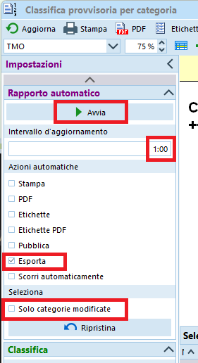
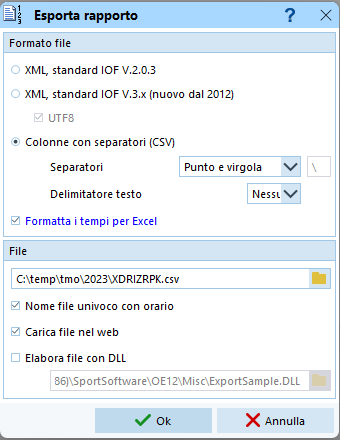
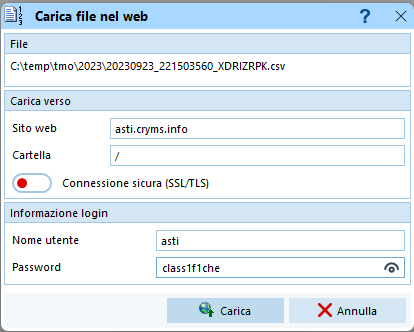

# Generazione e pubblicazione delle classifiche

{width=100px}  
Vedi [PDF della vecchia versione, capitolo 5.9 e 6.1](../../gestione_gara_org/inc/Istruzioni_OL_einzel_per_TMO_v2_4.pdf): 

## Classifiche provvisorie

Le classifiche provvisorie sono classifiche pubblicate durante la gara, quando non tutti i concorrenti sono giunti all'arrivo. Nella testata di ogni categoria vengono indicati il numero di concorrenti arrivati rispetto al numero di concorrenti iscritti (ad es. `(13/18)`).  
Ai TMO, queste classifiche vengono di regola mostrate sulle TV al centro gara e caricate in internet sul sito [O2Rank](https://classifiche.asti-ticino.ch/o2rank). Come alternativa vengono stampate a intervalli regolari e appese al centro gara.
  
1. Nel menu `Classifiche` seleziona `Classifica provvisoria > Categorie`.  

1. Seleziona il rapporto `TMO`.  

1. Nelle `Impostazioni` a sinistra, nella sezione `Classifica`, seleziona  tutti i concorrenti, ma senza i non partiti.  

1. Seleziona le categorie da stampare nel pannello di selezione in basso (di regola tutte).
1. Assicurati che i tempi siano mostrati nel formato `OO:MM:SS`.  
Altrimenti, imposta il formato nel menu `ingranaggio` in alto a destra.
1. In caso di modifiche alle impostazioni, aggiorna le classifiche.

Ci sono varie opzioni sull'utilizzo di queste classifiche.  
  
??? Example "Stampa singola copia"
    1. Seleziona `Stampa` nella barra in alto.  
    
    1. Nel dialogo di stampa   
    
        1. Imposta la stampante.
        1. Imposta il formato della carta A4 verticale.
        1. Imposta `separa pagine`.
        1. Imposta i margini (10 sui 4 lati).
        1. Premi `Stampa`.

??? Example "Stampa automaticamente a intervalli regolari"  
    1. Nelle `Impostazioni` a sinistra, nella sezione `Rapporto automatico`  
    
        1. Imposta l'intervallo di aggiornamento a `20:00` o `30:00` minuti.
        1. Imposta `Stampa` come azione automatica.
        1. Seleziona `Solo categorie modificate`.
        1. Premi su `Avvia`.
    1. Nel dialogo di stampa (appare solo alla prima stampa)   
    
        1. Imposta la stampante.
        1. Imposta il formato della carta A4 verticale.
        1. Imposta `separa pagine`.
        1. Imposta i margini (10 sui 4 lati).
        1. Premi `Stampa`.
    1. **Non chiudere la finestra**.  
    Chiudendo la finestra, la stampa automatica si interrompe e alla prossima apertura bisogna ristampare tutte le categorie.  

??? Example "Pubblica in internet su O2Rank a intervalli regolari"  
    1. Recupera il token FTP della gara da `O2Rank`  
        
        1. Se non hai ancora una gara su `O2Rank`, creala seguendo le istruzioni in [Software > O2Rank > Creazione gara](../o2rank/creazione_gara.md)    
        1. Accedi a `O2Rank` su [classifiche.asti-ticino.ch/o2rank](http://classifiche.asti-ticino.ch/o2rank)
        1. Seleziona `Login` in alto a destra e accedi come amministratore  
        (utente `co@asti-ticino.ch`, password `class1f1che`)
        1. Seleziona `edit` sulla destra della tua gara
        1. Copia il token cliccando su `Copy to clipboard`  
        

    1. Nella finestra della classifica in OE12, nelle `Impostazioni` a sinistra, nella sezione `Rapporto automatico`  
    
        1. Imposta l'intervallo di aggiornamento a `1:00` minuto.
        1. Imposta `Esporta` come azione automatica.
        1. **Non selezionare** `Solo categorie modificate`.
        1. Premi su `Avvia`. 

    1. Nel dialogo di esportazione (appare solo la prima volta)  
    
        - Imposta `Colonne con separatori (CSV)`.
        1. Imposta separatore `Punto e virgola`.
        1. Imposta delimitatore testo `Nessuno`.
        1. Seleziona `Formatta i tempi per Excel`.
        1. Esporta il file nella cartella `C:\Temp\tmo\<anno>`).
        1. Imposta il nome del file a `<FTP-Token>.csv`.  
            - Es. `C:\Temp\tmo\2023\XDRIZRPK.csv`
        1. Imposta `Nome file univoco con orario`.
        1. Imposta `Carica file nel web`.
        1. Non impostare `Elabora file con DLL`.

    1. Nel dialogo `Carica file nel web` imposta i campi  
      

        - Sito web `asti.cryms.info`
        1. Cartella `/`
        1. Non attivare la connessione sicura SSL/TLS
        1. Nome utente `asti`
        1. Password `class1f2che`

    1. Attendi uno-due minuti e verifica le classifiche in internet (sito [classifiche.asti-ticino.ch/o2rank](http://classifiche.asti-ticino.ch/o2rank))

## Classifiche finali
Stampa le classifiche finali quando tutti i concorrenti sono arrivati, hai fatto tutte le verifiche necessarie e hai corretto gli stati di non classifica.  
Questa classifica serve quasi unicamente per la premiazione.
  
1. Nel menu `Classifiche`, seleziona `Classifiche Ufficiali > Categorie`.

1. Seleziona il rapporto `TMO`.  

1. Nelle `Impostazioni` a sinistra, nella sezione `Classifica`, seleziona  tutti i concorrenti, ma senza i non partiti.  

1. Seleziona le categorie da stampare nel pannello di selezione in basso (di regola tutte).
1. Assicurati che i tempi siano mostrati nel formato `OO:MM:SS`.  
Altrimenti, imposta il formato nel menu `ingranaggio` in alto a destra.
1. In caso di modifiche alle impostazioni, aggiorna le classifiche.

1. Seleziona `Stampa` nella barra in alto.  

1. Nel dialogo di stampa   

    1. Imposta la stampante.
    1. Imposta il formato della carta A4 verticale.
    1. Imposta `separa pagine`.
    1. Imposta i margini (10 sui 4 lati).
    1. Premi `Stampa`.

## Classifiche TMS

## Pubblicazione SOLV

## Classifiche ASTi

