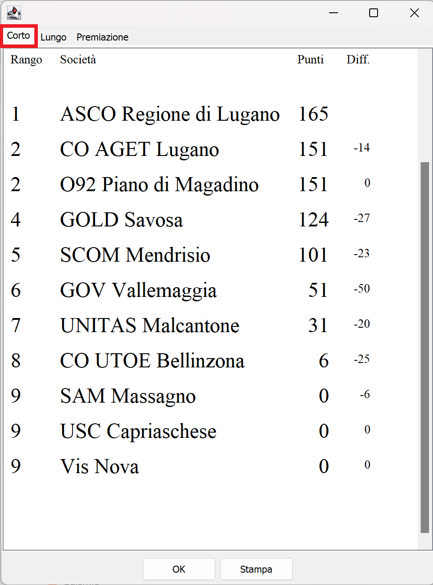
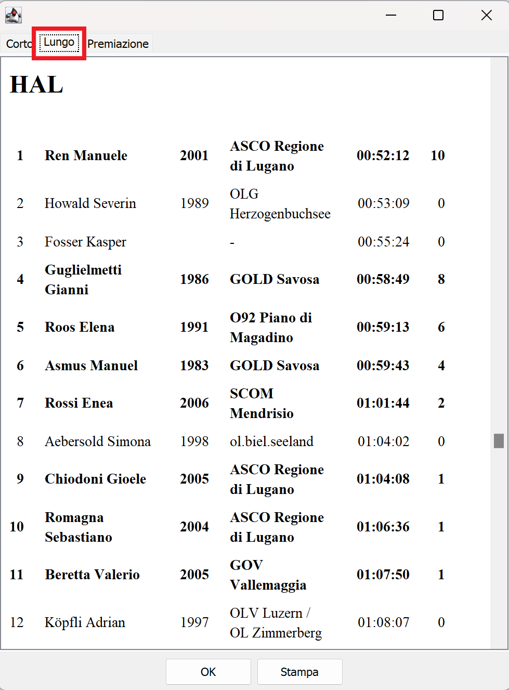
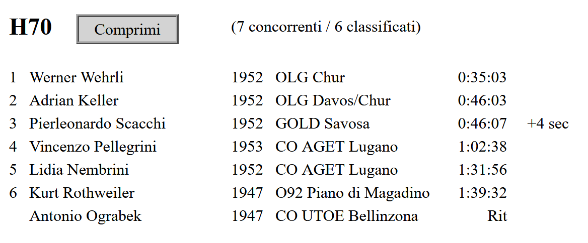

# Generazione e pubblicazione delle classifiche

## Classifiche TV / online

Le classifiche per le TV mostrate al centro gara dei TMO e le classifiche online pubblicate sul sito [O2Rank](http://classifiche.asti-ticino.ch/o2rank) aggiornate in tempo reale sono ottenute tramite un'unica classifica esportata a intervalli regolari. Questa classifica viene pubblicate durante la gara, quando non tutti i concorrenti sono giunti all'arrivo.  
In caso di problemi con la rete internet o con le TV, come alternativa le classifiche vengono stampate a intervalli regolari e appese al centro gara. La relativa procedura è descritta [più sotto](#classifiche-provvisorie).  
**Nota**: il sito o2rank supporta sia le classifiche provvisorie che quelle con tempi intermedi. La procedura descritta è la stessa, ma caricando i tempi intermedi è possibile visualizzare i grafici, per contro i file saranno più grandi sollecitando maggiormente la rete.
  
1. Nel menu `Classifiche` seleziona `Tempi intermedi > Categorie`.  

1. Nelle `Impostazioni` a sinistra, nella sezione `Classifica`, seleziona  tutti i concorrenti, ma senza i non partiti.  

1. Seleziona le categorie da stampare nel pannello di selezione in basso (di regola tutte).
1. Assicurati che i tempi siano mostrati nel formato `OO:MM:SS`.  
Altrimenti, imposta il formato nel menu `ingranaggio` in alto a destra.
1. In caso di modifiche alle impostazioni, aggiorna le classifiche.

1. Recupera il token FTP della gara da `O2Rank`.  
    1. Se non hai ancora una gara su `O2Rank`, creala seguendo le istruzioni in [Software > O2Rank > Creazione gara](../o2rank/creazione_gara.md)    
    1. Accedi a `O2Rank` su [classifiche.asti-ticino.ch/o2rank](http://classifiche.asti-ticino.ch/o2rank)
    1. Seleziona `Login` in alto a destra e accedi come amministratore  
    (utente `co@asti-ticino.ch`, password `class1f1che`)
    1. Seleziona `edit` sulla destra della tua gara
    1. Copia il `Ftp Token` cliccando su `Copy to clipboard`  
    

1. Nella finestra della classifica in OE12, nelle `Impostazioni` a sinistra, nella sezione `Rapporto automatico`  

    1. Imposta l'intervallo di aggiornamento a `1:00` minuto.
    1. Imposta `Esporta` come azione automatica.
    1. **Nota**: se stai esportando le classifiche provvisorie, **non** impostare l'opzione `Solo categorie modificate`.
    1. Premi su `Avvia`. 

1. Nel dialogo di esportazione (appare solo la prima volta)  

    1. Imposta `Colonne con separatori (CSV)`.
    1. Imposta separatore `Punto e virgola`.
    1. Imposta delimitatore testo `Nessuno`.
    1. Seleziona `Formatta i tempi per Excel`.
    1. Esporta il file nella cartella `C:\Temp\tmo\<anno>`).
    1. Imposta il nome del file a `<FTP-Token>.csv`.  
        - Es. `C:\Temp\tmo\2023\XDRIZRPK.csv`
    1. Imposta `Nome file univoco con orario`.
    1. Imposta `Carica file nel web`.
    1. Non impostare `Elabora file con DLL`.
    1. Premi `Ok`.

1. Nel dialogo `Carica file nel web`    
  

    1. Imposta il sito web `classifiche.asti-ticino.ch`
    1. Imposta la cartella `/`
    1. Non attivare la connessione sicura SSL/TLS
    1. Imposta il nome utente `asti`
    1. Imposta la password `class1f1che`
    1. Premi `Carica`.

1. Attendi uno-due minuti e verifica le classifiche in internet (sito [classifiche.asti-ticino.ch/o2rank](http://classifiche.asti-ticino.ch/o2rank))

## Classifiche provvisorie

Le classifiche provvisorie sono classifiche pubblicate durante la gara, quando non tutti i concorrenti sono giunti all'arrivo. Nella testata di ogni categoria vengono indicati il numero di concorrenti arrivati rispetto al numero di concorrenti iscritti (ad es. `(13/18)`).  
Ai TMO, queste classifiche vengono di regola mostrate sulle TV al centro gara e caricate in internet sul sito [O2Rank](https://classifiche.asti-ticino.ch/o2rank).  
Come alternativa in caso di problemi con le TV vengono stampate a intervalli regolari e appese al centro gara.
    
1. Nel menu `Classifiche` seleziona `Classifica provvisoria > Categorie`.  

1. Nel menu a tendina in alto, seleziona `TMO` come modello del rapporto.  

1. Nelle `Impostazioni` a sinistra, nella sezione `Classifica`, seleziona  tutti i concorrenti, ma senza i non partiti.  

1. Seleziona le categorie da stampare nel pannello di selezione in basso (di regola tutte).
1. Assicurati che i tempi siano mostrati nel formato `OO:MM:SS`.  
Altrimenti, imposta il formato nel menu `ingranaggio` in alto a destra.
1. In caso di modifiche alle impostazioni, aggiorna le classifiche.

Scegli se stampare una singola copia o se stampare automaticamente a intervalli regolari.   

- Stampa a intervalli regolari
    1. Nelle `Impostazioni` a sinistra, nella sezione `Rapporto automatico`  
    
        1. Imposta l'intervallo di aggiornamento a `20:00` o `30:00` minuti.
        1. Imposta `Stampa` come azione automatica.
        1. Seleziona `Solo categorie modificate`.
        1. Premi su `Avvia`.
    1. Nel dialogo di stampa (appare solo alla prima stampa)   
    
        1. Imposta la stampante.
        1. Imposta il formato della carta A4 verticale.
        1. Imposta `separa pagine`.
        1. Imposta i margini (10 sui 4 lati).
        1. Premi `Stampa`.
    1. **Non chiudere la finestra**.  
    Chiudendo la finestra, la stampa automatica si interrompe e alla prossima apertura bisogna ristampare tutte le categorie.  

- Stampa singola copia
    1. Seleziona `Stampa` nella barra in alto.  
    
    1. Nel dialogo di stampa   
    
        1. Imposta la stampante.
        1. Imposta il formato della carta A4 verticale.
        1. Imposta `separa pagine`.
        1. Imposta i margini (10 sui 4 lati).
        1. Premi `Stampa`.

## Classifiche finali
Per le classifiche finali, assicurati che tutti i concorrenti sono arrivati, hai fatto tutte le verifiche necessarie (anche i [partiti in anticipo](casi_normali.md#verifica-orari-partenze)) e hai corretto gli stati di non classifica.  
  
Verifica se ti serve veramente la stampa di questa classifica. Storicamente serviva quasi esclusivamente come copia data ai giornalisti e per la premiazione. Attualmente, i giornalisti accedono alle classifiche online e la premiazione viene fatta con la classifica sul tablet (vedi la sezione [TMS](#classifiche-tms)).
  
1. Nel menu `Classifiche`, seleziona `Classifiche Ufficiali > Categorie`.

1. Seleziona il rapporto `TMO`.  

1. Nelle `Impostazioni` a sinistra, nella sezione `Classifica`, seleziona  tutti i concorrenti, ma senza i non partiti.  

1. Seleziona le categorie da stampare nel pannello di selezione in basso (di regola tutte).
1. Assicurati che i tempi siano mostrati nel formato `OO:MM:SS`.  
Altrimenti, imposta il formato nel menu `ingranaggio` in alto a destra.
1. In caso di modifiche alle impostazioni, aggiorna le classifiche.

1. Seleziona `Stampa` nella barra in alto.  

1. Nel dialogo di stampa   

    1. Imposta la stampante.
    1. Imposta il formato della carta A4 verticale.
    1. Imposta `separa pagine`.
    1. Imposta i margini (10 sui 4 lati).
    1. Premi `Stampa`.

## Esportazione classifiche
Esporta le classifiche in file CSV da utilizzare per le classifiche TMS, per il sito SOLV (Swiss Orienteering), per il sito ASTi (classifiche annuali), per RouteGadget e per Livelox.  

1. Assicurati di aver controllato i concorrenti [partiti in anticipo](casi_normali.md#verifica-orari-partenze).
1. Nel menu `Classifiche`, seleziona `Tempi intermedi > Categorie`.  

1. Nelle `Impostazioni` a sinistra, nella sezione `Classifica`, seleziona  tutti i concorrenti, ma senza i non partiti.  

1. Seleziona le categorie da esportare nel pannello di selezione in basso (di regola tutte).
1. Seleziona `Esporta`.  

1. Nel dialogo di esportazione  

    - Imposta `Colonne con separatori (CSV)`.
    1. Imposta separatore `Punto e virgola`.
    1. Imposta delimitatore testo `Nessuno`.
    1. Seleziona `Formatta i tempi per Excel`.
    1. Imposta il nome e la cartella di destinazione del file.
    1. Imposta il nome del file nel formato `classificaTMO_AANN_SOCIETA_LUOGO_XX` analogamente a quanto fatto per la cartella della gara (in [Creazione gara](creazione_gara.md)), dove  
    `AA` è l'anno a due cifre  
    `NN`è il numero della gara a due cifre  
    `SOCIETA` è la sigla della società  
    `LUOGO` è il posto della gara  
    `_XX` è un suffisso opzionale per gare speciali (ad es. _CTCO)  
        
            Esempi:  
            classificaTMO_2301_GOLD_Novaggio  
            per il primo TMO del 2023 a Novaggio organizzato dal GOLD  
                
            classificaTMO_2309_GOV_Cimalmotto_CTCO  
            per i campionati ticinesi, nono TMO del 2023  
            organizzato dal GOV a Cimalmotto  
        
        Per gare speciali usa `classificaGARA_AA`, es. `classificaStaffettaSele_23` per la gara del 2023.  
        
        Questo file va poi mandato ai responsabili delle classifiche SOLV, TMO, TMS e RouteGadget/Livelox, per cui riconoscere dal nome del file di che gara si tratta è un bell'aiuto.  

    1. Non impostare `Nome file univoco con orario`.
    1. Non impostare `Carica file nel web`.
    1. Non impostare `Elabora file con DLL`.
    1. Premi `Ok`.

## Classifiche TMS / Premiazione
Crea e stampa la classifica per il Trofeo Miglior Società ticinese (TMS).  

1. Lancia il programma TMS (doppio click sull'icona sul desktop del PC server ASTi)
1. Appare la finestra con le istruzioni su come esportare i dati da OL-Einzel.  
Premi `OK`.  
**Nota**: ignora la versione di OL-Einzel...  

1. Nella finestra delle impostazioni, seleziona il file esportato in [Esportazione classifiche](#esportazione-classifiche).
**Nota**: i campi Gara, Luogo e Data sono utilizzati nell'intestazione della classifica.  

1. Appare una finestra con tre tab: una con la classifica TMS, l'altra con la classifica di tutte le categorie e i punti assegnati ad ogni concorrente, e una con la classifica per la premiazione.   
{width=48%} {width=48%}  
**Nota**: la classifica per la premiazione ha elementi dinamici che non funzionano in questa app. Ad esempio vengono mostrati sempre tutti i concorrenti, e i bottoni `Espandi` non funzionano.
Basta aprire il file generato in un browser per vedere la pagina correttamente.
{width=48%}  
1. Se usi il tablet per la premiazione:
    1. Il programma ha copiato automaticamente il file sul server della documentazione.
    1. Sul tablet, apri il web browser `Edge` (l'icona si trova sul desktop).
    1. Dalla barra dei link salvati, seleziona `Premiazione`.
    1. Assicurati che il file sia quello della gara attuale e non quello della gara precedente preso dalla cache del browser (controlla i dettagli in cima alla pagina).  
    1. La classifica mostra le categorie nell'ordine usato solitamente per la premiazione (es. OK, D10, H10, D12, H12, .... DAL, HAL) seguite dalla classifica TMS.
    1. Vengono mostrati alcuni commenti a fianco dei concorrenti per permettere qualche commento supplementare a chi legge le classifiche.
        1. Indicazione a livello di categoria se ci sono tanti non-classificati.  
        
        1. Parimerito  
        
        1. Distacchi minimi tra i concorrenti sul podio.  
        
        1. Distacco minimo tra il terzo e il quarto posto (*giù dal podio per un soffio*).  
        
        1. Se sul podio ci sono solo concorrenti non ticinesi, viene mostrato anche il primo ticinese.  
        
    1. Ogni categoria ha un bottone `Espandi` per vedere la classifica completa, rispettivamente `Comprimi` per tornare alla visualizzazione minima del podio.  
      

1. Se non usi il tablet per la premiazione, ma la versione stampata su carta:
    1. Seleziona il tab `Corto`.
    1. Premi `Stampa`.  
    **Nota**: assicurati di selezionare la stampante A4.

!!! Note "Nota"
    Il programma genera tre file HTML nella cartella in cui si trova il file CSV delle classifiche.  
    I quattro file vanno spediti al responsabile delle classifiche TMS (vedi [Classifiche ASTi](#classifiche-asti)).

## Pubblicazione SOLV
Pubblica la classifica sul sito della federazione svizzera (Swiss Orienteering / SOLV).

1. Caricare il file CSV in internet, all’indirizzo [Classifiche sul sito SOLV](https://www.o-l.ch/cgi-bin/results).  
**Nota**: questa è la normale pagina usata per accedere alle classifiche.
1. Accedi al formulario per il caricamento delle classifiche cliccando sul link `Webformula` nella seziona per gli organizzatori (`Veranstalter`).  

1. Seleziona la gara e premi `Weiter`.  
**Nota**: sono selezionabili solo le gare più recenti.  

1. Riempi i campi del formulario e poi premi `Abschicken`.  

    ??? Image "Immagine d'esempio di un formulario riempito"
        

    - Nel campo `Ranglisten-File` seleziona il file delle classifiche esportato in [Esportazione classifiche](#esportazione-classifiche).
    - Nel campo `Nullzeit` imposta l'ora zero come impostata nella gara (vedi `Gara > Impostazioni`).
    - Il testo nel campo `Hinweistext` appare in cima alla classifica di ogni categoria. Questo è utile per comunicare ad esempio delle decisioni della giuria.
    - Nel campo `format` seleziona `OE12/OE2010/OLEinzel (CSV)`.
    - Se la gara aveva percorsi individuali (ad es. farfalle) e la sequenza dei punti non era la stessa per tutti i concorrenti di una categoria, seleziona `Postennr. anhand SiegerIn`.  
    **Nota**: imposta questa opzione anche se i percorsi individuali concernono poche o una sola categoria.  
    **Nota**: i grafici dei tempi intermedi saranno adattati alla sequenza dei punti del vincitore.  
    - Nel campo `Eingabe durch: SOLV-Nr:` immetti il tuo numero SOLV.
    - Il testo nel campo `Bemerkung` è visibile solo ai gestori del sito SOLV.  
    **Nota**: puoi caricare la classifica più volte, ad esempio dopo una correzione. Tuttavia, puoi pubblicare autonomamente solo la prima versione. Dalla seconda classifica in poi devono intervenire i webmaster, per cui questo campo è utile per spiegare loro il motivo del caricamento supplementare.

1. La prossima finestra mostra un breve testo e un link per testare le classifiche.  
    1. Verifica la correttezza di varie categorie, soprattutto quelle dove ci stti dei problemi.  
    1. Visualizza i tempi intermedi e i grafici di alcuni concorrenti, se possibile usando i dati di qualche concorrente presente che può giudicare se il grafico potrebbe corrispondere alla sua gara.
    1. Se tutto è ok, conferma cliccando su `Freischalten` e immettendo il tuo numero SOLV.

## Classifiche ASTi
Per l’allestimento e pubblicazione delle classifiche annuali TMO, SprintCup e TMS, come pure per il controllo dei punti del TMS, spedire i file ai responsabili ASTi.

1. Spedire per e-mail i seguenti file all'indirizzo [co.classifiche@asti-ticino.ch](mailto://co.classifiche@asti-ticino.ch).  
    - Il file delle classifiche esportato in [Esportazione classifiche](#esportazione-classifiche).
    - I due file TMS generati in [Classifiche TMS](#classifiche-tms).
    - Il file dei percorsi OCAD importato in [Creazione gara](creazione_gara.md).
    - Il file OCAD della cartina.
