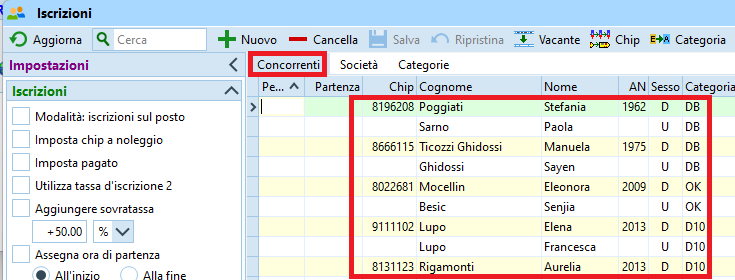

# Creazione Gara

Esistono varie opzioni per la creazione della gara in OL-Einzel v.12 (OE12) a dipendenza del portale d'iscrizione o della tipologia di gara.

- Importazione dati dal portale d'iscrizione OL-Events
- Creazione da gara modello
- Creazione completamente manuale

Nelle sezioni seguenti molte istruzioni sono in comune alle tre tipologie. In caso di differenze, queste sono chiaramente marcate e descritte in sezioni separate. Espandi la relativa sezione per accedere alle istruzioni specifiche. 

## Controllo delle cartelle

Controlla le impostazioni delle cartelle dell'applicazione (non dovrebbero cambiare...):  

1. Sulla finestra principale, seleziona `cartelle dell'applicazione` dal menu delle impostazioni in alto a destra.  
  
  
1. Imposta le cartelle e la configurazione standard di SportSoftware.  
  
  
1. Conferma premendo `OK`  

## Creazione gara

Segui le istruzioni a dipendenza della tipologia di gara:

??? Example "Utilizzo di OL-Events"
    
    1. Seleziona `Gara > Nuovo`  
      
    
    1. Seleziona `Gara singola`  
      
    
    1. Riempi la scheda della nuova gara  
        
        1. La denominazione della gara è il testo che appare sulle stampe, ad esempio `1. TMO GOLD Novaggio`  
        
        1. Imposta la cartella di gara nel formato `TMO_AANN_SOCIETA_LUOGO_XX`  
        dove  
        `AA` è l'anno a due cifre  
        `NN`è il numero della gara a due cifre  
        `SOCIETA` è la sigla della società  
        `LUOGO` è il posto della gara  
        `_XX` è un suffisso opzionale per gare speciali (ad es. _CTCO)  
          
        Esempi:  
        `TMO_2301_GOLD_Novaggio` per il primo TMO del 2023 a Novaggio organizzato dal GOLD  
          
        `TMO_2309_GOV_Cimalmotto_CTCO` per i campionati ticinesi, nono TMO del 2023 organizzato dal GOV a Cimalmotto  
          
        Per gare speciali usa `GARA_AA`, es. `StaffettaSele_23` per la gara del 2023
        
        1. Seleziona `Standard` come tipo di gara  
        1. Imposta la data e l'ora zero. 
        Per l'ora zero imposta un orario anticipato di 15-30 minuti rispetto alle prime partenze, per permettere la partenza di alcuni concorrenti (es. collaboratori) prima dell'ora zero ufficiale.  
        1. Seleziona `SPORTident` come sistema chip

??? Example "Creazione con gara modello" 
    
    1. Seleziona `Gara > Copia`.  
    Se il comando non è attivo, seleziona prima una gara a caso con `Gara > Seleziona`  
      
    1. Scegli `Gara modello per TMO` o `Gata Modello per SpintCup`come gara d'origine.
      
    1. Imposta `Crea nuova gara`  
      
    1. La denominazione della gara è il testo che appare sulle stampe, ad esempio `1. TMO GOLD Novaggio`  
      
    1. Imposta la cartella seguendo le regole descritte sopra per le gare con OL-Events (formato `TMO_AANN_SOCIETA_LUOGO_XX`)  
      
    1. Seleziona `Tutto` nelle opzioni

    1. Premi `Avvia`, `OK` e `Chiudi`

??? Example "Creazione completamente manuale"
    Seguire le istruzioni in `Utilizzo di OL-Events`

## Controllo del sistema chip

Per evitare continue richieste di verifica da parte del programma, controlla subito le impostazioni del sistema chip.  

1. Seleziona `Gara > Impostazioni`
1. Clicca sul bottone `Sistema chip`  
  
1. Verifica le impostazioni di SPORTident.  
  
    1. Verifica data e ora
    1. Imposta la precisione del cronometraggio a SECONDI `OO:MM:SS`
    1. Imposta l'uso della scatoletta all'arrivo ma non alla partenza.
    1. Imposta la modalità di lettura del tempo dal chip
    1. Seleziona una durata di gara inferiore alle 12 ore.
    1. Conferma con `OK`
1. Chiudi la finestra con `OK`

## Impostazione categorie {#categorie}

??? Example "Utilizzo di OL-Events"
    Le categorie vengono importate da OL-Events.  
    *Nota*: è possibile eseguire questo passo più volte.

    1. Recupera il Bearer Token da OL-Events  
         
        1. Accedi a [ol-events](https://portal.ol-events.ch) come amministratore della gara
          
        1. Nel menu a sinistra, sotto `organizzatore` seleziona `Le mie gare`
          
        1. Seleziona la tua gara
          
        1. Nel menu `Gestione gara` seleziona `Esportazioni`  
         
           
        1. Dalla schermata `Scambio di dati` copia il Bearer Token  
        
      
    1. Connetti OE12 alla gara in OL-Events
        1. Nella finestra principale di OE-12, seleziona `OL-Events` nel menu `Web`  
          
          
        1. Nel menu specifico di OL-Events, seleziona `Impostazioni` 
        
          
        1. Incolla il Bearer Token di OL-Events nel campo `Token` e premi il bottone `Cerca`.   
        Appaiono le impostazioni della gara come definite in OL-Events. Attualmente queste informazioni sono di controllo per assicurarsi di aver collegato OE12 alla gara corretta in OL-Events, ma i dati non vengono ripresi da OE12.  
        
          
    1. Importa le categorie da OL-Events
        
        1. Nel menu `Web > OL-Events` seleziona `Scarica > Categorie`  
          
          
        1. Verifica che la gara sia quella corretta e premi `Scarica`  
        
          
        1. Conferma di scaricare le categorie  
          
          
        1. Verifica il numero di categorie e che non ci siano errori.  
          
          
        1. Chiudi la finestra di verifica.
          
    1. Verifica le categorie
        1. Nella finestra principale di OE12, nel menu `Iscrizioni` seleziona `Modifica > Iscrizioni`  
          
          
        1. Seleziona il tab `Categorie` e verifica i dati.  
        In OL-Events il nome lungo delle categorie è in tedesco. In OE12 usiamo unicamente la versione corta.  
        

??? Example "Creazione con gara modello" 
    Creando la gara dalla gara modello imposta già in automatico le categorie del tipo di gara selezionato (TMO o SprintCup)

??? Example "Creazione completamente manuale"
    Inserendo le categorie manualmente, assicurati di mantenere i nomi e le ID come definite dal SOLV e le tasse d'iscrizione come definite nel [RECO](https://www.asti-ticino.ch/co/index.php?folder=ctco&main=reco).  

        1. Nella finestra principale di OE12, nel menu `Iscrizioni` seleziona `Modifica > Iscrizioni`  
          
          
        1. Seleziona il tab `Categorie`.  

        1. Clicca il bottone `+ Nuovo` e inserisci tutte le categorie.  
        *Nota*: per gare TMO mantieni il numero e la denominazione corta come definite dal SOLV e la tassa d'iscrizione come specificato nel RECO (vedi immagine).  
        I campi `Età` e `Sesso` non vengono usati.  
        

## Importazione iscrizioni

??? Example "Utilizzo di OL-Events"
    Le iscrizioni vengono importate da OL-Events.  
    *Nota*: è possibile eseguire questi passi più volte già prima della chiusura delle iscrizioni.

    1. Si suppone che OE12 sia già connesso alla gara corretta in OL-Events come descritto [sopra](#categorie).  
      
    1. Nel menu `Web > OL-Events` seleziona `Scarica > Iscrizioni`  
      
      
    1. Verifica che la gara collegata sia quella corretta e imposta `Cancella e ricrea` per i concorrenti e per le società.  
    Importa i blocchi di partenza ma non i tempi di partenza.  
      
      
    1. Conferma di scaricare le iscrizioni  
      
      
    1. Verifica che non ci siano messaggi di errore.  
    *Nota*: è normale che alcuni campi del file XML vengano ignorati.  
      
      
    1. Verifica le iscrizioni selezionando `Modifica > Iscrizioni` nel menu `Iscrizioni`.  
              

??? Example "Creazione con gara modello" 
    da fare

??? Example "Creazione completamente manuale"
    da fare

