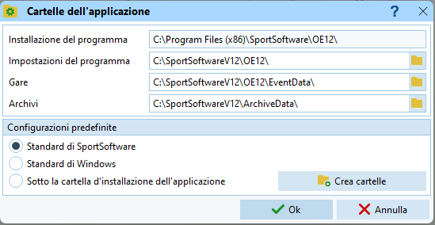

# Creazione Gara

Esistono varie opzioni per la creazione della gara in OL-Einzel v.12 (OE12) a dipendenza del portale d'iscrizione o della tipologia di gara.

- Importazione dati dal portale d'iscrizione OL-Events
- Creazione da gara modello
- Creazione completamente manuale

Nelle sezioni seguenti molte istruzioni sono in comune alle tre tipologie. In caso di differenze, queste sono chiaramente marcate e descritte in sezioni separate. Espandi la relativa sezione per accedere alle istruzioni specifiche. 

## Controllo delle impostazioni delle cartelle {#cartelle}

Controlla le impostazioni delle cartelle dell'applicazione (non dovrebbero cambiare...):  

1. Sulla finestra principale, seleziona `cartelle dell'applicazione` dal menu delle impostazioni in alto a destra.  
  
  
1. Imposta le cartelle e la configurazione standard di SportSoftware.  
  
  
1. Conferma premendo `OK`  

## Creazione gara

Segui le istruzioni a dipendenza della tipologia di gara:

??? Info "Utilizzo di OL-Events"
    
    1. Seleziona `Gara > Nuovo`  
      
    
    1. Seleziona `Gara singola`  
      
    
    1. Riempi la scheda della nuova gara  
        
        1. La denominazione della gara è il testo che appare sulle stampe, ad esempio `1. TMO GOLD Novaggio`  
        
        1. Imposta la cartella di gara nel formato `TMO_**##_SOCIETA_LUOGO_XX`  
        dove  
        `**` è l'anno a due cifre  
        `##`è il numero della gara a due cifre  
        `SOCIETA` è la sigla della società  
        `LUOGO` è il posto della gara  
        `_XX` è un suffisso opzionale per gare speciali (ad es. _CTCO)  
          
        Esempi:  
        `TMO_2301_GOLD_Novaggio` per il primo TMO del 2023 a Novaggio organizzato dal GOLD  
          
        `TMO_2309_GOV_Cimalmotto_CTCO` per i campionati ticinesi, nono TMO del 2023 organizzato dal GOV a Cimalmotto  
          
        Per gare speciali usa `GARA_**`, es. `StaffettaSele_23` per la gara del 2023
        
        1. Seleziona `Standard` come tipo di gara  
        1. Imposta la data e l'ora zero. 
        Per l'ora zero imposta un orario anticipato di 15-30 minuti rispetto alle prime partenze, per permettere la partenza di alcuni concorrenti (es. collaboratori) prima dell'ora zero ufficiale.  
        1. Seleziona `SPORTident` come sistema chip

??? Info "Creazione con gara modello" 
    
    1. Seleziona `Gara > Copia`.  
    Se il comando non è attivo, seleziona prima una gara a caso con `Gara > Seleziona`  
      
    1. Scegli `Gara modello per TMO` come gara d'origine  
      
    1. Imposta `Crea nuova gara`  
      
    1. La denominazione della gara è il testo che appare sulle stampe, ad esempio `1. TMO GOLD Novaggio`  
      
    1. Imposta la cartella seguendo le regole descritte sopra per le gare con OL-Events (formato `TMO_AANN_SOCIETA_LUOGO_XX`)  
      
    1. Seleziona `Tutto` nelle opzioni

    1. Premi `Avvia`, `OK` e `Chiudi`

??? Info "Creazione completamente manuale"
    Seguire le istruzioni in `Utilizzo di OL-Events`

## Controlla le impostazioni del sistema chip

Per evitare continue richieste di verifica da parte del programma, controlla subito le impostazioni del sistema chip.  

1. Seleziona `Gara > Impostazioni`
1. Clicca sul bottone `Sistema chip`  
  
1. Verifica le impostazioni di SPORTident.  
  
    1. Verifica data e ora
    1. Imposta la precisione del cronometraggio a SECONDI `OO:MM:SS`
    1. Imposta l'uso della scatoletta all'arrivo ma non alla partenza.
    1. Imposta la modalità di lettura del tempo dal chip
    1. Seleziona una durata di gara inferiore alle 12 ore.
    1. Conferma con `OK`
1. Chiudi la finestra con `OK`

## Con portale d'iscrizione OL-Events {#ol-events}

Creare una gara "vuota" e importare categorie e concorrenti direttamente da OL-Einzel
## Con gara modello {#gara-modello}

## Completamente manuale {#manuale}

