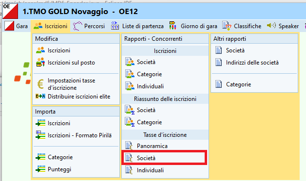
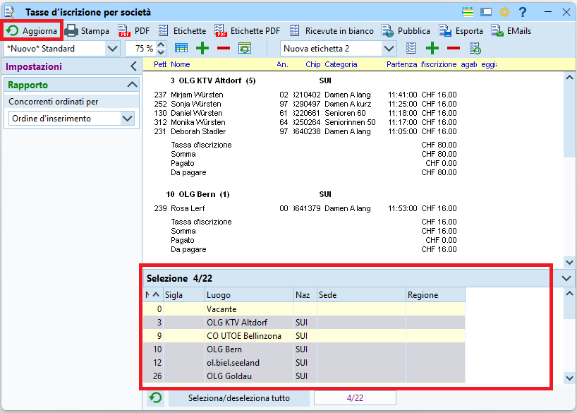
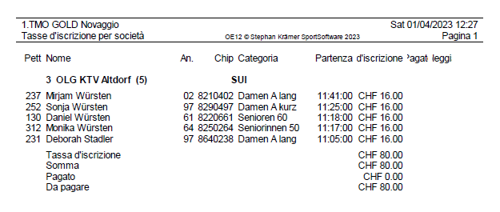
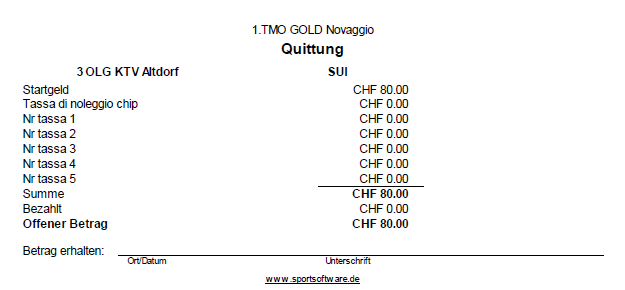
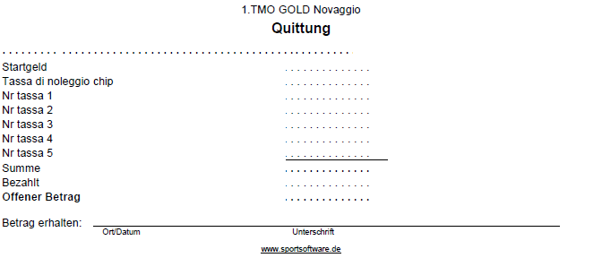

# Gestione Finanziaria

Per contenere i costi del servizio del portale d'iscrizioni OL-Events, i pagamenti delle tasse d'iscrizione non vengono gestite dal portale.  
Dopo la gara l'organizzatore spedisce il dettaglio delle iscrizioni (quindi incluse le iscrizioni sul posto) con la fattura a tutte le società ticinesi. 
   
La procedura d'incasso per le società non ticinesi non è specificata: possibili opzioni sono ad esempio il pagamento all'info il giorno di gara o la fattura come le società ticinesi.  
Per l'incasso all'info il giorno di gara, stampa i dettagli per le società non ticinesi già il giorno prima della gara:  
  
1. Nel menu `Iscrizioni`seleziona `Iscrizioni > Modifica`
1. Seleziona il tab `Categorie`
  
    - Controlla che le tasse d'iscrizione sorrispondano alle disposizioni del [RECO - Tariffario](https://www.asti-ticino.ch/co/index.php?folder=ctco&main=reco)
    - Le tasse d'iscrizioni 2 non vengono usate, come pure la sovratassa di 5.- impostabile nel pannello delle impostazioni.  
    Il RECO prescrive infatti che la sovratassa  
      
        - Non si applica alle categorie OK, HB e DB
        - Viene pagata dai concorrenti stessi e **NON** viene fatturata alle società
        - Durante le iscrizioni sul posto e le mutazioni, presta attenzione alla gestione corretta dei campi `Tassa d'iscrizione` e del flag `Pagato`.  
        Vale la pena incassare all'info la parte non fatturabile alla società, e inserire nelle iscrizioni solamente la parte da fatturare alla società con il flag `Pagato` non settato. Questo permette la corretta creazione delle fatture dopo la gara.
        - Fai capo al RECO per le regole sulla corretta gestione delle sovratasse (es. noleggio chip)

1. Seleziona il tab `Concorrenti`
1. Controlla e eventualmente correggi il flag `Pagato` e le tasse d'iscrizione dei giovani.  
  
    - **Nota:** OL-Events e OL-Einzel hanno tasse di iscrizione per categoria, mentre da noi vige la tassa di iscrizione secondo l’età. Ordina i concorrenti per categoria e verifica nelle categorie HAL, HAM, HAK, HB, H18, DA, DAK, DB, D18 che non ci siano giovani di meno di 20 rispettivamente 16 anni, che abbiano una tassa di iscrizione troppo alta.  
    - **Nota:** Nelle categorie HB e DB, in caso di partecipazione in gruppo, per la tassa d’iscrizione fa stato l’età del concorrente più anziano.

1. Nel menu `Iscrizioni` seleziona `Tasse d'iscrizione > Società`  
  
  
1. Nella finestra che appare  
  
  
    1. Seleziona le società interessate nel pannello `Selezione` in basso
    1. Aggiorna la lista premendo `Aggiorna` nell'angolo in alto a sinistra della finestra (il bottone `Aggiorna` nel pannello in basso aggiorna unicamente la lista delle società per la selezione)  

1. Ci sono tre alternative per la stampa

    1. Seleziona il modello `*Nuovo* Standard`e premi `Stampa`  
    **Nota:** imposta `Separa pagine` per avere fogli separati da consegnare firmati come ricevuta alle società.    
        
        Le fatture generate hanno il seguente formato:  
          

    1. Come alternativa è possibile stampare le ricevute scegliendo il modello in tedesco o inglese e premendo `Etichette`  
    **Nota:** l'ammontare pagato è impostato a zero, ma firmando la riga in basso si dichiara la fattura pagata.  
    **Nota:** la ricevuta contiene unicamente i totali, senza il dettaglio dei concorrenti iscritti per la società.  
    **Nota:** nella finestra di stampa viene chiesto quante ricevute stampare per pagina. Il modello ne prevede 3 per pagina.  
      
        Le ricevute generate hanno il seguente formato:  
          

    1. Scegliendo `Ricevute in bianco` si possono stampare delle ricevute senza importi, da riempire a mano all'info.  
    Tuttavia, il layout non è dei migliori, e comunque per stampare dei moduli vuoti non è necessario utilizzare OL-Einzel...  
         
         Le ricevute in bianco hanno il seguente formato:  
         
