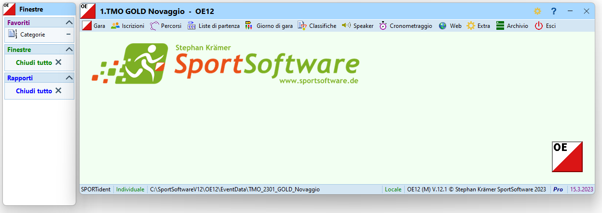
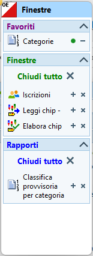
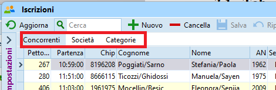
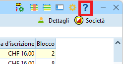
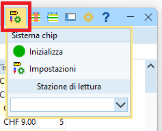
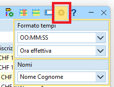
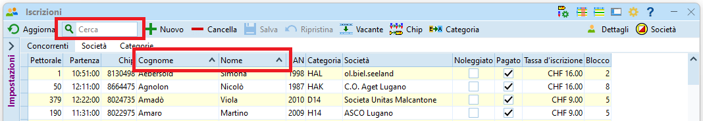
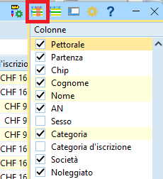
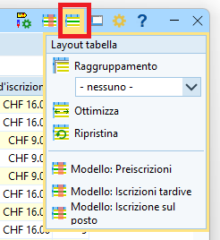

# Interfaccia grafica di OE12

**QUESTA PAGINA È ANCORA DA FARE**  
{width=100px}

Questo capitolo descrive alcune caratteristiche comuni a molte finestre nel programma. Molte sono di uso comune in quanto presenti anche in altre applicazioni, ma vengono riportate per sottolineare la differenza rispetto alla versione precedente.

## Multifinestre

OE12 è un sistema a più finestre. Di base si aprono due finestre, una con la lista di finestre aperte e una con il menu principale.  

Selezionando le voci nei vari menu della finestra principale apre finestre supplementari. Queste finestre sono aggiunte alla lista delle finestre aperte da dove è possibile accedere direttamente alla finestra desiderata.  
  

**Nota**: alle singole finestre manca la possibilità di ridimensionamento veloce a schermo intero.  

## Tab

Alcune finestre coprono varie funzionalità mediante l'uso di `tab`, invero non sempre facilmente riconoscibili come tali.  

## Impostazioni delle finestre

Praticamente ogni finestra offre un aiuto contestuale (in inglese) premendo sul punto di domanda in alto a destra.  
  
  
Le finestre che possono interagire con un'unità di lettura chip hanno un menu per l'impostazione della connessione alla scatoletta connessa via una porta seriale USB.  
  
  
Il menu con l'icona dell'ingranaggio offre opzioni per il formato dei tempi (precisi al secondo, al decimo, ecc.), ma ha un impatto unicamente sulla finestra selezionata. L'impostazione importante per la definizione della precisione del cronometraggio è quella in `Gara > Impostazioni > Sistema chip`.  
In questo menu si trova anche l'opzione per definire l'ordine tra nome e cognome.  

## Personalizzazione delle tabelle

Si possono adattare le tabelle alle proprie esigenze spostando le varie colonne tramite trascinamento sul loro titolo (drag&drop), e ordinandole rispetto ad una singola colonna premendo sul relativo titolo.  
**Nota**: il campo della ricerca cerca sempre solo nella colonna attualmente utilizzata per l'ordinamento.  
  
  
L'icona con una tabella stilizzata e una colonna marcata in rosso, in alto a sinistra sulla barra del titolo, permette di selezionare le colonne da mostrare. La lista permette anche, tramite trascinamento, di cambiare la posizione delle colonne nella tabella.
  
  
L'icona con la tabella e la riga in blu permette di impostare vari layout predefiniti, normalmente non utili per i fini dei TMO.  
In alcuni casi, tuttavia, questo menu nasconde delle impostazioni utili, come per il raggruppamento per categoria nella finestra delle iscrizioni.  
  

## Inpostazioni
{==
Le impostazioni si trovano generalmente in una parte che si nasconde sul bordo sinistro della relativa finestra.

Normalmente il pannello delle opzioni nasconde i dati su cui si sta lavorando. Premendo sulla
"puntina" in alto a destra del pannello questo resta fisso ed è così possibile lavorare coi dati e
le opzioni simultaneamente
==}
{width=100px}

## Pannello supplementare
{==
Alcune finestre hanno un pannello supplementare nella parte bassa. Simile al pannello delle
opzioni, anche questo pannello nasconde di regola i dati, ma ha la puntina per fissarlo in
modalità "sempre visibile".

La funzionalità di questo pannello varia a seconda della finestra in cui si trova.
Ad esempio nel dialogo delle iscrizioni questo pannello mostra l'archivio SOLV, mentre nelle
liste di partenza e nelle classifiche permette di selezionare le categorie da elaborare.
==}
{width=100px}

## Rapporti e etichette

{width=100px}
