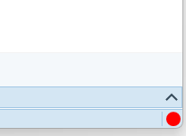
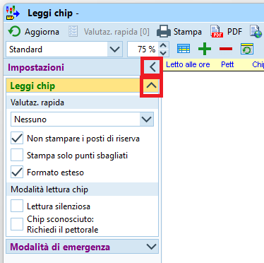
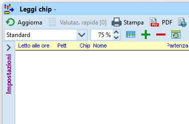
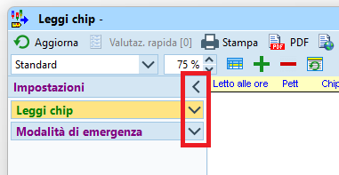
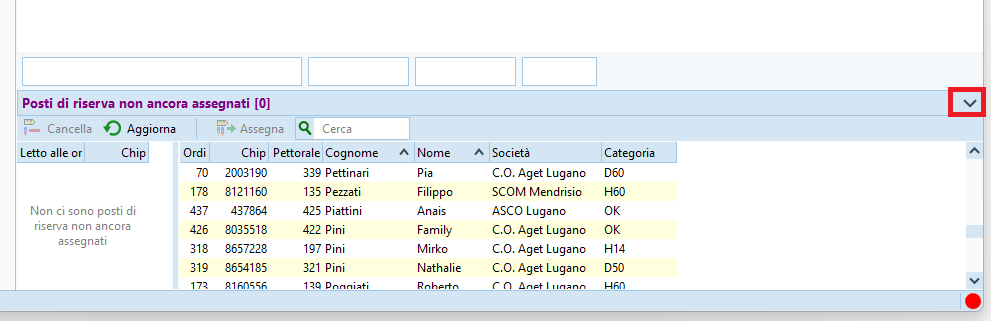
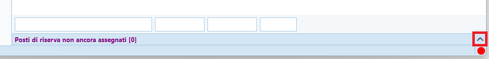

# Interfaccia grafica di OE12

Questo capitolo descrive alcune caratteristiche comuni a molte finestre nel programma. Molte sono di uso comune in quanto presenti anche in altre applicazioni, ma vengono riportate per sottolineare la differenza rispetto alla versione precedente.

## Multifinestre

OE12 è un sistema a più finestre. Di base si aprono due finestre, una con la lista di finestre aperte e una con il menu principale.  

Selezionando le voci nei vari menu della finestra principale apre finestre supplementari. Queste finestre sono aggiunte alla lista delle finestre aperte da dove è possibile accedere direttamente alla finestra desiderata.  
  

- Il tastino `+` vicino ad ogni finestra la marca come favorita e la aggiunge alla relativa lista in cima alla finestra. Premendo su una finestra `favorita` la apre direttamente, senza bisogno di accederci via menu.
- Il tastino `x` chiude la finestra.

**Nota**: alle singole finestre manca la possibilità di ridimensionamento veloce a schermo intero.  

## Tab

Alcune finestre coprono varie funzionalità mediante l'uso di `tab`, invero non sempre facilmente riconoscibili come tali.  

## Impostazioni delle finestre

### Aiuto contestuale

Praticamente ogni finestra offre un aiuto contestuale (in inglese) premendo sul punto di domanda in alto a destra.  
  
  
### Sistema chip

Le finestre che possono interagire con un'unità di lettura chip hanno un menu per l'impostazione della connessione alla scatoletta connessa via una porta seriale USB e un indicatore dello stato della connessione nell'angolo in basso a destra della finestra.  
  
  
  
Se lo stato in basso a destra non è verde, assicurati che non ci siano altre finestre collegate alla stazione di lettura e eventualmente chiudile.  
  
- Seleziona la porta COM usata dalla scatoletta di lettura (es. `COM3 SPORTident - xxx`)
- Premi su `Inizializza` per aggiornare lo stato della connessione.
- Le `Impostazioni` sono quelle definite durante la creazione della gara e non dovrebbero avere un impatto sulla finestra in questione
  
### Impostazioni varie 

Il menu con l'icona dell'ingranaggio offre opzioni per il formato dei tempi (precisi al secondo, al decimo, ecc.), ma ha un impatto unicamente sulla finestra selezionata. L'impostazione importante per la definizione della precisione del cronometraggio è quella in `Gara > Impostazioni > Sistema chip`.  
  
In questo menu si trova anche l'opzione per definire l'ordine tra nome e cognome.  
La scelta è libera tra `Nome Cognome` e `Cognome Nome`, ma non utilizzare la versione con la virgola in quanto può creare problemi con alcuni sistemi esterni.  

## Personalizzazione delle tabelle

### Ordinamento e posizione colonne

Si possono adattare le tabelle alle proprie esigenze spostando le varie colonne tramite trascinamento sul loro titolo (drag&drop), e ordinandole rispetto ad una singola colonna premendo sul relativo titolo.  
**Nota**: il campo della ricerca cerca sempre solo nella colonna attualmente utilizzata per l'ordinamento.  
  
  
### Selezione delle colonne

L'icona con una tabella stilizzata e una colonna marcata in rosso, in alto a sinistra sulla barra del titolo, permette di selezionare le colonne da mostrare. La lista permette anche, tramite trascinamento, di cambiare la posizione delle colonne nella tabella.  
  
  
### Selezione layout

L'icona con la tabella e la riga in blu permette di impostare vari layout predefiniti, normalmente non utili per i fini dei TMO.  
In alcuni casi, tuttavia, questo menu nasconde delle impostazioni utili, come per il raggruppamento per categoria nella finestra delle iscrizioni.  
  

## Impostazioni

Le impostazioni si trovano generalmente in una parte che si nasconde sul bordo sinistro della relativa finestra.  
Premi sulla freccetta per nascondere o mostrare il pannello delle opzioni.  
   
  
A volte le opzioni sono raggruppate in sezioni all'interno del pannello, e possono a loro volta essere visibili o nascoste.   

## Pannello supplementare

Alcune finestre hanno un pannello supplementare nella parte bassa. Simile al pannello delle
opzioni, anche questo presenta i bottoni con le freccette per mostrare o nascondere il pannello stesso.

La funzionalità di questo pannello varia a seconda della finestra in cui si trova.
Ad esempio nel dialogo delle iscrizioni questo pannello mostra l'archivio SOLV, mentre nelle
liste di partenza e nelle classifiche permette di selezionare le categorie da elaborare.
Nell'esempio, la finestra della lettura chip con il pannello supplementare con i posti di riserva.  
  
*Pannello visibile*  
  
  
*Pannello nascosto*  
  

<!--
## Rapporti e etichette

{width=100px}
-->