# Iscrizioni tardive

Questa sezione descrive le iscrizioni tardive e le mutazioni effettuate dopo l'importazione delle iscrizioni ma prima della creazione delle liste di partenza.  
Per le mutazioni dopo la creazione delle liste di partenza, vedi [Mutazioni il giorno di gara](mutazioni_giorno_gara.md).  
 
!!! Warning "Attenzione"
    In OE12 è cambiata la gestione degli indirizzi, importante per l'inserimento del domicilio.  
    Anche l'importazione di società dall'archivio come pure la creazione di nuove società è cambiato.

**Nota**: sebbene OL-Einzel abbia una funzionalità chiamata `Iscrizioni sul posto`, usiamo sempre solo la funzionalità generica di `Iscrizioni`.  
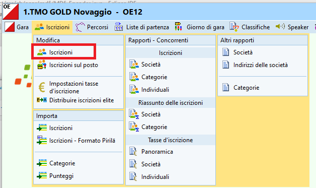 
  
**Nota**: aprendo la finestra delle iscrizioni appare sempre il seguente **avvertimento errato**, al quale è importante rispondere sempre `No`.  
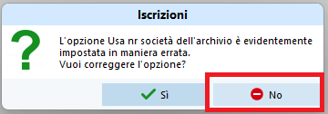
 
## Controllo impostazioni

Controlla le impostazioni e configura la finestra delle iscrizioni  

1. Nel menu `Iscrizioni` seleziona `Modifica > Iscrizioni`
1. Controlla le impostazioni come da immagine  
    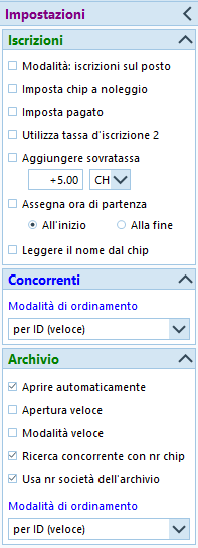   

    1. Nota su `Utilizza tassa d'iscrizione 2` e `Aggiungere sovratassa`  
    Secondo le disposizioni del [Tariffario del RECO](https://www.asti-ticino.ch/co/index.php?folder=ctco&main=reco), la sovratassa per le mutazioni (nome e/o categoria) e le iscrizioni tardive o sul posto ammonta a 5.- Fr., escluse le categorie HB, DB e OK.  
    Tuttavia, il RECO specifica pure che *il supplemento per le iscrizioni sul posto [...] non può essere aggiunto sulla fattura alle società*.  
    Quindi, per poter generare in OE12 delle fatture corrette dopo la gara, almeno per i concorrenti di società ticinesi la tassa d'iscrizione deve rimanere quella normale, e il supplemento va incassato separatamente dal concorrente, ad esempio il giorno di gara.  
    Dal punto di vista delle impostazioni, le due opzioni in questione non vengono perciò utilizzate e non vanno selezionate.  
      
    1. Nota sulle impostazioni dell'archivio  
    Le impostazioni mostrate permettono la ripresa di tutti i dati di un concorrente inserendo unicamente il suo numero chip.  
    È tuttavia importante che `TUTTE` le impostazioni archivio siano come indicate nell'immagine.
    
1. Ottimizza la tabella  
Vedi [Personalizzazione delle tabelle](../interfaccia_grafica/#personalizzazione-delle-tabelle) per dettagli sulla gestione dell'interfaccia grafica.  

    1. Seleziona le colonne rilevanti   
    **Nota**: puoi selezionare le colonne premendo sull'icona `colonne` in alto a destra.  
    
   
    1. Ordina le colonne  
    **Nota**: puoi spostare le colonne semplicemente trascinando l'intestazione delle varie colonne e ridimensionarle trascinando il bordo di separazione tra due intestazioni.
      
    1. È consigliato l'utilizzo delle seguenti colonne  
    **Nota**: disattiva le colonne `Pettorale` e `Partenza`, in quanto se visualizzati diventano campi obbligatori.  
        1. Ordine d'inserimento  
        Questo campo è utile unicamente durante le iscrizioni tardive. Una volta generate le liste di partenza e assegnati i pettorali, vale la pena nascondere questa colonna per evitare errori confondendolo con il pettorale.
        1. Chip
        1. Noleggiato
        1. Categoria
        1. Cognome
        1. Nome
        1. Anno
        1. Società
        1. Indirizzo
        1. Tassa d'iscrizione
        1. Pagato
        1. Blocco  
        **Nota**: Attiva la colonna `Blocco` per poter tenere in giusta considerazione i desideri di partenza. 
          
## Iscrizione nuovo concorrente
Non avendo ancora creato le liste di partenza, basta aggiungere nuovi concorrenti.
  
1. Nel menu `Iscrizioni` seleziona `Modifica > Iscrizioni`
1. Ordina la tabella per `Ordine di inserimento`  
Questo mantiene i dati dei concorrenti iscritti in fondo alla tabella, permettendo un maggior controllo sui dati inseriti.
1. Seleziona `+ Nuovo`  
Viene aggiunta una riga in fondo alla tabella, in modalità `modifica`
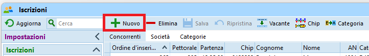  
1. Inserisci il numero del chip e premi `TAB` (il tasto tabulatore per spostarti sul prossimo campo).  
Il programma cerca il numero chip nell'archivio. 
    1. Se il chip viene trovato nell'archivio, vengono automaticamente ripresi i dati del concorrente.  
    Controlla comunque sempre che il nome del concorrente, la società e il domicilio corrispondano ed eventualmente correggi.
    1. Se il chip non è presente nell'archivio, il programma reclama.  
    Prova a cercare il concorrente nell'archivio per nome.  
    **Nota**: riprendendo i dati di un concorrente dall'archivio vengono mantenuti molti più dati di quelli inseriti manualmente nella tabella, come per esempio l'ID della banca dati SOLV. È quindi buona pratica cercare prima nell'archivio in modo da importare anche i dati supplementari.   
    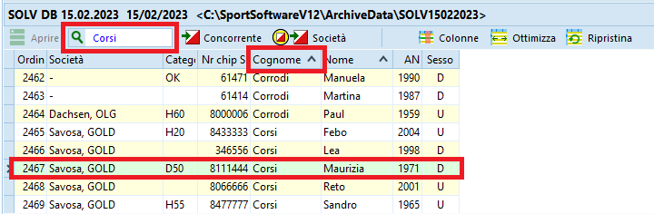  
        1. Apri l'archivio premendo sul pannello in basso
        1. Ordina per `Cognome`
        1. Cerca inserendo il cognome nel campo di ricerca
        1. Doppio click sul concorrente, e tutti i suoi dati verranno ripresi in quello che stai inserendo.   
        **Nota**: in alternativa al doppio click puoi anche selezionare il bottone `Concorrente` in alto a destra del campo di ricerca.
    1. Se il concorrente non è presente nell'archivio bisogna inserire tutti i dati manualmente.  
    Inserisci i campi
        1. `Cognome`, `Nome` e `AN` (anno di nascita)  
        **Nota**: per concorrenti che corrono in coppia, inserire i cognomi e i nomi separandoli con `+` (ad es. `Heidi + Peter`). Il RECO infatti richiede che si riconosca chiaramente chi corre in coppia, dato che non valgono per le classifiche annuali del TMO.   
        **Nota**: non ci sono direttive riguardo a quale anno di nascita usare, ma per la tassa d'iscrizione fa stato il concorrente più anziano.  
        1. Il campo `Indirizzo` non è editabile. Per le liste di partenza e le classifiche sul sito SOLV serve unicamente il domicilio.
        Premere su `Dettagli` in alto a destra per mostrare la sezione `Indirizzo` sulla destra con i singoli campi editabili.  
        **Nota**: il campo `Indirizzo` nella tabella verrà aggiornato con i nuovi valori solo quando salvi l'iscrizione.  
        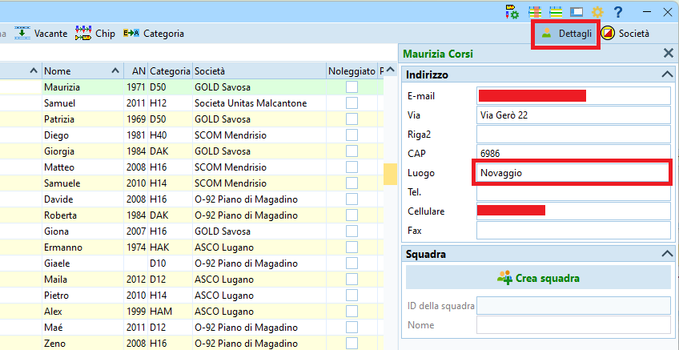  
1. Seleziona la `categoria`
1. Seleziona la `società`  
La tendina contiene le società già presenti nella gara.  
    1. Seleziona la società del concorrente se è presente nella tendina
    1. Se la società non è ancora presente nella gara (quindi nella tendina di selezione delle società)  
    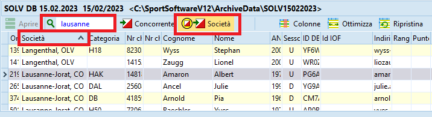  
        1. Apri l'archivio premendo sul pannello in basso
        1. Ordina per `Società`
        1. Cerca inserendo il nome della società (di solito il comune e non la sigla)
        1. Seleziona il primo concorrente della società
        1. Premi `Inserisci nuova società dall'archivio`
        1. Assegna la società al concorrente che stai iscrivendo
    1. Se la società non è presente nell'archivio  
    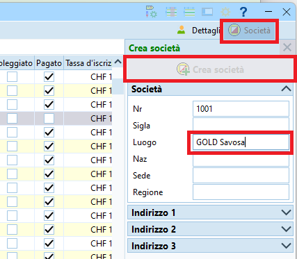  
        1. Premi su `Società` in alto a destra per mostrare la sezione `Società` sulla destra
        1. Premi su `Crea società`
        1. Inserisci nel campo `Luogo` tutto il nome della società, lasciando quindi vuoto il campo `Sigla`.  
        1. Lascia il numero di società generato automaticamente  
        **Nota**: il campo `Società` nella tabella verrà aggiornato con la nuova società solo quando salvi l'iscrizione.  
1. Imposta il campo `Noleggiato` se il chip è stato noleggiato.  
Alla lettura chip apparirà un relativo messaggio, permettendo il ritiro del chip.  
**Nota**: utilizza la barra spaziatrice per selezionare e deselezionare il campo.
1. Controlla la `Tassa d'iscrizione` e imposta il campo `Pagato`.  
**Nota**: secondo il RECO la sovratassa di 5.- Franchi per le iscrizioni tardive va pagata dal concorrente e non è permesso fatturare la sovratassa alle società ticinesi. Quindi per i concorrenti ticinesi la tassa d'iscrizione deve corrispondere a quella normale usata per le iscrizioni e la sovratassa va gestita manualmente. Per i concorrenti di società non ticinesi, è possibile invece aggiungere la sovratassa direttamente nel campo `tassa d'iscrizione` in modo da ottenere poi delle fatture corrette da spedire o da presentare ai concorrenti il giorno di gara.  
**Nota**: se un concorrente paga una parte (ad esempio il noleggio chip oppure la sovratassa), inserisci nel campo della tassa solo la quota ancora da pagare e non
selezionare il campo `Pagato`. In questo modo la fattura che verrà inviata alla società sarà corretta. La contabilità delle sovratasse va invece gestita separatamente e esternamente a OE.
1. Inserisci l’eventuale preferenza di partenza nel campo `blocco`.  
Imposta i valori come definiti in [Allestimento delle liste di partenza](../liste_partenza/#crea_liste_partenza)
1. Salva l'iscrizione premendo `Enter` o premendo sull'icona del dischetto in alto a sinistra.  
**Nota**: Premi `Esc` per annullare le modifiche / l'inserimento del nuovo concorrente.

## Disiscrizione di un concorrente
Concorrenti che all’ultimo momento si disicrivono vanno semplicemente cancellati.  

1. Nel menu `Iscrizioni` seleziona `Modifica > Iscrizioni`
1. Ordina la tabella per `Cognome`  
1. Inserisci il cognome nel campo di ricerca e premi enter per trovare l'iscrizione.
1. Seleziona la riga del concorrente da cancellare
1. Premi su `- Elimina`  
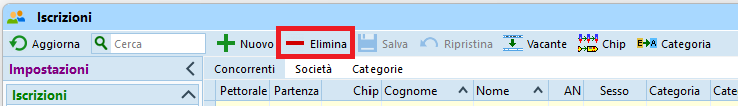  
1. Conferma la cancellazione  
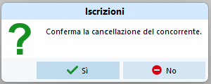  

## Iscrizione come sostituzione di un concorrente assente
La ricerca nell'archivio di un numero chip funziona solamente per le iscrizioni nuove oppure sostituendo un vacante.  
I dati di un concorrente iscritto via archivio o via un portale d'iscrizione sono molti, alcuni non visibili nella tabella delle iscrizioni, ma esportati nelle liste di partenza e classifiche per il sito SOLV. È quindi necessario assicurarsi di cancellare tutti i dati del concorrente precedente.  

1. Trova il concorrente assente (analogamente alla ricerca in [Disiscrizione](#disiscrizione-di-un-concorrente))
1. Trasformalo in `Vacante` per cancellare tutti i suoi dati  
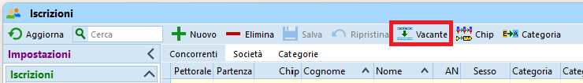  
1. Sostituisci il vacante con i dati del nuovo concorrente, cercandolo prima nell'archivio e eventualmente inserendo i dati manualmente come per una [nuova iscrizione](#iscrizione-nuovo-concorrente).

Alternativamente puoi  

1. Cancellare il concorrente assente (vedi sopra [Disiscrizione di un concorrente](#disiscrizione-di-un-concorrente))
1. Inserire il nuovo concorrente (vedi sopra [Iscrizione nuovo concorrente](#iscrizione-nuovo-concorrente)).

## Scambio di due concorrenti
Non avendo ancora sorteggiato la lista di partenza, lo scambio di due concorrenti si risolve semplicemente nella mutazione delle rispettive categorie e/o numero chip.

## Desideri di partenza
Puoi tener conto dei desideri di partenza anche prima di creare le liste di partenza, impostando il campo `Blocco` di ogni concorrente, assegnando i valori come definiti in [Allestimento delle liste di partenza](../liste_partenza/#crea_liste_partenza).  
  
## Cambio di categoria
Non avendo ancora sorteggiato la lista di partenza e non avendo ancora stampato le cartine, il cambio di categoria si risolve semplicemente con la mutazione del campo `Categoria`.

## Aggiunta o cambio del numero chip
Il numero chip va semplicemente aggiunto o, se già presente, modificato. Questo non farà scattare una ricerca del concorrente nell'archivio, e quindi non c'è il pericolo di sovrascrivere i dati del concorrente con dati dall'archivio.