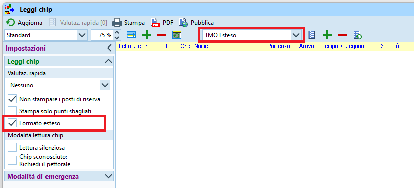

# Lettura Chip

{width=100px}  
Vedi [PDF della vecchia versione, capitolo 5.4](../../gestione_gara_org/inc/Istruzioni_OL_einzel_per_TMO_v2_4.pdf): 

Impostare il formato esteso e selezionare il modello `TMO Esteso` per i foglietti degli intertempi con la classifica attuale e il distacco dai migliori in ogni tratta.  
   
  
