# Lettura Chip

!!! Warning "Nuovo formato intertempi"
    Impostare il formato esteso e selezionare il modello `TMO Esteso` per i foglietti degli intertempi con la classifica attuale e il distacco dai migliori in ogni tratta.  
      
        
    Foglietto con formato esteso  
    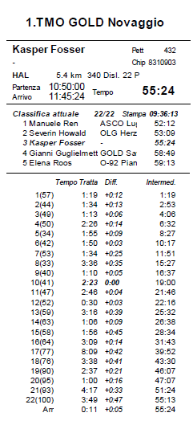  

## Impostazioni
Imposta le opzioni per la lettura chip.  

1. Nel menu `Giorno di gara`, seleziona `Chip > Leggi chip`.  
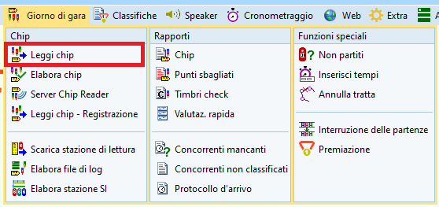
1. Nel dialogo per la selezione della stampante, controlla
    1. Nome stampante: deve essere la stampantina dei tempi intermedi con il numero corrispondente alla stampantina assegnata al PC.
    1. Formato carta: per le stampantine, la larghezza è 72mm (la lunghezza è 286mm anche se si tratta di rotoli “infiniti”).
    1. Impostazioni etichette: `TMO Esteso` (questo campo non è modificabile)
    1. Righe e colonne: `1` e `1`  
    1. Margini: `10` in basso, `0` gli altri.  
    **Nota**: se all'apertura della finestra non appare il dialogo della stampante, imposta `Automatico` nelle opzioni di valutazione rapida sulla sinistra.
1. Verifica o correggi le impostazioni sulla sinistra.  
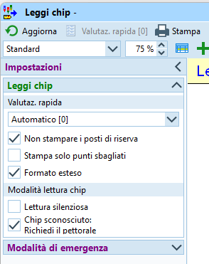
    1. Imposta valutazione rapida a `Automatico` per attivare la stampa automatica dei tempi intermedi ad ogni lettura chip.
    1. Imposta `Non stampare i posti di riserva`.  
    **Nota**: i posti di riserva sono per i chip sconosciuti, non assegnati ad un concorrente. Stampando il biglietto sembrerebbe tutto a posto, non sapendo poi però a chi appartenevano quei tempi. 
    1. Non impostare `Stampa solo punti sbagliati`. Stampiamo i foglietti anche per chi ha trovato tutti i punti...
    1. Imposta `Formato esteso`. Questo formato stampa sul foglietto la classifica dei primi 5 concorrenti della categoria (al momento della lettura...) come pure il distacco dal miglior tempo di ogni tratta.  
    Senza il `Formato esteso`, i foglietti conterranno unicamente i tempi intermedi di tratta e di gara.
    1. Non impostare `Lettura silenziosa`.
    1. Imposta `Chip sconosciuto: Richiedi il pettorale` se alla lettura del chip i concorrenti hanno un pettorale oppure se hanno la cartina con l'etichetta personalizzata e il numero di pettorale. In caso di chip sconosciuto appare una finestra in cui inserire il pettorale e assegnare immediatamente il chip al concorrente.  
    Se invece i concorrenti non hanno il pettorale o non si presentano necessariamente con la cartina, è più semplice non impostare questo campo e gestire i chip sconosciuti tramite le riserve.
1. Imposta il formato del foglietto a `TMO Esteso` o `TMO` a dipendenza dell'impostazione del formato esteso nelle impostazioni.  
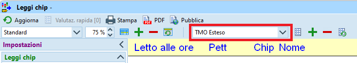
1. Verifica che la stazione di lettura sia pronta (luce verde in basso a destra).  
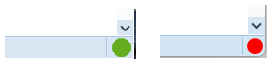  
Se invece è rossa
    1. Assicurati che la stazione di lettura sia collegata al PC e riconosciuta dal programma.  
    **Nota**: nel menu `Sistema chip` in basso appare il nome della scatoletta o una selezione di scatolette (in caso se ne attacchino più di una al PC).  
    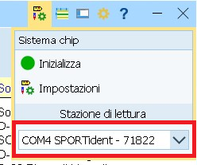
    1. Prova a inizializzare la stazione di lettura premendo sul bottone rosso in basso a destra (sperando che diventi verde). 
    1. Prova a visualizzare le impostazioni nel menu `Sistema Chip > Inizializza`.  
    **Nota**: normalmente basta aprire e richiudere il dialogo, senza bisogno di modificare i valori.   
    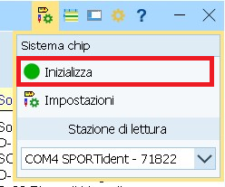  

## Controllo punti posati
Il giorno della gara, i posatori posano e accendono le scatolette ai punti utilizzando il loro chip, che non è registrato nella gara attuale. Al rientro al centro gara, è consigliabile leggere il loro chip e controllare con loro se la sequenza dei punti sul chip corrisponde al giro fatto per la posa delle scatolette.  
Se fatto prima della prima partenza, in caso di errori è possibile intervenire e male che vada bloccare e posticipare la prima partenza.  
  
1. Nel menu `Giorno di gara`, seleziona `Chip > Leggi chip`.  
1. Assicurati che la stazione di lettura sia connessa e la stampa degli intertempi sia configurata, come descritto in [Impostazioni](#impostazioni).
1. Nelle impostazioni a sinistra togli la spunta a `Non stampare i posti di riserva`.
1. Leggi il chip del posatore.  
**Nota**: il chip non dovrebbe essere presente nella gara, per cui deve apparire la scritta `Concorrente senza tempo di partenza`.  
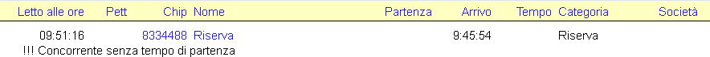
1. Controlla con il posatore che la sequenza dei punti sul foglietto degli intertempi corrisponda alla sequenza con cui il posatore li ha posati.
1. In caso di errori, fai correggere la posa delle scatolette.  
**Nota**: se questo non è fattibile prima del passaggio del primo concorrente, devi posticipare la partenza (vedi [Ritardo nelle partenze](casi_speciali.md#ritardo-nelle-partenze)).
1. Cancella il chip del posatore selezionando il posto di riserva nel pannello in basso e premendo sul bottone `Elimina`.
1. Nelle impostazioni a sinistra rimetti la spunta a `Non stampare i posti di riserva`.

## Stampa lista chip noleggiati
Per controllare che tutti i chip noleggiati siano effettivamente marcati come tali anche nel programma, conviene stampare la lista da OL-Einzel e confrontarla con la lista tenuta all'info.  

1. Nel menu `Iscrizioni`, seleziona `Rapporti - Concorrenti > Iscrizioni > Individuali`.  
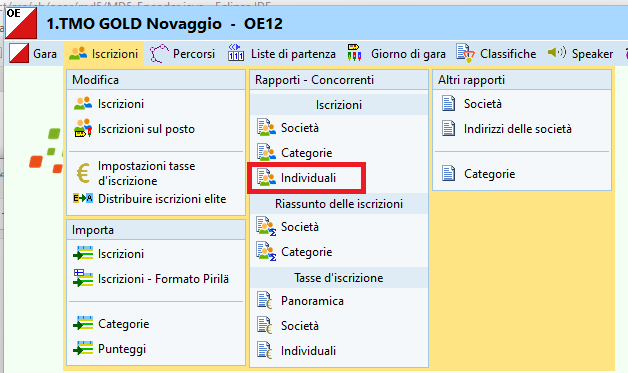
1. Nelle impostazioni a sinistra, seleziona `Solo chip noleggiati`.
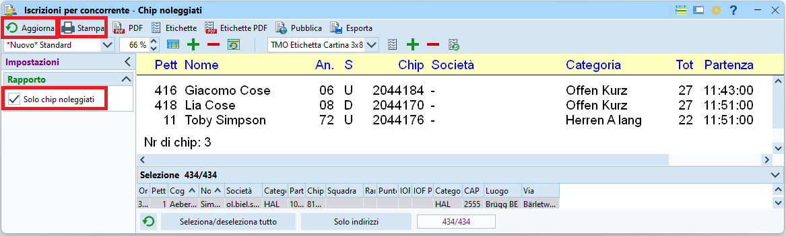
1. Nel pannello in basso, seleziona tutti i concorrenti.
1. Premi `Aggiorna` nel menu in alto a sinistra.
1. Premi `Stampa`.

Questa lista va spuntata a ogni concorrente che consegna la sua SI-Card, in modo da avere un controllo immediato su quante SI-Card mancano.  
**Nota**: alla lettura di un chip noleggiato viene segnalato a video di ritirarlo.

## Lettura
Per la lettura chip dei concorrenti:

1. Nel menu `Giorno di gara`, seleziona `Chip > Leggi chip`.  
1. Assicurati che la stazione di lettura sia connessa e la stampa degli intertempi sia configurata, come descritto in [Impostazioni](#impostazioni).
1. Fai leggere i chip ai concorrenti.  
**Nota**: il sistema stampa automaticamente gli intertempi per ogni concorrente e a video mostra i dati del concorrente (nome, categoria, società...), il suo tempo e lo stato in classifica (cioè se è classificato o se gli mancano punti).  
  
Di seguito alcune casistiche da gestire.

### Concorrente classificato
Alla lettura del chip di un concorrente che ha trovato tutti i punti nella sequenza corretta:

1. Appare il nome del concorrente e il tempo di gara.  
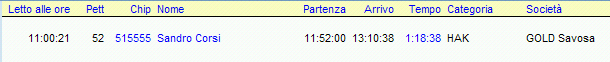  
1. Viene stampato il foglietto degli intertempi.  
**Nota**: se sul foglietto degli intertempi appaiono tanti punti duplicati (ad esempio 3-5 volte lo stesso punto di fila), informa il concorrente di spedire il chip per la sostituzione della batteria (cerca in Google `SIAC sostituzione Svizzera`).

### Chip a noleggio
Indipendentemente dallo stato di classifica (trovato tutti i punti o meno), il programma segnala se un chip è da ritirare.

1. Sotto al nome, appare la scritta `Questo chip è stato noleggiato`.  
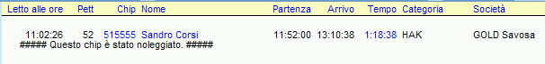
1. Ritira il chip.
1. Spunta la lista dei chip a noleggio (vedi [stampa chip noleggiati](#stampa-lista-chip-noleggiati)).

### Manca un punto
Se manca un singolo punto:

1. Sotto al nome appare la scritta `Punzonature mancanti` e il numero del punto mancante.  
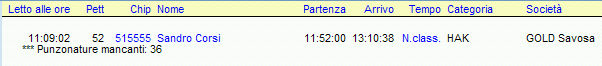
1. Chiedi al concorrente se in effetti ha lasciato via un punto (spesso i concorrenti lo sanno).  
Altrimenti:  
    - Controlla se sul foglietto degli intertempi, in fondo dopo il tempo di arrivo, è elencato un punto supplementare (segnato con un asterisco) con un tempo che rientra nell'intervallo tra il punto prima e il punto dopo quello mancante. In questo caso è molto probabile che il concorrente abbia timbrato il punto sbagliato.  
    **Nota**: vale la pena avere un postennetz (cartina con tutti i punti) per mostrare al concorrente quale punto ha timbrato al posto del proprio. Spesso questo chiarisce i dubbi al concorrente.
    - Se il concorrente ha timbrato sulla cartina, vedi la sezione [in basso ](#timbrato-sulla-cartina).
    - Se invece il concorrente pensa di aver trovato tutti i punti, fagli rileggere il chip.  
    **Nota**: il sistema non permette di leggere due volte di fila lo stesso chip. Leggi prima il chip di un altro concorrente e riprova. Se non ci sono altri concorrenti, leggi su un altro PC oppure chiudi la finestra di lettura chip e riaprila.  
    Conferma e sovrascrivi i dati del concorrente.  
    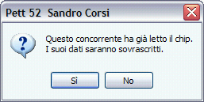   
    Se il concorrente risulta ancora non classificato... consolalo!

### Mancano punti
Se mancano diversi punti

1. Sotto al nome appare la scritta `Punzonature mancanti` e la lista dei punti mancanti.  
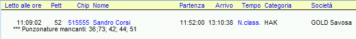
1. Chiedi se in effetti ha lasciato via diversi punti (di solito sono concorrenti che si ritirano).  
Altrimenti:  
    - Controlla se sul foglietto degli intertempi appaiono tanti punti duplicati (ad esempio 3-5 volte lo stesso punto di fila). Questo è dovuto alla batteria scarica della SIAC (il chip air). In casi estremi porta a riempire il chip con dati prima della fine della gara, per cui gli ultimi punti vanno persi. Il concorrente non è classificato e purtroppo non ci sono alternative dato che non è possibile verificare la sequenza dei punti trovati.  
    Informa il concorrente di spedire il chip per la sostituzione della batteria (cerca in Google `SIAC sostituzione Svizzera`).
    - Controlla se ha corso nella categoria giusta / se ha preso la cartina corrispondente alla sua categoria (soprattutto quando le cartine non sono personalizzate con l'etichetta e il nome).  
    Di regola non si può semplicemente cambiare la categoria (in `Iscrizioni > Modifica > Iscrizioni`) e rileggere il chip (sovrascrivendo i dati), anche se questo risolverebbe il problema, perché probabilmente la partenza sul percorso sbagliato ha violato gli intervalli di partenza o i limiti di età o di genere della categoria.
    - Controlla se sul foglietto degli intertempi, in fondo dopo il tempo di arrivo, sono elencati punti supplementari (segnati con un asterisco) con dei tempi che rientrano negli intervalli tra il punto prima e il punto dopo di quelli mancanti. In questo caso è molto probabile che il concorrente abbia timbrato punti sbagliati.    
    **Nota**: vale la pena avere un postennetz (cartina con tutti i punti) per mostrare al concorrente quale punto ha timbrato al posto del proprio. Spesso questo chiarisce i dubbi al concorrente.
    - In caso di percorsi con farfalle verifica col concorrente la sequenza dei punti timbrati rispetto alla sequenza richiesta sulla cartine. 
    - Se il concorrente ha timbrato sulla cartina, vedi la sezione [in basso ](#timbrato-sulla-cartina).
    - Se invece il concorrente pensa di aver trovato tutti i punti, fagli rileggere il chip.  
    **Nota**: il sistema non permette di leggere due volte di fila lo stesso chip. Leggi prima il chip di un altro concorrente e riprova. Se non ci sono altri concorrenti, leggi su un altro PC oppure chiudi la finestra di lettura chip e riaprila.  
    Conferma e sovrascrivi i dati del concorrente.  
    Se il concorrente risulta ancora non classificato... consolalo!

### Timbrato sulla cartina
Se il concorrente ha timbrato un punto sulla cartina, molto probabilmente gli manca un punto sul chip e quindi risulta non classificato.

1. Assicurati che la cartina sia del concorrente (pettorale e nome sull’etichetta).  
Se le cartine sono anonime (senza etichetta), marca un cerchio attorno al timbro e il numero del pettorale vicino al timbro.
1. Marca su un foglio
    - Numero del punto
    - La forma della punzonatura
    - Pettorale, nome e categoria del concorrente
    - Ev. descrizione del motivo per cui ha punzonato (es. scatoletta non andava, scatoletta mancante, ...)  
**Nota**: se un punto non funziona, molto probabilmente arriveranno tanti concorrenti con la stessa punzonatura. Controlla comunque la punzonatura su ogni cartina e confrontala con quella già marcata.  
**Nota**: marca anche tutti i concorrenti ai quali manca il punto ma che `non` hanno timbrato sulla cartina, in modo da avere la lista di tutti i
concorrenti che hanno timbrato e la lista di quelli che `non` hanno timbrato.
1. Avvisa il tracciatore, controllore o capo gara e se possibile fai controllare subito la pinza del punto in questione. Altrimenti è importante che durante il ritiro punti venga controllato. Dato che sui paletti non è più indicato il numero del punto, dopo il ritiro non sarà più possibile controllare se la punzonatura corrisponde al punto corretto.  
**Nota**: questo vale soprattutto se il punto è stato punzonato sulla cartina solo da un singolo o da pochi concorrenti. Chiaramente, se sono tanti i concorrenti che hanno timbrato e tutti con lo stesso timbro, non può che essere quello corretto. 

Cambia lo stato di classifica dei concorrenti che hanno timbrato sulla cartina.  
**Nota**: quelli che non hanno timbrato sulla cartina non possono essere classificati.

1. Nel menu `Giorno di gara` seleziona `Chip > Elabora chip`.  
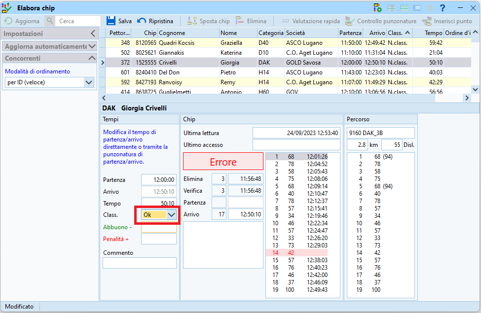
1. Ordina i concorrenti per lo stato di classifica (colonna `Class.`).  
**Nota**: in questo modo i concorrenti non classificati si trovano in cima alla lista.
1. Seleziona il concorrente da modificare.
1. Cambia lo stato di classifica da `N.Class.` a `OK`.
1. Premi `Enter` per confermare o `Esc` per annullare la modifica.

### Chip non trovato

1. Se il chip letto non è associato a nessun concorrente, appare il messaggio `Concorrente senza tempo di partenza` e non viene stampato il foglietto degli intertempi.  

1. Se è impostato `Chip sconosciuto: richiedi il pettorale` appare una finestra in cui inserire il pettorale del concorrente.  
Questo assegna il chip al concorrente e stampa il foglietto degli intertempi.
1. Altrimenti, nella parte bassa della finestra appare il pannello dei posti di riserva.  
Sulla sinistra vengono elencati i chip letti ma non assegnati ad alcun concorrente, sulla destra la lista di tutti i concorrenti iscritti.  
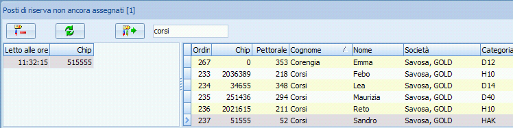
1. Seleziona sulla sinistra il chip appena letto.
1. Ordina i concorrenti per cognome (cliccando sull'intestazione della colonna).
1. Inserisci il cognome nel campo di ricerca in alto.
1. Seleziona il concorrente.  
**Nota**: chiedi conferma al concorrente per tutti i campi (Cognome, Nome, Società, Categoria).
1. Premi sul bottone `Assegna`.  
**Nota**: il chip viene assegnato al concorrente e viene stampato il foglietto degli intertempi.

### Chip già letto
Se si rilegge un chip già letto appare il seguente messaggio.  

Se non hai richiesto tu la rilettura del chip, rispondi **sempre di NO** e chiedi il motivo della rilettura.  
  
Se il concorrente è ritornato nel bosco, ad esempio a fronte di un punto mancante (tipicamente l’ultimo punto o l’arrivo), spiegagli che questo non è permesso e che non può essere classificato.  

Se il motivo della rilettura è la ristampa degli intertempi procedi come segue:

1. Nel menu `Giorno di gara`, seleziona `Chip > Elabora chip`.
1. Seleziona il concorrente, ad esempio cercandolo per nome o per pettorale.
1. Selezione `Valutazione rapida`.
1. Controlla le impostazioni della stampante.
    1. Nome stampante
    1. Layout dell’etichetta (`TMO esteso` o `TMO`)
    1. Numero di righe e colonne
    1. Margini
5. Se tutto corrisponde, premi `Stampa`.  
Altrimenti `Annulla`, imposta i valori corretti e premi `Stampa`.
  

Se invece il motivo è l’utilizzo del chip da parte di più concorrenti (es. usato prima dal figlio su un percorso corto, poi dal genitore), spiega che questo non è possibile. Rileggendo vanno persi i dati del primo concorrente.  

- Puoi essere severo:  
    1. Nel menu `Giorno di gara`, seleziona `Chip > Elabora chip`.
    1. Seleziona il concorrente, ad esempio cercandolo per nome o per pettorale.
    1. Imposta lo stato di classifica a `N.Class.`.
- O magnanimo:
    1. Nel menu `Iscrizioni`, seleziona `Modifia > Iscrizioni`.
    1. Ordina i concorrenti per numero del chip (cliccando sull'intestazione della colonna `Chip`).
    1. Cerca il numero del chip.
    1. Verifica che sia il concorrente giusto (figlio, amico, ...).
    1. Cancella il numero chip del concorrente.
    1. Conferma la cancellazione.
    1. Rileggi il chip.
