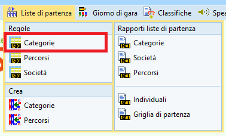

# Liste di partenza

I passi per la creazione delle liste di partenza sono:  
  
- Definire la griglia di partenza tramite le regole per ogni categoria (intervallo, orario del primo concorrente, numero vacanti, ecc.)
- Sorteggiare le liste di partenza, cioè assegnare un tempo di partenza casuale ad ogni concorrente, rispettando le regole
- Assegnare un numero di pettorale ad ogni concorrente
- Stampare le liste e griglie di partenza
- Stampare le etichette personalizzate da incollare sulle cartine
- Pubblicare le liste di partenza

## Regole per categoria

Definisci la griglia di partenza creando le regole di partenza per ogni categoria.  

1. Nel menu `Liste di partenza` seleziona `Regole > Categorie`  
  
  
1. La videata contiene varie sezioni  
  
  
    - Sulla destra appaiono le categorie ancora da inserire in griglia.  
    **Nota**: categorie con lo stesso primo punto non dovrebbero avere concorrenti che partono allo stesso minuto. Ordinando le categorie per primo punto facilita enormemente il lavoro, permettendo facilmente di mettere le relative categorie nello stesso corridoio.
      
    - Sulla sinistra si impostano i valori di base (che possono venir modificati per ogni categoria)
        - `Corridoi`: il numero di corridoi rappresenta il numero di colonne nella griglia, potenzialmente quindi il numero di concorrenti che possono partire contemporaneamente allo stesso minuto.  
        Di regola viene incrementato man mano che si riempie la griglia
        - `Numero Vacanti` o `% Vacanti`: quanti vacanti per categoria impostare come valore predefinito.    
        Di solito per la maggior parte delle categorie è previsto un numero ridotto di vacanti, spesso solo 1-2. Vale la pena selezionare un numero assoluto scegliendo `Numero vacanti` e non una percentuale, e impostare il valore a 1 o 2.
        - `Intervallo (min)`: il distacco di partenza tra due concorrenti della stessa categoria.  
        Questo valore viene di regola impostato a dipendenza delle categorie per corridoio, e quindi modificato per ogni categoria. Un valore iniziale di 4:00 minuti va bene.
        - **NON** impostare l'utilizzo di blocchi orari.  
        OL-Events esporta i concorrenti con un blocco di partenza impostato, tenendo conto delle regioni e delle preferenze espresse dai concorrenti durante l'iscrizione (partenza presto o tardi), e chiaramente ne vogliamo tenere conto.   
        Ma l'impostazione in questo pannello crea dei blocchi temporali fissi, ad esempio il primo blocco di concorrenti parte tra le 10:00 e le 11:00, il secondo tra le 11:00 e le 12:00, con potenzialmente grandi "buchi" senza partenze.  
          
    - Nel pannello in basso sono visualizzate le impostazioni della categoria selezionata.
    **Nota**: il campo `Tot` mostra il numero di concorrenti iscritti  
      
1. Crea corridoi supplementari incrementando il numero nel pannello di sinistra.  
  
1. Trascina tutte le categorie dalla lista di destra sulla casella nella griglia del minuto in cui vuoi che parta il primo concorrente.  
**Nota**: se crei tutti i corridoi prima di inserire le categorie, trascina la prima categoria nel corridoio più a destra. Altrimenti il programma cancella tutti i corridoi non utilizzati sulla destra.  
  
1. Seleziona una categoria nella griglia per modificare il relativo numero di posti vacanti e l’intervallo nel pannello in basso. Salva per aggiornare la griglia.  
**Nota**: non sono ammesse categorie accavallate, cioè con due concorrenti che partono allo stesso minuto nello stesso corridoio.  
**Nota**: Eventuali incompatibilità vengono segnalate con caselle rosse e con l'intestazione della colonna pure in rosso.  
  
  
1. Controlla la panoramica delle partenza.  
  

    - Tutte le categorie dovrebbero partire più o meno entro lo stesso intervallo di partenza, per fare in modo che tutti i concorrenti abbiano la stessa possibilità di incontrarne altri sul percorso.  
    - Questo rapporto mostra l'ora del primo e dell'ultimo concorrente di ogni categoria. Verifica soprattutto che l'orario di partenza degli ultimi concorrenti sia nella finestra temporale prevista.  
    **Nota**: Scrollando la griglia si può vedere quando parte l’ultimo concorrente anche graficamente.   
      
  
1. Verifica le regole di partenza.   
  

    - Controlla che le regole non presentino alcun errore in nessun test.  
    - **Nota**: è possibile tenere aperte le due finestre, la griglia e il rapporto di controllo. Dopo ogni modifica nella griglia, basta premere su `Aggiorna` nel rapporto di controllo per aggiornarne lo stato.  
      

## Gare con più partenze

Se vi sono più luoghi di partenza bisogna indicare quali categorie partono da quale partenza in modo da poter poi creare le griglie di partenza cartacee per i collaboratori di ogni partenza, con le sole categorie di quel luogo.  

1. Numera le partenze in maniera sequenziale
1. Assegna nel campo `Luogo di partenza` lo stesso numero a tutte le categorie che partono dalla stessa partenza.  

    - **Consiglio**: assegna il luogo di patenza alla prima categoria e imposta il filtro per luogo di partenza in alto. Ogni categoria aggiunta alla griglia avrà automaticamente assegnato questo luogo di partenza.  
      
  
    - Il programma controlla che le cateogrie nello stesso corridoio condividano la stessa partenza.  
      
    - **Consiglio**: per non fare confusione, conviene mantenere le due partenze separate inserendo una (o più) colonne vuote.  
    La prossima immagine mostra un esempio con due partenze, separate graficamente dalla colonne 3, lasciata volutamente vuota.  
    
      

  
