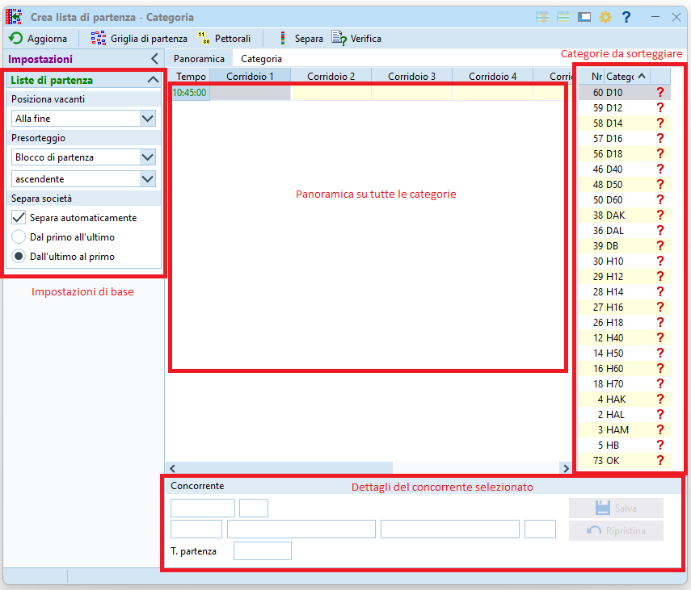
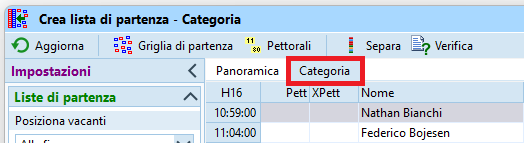
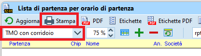
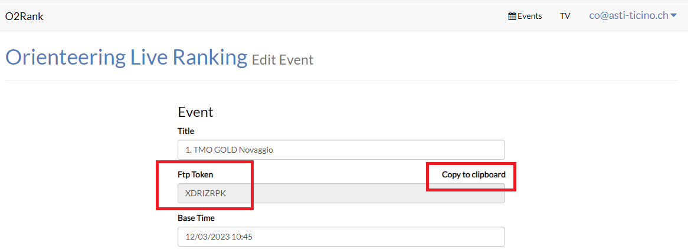

# Liste di partenza

I passi per la creazione delle liste di partenza sono:  
  
- Definire la griglia di partenza tramite le regole per ogni categoria (intervallo, orario del primo concorrente, numero vacanti, ecc.)
- Sorteggiare le liste di partenza, cioè assegnare un tempo di partenza casuale ad ogni concorrente, rispettando le regole
- Assegnare un numero di pettorale ad ogni concorrente
- Stampare le liste e griglie di partenza
- Stampare le etichette personalizzate da incollare sulle cartine
- Pubblicare le liste di partenza

## Regole per categoria

Definisci la griglia di partenza creando le regole di partenza per ogni categoria.  

1. Nel menu `Liste di partenza` seleziona `Regole > Categorie`  
  
  
1. La videata contiene varie sezioni  
  
  
    - Sulla destra appaiono le categorie ancora da inserire in griglia.  
    **Nota**: categorie con lo stesso primo punto non dovrebbero avere concorrenti che partono allo stesso minuto. Ordinando le categorie per primo punto facilita enormemente il lavoro, permettendo facilmente di mettere le relative categorie nello stesso corridoio.
      
    - Sulla sinistra si impostano i valori di base (che possono venir modificati per ogni categoria)
        - `Corridoi`: il numero di corridoi rappresenta il numero di colonne nella griglia, potenzialmente quindi il numero di concorrenti che possono partire contemporaneamente allo stesso minuto.  
        Di regola viene incrementato man mano che si riempie la griglia
        - `Numero Vacanti` o `% Vacanti`: quanti vacanti per categoria impostare come valore predefinito.    
        Di solito per la maggior parte delle categorie è previsto un numero ridotto di vacanti, spesso solo 1-2. Vale la pena selezionare un numero assoluto scegliendo `Numero vacanti` e non una percentuale, e impostare il valore a 1 o 2.
        - `Intervallo (min)`: il distacco di partenza tra due concorrenti della stessa categoria.  
        Questo valore viene di regola impostato a dipendenza delle categorie per corridoio, e quindi modificato per ogni categoria. Un valore iniziale di 4:00 minuti va bene.
        - **NON** impostare l'utilizzo di blocchi orari.  
        OL-Events esporta i concorrenti con un blocco di partenza impostato, tenendo conto delle regioni e delle preferenze espresse dai concorrenti durante l'iscrizione (partenza presto o tardi), e chiaramente ne vogliamo tenere conto.   
        Ma l'impostazione in questo pannello crea dei blocchi temporali fissi, ad esempio il primo blocco di concorrenti parte tra le 10:00 e le 11:00, il secondo tra le 11:00 e le 12:00, con potenzialmente grandi "buchi" senza partenze.  
          
    - Nel pannello in basso sono visualizzate le impostazioni della categoria selezionata.
    **Nota**: il campo `Tot` mostra il numero di concorrenti iscritti  
      
1. Crea corridoi supplementari incrementando il numero nel pannello di sinistra.  
  
1. Trascina tutte le categorie dalla lista di destra sulla casella nella griglia del minuto in cui vuoi che parta il primo concorrente.  
**Nota**: se crei tutti i corridoi prima di inserire le categorie, trascina la prima categoria nel corridoio più a destra. Altrimenti il programma cancella tutti i corridoi non utilizzati sulla destra.  
  
1. Seleziona una categoria nella griglia per modificare il relativo numero di posti vacanti e l’intervallo nel pannello in basso. Salva per aggiornare la griglia.  
**Nota**: non sono ammesse categorie accavallate, cioè con due concorrenti che partono allo stesso minuto nello stesso corridoio.  
**Nota**: Eventuali incompatibilità vengono segnalate con caselle rosse e con l'intestazione della colonna pure in rosso.  
  
  
1. Controlla la panoramica delle partenza.  
  

    - Tutte le categorie dovrebbero partire più o meno entro lo stesso intervallo di partenza, per fare in modo che tutti i concorrenti abbiano la stessa possibilità di incontrarne altri sul percorso.  
    - Questo rapporto mostra l'ora del primo e dell'ultimo concorrente di ogni categoria. Verifica soprattutto che l'orario di partenza degli ultimi concorrenti sia nella finestra temporale prevista.  
    **Nota**: Scrollando la griglia si può vedere quando parte l’ultimo concorrente anche graficamente.   
      
  
1. Verifica le regole di partenza.   
  

    - Controlla che le regole non presentino alcun errore in nessun test.  
    - **Nota**: è possibile tenere aperte le due finestre, la griglia e il rapporto di controllo. Dopo ogni modifica nella griglia, basta premere su `Aggiorna` nel rapporto di controllo per aggiornarne lo stato.  
      

## Gare con più partenze

Se vi sono più luoghi di partenza bisogna indicare quali categorie partono da quale partenza in modo da poter poi creare le griglie di partenza cartacee per i collaboratori di ogni partenza, con le sole categorie di quel luogo.  

1. Numera le partenze in maniera sequenziale
1. Assegna nel campo `Luogo di partenza` lo stesso numero a tutte le categorie che partono dalla stessa partenza.  

    - **Consiglio**: assegna il luogo di patenza alla prima categoria e imposta il filtro per luogo di partenza in alto. Ogni categoria aggiunta alla griglia avrà automaticamente assegnato questo luogo di partenza.  
      
  
    - Il programma controlla che le cateogrie nello stesso corridoio condividano la stessa partenza.  
      
    - **Consiglio**: per non fare confusione, conviene mantenere le due partenze separate inserendo una (o più) colonne vuote.  
    La prossima immagine mostra un esempio con due partenze, separate graficamente dalla colonne 3, lasciata volutamente vuota.  
    
      
## Allestimento delle liste {#crea_liste_partenza}

Crea le liste di partenza sorteggiando i concorrenti rispetto alle regole di partenza.

1. Nel menu `Liste di partenza` seleziona `Crea > Categorie`  
  
  
1.  La videata contiene varie sezioni  
  
  
    - Sulla destra appaiono le categorie ancora da sorteggiare.  

    - In basso sono visualizzati i dettagli del concorrente selezionato
      
    - Nel pannello a sinistra si impostano i valori di base  
        - Posizione vacanti: in Ticino di regola i vacanti si trovano alla fine della lista di partenza visto che sono spesso usati per le iscrizioni sul posto per cui il concorrente ha bisogno di tempo per prepararsi e raggiungere la partenza.  
        - Presorteggio: impostato su `Blocco di partenza` in ordine `ascendente`  
        Vedi i valori in [Gestione desideri di partenza](creazione_gara.md#desideri_partenza)     
       - Separa società: impostato per la separazione automatica, evita (o almeno ci prova) che due concorrenti della stessa società corrano uno dopo l'altro

1. Seleziona il tab `Panoramica`  
  
  
1. Nel menu `Griglia di partenza` seleziona `Tutte le categorie`. Questo sorteggia i concorrenti di tutte le categorie, assegnando loro un tempo di partenza.  
  
  
    - Appare un messaggio con il numero di coppie separate (concorrenti della stessa società) e il numero di quelle che non è stato possibile separare.  
      
      
    - Sulla schermata riassuntiva, verifica che non ci siano errori a parte i pettorali mancanti (non ancora assegnati) e le coppie non separate.  
      

1. Seleziona il tab `Categorie` e controlla il sorteggio di ogni categoria
  
  
    - Seleziona ogni categoria e controlla:
        - che il desiderio di partenza sia stato esaudito.  
        La funzione `Separa società` a volte rimescola i concorrenti senza tener conto di questa impostazione.  
          
        - che i concorrenti della stessa società siano effettivamente separati.  
        La funzione `Separa società` separa i concorrenti inserendo un singolo avversario tra due compagni di società, anche se a volte è possibile separarli maggiormente.  
        **Nota**: i vacanti non vengono considerati "compagni di società" e restano pertanto in fondo alla lista di partenza. A volte è utile usarli per separare concorrenti della stessa società. 
           
    - **Nota**: sposta un concorrente semplicemente trascinandolo e rilasciandolo all'interno della griglia fino alla posizione desiderata.
      
1. Assegna i pettorali quando le liste di partenza sono in versione definitiva.  
**Nota**: la procedura descrive l'assegnazione dei pettorali in ordine di categoria. Nelle gare in cui non viene distribuito il pettorale, questo è unicamente un mezzo tecnico per identificare un concorrente e questa procedura funziona bene. Se invece vengono distribuiti i pettorali e si desidera assegnarli seguendo certe logiche (es. gli élite iniziano dal numero 1), bisogna assegnarli separatamente per ogni categoria.  

    1. Seleziona il tab `Panoramica`  
      
    1. Nel menu `Pettorali` seleziona `Tutte le categorie`  
      
      
    1. Assegna in pettorali iniziando dal numero 1 in ordine ascendente  
      
      
    1. Verifica nuovamente il sorteggio delle liste di partenza.  
    **Nota**: la finestra riassuntiva è la stessa di quella mostrata dopo il sorteggio delle categorie.
  
## Stampa

Servono di regola due tipologie di liste di partenza su carta:  

- Liste di partenza per categoria, da usare dai collaboratori all'info e in partenza, con una copia da appendere alla  pre-partenza per i concorrenti.  
- Griglia di partenza come lista di partenza progressiva usata in partenza e in pre-partenza per chiamare i concorrenti.  

I relativi passi sono:

1. Stampa le liste di partenza per categoria  
    1. Nel menu `Liste di partenza` seleziona `Rapporti liste di partenza > Categorie`  
      
      
    1. La finestra mostra le liste di partenza di tutte le categorie, ordinate per ora di partenza.  
      
      
        - Assicurati che i tempi siano mostrati nel formato `OO:MM:SS`.  
        Altrimenti, impostalo nel menu `ingranaggio` in alto a destra.
        - Nel pannello `Impostazioni` sulla sinistra definisci l'ordinamento dei concorrenti per tempo di partenza. 
        - Di base sono selezionate tutte le categorie. Se vuoi stampare unicamente singole categorie, selezionale nel pannello in basso.
        - Per selezionare unicamente le categorie di un luogo di partenza, seleziona il luogo in basso  
        
      
    1. Se nel passo precedente hai modificato qualsiasi parametro, premi su `Aggiorna` nel menu in alto a sinistra.
    1. Seleziona `TMO` come modello del rapporto e premi su `Stampa`  
      
      
    1. Seleziona la stampante ASTI laser A4 per stampe in bianco e nero e imposta `Separa pagine`.  
      
      

1. Stampa le griglie di partenza  
    1. Nel menu `Liste di partenza` seleziona `Rapporti liste di partenza > Griglia di partenza`  
      
      
    1. La finestra mostra la griglia a partire dall'ora zero impostata per la gara, quindi eventualmente tanto *prima* della partenza del primo concorrente.  
      
      
        - Nella parte bassa, imposta l'ora di inizio della griglia e clicca su `Aggiorna` in alto a sinistra.
        - Per gare con più partenze, crea griglie separate per ogni luogo di partenza selezionandoli in basso a sinistra
      
    1. Seleziona `TMO` o `TMO con corridoio` come modello del rapporto e premi `Stampa`  
      
      
    1. Seleziona la stampante ASTI laser A4 per stampe in bianco e nero e non impostare `Separa pagine`.  
      
        

## Pubblicazione

Le liste di partenza vanno pubblicate sia sul sito web di Swiss Orienteering che sul sito ASTI O2Rank.  
Il formato del file è lo stesso, per cui basta esportare le liste di partenza una volta.  
Se la gara non è ancora aperta in O2Rank e non la vuoi aprire subito, puoi seguire le indicazioni relative all'esportazione del file descritto in O2Rank, ma senza `Carica file nel web`. Il file così esportato va poi caricato sul sito di Swiss Orienteering.

### Su O2Rank {#pubblica_liste_partenza_o2rank}

1. Recupera il token FTP della gara da `O2Rank`  

    - Se non hai ancora una gara su `O2Rank`, creala seguendo le istruzioni in [Software > O2Rank > Creazione gara](../o2rank/creazione_gara.md)

    1. Accedi a `O2Rank` su [classifiche.asti-ticino.ch/o2rank](http://classifiche.asti-ticino.ch/o2rank)
    1. Seleziona `Login` in alto a destra e accedi come amministratore  
    (utente `co@asti-ticino.ch`, password `class1f1che`)
    1. Seleziona `edit` sulla destra della tua gara
    1. Copia il token cliccando su `Copy to clipboard`  
    

1. Esporta le liste di partenza  

    1. Nel menu `Liste di partenza` seleziona `Rapporti liste di partenza > Categorie`  
          

        - Assicurati che i tempi siano mostrati nel formato `OO:MM:SS`.  
        Altrimenti, impostalo nel menu `ingranaggio` in alto a destra.
        - Nel pannello `Impostazioni` sulla sinistra definisci l'ordinamento dei concorrenti per tempo di partenza. 
        - Seleziona tutte le categorie nel pannello in basso.
        - Seleziona tutti i luoghi di partenza nella tendina in basso.

    1. Se nel passo precedente hai modificato qualsiasi parametro, premi su `Aggiorna` nel menu in alto a sinistra.
    1. Premi su `Esporta` nel menu in alto.
    1. Imposta i seguenti campi  
        

        - `Colonne con separatori (CSV)`
        - Separatore `Punto e virgola` 
        - Delimitatore di testo `Nessuno`
        - Seleziona `Formatta i tempi per Excel` 

        Nella sezione `File`  

        - Esporta il file nella cartella `C:\Temp\tmo\<anno>`
        - Imposta il nome del file a `LP_<FTP-Token>.csv`  
        **Nota**: assicurati di usare il `Ftp Token` della tua gara e non quello già impostato in OL-Einzel, che probabilmente è il token della gara precedente.
            - Es. `C:\Temp\tmo\2023\LP_XDRIZRPK.csv`
        - Seleziona `Nome file univoco con orario`
        - Seleziona `Carica file nel web`
        - Non selezionare `Elabora file con DLL`

    1. Nel dialogo `Carica file nel web` imposta i campi  
      

        - Sito web `classifiche.asti-ticino.ch`
        - Cartella `/`
        - Non attivare la connessione sicura SSL/TLS
        - Nome utente `asti`
        - Password `class1f1che`

    1. Attendi uno-due minuti e verifica le liste in internet (sito [classifiche.asti-ticino.ch/o2rank](http://classifiche.asti-ticino.ch/o2rank))

### Su Swiss Orienteering {#pubblica_liste_partenza_solv}

Carica sul sito di Swiss Orienteering il file esportato per O2Rank (vedi [sopra](#pubblica_liste_partenza_o2rank)).  
**Nota**: il nome del file contiene come prefisso la data e l'ora dell'esportazione.  
  
1. Vai sul sito SOLV [www.swiss-orienteering.ch](https://www.swiss-orienteering.ch)
1. Nel menu in alto, seleziona `Gare > Liste di partenza`  
  
  
1. Seleziona `Webformular` nella sezione `Veranstalter` (`organizzatori`)  
  
  
1. Seleziona la tua gara e premi `Weiter` (`continua`)
1. Imposta tutti i campi  
  
  
    - Controlla tutti i campi
    - Seleziona il file esportato da OL-Einzel cliccando su `Browse`
    - **Importantissimo**: Imposta la stessa ora zero come impostata nella gara di OL-Einzel, quindi quella "tecnica", anticipata, e non quella "ufficiale".
    - Seleziona OE12 come formato del file
    - Inserisci il tuo numero SOLV
    - Premi su `Abschicken` (`invia`)

1. Controlla l'anteprima delle liste di partenza.
    1. Confronta alcune categorie con le liste di partenza stampate da OL-Einzel
    1. Controlla i dati (nome, pettorale, chip, orario di partenza) di alcuni concorrenti
    1. Controlla i date dei concorrenti che partono anticipatamente
    1. RICORDA CHE: una volta spedita la lista delle partenze non puoi più ricaricarla dal sito SwissOrienteering ma devi scrivere a oltech@swiss-orienteering.ch allegando la lista modificata. Perciò sii sicuro che il documento che stai caricando è corretto!
1. Se non ci sono errori, conferma inserendo la tuo ID della banca dati SOLV.
