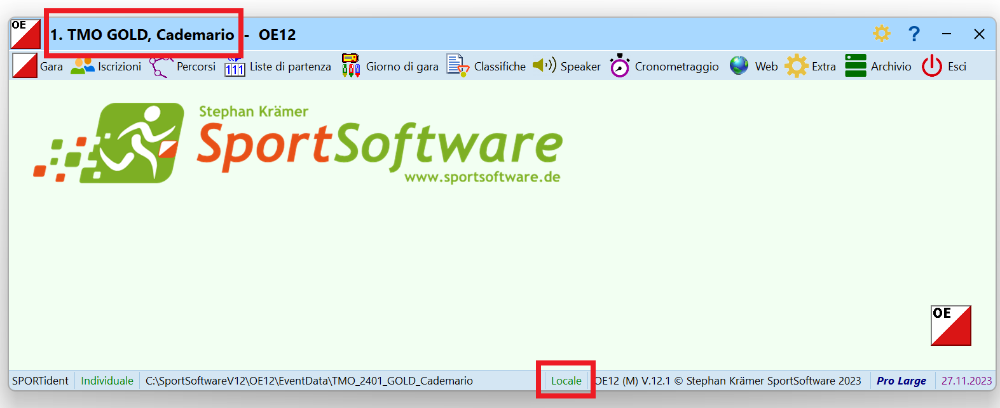

# Montaggio Infrastruttura

Questa pagina copre:

- Il materiale IT da prendere dal magazzino ASTi.
- Il montaggio della rete per la gestione della gara.
- Il montaggio delle TV per le classifiche online.
- La configurazione di OL-Einzel specifica per ogni gara.

La descrizione vale per normali gare di TMO, cioè gare con meno di 500 concorrenti preiscritti tramite un portale di iscrizioni (quindi con poche mutazioni o iscrizioni sul posto).  
Per gare speciali (sCOOLcup, staffetta sele) o con più concorrenti (nazionali), adattare il numero di PC e l'infrastruttura alle esigenze della gara.

## Materiale ASTi

Il materiale IT necessario per un TMO normale è:

- 2 scatole gialle (contengono i PC, switch, router, mouse, cavi di rete, ciabatte, ecc.).
- 1 borsa PC bianca (potrebbe essere in una scatola gialla).
- 3 stampantine
- 1 stampante A4 con toner  
**Nota**: ricordati la carta A4 (non in dotazione ASTi)
- 2 TV
- Piedistalli per TV (3 piedi, 3 stanghe verticali, 2 orizzontali)
- 1 scatola di legno (punti e scatolette di lettura)
- 1 scatola di legno (altoparlante e microfono per la premiazione)
- 1 bobina cavo corrente

Considera se ti serve materiale supplementare:

- ev. 1 generatore di corrente con tanica benzina
- ev. ponti radio (fungono da cavo di rete "lungo" o dove è meglio non posare un cavo di rete (attraversamento strada, piazzale con gente, ecc.))
- ev. switch supplementari (se ci sono gruppi di PC dislocati basta un cavo lungo e uno switch supplementare al quale attaccare gli apparecchi dislocati)

## Montaggio

Configurazione standard della rete per un TMO normale.

- 2 stazioni di lettura chip
    - Usa il PC4 (server) e preferibilmente il PC5 (argento).  
    **Nota**: Tenendo il PC4 come stazione di lettura permette la lettura dei chip dei concorrenti anche in caso di mancanza di corrente. Infatti, questo PC ha la batteria che funziona e visto che la gara è salvata sul PC4 (server) sarà in grado di salvare i tempi dei concorrenti.  
    Senza corrente le stampanti non funzionano e non sarà evidentemente possibile stampare gli intertempi, ma non funziona nemmeno lo switch per cui non ci sarà la rete tra i PC. In mancanza di corrente, i PC 1, 2 e 3 si spengono immediatamente (le loro batterie non funzionano più) ma pure il PC 5 che ha una batteria funzionante non potrà salvare i chip letti, visto che non avrà accesso al PC4 via rete.
    - Collega i PC allo switch tramite cavi di rete e **NON** via WiFi.
    - Collega una scatoletta di lettura chip alla porta USB di ogni PC.
- 3 stampantine intertempi
    - Collega 2 stampantine per gli intertempi allo switch tramite cavo di rete.  
    - Tieni una stampantina di riserva (normalmente non serve).
    - Posiziona ogni stampantina vicino ad una stazione di lettura, e configura il PC per l'uso della stampantina vicina alla propria scatoletta di lettura.  
    **Nota**: anche se ogni PC ha accesso via rete a tutte le stampantine presenti, i concorrenti si aspettano che il loro foglietto esca dalla stampantina vicina alla stazione di lettura.  
    È possibile usare una sola stampantina per più stazioni di lettura, ma in questo caso è consigliato avere un addetto che prende i foglietti dalla stampantina e li consegna ai concorrenti verificando il nome.
- 1 PC nelle retrovie
    - Usa il PC3.  
    **Nota**: sul PC3 è installato il software che fornisce le classifiche alle TV in caso di mancanza di rete mobile verso internet.
    - Collega una scatoletta di lettura chip per la lettura dello start check per l'identificazione dei concorrenti non partiti.
    - Questo PC non ha bisogno di una stampante per intertempi dedicata. In caso di bisogno può stampare su una stampantina in rete.
    - Usa questo PC per il caricamento online delle classifiche in tempo reale.  
    **Nota**: la nuova versione di OL-Einzel non presenta più in primo piano la finestra di caricamento delle classifiche online, permettendone l'utilizzo normale anche con questa funzionalità attivata.
- 1 switch
    - Le scatole gialle contengono uno switch con un numero di prese sufficienti per la rete di un TMO
    - Collega tutti i PC, stampanti, router e apparecchi vari a questo switch tramite cavi di rete.  
    **Nota**: per configurazioni speciali, ad esempio isole di PC dislocate (stazioni di lettura distanti tra loro, postazione speaker, ecc.), ricordati di prendere materiale supplementare dal magazzino ASTi (switch piccoli, ponti radio, ecc.).
- 1 router
    - Collega il router allo switch tramite un cavo di rete.
    - Il router usa la rete mobile (natel) per il collegamento verso internet usato per il caricamento delle classifiche online.
    - Il router è pure un punto d'accesso WiFi usato dalle TV per scaricare le classifiche da internet.
    - La rete WiFi è usata pure dal tablet per accedere alla classifica sul PC4 per la premiazione.  
    **Nota**: il router è configurato in maniera da non permettere a nessun altro apparecchio la connessione via WiFi.
- 1 stampante A4
    - In caso normale, la stampante A4 non viene più usata, per cui vale la pena lasciarla nella scatola e toglierla solo se strettamente necessario.
    - Se necessario, collega la stampante allo switch via un cavo di rete.
    - Usi ancora validi per la stampante A4:
        - Stampa delle classifiche da appendere nel caso di problemi con le TV.
    - Usi obsoleti per la stampante A4:
        - Stampa delle classifiche per la premiazione.  
        **Nota**: la creazione della classifica TMS genera automaticamente un file delle classifiche con le categorie nell'ordine usata normalmente durante le premiazioni. Questo file è accessibile via rete WiFi dal tablet.
        - Stampa dei concorrenti mancanti. La lista dei nomi può essere stampata sulle stampantine.
- 2 TV
    - Appendi le TV in alto (possibilmente usa i supporti ASTi), permettendo a più persone di vedere le classifiche.  
    **Nota**: assicurati che siano al riparo dalla pioggia e dal vento, e che persone "distratte" (o bambini vivaci) non incampino nei supporti o direttamente nelle TV.
    - Le TV si collegano alla rete WiFi del router per accedere alle classifiche online. Assicurati che siano posizionate in un luogo con copertura WiFi del router.  
    **Nota**: se colleghi le TV a una rete WiFi diversa (rete del centro gara o hot spot personale), ricordati di riconfigurare la rete ASTi al termine della tua gara.

## Configurazione OL-Einzel

Configura OL-Einzel su tutti i PC per l'utilizzo della gara corretta.  

1. Copia la gara sul PC 4 (server) come descritto in [varie_pre_gara](varie_pre_gara.md#copia-la-gara-sui-pc-asti).  
**Nota**: la gara deve essere copiata **unicamente sul server**. Non copiarla su tutti i PC per evitare di modificare varie copie della gara.
1. Sul PC 4 (server) seleziona la gara corretta.
    1. Controlla il nome della gara nella barra del titolo e la modalità `locale` nella barra di stato in basso della finestra principale.  
    
    1. Se la gara non corrisponde, seleziona `Gara > Seleziona`.
    1. Assicurati di essere in modalità `Locale`, altrimenti premi sull'icona `...` in alto a destra.
    
    1. Controlla di vedere la cartella corretta nella barra in altro, altrimenti cambiala cliccando sull'icona `cartella` sulla destra della barra stessa.
    1. Seleziona la gara e premi `OK`.
1. Su tutti i PC client utilizzati per la gara (PC 1, 2, 3, 5), seleziona la gara remota sul server.
    1. Controlla il nome della gara nella barra del titolo e la modalità `rete` nella barra di stato in basso della finestra principale.  
    Verifica pure che la gara si trovi su `asti-pc-4` (server).
    1. Se la gara non corrisponde, seleziona `Gara > Seleziona`.
    1. Assicurati di essere in modalità `Rete`, altrimenti premi sull'icona `...` in alto a destra.
    1. Assicurati di vedere la cartella giusta sul PC 4  
    `\\Asti-PC-4\SportSoftwareV12\OE12\EventData`.
        1. Se non corrisponde, premi sull'icona `cartella` sulla destra.
        1. Sotto `Rete`, seleziona il server `Asti-PC-4` e la cartella `SportSoftwareV12\OE12\EventData`.
        1. Seleziona la gara e premi `OK`.
1. Sui PC di lettura chip, configura la stampantina corrispondente.  
Vedi [Lettura Chip](lettura_chip.md#impostazioni).

