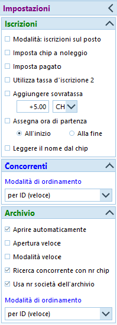

# Iscrizioni e mutazioni sul posto
Questa sezione descrive le iscrizioni sul posto e le mutazioni effettuate il giorno di gara.  
Per le iscrizioni e le mutazioni pervenute **prima** della creazione delle liste di partenza, vedi [Iscrizioni tardive](iscrizioni_tardive.md).  
 
!!! Warning "Attenzione"
    In OE12 è cambiata la gestione degli indirizzi, importante per l'inserimento del domicilio.  
    Anche l'importazione di società dall'archivio come pure la creazione di nuove società è cambiato.
  
Di base viene stampato un numero limitato di cartine, corrispondente agli iscritti più i vacanti previsti durante la creazione delle liste di partenza. 
Quindi il giorno di gara non vengono mai aggiunte iscrizioni, bensì unicamente sostituiti dei vacanti oppure dei concorrenti assenti  
  
**Nota**: sebbene OL-Einzel abbia una funzionalità chiamata `Iscrizioni sul posto`, usiamo sempre solo la funzionalità generica di `Iscrizioni`.  
 
  
**Nota**: aprendo la finestra delle iscrizioni appare sempre il seguente **avvertimento errato**, al quale è importante rispondere sempre `No`.  

 
## Controllo impostazioni

Controlla le impostazioni e configura la finestra delle iscrizioni  

1. Nel menu `Iscrizioni` seleziona `Modifica > Iscrizioni`
1. Controlla le impostazioni come da immagine  
       

    1. Nota su `Utilizza tassa d'iscrizione 2` e `Aggiungere sovratassa`  
    Secondo le disposizioni del [Tariffario del RECO](https://www.asti-ticino.ch/co/index.php?folder=ctco&main=reco), la sovratassa per le mutazioni (nome e/o categoria) e le iscrizioni tardive o sul posto ammonta a 5.- Fr., escluse le categorie HB, DB e OK.  
    Tuttavia, il RECO specifica pure che *il supplemento per le iscrizioni sul posto [...] non può essere aggiunto sulla fattura alle società*.  
    Quindi, per poter generare in OE12 delle fatture corrette dopo la gara, almeno per i concorrenti di società ticinesi la tassa d'iscrizione deve rimanere quella normale, e il supplemento va incassato separatamente dal concorrente, ad esempio il giorno di gara.  
    Dal punto di vista delle impostazioni, le due opzioni in questione non vengono perciò utilizzate e non vanno selezionate.  
      
    1. Nota sulle impostazioni dell'archivio  
    Le impostazioni mostrate permettono la ripresa di tutti i dati di un concorrente inserendo unicamente il suo numero chip.  
    È tuttavia importante che `TUTTE` le impostazioni archivio siano come indicate nell'immagine.
    
1. Ottimizza la tabella  
Vedi [Personalizzazione delle tabelle](../interfaccia_grafica/#personalizzazione-delle-tabelle) per dettagli sulla gestione dell'interfaccia grafica.  

    1. Seleziona le colonne rilevanti   
    **Nota**: puoi selezionare le colonne premendo sull'icona `colonne` in alto a destra.  
    
   
    1. Ordina le colonne  
    **Nota**: puoi spostare le colonne semplicemente trascinando l'intestazione delle varie colonne e ridimensionarle trascinando il bordo di separazione tra due intestazioni.
      
    1. È consigliato l'utilizzo delle seguenti colonne  
    **Nota**: attiva le colonne `Pettorale` e `Partenza` e disattiva `Blocco` che non serve il giorno di gara.  
    **Nota importante**: disattiva `Ordine d'inserimento` in quanto può creare confusione con il pettorale e portare a errori.
        1. Pettorale
        1. Partenza
        1. Categoria
        1. Chip
        1. Noleggiato
        1. Cognome
        1. Nome
        1. Anno
        1. Società
        1. Indirizzo
        1. Tassa d'iscrizione
        1. Pagato 

## Iscrizione sul posto
Normalmente, i concorrenti che si iscrivono sul posto prendono il pettorale e l'orario di partenza di un vacante della propria categoria.  
  
1. Nel menu `Iscrizioni` seleziona `Modifica > Iscrizioni`.  
**Nota importante**: non selezionare `Iscrizioni sul posto` dal menu.
1. Trova il vacante  
**Nota**: ci sono vari modi per trovare il vacante da sostituire  
    - Ordina i concorrenti per pettorale premendo sull'intestazione della colonna `Pettorale` e cerca per numero
      
      
    - Ordina per orario di partenza premendo sull'intestazione della colonna `Partenza` e cerca per orario  
      
    - Ordina per orario di partenza e raggruppa per categoria nel menu in alto a destra  
      
      
        Aprendo sempre una sola categoria per volta dovrebbe risultare abbastanza veloce trovare il vacante cercato.  
            
      
1. Controlla il numero di pettorale, orario di partenza e categoria
1. Inserisci il numero del chip e premi `TAB` (il tasto tabulatore per spostarti sul prossimo campo).  
Il programma cerca il numero chip nell'archivio. 
    1. Se il chip viene trovato nell'archivio, vengono automaticamente ripresi i dati del concorrente.  
    Controlla comunque sempre che il nome del concorrente, la società e il domicilio corrispondano ed eventualmente correggi.
    1. Se il chip non è presente nell'archivio, il programma reclama.  
    Prova a cercare il concorrente nell'archivio per nome.  
    **Nota**: riprendendo i dati di un concorrente dall'archivio vengono mantenuti molti più dati di quelli inseriti manualmente nella tabella, come per esempio l'ID della banca dati SOLV. È quindi buona pratica cercare prima nell'archivio in modo da importare anche i dati supplementari.   
      
        1. Apri l'archivio premendo sul pannello in basso
        1. Ordina per `Cognome`
        1. Cerca inserendo il cognome nel campo di ricerca
        1. Doppio click sul concorrente, e tutti i suoi dati verranno ripresi in quello che stai inserendo.   
        **Nota**: in alternativa al doppio click puoi anche selezionare il bottone `Concorrente` in alto a destra del campo di ricerca.
    1. Se il concorrente non è presente nell'archivio bisogna inserire tutti i dati manualmente.  
    Inserisci i campi
        1. `Cognome`, `Nome` e `AN` (anno di nascita)  
        **Nota**: per concorrenti che corrono in coppia, inserire i cognomi e i nomi separandoli con `+` (ad es. `Heidi + Peter`). Il RECO infatti richiede che si riconosca chiaramente chi corre in coppia, dato che non valgono per le classifiche annuali del TMO.   
        **Nota**: non ci sono direttive riguardo a quale anno di nascita usare, ma per la tassa d'iscrizione fa stato il concorrente più anziano.  
        1. Il campo `Indirizzo` non è editabile. Per le liste di partenza e le classifiche sul sito SOLV serve unicamente il domicilio.
        Premere su `Dettagli` in alto a destra per mostrare la sezione `Indirizzo` sulla destra con i singoli campi editabili.  
        **Nota**: il campo `Indirizzo` nella tabella verrà aggiornato con i nuovi valori solo quando salvi l'iscrizione.  
          
1. Seleziona la `società`  
La tendina contiene le società già presenti nella gara.  
    1. Seleziona la società del concorrente se è presente nella tendina
    1. Se la società non è ancora presente nella gara (quindi nella tendina di selezione delle società)  
      
        1. Apri l'archivio premendo sul pannello in basso
        1. Ordina per `Società`
        1. Cerca inserendo il nome della società (di solito il comune e non la sigla)
        1. Seleziona il primo concorrente della società
        1. Premi `Inserisci nuova società dall'archivio`
        1. Assegna la società al concorrente che stai iscrivendo
    1. Se la società non è presente nell'archivio  
      
        1. Premi su `Società` in alto a destra per mostrare la sezione `Società` sulla destra
        1. Premi su `Crea società`
        1. Inserisci nel campo `Luogo` tutto il nome della società, lasciando quindi vuoto il campo `Sigla`.  
        1. Lascia il numero di società generato automaticamente  
        **Nota**: il campo `Società` nella tabella verrà aggiornato con la nuova società solo quando salvi l'iscrizione.  
1. Imposta il campo `Noleggiato` se il chip è stato noleggiato.  
Alla lettura chip apparirà un relativo messaggio, permettendo il ritiro del chip.  
**Nota**: utilizza la barra spaziatrice per selezionare e deselezionare il campo.
1. Controlla la `Tassa d'iscrizione` e imposta il campo `Pagato`.  
**Nota**: secondo il RECO la sovratassa di 5.- Franchi per le iscrizioni tardive va pagata dal concorrente e non è permesso fatturare la sovratassa alle società ticinesi. Quindi per i concorrenti ticinesi la tassa d'iscrizione deve corrispondere a quella normale usata per le iscrizioni e la sovratassa va gestita manualmente. Per i concorrenti di società non ticinesi, è possibile invece aggiungere la sovratassa direttamente nel campo `tassa d'iscrizione` in modo da ottenere poi delle fatture corrette da spedire o da presentare ai concorrenti il giorno di gara.  
**Nota**: se un concorrente paga una parte (ad esempio il noleggio chip oppure la sovratassa), inserisci nel campo della tassa solo la quota ancora da pagare e non
selezionare il campo `Pagato`. In questo modo la fattura che verrà inviata alla società sarà corretta. La contabilità delle sovratasse va invece gestita separatamente e esternamente a OE.
1. Salva l'iscrizione premendo `Enter` o premendo sull'icona del dischetto in alto a sinistra.  
**Nota**: Premi `Esc` per annullare le modifiche / l'inserimento del nuovo concorrente.

## Mutazione concorrente
Cambiamenti dei dati di un concorrente (ad esempio il numero del chip, il domicilio, la società o il cognome) dovrebbero venir eseguiti dal concorrente stesso aggiornando i suoi dati nella banca dati SOLV.  
Le mutazioni effettuate in OL-Einzel seguendo la procedura qui descritta valgono unicamente per la gara in corso. Al prossimo TMO saranno ancora errati. 
  
1. Nel menu `Iscrizioni` seleziona `Modifica > Iscrizioni`
1. Ordina i concorrenti per nome cliccando sull'intestazione della colonna `Cognome`
1. Inserisci il cognome del concorrente nel campo di ricerca
1. Modifica i campi
1. Premi `Enter` per salvare o `Esc` per annullare la modifica  

 
## Disiscrizione di un assente
Per disiscrivere un concorrente assente, marcalo come `non partito`.
  
**Nota**: evita di mettere il concorrente a vacante in quanto un concorrente iscritto che poi non si presenta è tenuto a pagare la tassa d'iscrizione. Trasformandolo in vacante non figurerà più nelle iscrizioni e quindi nelle fatture spedite alle società.  
**Nota**: dalla partenza riceverai la lista dei concorrenti non partiti, per cui potresti anche ignorare questo caso prima della gara. Importante è la gestione all'info, per eventualmente poter rivendere il posto ad un altro concorrente.  
  

1. Se sai il numero di pettorale del concorrente
    1. Nel menu `Cronometraggio` seleziona `Manualmente > Immissione manuale`  
      
  
    1. Annulla la finestra di stampa
    1. Imposta nel pannello a sinistra `Valutazione rapida` a `Nessuno`
    1. Imposta lo stato di classifica in basso a destra a `N.Part.`
      
  
    1. Per ogni concorrente non partito  
        1. Inserisci il numero di pettorale e premi `Enter`.  
          
      
        1. Verifica sempre che il nome che appare nella lista corrisponda a quello del concorrente non partito
  
1. Altrimenti, se non sai il numero di pettorale del concorrente  
    1. Nel menu `Giorno di gara` seleziona `Elabora chip`  
      
    1. Ordina i concorrenti per nome cliccando sull'intestazione della colonna `Cognome`
    1. Inserisci il cognome del concorrente nel campo di ricerca
    1. Cambia lo stato a `Non partito`
    1. Premi `Enter` per salvare o `Esc` per annullare la modifica  
    
  
## Sostituzione concorrente
Sostituire un concorrente assente con un altro concorrente.  
**Nota**: se i due concorrent sono della stessa società, il RECO prevede unicamente il pagamento della sovratassa. Mentre se il nuovo concorrente è di una società diversa, tenere conto che il concorrente assente è tenuto al pagamento della tassa d'iscrizione, ma non figurerà più nelle fatture generate dopo la gara.

1. Nel menu `Iscrizioni` seleziona `Modifica > Iscrizioni`
1. Trova il concorrente (analogamente alla ricerca del vacante in [Iscrizione sul posto](#iscrizione-sul-posto))  
Ad esempio
    1. Ordina i concorrenti per nome cliccando sull'intestazione della colonna `Cognome`
    1. Inserisci il cognome del concorrente assente nel campo di ricerca
1. Trasforma il concorrente assente in vacante premendo sull'aposito bottone.
**Nota**: così facendo cancelli tutti i suoi dati, anche quelli non visibili nella tabella.  
  
1. Iscrivi il nuovo concorrente analogamente all'[Iscrizione sul posto](#iscrizione-sul-posto)
  
## Scambio concorrenti
Di base i campi categoria, pettorale e orario di partenza formano una tripletta immutabile. 
Lo scambio di due concorrenti si risolve quindi nello scambio delle relative "triplette" di dati.  
  
1. Trova il primo concorrente.  
**Nota**: tieni nota dei dati del primo concorrente.
    1. Assegnagli la nuova categoria (quella del secondo concorrente).  
    1. Assegnagli il nuovo orario di partenza (quello del secondo concorrente).
    1. Assegnagli un numero di pettorale fittizio.  
    **Nota**: i numeri di pettorale devono sempre essere univoci. Non è pertanto possibile assegnare lo stesso pettorale a due concorrenti, nemmeno temporaneamente.  
    **Consiglio**: assegnagli il numero di pettorale nuovo (quello del secondo concorrente) + 9000.
1. Trova il secondo concorrente
    1. Assegnagli la nuova categoria (quella originale del primo concorrente).
    1. Assegnagli il nuovo orario di partenza (quello originale del primo concorrente).
    1. Assegnagli il nuovo numero di pettorale (quello originale del primo concorrente).
1. Trova il primo concorrente
    1. Correggi il numero di pettorale (togli 9000)  
  
**Nota**: questa procedura funziona anche se uno dei due concorrenti è un Vacante.

## Cambio orario partenza
In generale non è possibile semplicemente cambiare l'orario di partenza di un concorrente, in quanto si rischierebbe di non rispettare le regole di partenza.  
Il cambio di orario di partenza è spesso uno scambio tra due concorrenti (di cui uno eventualmente è un vacante) e va quindi gestito come descritto in [Scambio concorrenti](#scambio-concorrenti).  
Se tuttavia si vuole assegnare un nuovo orario di partenza ad un concorrente, e questo orario di partenza rispetta le regole e non è già utilizzato da altri concorrenti della stessa categoria (inclusi quindi i vacanti), basta sovrascrivere il relativo campo.

## Cambio categoria
Non è possibile semplicemente cambiare la categoria di un concorrente, in quanto si rischierebbe di non avere abbastanza cartine alla partenza, e le regole di partenza non sarebbero rispettate.  
Il cambio di categoria è perciò sempre uno scambio tra due concorrenti (di cui uno eventualmente è un vacante) e va quindi gestito come descritto in [Scambio concorrenti](#scambio-concorrenti).