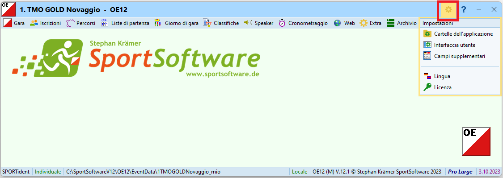
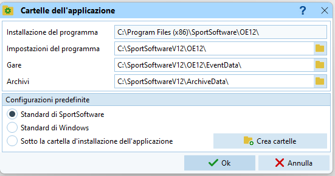
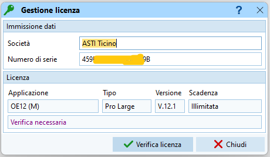

# Panoramica di OL-Einzel

## OL-Einzel
OL-Einzel è uno (il più usato) di una serie di programmi di gestione delle corse di orientamento.  
Il presente sito fa riferimento alla versione 12 di OL-Einzel, mentre la documentazione della versione precedente è disponibile in formato PDF ([Documentazione OL-Einzel 2010](../../gestione_gara_org/inc/_OL_einzel_per_TMO_v2_4.pdf)).  
  
Parlare di OL-Einzel è in realtà improprio, poiché [SportSoftware](https://www.sportsoftware.de), la ditta di Stephan Krämer che ha sviluppato il programma, ha creato una serie di applicazioni per gestire varie tipologie di gare.  
  
- **OE12** - esteso **OL-Einzel** - gestione di gare individuali, sia singole che a tappe.
- **OS12** - esteso **OL-Staffel** - gestione di gare a staffetta.
- **OEScore** - gestione di gare con punteggi (punteggi diversi per i vari punti, obiettivo fare il punteggio più alto entro un determinato tempo).
- **OEHeats** - gestione di gare con qualifiche e finali, comprese le Knock-Out Sprint.
- **ChipReader** - programma per la lettura chip senza assistenza da parte di un operatore, connesso alle applicazioni elencate sopra .
- **MLManager** - programma per la traduzione dei testi, non accessibile a tutti ma presente in Ticino. Quindi se trovate traduzioni in italiano da migliorare, comunicatecele ([co@asti-ticino.ch](mailto://co@asti-ticino.ch)).  
  
Le applicazioni sono per il sistema operativo Windows, a parte `ChipReader` che è disponibile anche su Android.  
  
OL-Einzel è disegnato per lavorare in rete. Ogni PC in rete deve avere la propria versione completa di OL-Einzel installata, ma solo un PC funge da server e ha la banca dati della gara in locale, mentre i PC client accedono alla banca dati sul server in remoto (via rete `cablata`).  
Volutamente queste istruzioni si limitano a menzionare le cose essenziali che possono essere utili per l’organizzazione di un TMO. Anzi, in alcuni punti interpretano già la nostra realtà ticinese, dando delle direttive precise su come è meglio fare le cose (secondo il nostro punto di vista). In realtà OL-Einzel offre molte opzioni e funzioni non trattate nel presente documento, tra cui ad esempio:

- Sfruttamento del tempo della scatoletta Start.
- Supporto per lo speaker, con o senza punti radio.
- Presa del tempo con la fotocellula.
- Gare a tappe.
- Ecc.
  
Se scoprite maniere più efficienti per risolvere i problemi ticinesi, o se trovate errori o mancanze nel documento, fatelo sapere ([co@asti-ticino.ch](mailto://co@asti-ticino.ch)). Grazie.

## Licenze
I vari programmi richiedono licenze separate per ogni applicazione, per sbloccare funzionalità aggiuntive e per gestire numeri maggiori di concorrenti.  
I dettagli sono visibili sull'[Online Shop di SportSoftware](https://sportsoftware.de/onlineshop).  
  
SportSoftware non rilascia licenze alle federazioni da mettere poi a disposizione delle società affiliate. Perciò, in Ticino ogni società ha la propria licenza per coprire le funzionalità e il numero di concorrenti necessari per gestire una gara di TMO (fino a 1000 concorrenti), mentre l'ASTi ha una licenza per gestire gare più grosse, ad esempio le nazionali, con più di 1000 concorrenti e pure per gare a tappe.  
In accordo con lo sviluppatore, sui PC ASTi è installato il software con la licenza ASTi, per cui tutte le gare vengono sempre gestite con questa licenza. Per la preparazione delle gare sul proprio PC privato vengono invece usate le licenze di società. Le gare generate con una licenza sono trasferibili senza problemi su PC con un'altra licenza (nel rispetto delle limitazioni menzionate).
 
  
Di seguito le persone di riferimento per le licenze delle varie società ticinesi.   
  
- **ASTi** - Sandy.
- **ASCO** - Michele.
- **GOLD** - Sandy.
- **GOV** - Chico.
- **O-92** - Georg.
- **SCOM** - Camilla.
- **UNITAS** - Tepa.
- **UTOE** - Leandro.
- **AGET** - `non usa OL-Einzel`.

Attualmente, solo il `GOLD` è in possesso di una licenza per OE-Heats e per OL-Staffel (gare a staffetta), quest'ultima disponibile unicamente per la Staffetta Sele.  
Se l'ASTi decidesse di introdurre gare a staffetta o Knock-out Sprint nel programma annuale, sarebbe necessario l'acquisto di relative licenze.

## Installazione
I programmi sono disponibili per piattaforma Windows, scaricabili direttamente dal sito di [SportSoftware / downloads](https://sportsoftware.de/downloads).

Installazione  

1. Scarica il programma.  
**Nota**: viene scaricato un singolo file denominato ad esempio `oe121setup.exe` per OL-Einzel versione 12.1.
1. Esegui il programma scaricato per installare l'applicazione.
1. Seleziona la cartella di destinazione.

Configurazione  

1. L'applicazione si avvia con una licenza di test, con funzionalità limitate.
1. Dal menu ingranaggio nella finestra principale:  

    1. Seleziona `Lingua` e scegli la lingua preferita.
    1. Seleziona `Cartelle dell'applicazione` e configura le cartelle dell'applicazione con i valori predefiniti di SportSoftware.  
    
    1. Seleziona `Licenza` e inserisci la società e la licenza, poi premi su `Verifica licenza` per un controllo della validità.  
    

  

