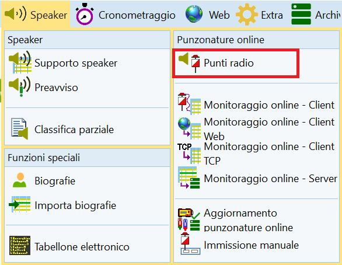
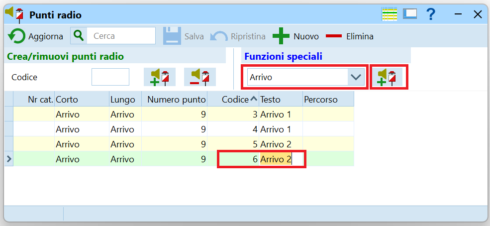
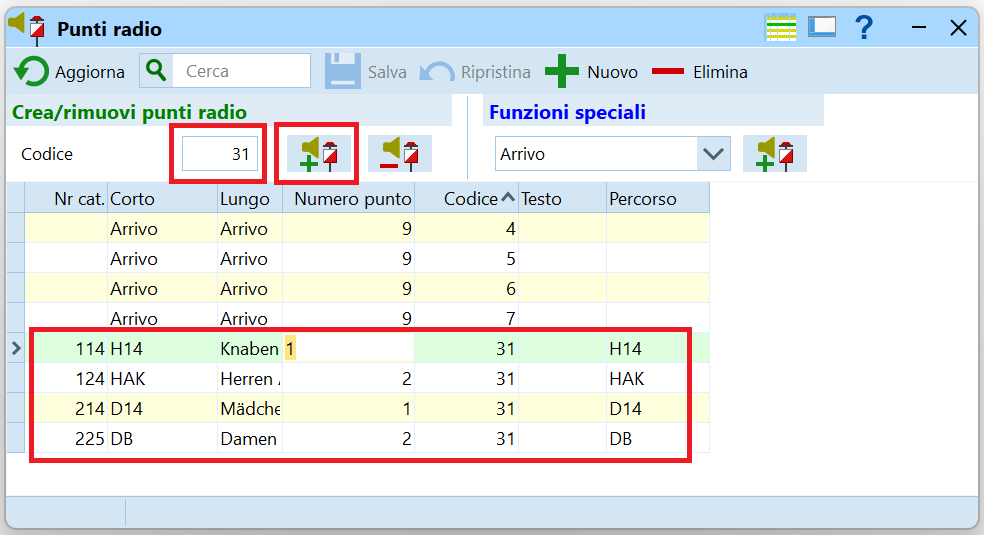
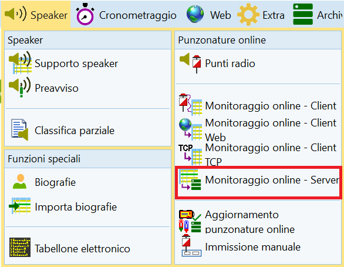
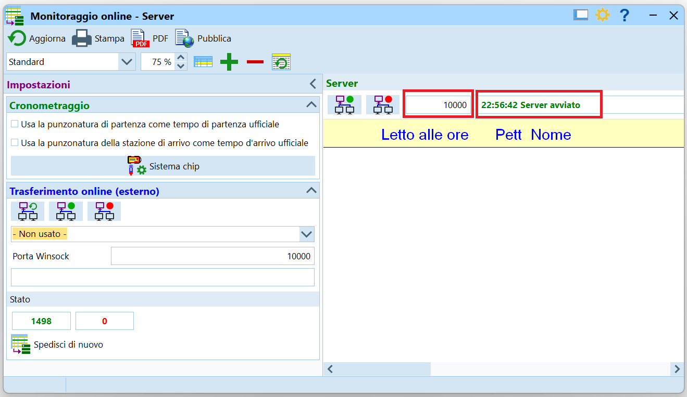
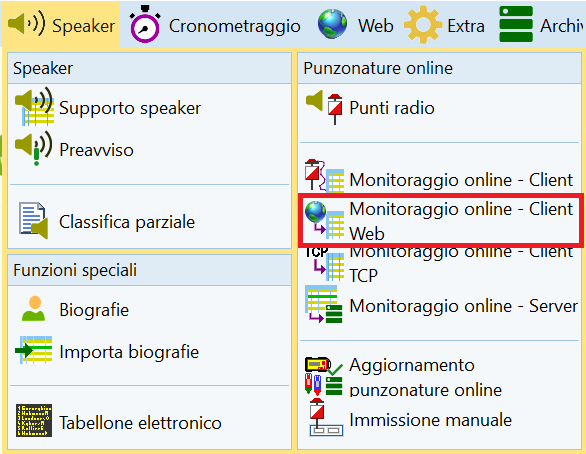
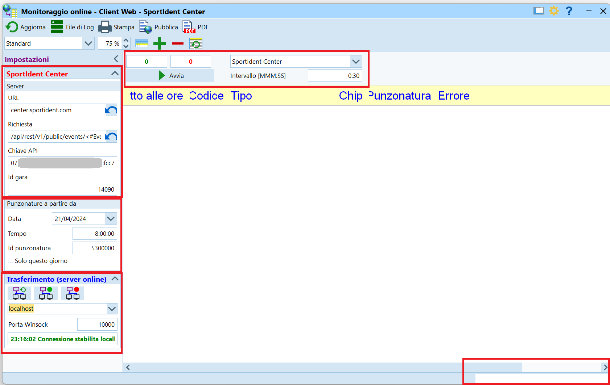

# Punti Radio SPORTident

Questa pagina descrive le configurazioni necessarie in OL-Einzel per l'uso dei punti radio SPORTident descritti nella sezione [materiale > sportident](../../materiale/sportident/punti_radio.md).  

## Concetto
A prima vista, il funzionamento di OL-Einzel in questo ambito sembra alquanto contorto. I passi necessari sono:  
  
- Definire i punti radio.  
Il programma non importa qualsiasi punto che viene spedito al SI-Center.
- Lanciare un server.  
OE usa un processo server interno per salvare i dati dei punti radio in una banca dati.
- Lanciare un processo Web e collegarlo 
    - Al server interno di OL-Einzel.  
    - Al server di SI-Center di SPORTident.  
Questo processo a intervalli regolari legge le punzonature dal server SPORTident e li manda al server OL-Einzel, che li salva nella banca dati.

## Definizione punti
Definisci quali scatolette sono dei punti radio.  
  
1. Nel menu `Speaker` seleziona `Punzonature online > Punti radio`.  

1. Per la creazione di punti radio per l'arrivo o la partenza:  
    1. Seleziona la funzione del punto dal menu a tendina.  
    Le opzioni sono `Clear`, `Check`, `Start` e `Finish`.
    1. Premi il bottone a destra del menu a tendina `Crea un punta radio con questa funzione`.
    1. Imposta il `codice` della scatoletta e assegna un testo per riconoscere le punzonature di questa scatoletta. Premi `Enter` per salvare i dati.  
    **Nota**: non modificare il `Numero punto` in quanto il valore impostato corrisponde alla funzione della scatoletta seleziona nel menu a tendina.  
    **Nota**: nell'esempio, la gara aveva due arrivi, ognuno con due scatolette `Finish` con un codice univoco impostato con [SPORTident Config+](../../materiale/sportident/configplus.md)
    
1. Per la punti radio ai "normali" punti di controllo:
    1. Inserisci il numero del punto.    
    **Nota**: devi già aver importato i percorsi e averli assegnati alle categorie.
    2. Premi sul bottone a destra col segno `Più`.  
    **Nota**: nella tabella vengono inseriti tutti i percorsi con questo punto.  
    

## Avvio del server interno
OL-Einzel usa un server interno per salvare le punzonature dei punti radio in una banca dati.  
Questo server può girare su qualsiasi PC della rete, non necessariamente su quello che va a prendere i dati dal server SPORTident. Tuttavia, per minimizzare l'utilizzo della rete, è consigliabile lanciare i due servizi (il server e il client web) sulla stessa macchina.  
  
1. Nel menu `Speaker`, seleziona `Punzonature online > Monitoraggio online - Server`.  
  
1. Nella finestra del server:
    1. Verifica che il server sia avviato (testo in alto a destra).
    1. Nota il numero della porta utilizzata, di regola la 10'000.
    1. I due bottoni a sinistra della porta servono per fermare e riavviare il server, azione di regola non necessaria.
    1. Le due opzioni a sinistra mostrano le impostazioni della gara sull'uso del tempo di partenza e di arrivo. Di regola manteniamo quale tempo ufficiale il tempo memorizzato sul chip e non quello ricevuto al punto radio.  
    
1. Lascia la finestra aperta, eventualmente minimizzata. Chiudendo la finestra termina il processo del server, e i punti radio non vengono più salvati nella banca dati.

## Avvio del client Web
Il client Web è un processo che a intervalli regolari si connette al server del SI-Center di SPORTident e scarica le nuove punzonature che vengono poi inviate al server di OL-Einzel.  
  
1. Nel menu `Speaker`, seleziona `Punzonature online > Monitoraggio online - Client Web`.  

1. Controlla e imposta vari campi.  

1. Nel menu in alto in centro, dal menu a tendina seleziona `SportIdent Center`.
1. Nel menu a sinistra, nella sezione `SportIdent Center > Server`
    1. Non modificare i primi due campi `URL` e `Richiesta`.
    1. Imposta la `Chiave API`al valore della `API Key`definita nel profilo del SI-Center di SPORTident (vedi [materiale > SPORTident > Punti radio > Sito SPORTident Center](../../materiale/sportident/punti_radio.md#si-center)).
    1. Imposta l'`ID` dell'evento creato sul SI-Center di SPORTident.
1. Nel menu a sinistra, nella sezione `SportIdent Center > Punzonature a partire da`, imposta la data della gara, l'ora da quando prelevare le punzonature (qualche ora prima dell'ora zero, per ricevere anche le punzonature di test dei posatori), e eventualmente l'ID della prima punzonatura.  
**Nota**: se vengono usate le unità di Maja Sieber, la sua API Key e l'evento con ID = 3, impostare la prima punzonatura ad un valore di 5000000.
1. Nel menu a sinistra, nella sezione `Trasferimento (server online)`, verifica che la connessione sia stabilita.  
**Nota**: questa è la connessione al server di OL-Einzel. Se la connessione non funziona, verifica il nome del server e la porta.  
1. Nel menu in alto, imposta la frequenza di scaricamento delle punzonature.  
**Nota**: se i dati servono allo speaker che commenta i tempi di arrivo dei concorrenti e il pubblico vede i concorrenti, impostare un tempo di `0:05` (5 secondi). Se invece i punti radio servono per tener traccia di chi termina la gara ma non scarica il chip (capita spesso se l'arrivo è distante dal centro gara), impostare tempi più lunghi di 30 secondi o anche minuti.
1. Premi `Avvia`. Le punzonature già presenti sul server vengono mostrate e in seguito la lista si aggiorna man mano che i concorrenti timbrano un punto radio.
**Nota**: durante lo scarico dei chip, una banda in basso a destra mostra il numero di chip scaricati. Questo è un buon indicatore del funzionamento del collegamento al server.

## Concorrenti mancanti

La lista dei concorrenti mancanti elenca tutti i concorrenti che non hanno scaricato il chip. La lista indica pure se un concorrente mancante ha timbrato un punto radio dell'arrivo e quindi ha terminato la gara (senza bisogno di cercarlo nel bosco).

!!! Failure "Affidabilità"
    Attenzione: non fidarti ciecamente dei dati forniti dai punti radio. Secondo statistiche non ufficiali, l'affidabilità non è totale e alcuni concorrenti (1-2%) potrebbero timbrare il punto ma non risultare nei dati spediti al server.  
    I motivi sono vari e dipendeno da diversi fattori tra cui la qualità della copertura della rete mobile, lo stato delle batterie dei punti, dei modem e anche delle SIAC, della posizione dei punti rispetto ai modem, ecc.  
    Nel caso dei concorrenti mancanti, quindi, un concorrente potrebbe aver terminato la gara anche se non ha un tempo d'arrivo dei punti radio. D'altra parte, però, se un concorrente ha un tempo d'arrivo siamo certi che non è più nel bosco!!!
