# Varie funzioni pre-gara

Questa sezione descrive varie funzioni utili nei giorni precedenti la gara.  
  
## Cartine

### Calcola il numero di cartine necessarie

Il numero di cartine necessarie per ogni categoria è dato da:
  
- Numero di iscritti
- Numero di vacanti previsti
- Cartine supplementari richieste con l'iscrizione
- Riserva (di solito 1)

Per ottenere il numero di iscritti per categoria, compresi i vacanti:
1. Nel menu `Iscrizioni` seleziona `Riassunto delle iscrizioni > Categorie`  
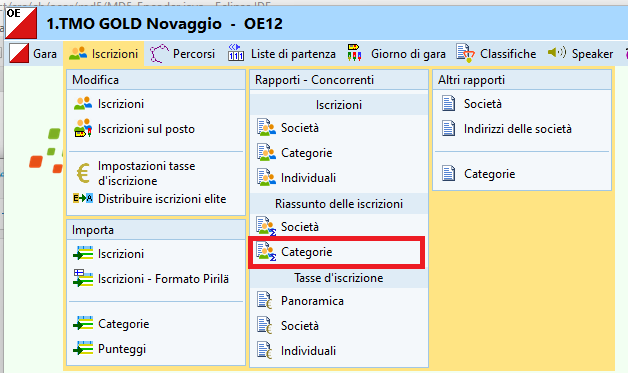

Per ottenere il numero di cartine supplementari richieste ad esempio dagli iscritti nelle categorie OK, H/DB e H/D10-12-14, procedere a dipendenza del sistema di importazione delle iscrizioni utilizzato.

??? Example ":asti-tmo: :asti-sprintCup: :asti-naz: Iscrizioni importate direttamente da OL-Events"
    
    Purtroppo la procedure di importazione automatica tra OE12 e OL-Events non è (ancora) in grado di importare anche il numero di cartine supplementari.  
      
    1. Il OL-Events, esporta le iscrizioni come file CSV per OE12 (vedi [Esportazioni in OL-Events](/software/olevents/organizzatori/#esportazioni))
    1. Il file viene salvato nella cartella di default dei download col nome *data*\_export\_OE12\_*numeroGara*.csv (ad esempio `10_03_2023_export_OE12_175.csv`)
    1. Apri il file con Excel
    1. Seleziona la prima colonna premendo sull'intestazione `A`  
    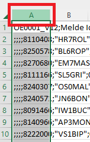  
      
    1. Nel menu `Data` seleziona `Text to Columns` (identifica la voce corretta se usi Excel in italiano...)  
    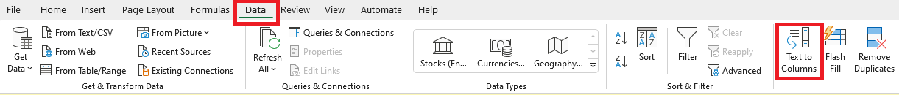  
      
    1. Seleziona `Delimited` e `Next >`  
    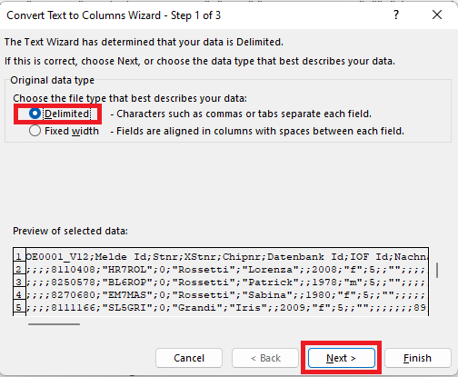  
      
    1. Seleziona il separatore `Semicolon` (`Punto e virgola`) e `Finish`  
    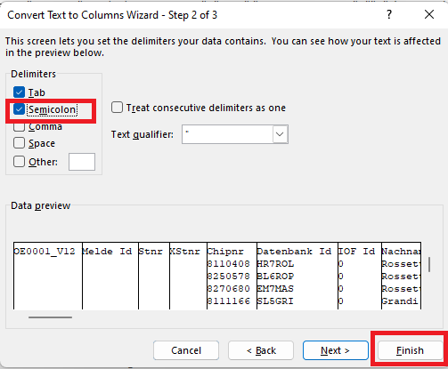  
      
        Se ti appare un messaggio che dice `ci sono già valori in questi campi`:  
          
        1. Esci da Excel senza salvare
        1. Apri il file con un editor di testo (ad esempio Notepad++, Notepad ma **NON** Word o simili)
        1. Cerca tutte le virgole e cancellale (dovrebbero essere solo 1-2 usate negli indirizzi come separatori tra la via e il numero civico)
        1. Salva il file e ricomincia da capo aprendolo in Excel

    1. Seleziona tutta la tabella cliccando sul triangolo verde a sinistra dell'intestazione della prima colonna `A` e sopra l'intestazione della prima riga `1`  
    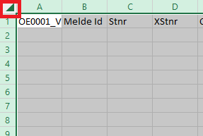  
      
    1. Nel menu `Data` seleziona `Filter`  
    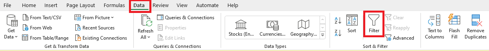  
      
    1. Nella colonna `Text3`, apri il filtro (triangolino verso il basso) e seleziona unicamente i campi con le cartine supplementari  
    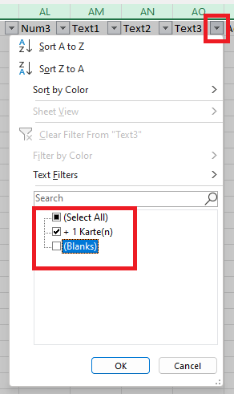  
      
    1. Conta il numero di cartine richieste per ogni categoria  
    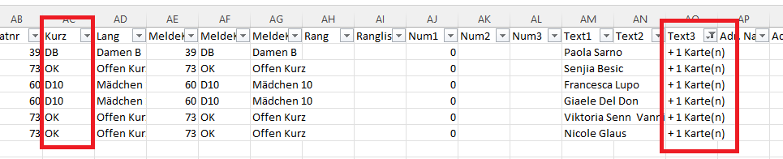
      

??? Example "Iscrizioni importate con file CSV"
    
    Sia OL-Events che GO2OL esportano il numero di cartine supplementari in uno dei campi `Testo1`, `Testo2`, `Testo3` o `Num1`, `Num2` o `Num3`.  
      
    1. Nel menu `Iscrizioni` seleziona `Modifica > Iscrizioni`
    1. Seleziona il tab `Concorrenti`
    1. Se non sono visibili, aggiungi alla tabella le colonne `Testo#` e `Num#`  
    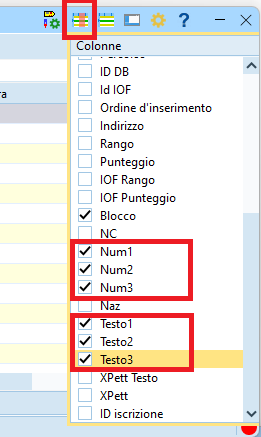  
      
    1. Ordina alfabeticamente ognuna delle colonne aggiunte per trovare i valori desiderati.  
    **Nota:** nell'esempio una gara importata da OL-Events in formato OE12 con le cartine nel campo `Testo3` e i concorrenti in coppia nel campo `Testo1`  
    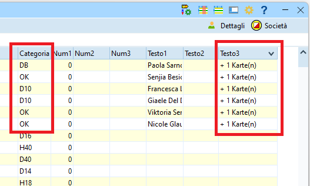 
      
    1. Conta il numero di cartine richieste per ogni categoria      

??? Example "Iscrizioni gestite manualmente"
    
    Avendo gestito manualmente le iscrizioni, sicuramente hai a disposizione i dati relativi alle cartine supplementari richieste.

### Stampa etichette per cartine

1. Nel menu `Iscrizioni` seleziona `Iscrizioni > Categorie`  
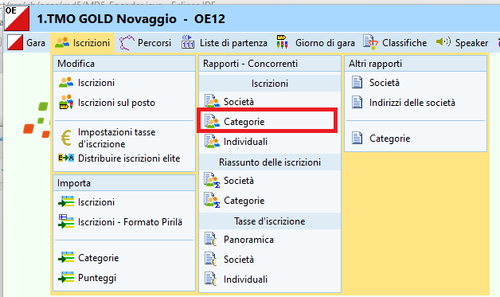  
  
1. Eventualmente, nel pannello in basso, seleziona una categoria con pochi concorrenti per la prova di stampa  
  
1. Seleziona il modello `TMO Etichetta Cartina` e `Etichette`  
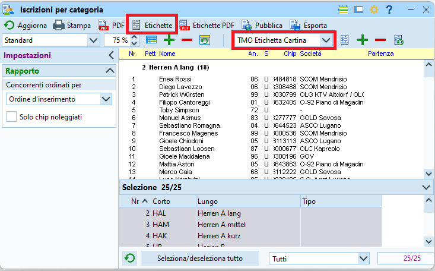  
  
1. Nel pannello di stampa, specifica quante etichette ci sono su un foglio A4  
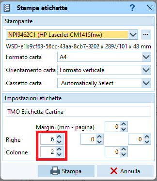  
  
1. Se la stampa è soddisfaciente e i campi stampati sono all'interno delle etichette, seleziona tutte le categorie e stampa le etichette di tutti i concorrenti
  
## Gestione finanziaria

Per contenere i costi del servizio del portale d'iscrizioni OL-Events, i pagamenti delle tasse d'iscrizione non vengono gestite dal portale.  
Dopo la gara l'organizzatore spedisce il dettaglio delle iscrizioni (quindi incluse le iscrizioni sul posto) con la fattura a tutte le società ticinesi.  

La procedura d'incasso per le società non ticinesi non è specificata: possibili opzioni sono ad esempio il pagamento all'info il giorno di gara o la fattura come le società ticinesi.  
Per l'incasso all'info il giorno di gara, stampa i dettagli per le società non ticinesi già il giorno prima. Vedi i dettagli in [Finanze](finanze.md).

## Copia di sicurezza

In ogni momento della gestione di una gara è possibile e consigliabile creare copie di sicurezza.  
  
1. Seleziona `Gara > Copia di sicurezza`  
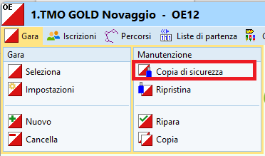  
  
1. Premi il bottone `Crea automaticamente il nome del file`  
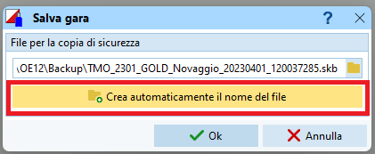  
  
    - **Nota:** OE crea il nome aggiungendo data e ora al nome della cartella della gara.  
    - **Nota:** Le copie di sicurezza sono salvati nella cartella `C:\SportSoftwareV12\OE12\Backup` con l'estensione `.skb`

1. Premi `OK` per lanciare il salvataggio della gara
1. Conferma  
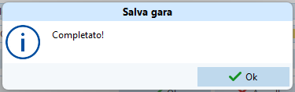
  
Per ripristinare una copia di sicurezza:  

1. Seleziona `Gara > Ripristina`  
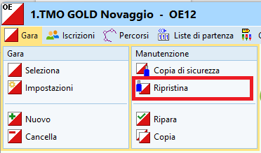  
  
1. Riempi i vari campi  
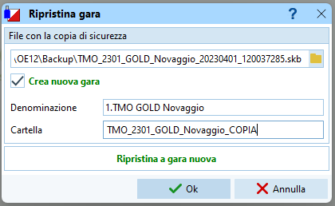  
  
    - Seleziona il file della copia di sicurezza
    - Imposta `Crea nuova gara` per non sovrascrivere quella attuale
    - Imposta la cartella in cui importare la gara

1. Premi `OK`  
**Nota:** Se hai ripristinato i dati in una nuova gara, la nuova gara è selezionata automaticamente come gara attuale.

## Copia la gara sui PC ASTI

Spesso le gare vengono preparate su PC personali, mentre il giorno di gara vengono normalmente utilizzati i PC ASTi.  
Copia tutta la cartella di gara dal PC *di preparazione* al server *di gara*  

1. Chiudi il programma OL-Einzel OE12
2. Con Windows Explorer, copia la cartella di gara  
**Nota:** la gara si trova in `C:\SportSoftwareV12\OE12\EventData`
3. Incolla la cartella di gara `unicamente` sul PC ASTI che funge da server (il PC 4).

