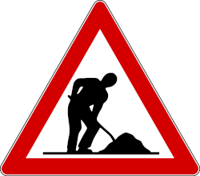

# Varie funzioni pre-gara

Questa sezione descrive varie funzioni utili nei giorni precedenti la gara.  
  
{width=100px}  
Vedi [PDF della vecchia versione, capitolo 4.6, 4.7, 4.8, 4.9](../../gestione_gara_org/inc/Istruzioni_OL_einzel_per_TMO_v2_4.pdf): 
