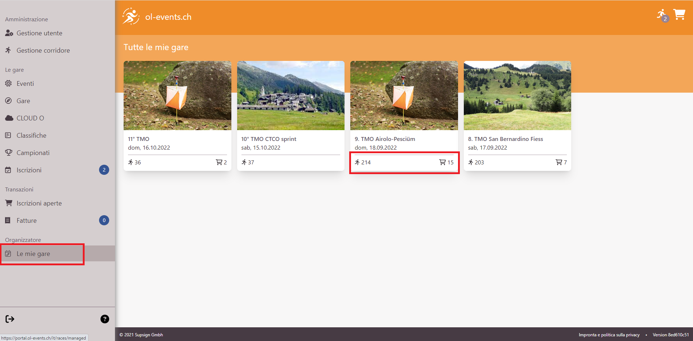
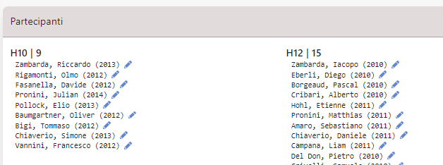

# Portale OL-Events - Per gli Organizzatori

## Panoramica di OL-Events
OL-Events è un portale svizzero specifico per  iscrizioni a gare di corsa d'orientamento.  
Link: [ol-events.ch](https://portal.ol-events.ch/it).

Caratteristiche principali:

- Gestione completa delle iscrizioni
- Connessione alla banca dati dei concorrenti SOLV
- Gestione dei pagamenti (**Non per i TMO**)
- Esportazione delle iscrizioni per OL-Einzel
- Integrazione diretta con OL-Einzel OE12
- Supporto per gare singole o eventi di più gare
- Gestione avanzata della gara per gli organizzatori

**NOTA**: per i TMO valgono condizioni speciali. 

- I pagamenti non sono gestiti dal portale ma dall'organizzatore (fattura per società). 
- Il prezzo del servizio è una tassa fissa concordata con la CTCO
- Non sono comprese funzionalità o configurazioni speciali. Per esigenze particolari, contattare il gestore del portale [Supsign](mailto:support@ol-events.ch)

## Creazione gara

Il portale non permette (ancora) la creazione autonoma di una gara. La procedura descritta sul sito non vale per le gare TMO, in quanto la parte contrattuale è relativa ai pagamenti e quindi superflua per le gare ticinesi.  

Per creare una nuova gara, spedire un email a [support@ol-events.ch](mailto:support@ol-events.ch) con le seguenti indicazioni:

- Nome della gara
- Società organizzatrice `(*)`
- Nome e cognome degli amministratori della gara sul portale.  
Questi utenti devono essersi registrati come utenti sul portale (vedi [Registrazione iniziale](concorrenti.md#registrazione))
- Indicazione che si tratta di una gara TMO ticinese
- Data della gara
- Data della scadenza delle iscrizioni (di regola la domenica prima della gara)
- Data dell'apertura delle iscrizioni
- Tasse d'iscrizione se non corrispondono a quelle standard da RECO
- Dettagli per il pagamento `(*)`  
Nome e cognome, indirizzo e email.  
Non gestendo i pagamenti sul portale, questi dati sono solo informativi per i concorrenti, ma la persona indicata è responsabile del pagamento della fattura a OL-Events per la gestione della gara.

Gli utenti indicati come amministratori hanno la possibilità di modificare autonomamente questi dati e dovranno completarli e verificarli prima della pubblicazione della gara.  
I dati contrassegnati con `(*)` non sono modificabili dagli amministratori, ma unicamente dal team di OL-Events. 
## Selezione gara

Selezionare `Le mie gare` dal menu a sinistra per accedere alla lista delle gare per le quali si è registrati come amministratori.

{width=100%}

Nella parte bassa di ogni gara sono indicati il numero di concorrenti iscritti e il numero di concorrenti che hanno aggiunto la gara al loro carrello della spesa ma non hanno ancora confermato l'iscrizione. 

## Pannello di controllo della gara

Premendo sulla scheda di una gara si accede al suo pannello di controllo, con ulteriori menu per la gestione della gara. 

{width=100%}

Il pannello contiene diverse schede:

- `Gestione evento`  
Il link `Gestione amministratori` permette di gestire i diritti di amministratore della gara.  
È possibile assegnare i diritti a qualsiasi utente registrato sul portale, cercandolo per nome.  
La lista mostra gli amministratori attuali con la possibilità di revoca a ogni singolo amministratore.  
**Nota**: l'utente `Admin Admin` è predefinito dal portale.

- `Gestione gara`  
Questa scheda contiene una lista di link a varie pagine per la gestione della gara. Vedi la [prossima sezione](#gestioneGara) per i dettagli

- `Beneficiario`  
I dati relativi al beneficiario dei pagamenti. Dato che non viene effettuato un pagamento, questi sono dati informativi sulla società e la persona che ne gestisce le finanze.

- `Informazioni`  
Questa scheda riassume lo stato di varie opzioni.  
Per i TMO di regola sono spuntati solo due voci:
    - `pubblicato`: attivo quando la gara è visibile agli utenti. Il link porta direttamente alla pagina come la vedono gli utenti, opzione comoda per verificare le conseguenze delle proprie mutazioni a vari dati della gara.
    - `Iscrizione possibile`: questa opzione è spuntata quando sono aperte le iscrizioni.

- `Finanze`  
Riassunto delle tasse d'iscrizione dei concorrenti attualmente iscritti.

- `Richieste di ora di inizio`  
Gestione degli orari di partenza per blocchi regionali.  
OL-Events assegna un blocco di partenza ad ogni concorrente basandosi sulla sua provenienza regionale. Per i TMO non vengono fatte distinzioni per regione, per cui ogni regione viene impostata al blocco numero `5`.  
L'opzione `EDIT` in alto a destra permette di modificare il blocco assegnato ad ogni regione.  
I numeri dei blocchi sono:
    - 1: partenza prestissimo (per collaboratori)
    - 2: desiderio di pertenza `presto`
    - 3: primo gruppo di regioni
    - 5: secondo gruppo di regioni
    - 7: terzo gruppo di regioni
    - 8: desiderio di partenza `tardi`
    - 9: partenza tardissimo (per collaboratori)
I gruppi `1`, `4`, `6` e `9` non vengono assegnati dal portale, ma possono tornare utili all'organizzatore per soddisfare richieste di singoli concorrenti o dei propri collaboratori.

- `Sconti`  
Lista delle società ticinesi (comprese varie combinazioni) i cui soci non pagano le iscrizioni direttamente, ma che beneficiano del pagamento della società.  
Questa lista serve solo relativamente, in quanto la gestione delle finanze è demandata all'applicazione per la gestione della gara (per i più a OL-Einzel). Infatti, il portale non ha conoscenza delle mutazioni e delle iscrizioni sul posto, fondamentali per una corretta gestione contabile della gara. 

- `Partecipanti`
Nella parte bassa della pagina, non mostrata nell'immagine, si trova una grande scheda con tutti gli iscritti ordinati per categoria. È possibile modificare la categoria, il numero chip e la società di ogni concorrente.  
{width=80%}
## Gestione gara {#gestioneGara}

La scheda `Gestione gara` contiene una serie di link a pagine per la visione e eventuale modifica di svariati aspetti della gara.  
  

{width=30px} **QUESTA PAGINA È ANCORA DA FARE**  {width=30px}

- gestione gara
- integrazione con OL-Einzel
    - export / import in OE-2010
    - integrazione diretta da menu in OE12