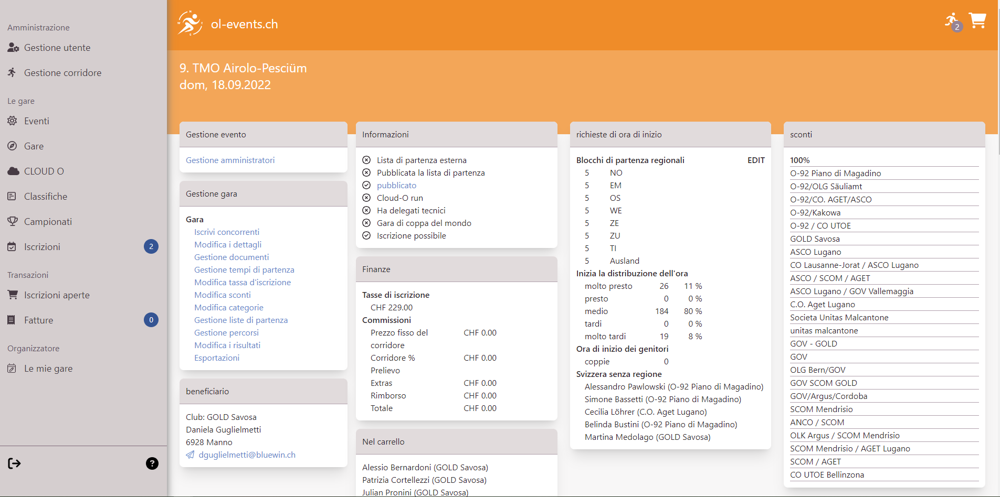
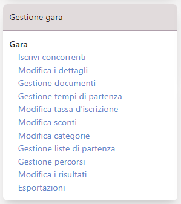
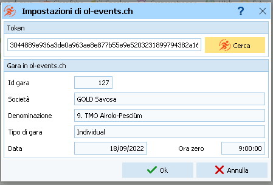

# Portale OL-Events - Per gli Organizzatori

## Panoramica di OL-Events
OL-Events è un portale svizzero specifico per  iscrizioni a gare di corsa d'orientamento.  
Link: [ol-events.ch](https://portal.ol-events.ch/it).

Caratteristiche principali:

- Gestione completa delle iscrizioni
- Connessione alla banca dati dei concorrenti SOLV
- Gestione dei pagamenti (**Non per i TMO**)
- Esportazione delle iscrizioni per OL-Einzel
- Integrazione diretta con OL-Einzel OE12
- Supporto per gare singole o eventi di più gare
- Gestione avanzata della gara per gli organizzatori

**NOTA**: per i TMO valgono condizioni speciali. 

- I pagamenti non sono gestiti dal portale ma dall'organizzatore (fattura per società). 
- Il prezzo del servizio è una tassa fissa concordata con la CTCO
- Non sono comprese funzionalità o configurazioni speciali. Per esigenze particolari, contattare il gestore del portale [Supsign](mailto:support@ol-events.ch)

## Creazione gara

Il portale non permette (ancora) la creazione autonoma di una gara. La procedura descritta sul sito non vale per le gare TMO, in quanto la parte contrattuale è relativa ai pagamenti e quindi superflua per le gare ticinesi.  

Per creare una nuova gara, spedire un email a [support@ol-events.ch](mailto:support@ol-events.ch) con le seguenti indicazioni:

- Nome della gara
- Società organizzatrice `(*)`
- Nome e cognome degli amministratori della gara sul portale.  
Questi utenti devono essersi registrati come utenti sul portale (vedi [Registrazione iniziale](concorrenti.md#registrazione))
- Indicazione che si tratta di una gara TMO ticinese
- Data della gara
- Data della scadenza delle iscrizioni (di regola la domenica prima della gara)
- Data dell'apertura delle iscrizioni
- Tasse d'iscrizione se non corrispondono a quelle standard da RECO
- Dettagli per il pagamento `(*)`  
Nome e cognome, indirizzo e email.  
Non gestendo i pagamenti sul portale, questi dati sono solo informativi per i concorrenti, ma la persona indicata è responsabile del pagamento della fattura a OL-Events per la gestione della gara.

Gli utenti indicati come amministratori hanno la possibilità di modificare autonomamente questi dati e dovranno completarli e verificarli prima della pubblicazione della gara.  
I dati contrassegnati con `(*)` non sono modificabili dagli amministratori, ma unicamente dal team di OL-Events. 
## Selezione gara

Selezionare `Le mie gare` dal menu a sinistra per accedere alla lista delle gare per le quali si è registrati come amministratori.

{width=100%}

Nella parte bassa di ogni gara sono indicati il numero di concorrenti iscritti e il numero di concorrenti che hanno aggiunto la gara al loro carrello della spesa ma non hanno ancora confermato l'iscrizione. 

## Pannello di controllo della gara

Premendo sulla scheda di una gara si accede al suo pannello di controllo, con ulteriori menu per la gestione della gara. 

{width=100%}

Il pannello contiene diverse schede:

- `Gestione evento`  
Il link `Gestione amministratori` permette di gestire i diritti di amministratore della gara.  
È possibile assegnare i diritti a qualsiasi utente registrato sul portale, cercandolo per nome.  
La lista mostra gli amministratori attuali con la possibilità di revoca a ogni singolo amministratore.  
**Nota**: l'utente `Admin Admin` è predefinito dal portale.

- `Gestione gara`  
Questa scheda contiene una lista di link a varie pagine per la gestione della gara. Vedi la [prossima sezione](#gestioneGara) per i dettagli

- `Beneficiario`  
I dati relativi al beneficiario dei pagamenti. Dato che non viene effettuato un pagamento, questi sono dati informativi sulla società e la persona che ne gestisce le finanze.

- `Informazioni`  
Questa scheda riassume lo stato di varie opzioni.  
Per i TMO di regola sono spuntati solo due voci:
    - `pubblicato`: attivo quando la gara è visibile agli utenti. Il link porta direttamente alla pagina come la vedono gli utenti, opzione comoda per verificare le conseguenze delle proprie mutazioni a vari dati della gara.
    - `Iscrizione possibile`: questa opzione è spuntata quando sono aperte le iscrizioni.

- `Finanze`  
Riassunto delle tasse d'iscrizione dei concorrenti attualmente iscritti.

- `Richieste di ora di inizio`  
Gestione degli orari di partenza per blocchi regionali.  
OL-Events assegna un blocco di partenza ad ogni concorrente basandosi sulla sua provenienza regionale. Per i TMO non vengono fatte distinzioni per regione, per cui ogni regione viene impostata al blocco numero `5`.  
L'opzione `EDIT` in alto a destra permette di modificare il blocco assegnato ad ogni regione.  
I numeri dei blocchi sono:
    - 1: partenza prestissimo (per collaboratori)
    - 2: desiderio di pertenza `presto`
    - 3: primo gruppo di regioni
    - 5: secondo gruppo di regioni
    - 7: terzo gruppo di regioni
    - 8: desiderio di partenza `tardi`
    - 9: partenza tardissimo (per collaboratori)
I gruppi `1`, `4`, `6` e `9` non vengono assegnati dal portale, ma possono tornare utili all'organizzatore per soddisfare richieste di singoli concorrenti o dei propri collaboratori.

- `Sconti`  
Lista delle società ticinesi (comprese varie combinazioni) i cui soci non pagano le iscrizioni direttamente, ma che beneficiano del pagamento della società.  
Questa lista serve solo relativamente, in quanto la gestione delle finanze è demandata all'applicazione per la gestione della gara (per i più a OL-Einzel). Infatti, il portale non ha conoscenza delle mutazioni e delle iscrizioni sul posto, fondamentali per una corretta gestione contabile della gara. 

- `Partecipanti`
Nella parte bassa della pagina, non mostrata nell'immagine, si trova una grande scheda con tutti gli iscritti ordinati per categoria. È possibile modificare la categoria, il numero chip e la società di ogni concorrente.  
{width=80%}
## Gestione gara {#gestioneGara}

La scheda `Gestione gara` contiene una serie di link a pagine per la visione e eventuale modifica di svariati aspetti della gara.  
  

Le voci principali sono marcate in grassetto:

- `Iscrivi concorrenti`  
Permette di iscrivere concorrenti, ricercandoli per cognome e nome tra gli utenti registrati sul portale.

- **`Modifica i dettagli`**  
Permette la visione e modifica della maggior parte dei campi "utili". Vedi la [prossima sezione](#modificaDettagli) per i dettagli

- `Gestione documenti`  
Caricare documenti (ad esempio i PDF dell'annuncio gara e delle ultime info) trascinandoli nell'apposita sezione, o selezionandoli cliccando sul tasto `+`.  
Assegnare `additional` come tipo di documento.  

- `Gestione tempi di partenza`  
Questa opzione crea confusione, in quanto non permette in realtà la selezione della finestra delle partenze (dall'orario della prima partenza a quello dell'ultima), bensì sono unicamente le relative date.  
*Quindi indicare in ambedue i campi la data della gara.*  

- `Modifica tassa d'iscrizione`  
Questa opzione permette la modifica delle tasse d'iscrizione delle varie fasce d'età, ma non quella fisse per categoria, come la tassa degli `OK`.  
Nota: le tasse assegnate ai concorrenti già iscritti non verranno modificate. Se ci sono già diversi concorrenti iscritti, chiedere al gestore del portale di modificare le tasse d'iscrizione, aggiornando anche quelle dei concorrenti iscritti.

- `Modifica sconti`  
Pagina con varie schede per la gestione degli sconti.
    - Nella scheda `Crea uno sconto` è possibile creare uno sconto a scelta con un importo fisso o con una percentuale (ma non entrambi).  
    - Nella scheda `Assegna uno sconto` si assegna un tipo di sconto ad un concorrente o ad una società (ma non a entrambi).
    - In `Sconti assegnati` sono visualizzati tutti gli sconti, raggruppati per tipologia di sconto. È possibile cancellare le registrazioni singolarmente.
Nota: non gestendo i pagamenti in OL-Events, non è necessario gestire questa lista.

- `Modifica categorie`  
Se questa pagina ha un problema di visualizzazione, ridurre la dimensione della pagina (ad esempio al 75% o al 67%).  
Permette la selezione delle categorie e per ogni categoria la definizione di quali desideri di partenza sono supportati. 

- `Gestione liste di partenza`  
Questa pagina non viene utilizzata per i TMO.  
Permette di impostare la gara con una tabella che permette ad ogni concorrente di scegliersi l'orario di partenza (come utilizzato in Ticino per alcune gare durante la pandemia di COVID-19).

- `Gestione percorsi`  
Questa pagina non viene utilizzata per i TMO.  
Permette la gestione di percorsi.

- `Modifica i risultati`
Questa pagina non viene utilizzata per i TMO. 
Permette di caricare le classifiche sul portale di OL-Events. Per i TMO carichiamo le classifiche unicamente sul sito SOLV. 

- **`Esportazioni`**   
Permette l'esportazione di vari rapporti, inclusi i dati da caricare su OL-Einzel. Vedi la [sezione esportazione](#esportazioni) in basso per i dettagli

## Modifica dettagli {#modificaDettagli}

{width=30px} **QUESTA SEZIONE È ANCORA DA FARE**  {width=30px}

## Esportazioni {#esportazioni}

La pagina per l'esportazione dei dati presenta varie schede.

Le varie schede sono:

- `API`  
Questa scheda contiene soprattutto il `Bearer Token`, cioè la chiave utilizzata da OL-Einzel v12 (OE12) per accedere direttamente a OL-Events e importare le categorie e le iscrizioni.  
  
      

    In OE12, nel menu `Web`, selezionare `Usa OL-Events`
      
    
    Nelle `Impostazioni`, inserire il bearer token e premere il bottone `Cerca` per connettere OE12 alla gara su OL-Events  
    

    Usare le voci del menu `Scarica Categorie` e `Scarica Iscrizioni` per importare i dati.

- `Eseguire le esportazioni (Ora zero: 09:00)`  
Questa scheda contiene i link per scaricare vari file utili.  
  
Nota: verificare l'ora zero nell'intestazione della scheda, e eventualmente correggerlo nella pagina della [Modifica dettagli](#modificaDettagli).  
I file esportati si trovano nella cartella di download di default dal browser.  
    - Sportsoftware `OE2010`  
    Il file con le iscrizioni da importare in OL-Einzel 2010. Usare la gara modello `TMO 2022` disponibile sul sito [asti-ticino.ch/co > Documenti > Gare modello](http://www.asti-ticino.ch/co/index.php?folder=doc&main=doc)
    - Sportsoftware `OE12`  
    Il file con le iscrizioni da importare nella versione nuova di OL-Einzel v12 (2022). Di regola, questo file non serve in quanto l'integrazione diretta è molto più comoda.
    - Sportsoftware `Categorie`  
    Le categorie sono già preimpostate nella gara modello, per cui questo file non viene utilizzato.
    - picoSoft `ORware 2021`  
    File con le iscrizioni da importare in ORWare. Non utilizzato per i TMO ticinesi.
    - `Altri download`
        - `Numero di cartine per percorso`  
        Non utilizzato, in quanto si basa sui percorsi che non vengono gestiti in OL-Events.
        - `Numero di cartine per categoria`  
        Per ogni categoria indica il numero di concorrenti iscritti e il numero di concorrenti aggiuntivi che corrono in coppia e che hanno richiesto una cartina supplementare.  
        Nota: i valori indicati non contengono i vacanti, per cui le cartine necessarie saranno di più di quelle indicate nel file.
        - `Scheda tecnica`  
        Genera un PDF con tanti dati riassuntivi sulle impostazioni della gara sul portale OL-Events. 
        - `Sconti per l'esportazione`
        Esporta una tabella con tutti i concorrenti (con indirizzo completo) e la relativa società, categoria e tassa d'iscrizione.
- `Esportazione di eventi`  
Esporta la lista di concorrenti con il numero SOLV e la categoria per ogni gara di un evento. Per i TMO, di regola un evento corrisponde ad una singola gara.
- `Informazioni mancanti`  
Indica se concorrenti iscritti non hanno indicato il numero IOF, richiesto per categorie elite (H/DE e H/D20) in gare WRE o di coppa del mondo.  
Indica anche i concorrenti che si sono iscritti ma non sono presenti nella banca dati del SOLV.  
Nota: per i normali TMO ambedue le notifiche non sono rilevanti e possono essere ignorate. 
- `Pagamenti mancanti`  
Questa scheda mostra i concorrenti che non hanno ancora completato la propria iscrizione, cioè che sono ancora nel carrello della spesa.  
Nota: eventualmente si possono contattare per verificare se si tratta di un errore di utilizzo del portale.  
- `Dichiarazione mancante sullo statuto antidoping`  
Per le gare nazionali e campionati svizzeri è obbligatorio che tutti i concorrenti delle categorie elite (H/DE e H/D20) abbiano firmato lo statuto antidoping di Swiss Orienteering. Questa lista permette di vedere chi non ha ancora consegnato il formulario firmato, permettendo di contattarlo prima della gara.
